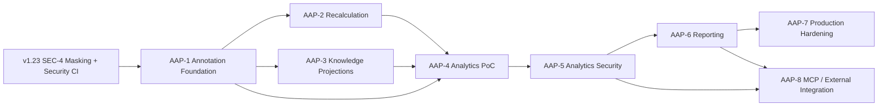

# Annotation, Derived Knowledge, Recalculation, Analytics & Reporting Plane - Implementation Plan

**Purpose:** Implementation plan for v1.24/1.25 - first-class annotations with versioned definitions and explicit dependencies, dependency-aware recalculation (**Resolutor** + **Equalix**), knowledge-projection provenance, and a downstream **Analytics and Reporting Plane** (events, facts, aggregates, metrics, reports) that observes protected knowledge without ever becoming an authorization side channel.
**Architecture reference:** [`docs/architecture/synanton-design-1.25.md`](../../architecture/synanton-design-1.25.md) (consolidates 1.24 + 1.25), [ADR-002](../../architecture/decisions/adr-002-annotations-analytics-plane.md), [proposal doc](../../architecture/proposals/v1.24-1.25/Synanton%20Design%201.24-1.25%20Annotations%20and%20Analytics%20Proposal.md)
**Prerequisite:** v1.23 classification-aware search - the normative security/representation baseline this plan inherits without relaxation (design §2.1, Appendix C) - see [`../classification-aware-search/INDEX.md`](../classification-aware-search/INDEX.md)
**Target repository:** `synanton/platform` - new services `java/annotations`, `java/analytics`; extends `synflux`, `ingestion-cache`, `synquest`, `relix`, `gateway`, `synapt`, `synanton-mcp`, `topology`, `control-plane`
**Audience:** Architects, platform engineers, data engineers, security engineers, SREs
**Last Updated:** 2026-09-02

---

## Theme

> Knowledge is derived state, and analytics is derived state over knowledge and platform activity.

Annotation determines what Synanton understands about extracted, classified content. Recalculation keeps that understanding consistent as rules, models, dictionaries, sources and policies change - without starving interactive workloads. Analytics observes the resulting knowledge and platform activity through a durable, replayable event boundary that sits strictly **after** the Design 1.23 classification/masking decision - it never becomes an alternate source of truth or a security side channel.

---

## User-Facing Capability Unlocked (cumulative across phases)

- Annotations (tags, classifications, entities, attributes, signals) are independently addressable, versioned, and explainable back to their producing definition, processing run and provenance chain.
- Annotation dependencies form an explicit DAG distinct from taxonomy; changing a rule/model/dictionary/source/policy triggers **only** the affected recalculation, not a full re-ingest.
- Reverse index, vector and graph projections carry annotation/definition-version provenance so recalculation and rebuilds are auditable.
- Platform activity and knowledge state become measurable - processing, annotation, search, security and cost metrics - without exposing anything a caller isn't already authorized to see (`resource_acl ∧ class_grants`, Single/Dual/Masked-only representation rules inherited unchanged from Design 1.23).
- The first end-to-end report (`daily-platform-processing`, design §66) is queryable with tenant isolation and classification-aware aggregation.
- Analytics storage (ClickHouse initially) is replaceable by replaying the durable `analytics_events` boundary - no canonical-knowledge rewrite required.
- Selected analytics capabilities (`get_metric`, `query_report`, `inspect_analytics`, `explain_metric`, `retrieve_lineage`) are reachable through MCP and a public Analytics API, both passing through the same canonical authorization/aggregation pipeline as every other interface.

---

## Non-Negotiable Invariants

Restated from design §89 (15 architectural invariants) as directives, each phase file states which of these it is responsible for enforcing.

1. **Analytics is derived state** - never authoritative, never a substitute for canonical knowledge (§22, §76).
2. **Canonical knowledge remains authoritative** - source content, semantic content, annotations, security policy and relationships keep their own systems of record (§76).
3. **Classification is not authorization mapping** - content sensitivity state and policy state are separate axes (§20, Invariant 3).
4. **Authorization is evaluated using current policy** - not the policy in force when a fact was recorded, except where §54's historical-validity-window treatment applies.
5. **Analytics cannot bypass masking or representation rules** - Single/Dual/Masked-only propagate unchanged into analytical facts (§27, Appendix C item 6).
6. **Aggregates cannot bypass security** - minimum group size, suppression, rounding and dimension restrictions apply before any aggregate is exposed (§28).
7. **Tenant boundaries apply to analytics** - storage, query, cache, API, MCP and materialized views (§46-47).
8. **Platform-wide analytics use explicit `system` scope** and never enter tenant-scoped APIs or aggregates (§46, Invariant 8).
9. **Derived knowledge and analytics remain recalculable** - Resolutor/Equalix apply to both (§48, §53).
10. **Analytics storage is replaceable** - `analytics_events` is the durable, replayable rebuild boundary; no ClickHouse-specific behaviour leaks into the architectural contract (§38-40, §77).
11. **Processing provenance is preserved** - every processing run and evaluation run is traceable (§12-13, §37).
12. **Background recalculation cannot starve interactive workloads** - Equalix enforces this (§50, §62).
13. **No external analytics interface may bypass the canonical query pipeline** - MCP and the Analytics API are interfaces, not bypasses (§43-44).
14. **A Masked-only original representation is never persisted** - inherited unchanged from Design 1.23 (§21, §54, Appendix C item 6).
15. **Security-sensitive caches are invalidated when their authorization assumptions become stale** - security mapping changes, aggregate policy changes, metric definition changes, source classification changes (§55-56).

---

## Current Baseline (as of 2026-09-02)

| Area | Exists today | Gap |
|------|--------------|-----|
| Chunk classification | `topology.class_grants` (Postgres `V4__class_grants.sql`); `chunks_payload.classification` (Cassandra `V6__chunk_classification.cql`) | Masking, representation selection (Single/Dual/Masked-only) and query-side sanitisation are still SEC-2..SEC-6 "Planned" in [`classification-aware-search/INDEX.md`](../classification-aware-search/INDEX.md) - this plan's security dependency is itself unfinished |
| Annotation model | AAP-1 landed: `annotations` service (`annotation_definitions`, `annotation_definition_versions` with Draft/Published immutability, `dependency_edges` with cycle rejection), Cassandra `annotations` table, `synflux` `AnnotationStage` (flag-gated, keyword-rule producer) | No ML/LLM/human producers yet; `AnnotationStage` still runs pre-masking (no SEC-4 to move after) |
| Provenance / processing runs | AAP-1 landed: `annotations.processing_runs` table + `ProcessingRunService`, populated by `AnnotationStage` per document | No evaluation-run distinction yet (that is AAP-2 recalculation runs) |
| Recalculation | AAP-2 landed: `ResolutorService` (deterministic reverse-DAG impact analysis + target lookup), `EqualixScheduler` (priority-ordered bounded worker pool across the 6 design §50 workload classes), default invalidating executor, `POST /recalculate` | Only `ANNOTATION_DEFINITION_VERSION_PUBLISHED` is wired end-to-end; `SOURCE_CHANGED`/`CLASSIFICATION_POLICY_CHANGED`/`EMBEDDING_MODEL_CHANGED` have no upstream producer yet (control-plane's `ReindexAfterPolicyChangeWorkflow` from SEC-6 doesn't exist). No Kafka topics (`annotation_definition_published`, `recalculation_requests`) - triggering is in-process/HTTP for now. Default executor only invalidates stale rows; it does not yet call back into `synflux` to produce a new-version row |
| Knowledge projections | `synquest` reverse index, `embedding_content_cache`, `relix` in-memory/Neo4j/Nebula graph all exist for chunks | No annotation-aware provenance or definition-version tagging on any projection |
| Analytics | Nothing | No `analytics_events` topic, no ClickHouse, no `analytical_facts`, no aggregates/metrics |
| Analytics security | `test:security` CI tier documented (design §3.9, SEC INDEX) but not yet wired into `.github/workflows/` | No `test:analytics-security` tier at all |
| Reporting | Nothing | No Analytics Registry, no metric/report lifecycle, no first report |
| MCP | `synanton-mcp` exposes `search`, `graph_query`, `ontology_resolve` | No analytics tools |
| Ops | Prometheus/Grafana wired for Phase 4 hardening (README) | No ClickHouse runbook, no analytics-specific alerts, no storage sizing model |

---

## Phased Delivery

| Phase | Name | Primary modules | Status | Plan |
|-------|------|-----------------|--------|------|
| AAP-1 | Annotation Foundation | `annotations` (NEW), `ingestion-cache`, `synflux` | In progress | [01-annotation-foundation.md](./01-annotation-foundation.md) |
| AAP-2 | Recalculation (Resolutor + Equalix) | `annotations`, `synflux`, `control-plane` | In progress | [02-recalculation.md](./02-recalculation.md) |
| AAP-3 | Knowledge Projections | `synquest`, `relix`, `ingestion-cache`/`synflux` | Planned | [03-knowledge-projections.md](./03-knowledge-projections.md) |
| AAP-4 | Analytics PoC | `analytics` (NEW), `synflux`, `gateway`, `synquest`, `relix` | Planned | [04-analytics-poc.md](./04-analytics-poc.md) |
| AAP-5 | Analytics Security | `analytics`, `gateway`, `topology`, CI | Planned | [05-analytics-security.md](./05-analytics-security.md) |
| AAP-6 | Reporting | `analytics`, `control-plane` | Planned | [06-reporting.md](./06-reporting.md) |
| AAP-7 | Production Hardening | `analytics`, infra/ops | Planned | [07-production-hardening.md](./07-production-hardening.md) |
| AAP-8 | MCP / External Integration | `synanton-mcp`, `synapt`, `analytics` | Planned | [08-mcp-integration.md](./08-mcp-integration.md) |

Each phase file states its own **Goal**, numbered **Work items** (concrete file paths, new classes/tables/topics), numbered **Definition of Done**, and a **Key files** table - following the [`classification-aware-search/INDEX.md`](../classification-aware-search/INDEX.md) (SEC-N) template.

---

## Master Configuration Gates

Full per-phase config lives in each phase file. These are the top-level enablement flags that gate the whole track:

| Property | Env var | Default | Purpose |
|----------|---------|---------|---------|
| `annotations.enabled` | `ANNOTATIONS_ENABLED` | `false` | Master gate for the `annotations` service and `AnnotationStage` in `synflux` |
| `annotations.resolutor.enabled` | `ANNOTATIONS_RESOLUTOR_ENABLED` | `false` | Enables impact-analysis change hooks (AAP-2) |
| `annotations.equalix.enabled` | `ANNOTATIONS_EQUALIX_ENABLED` | `false` | Enables controlled recalculation execution (AAP-2) |
| `analytics.enabled` | `ANALYTICS_ENABLED` | `false` | Master gate for the `analytics` service and event emission across producers |
| `analytics.security.enforce` | `ANALYTICS_SECURITY_ENFORCE` | `false` | Enables classification/tenant/aggregate enforcement on the analytics query path (AAP-5) |

---

## Dependencies & Sequencing

**Hard dependency:** AAP-1 requires the v1.23 masking gate (SEC-4) to be in place first - annotation instances must be produced from post-masking content, matching the analytics event boundary rule (design §24). Annotating pre-masking content would violate Invariant 5 one phase early.

**Parallelisable:** AAP-2 (recalculation) and AAP-3 (projection provenance) can proceed in parallel once AAP-1 ships - they touch disjoint subsystems (a new service vs. three existing projection modules). AAP-8 (MCP/API) can start once AAP-5 (security) is proven even if AAP-6 (reporting) is still in progress, since MCP tools like `inspect_analytics`/`retrieve_lineage` don't require the full metric/report registry.

---

## Open Questions

Carried forward from design Appendix D (intentionally deferred, workload/deployment-dependent) plus one implementation-specific question raised while grounding this plan in the codebase:

| # | Question | Status |
|---|----------|--------|
| 1 | Expected peak analytics event rate / sustained ingestion target | Deferred to AAP-4 PoC workload modelling (design §91) |
| 2 | ClickHouse production topology, replication factor | Deferred to AAP-7 (design §64-65, §92) |
| 3 | Retention by fact class, late-event window beyond the 24h default | Deferred to AAP-7 (design §59-60) |
| 4 | Dashboard concurrency target, report-specific freshness | Deferred to AAP-6 (design §41, §78) |
| 5 | Aggregate policy per data classification, system-wide metric authorization roles | Deferred to AAP-5/AAP-6 (design §28-29, §46) |
| 6 | Should Equalix (AAP-2, recalculation scheduling) share an implementation with the GPU track's reserved `EqualixScheduler` name (README GPU-5, "data-gated on GPU-4 evidence")? | Not resolved here - AAP-2 ships Equalix scoped to recalculation workloads only; consolidation is a follow-up decision once both exist |

---

## References

1. [`docs/architecture/synanton-design-1.25.md`](../../architecture/synanton-design-1.25.md) - full consolidated design (1.24 + 1.25)
2. [`docs/architecture/decisions/adr-002-annotations-analytics-plane.md`](../../architecture/decisions/adr-002-annotations-analytics-plane.md) - acceptance decision
3. [`docs/architecture/proposals/v1.24-1.25/Synanton Design 1.24-1.25 Annotations and Analytics Proposal.md`](../../architecture/proposals/v1.24-1.25/Synanton%20Design%201.24-1.25%20Annotations%20and%20Analytics%20Proposal.md) - source proposal
4. [`docs/implementation/classification-aware-search/INDEX.md`](../classification-aware-search/INDEX.md) - v1.23 security baseline this plan inherits (SEC-N precedent for phase-file template)
5. [`docs/implementation/semantic-chunking/INDEX.md`](../semantic-chunking/INDEX.md) - upstream chunk provenance this plan extends with annotation/definition-version tagging
6. [`docs/architecture/synanton-design-1.23.md`](../../architecture/synanton-design-1.23.md) - normative security/representation model (§2.1 of the 1.25 design)

---

## How to Contribute

Plan changes land here first. A phase is not done until its numbered Definition of Done (in the phase's own file) is fully satisfied. Changes that alter persisted annotation, processing-run, or analytical-fact schema require a migration in the same change set. Any analytics-path change must include or extend `test:analytics-security` coverage (AAP-5) once that tier exists.
