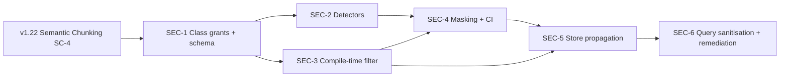

# Classification-Aware Semantic Search - Implementation Plan

**Purpose:** Implementation plan for v1.23 classification-aware semantic search. Closes the sub-document security gap by labelling chunks with sensitivity classes, deciding per chunk whether masking requires a second, authorized-only original representation (§3.2a of the design doc), and enforcing compile-time representation selection at query time.
**Architecture reference:** [`docs/architecture/synanton-design-1.23.md`](../../architecture/synanton-design-1.23.md), [`docs/architecture/synanton-design-1.22.md`](../../architecture/synanton-design-1.22.md) (§20, §23, §25, §40)
**Prerequisite:** v1.22 semantic chunking (structured `elements` → `SemanticChunk` with provenance) — see [`../semantic-chunking/INDEX.md`](../semantic-chunking/INDEX.md)
**Target repository:** `synanton/platform` (`topology`, `synflux`, `synquest`, `gateway`, `planner`, `relix`, `ingestion-cache`, `control-plane`)
**Audience:** Security engineers, ingestion engineers, search engineers, SREs
**Last Updated:** 2026-08-29

---

## Theme

> Resource ACLs answer *which documents* a caller may see. Class grants answer *which sensitivity bands within a document* they may see. Effective visibility is `resource_acl ∧ class_grants`. Masking is evaluated per chunk: if it makes no change, the chunk has one representation shared by every caller; if it changes the content, an authorized-only `original` representation exists alongside an always-available `masked` one, unless the class is configured `store_original: false` (e.g. SSN/`RESTRICTED`), in which case the original is never computed for storage at all, for any caller. Compile-time filters select the right representation before term statistics are computed — never a post-filter, and never whole-chunk exclusion.

---

## User-Facing Capability Unlocked

- A single document containing identity (RESTRICTED), contact (PERSONAL), and compensation (FINANCIAL) data can be searched by HR, payroll, and default users with disjoint, least-privilege visibility.
- Restricted literals configured `store_original: false` (e.g. SSN `000-00-0000` under `RESTRICTED`) are masked to `[REDACTED:CLASS]` before any chunk, cache, index, Kafka, graph, or synthesis store write, and the original is never computed for storage — for any caller.
- Other classified content (e.g. `FINANCIAL`, `PERSONAL`) that masking actually changes gets a second, class-grant-gated `original` representation in the same stores; unauthorized callers still search and retrieve the `masked` representation rather than being excluded.
- Class grant changes propagate over the existing topology outbox path; revoked entitlements disappear from search within the §11 SLO (p99 < 300 ms).
- Operators can quarantine documents on detector failure and re-index after policy change without a full re-ingest.
- A `test:security` CI tier asserts that restricted literals appear in zero stores after ingestion.

---

## Non-Negotiable Invariants

Derived from the v1.23 proposal §3 and §5.

1. **Mask before commit, decide representation before commit.** `ClassificationDetector` runs after chunking and **before** `PersistStage`, `EnrichStage`, and `EmbedStage`. For classes configured `store_original: false` (e.g. `RESTRICTED`/SSN), no unmasked span may reach Cassandra, Kafka, Lucene, embedding cache, graph, or synthesis cache — for any caller. For classes configured `store_original: true` where masking changed the content, both a `masked` and a class-grant-gated `original` representation are computed and persisted side by side; only the `masked` one is ever cross-tenant-shareable or reachable without the matching class grant. See [`synanton-design-1.23.md`](../../architecture/synanton-design-1.23.md) §3.2a.
2. **Cache-before-bus preserved.** Masking completes before any Kafka publish or outbox write (§6 invariant).
3. **Compile-time, not post-filter.** Representation-selecting clauses are injected by `AclInjector` at plan compile time for **all** tenant tiers — not only `HIGH_SECURITY`. This selects `original` vs. `masked` per chunk; it does not exclude the chunk.
4. **Fail-closed default.** When `gateway.classification.enforce=true`, chunks with missing `classification[]` are treated as `RESTRICTED`.
5. **Deterministic detectors only at gate.** SSN, phone, address, and table-header rules are regex/gazetteer-based; GPU-free and auditable. LLM classification is advisory (`synreview`) only.
6. **Additive and opt-in.** All features ship behind flags defaulting to v1.22 behaviour until explicitly enabled per tenant.
7. **Raw object out of scope.** Original bytes in `synvault`/MinIO retain source content; search-plane guarantees apply to derived artefacts only.

---

## Current Baseline (as of 2026-08-28)

| Area | Exists today | Gap |
|------|--------------|-----|
| Chunk provenance | `SemanticChunk` + `ChunkRow` carry `section_path`, `page_start/end`, `structured_content` | No `classification[]` field |
| Pipeline order | `extraction → semanticChunk → enrich → embed → persist` in `IngestionJobRunner` | No detector/masking stage |
| Resource ACLs | `topology.acl_grants` + outbox dispatcher | No `class_grants` table or API |
| Query ACL | `AclInjector` injects subject/group clauses only | No class dimension |
| Pre-filter | `CuckooAclFilter` keyed `(subjectId, resourceId)` | HIGH_SECURITY-only; no class bit |
| Embedding cache | `embedding_content_cache` keyed `(tenant, content_ref, ordinal, model)` | No class in key |
| Synthesis cache | `SynthesisCache` stores flat `aclMask` string | No `class_set` in mask |
| Graph | `Entity` has `source_refs` | No `classification` on entities/edges |
| Manifest states | `CHUNKED`, `ENRICHED`, `EMBEDDED`, … | No `QUARANTINED`, `PENDING_REVIEW` |
| Demo fixture | `demo-data/documents/` (general corpus) | No `restricted/employee-jordan.md` |
| CI | `gradle-build.yml` runs `buildAll` | No `test:security` tier |

---

## Phased Delivery

| Phase | Name | Primary modules | Duration | Status |
|-------|------|-----------------|----------|--------|
| SEC-1 | Class grants + chunk schema | `topology`, `ingestion-cache`, `synflux` | Weeks 1–2 | In progress |
| SEC-2 | Deterministic detectors + quarantine | `synflux` | Weeks 3–4 | Planned |
| SEC-3 | Compile-time class filtering | `gateway`, `planner`, `synquest` | Weeks 5–6 | Planned |
| SEC-4 | Masking gate + security CI | `synflux`, `ingestion-cache`, CI | Weeks 7–8 | Planned |
| SEC-5 | Store propagation (embed, graph, synthesis) | `ingestion-cache`, `relix`, `gateway` | Weeks 9–10 | Planned |
| SEC-6 | Query-side sanitisation + remediation | `gateway`, `synquest`, `control-plane` | Weeks 11–12 | Planned |
| SEC-7 | Physical separation (optional) | infra / per-tenant | Post-v1.23 | Optional |

---

## Phase SEC-1 — Class Grants + Chunk Schema

**Goal:** Introduce the class-grant axis and persist `classification[]` on every chunk, with propagation over the existing topology outbox.

### Work items

1. **PostgreSQL migration** — `java/topology/src/main/resources/db/migration/V4__class_grants.sql`:
   - Create `topology.class_grants` (`grant_id`, `org_id`, `subject_id`, `subject_type`, `class`, `permission`, `created_at`, `propagation_state`, `propagated_at`).
   - Classes: `PUBLIC`, `PERSONAL`, `FINANCIAL`, `RESTRICTED`.
   - Permissions: `SEARCH`, `VIEW`.

2. **Domain + repository** — mirror `AclGrant` pattern:
   - `ClassGrant` record in `java/topology/.../domain/model/`.
   - `ClassGrantRepository` + `JdbcClassGrantRepository`.
   - `ClassGrantMutationStore` writing outbox rows on grant/revoke (reuse `JdbcGrantMutationStore` pattern).

3. **gRPC/REST API** — extend `TopologyMutationApi` / admin controllers:
   - `grantClass(subject, class, permission)` / `revokeClass(grantId)`.
   - `resolveCallerClasses(subjectId, groups)` for gateway/synquest lookup.

4. **Propagation** — extend outbox event types:
   - `CLASS_GRANT_UPSERT`, `CLASS_GRANT_REVOKE`.
   - Fan-out to `synquest`, `gateway`, `relix` (same ack contract as resource ACLs).
   - Extend `CuckooAclFilter` to accept `(subjectId, class)` tuples (SEC-3 completes enforcement).

5. **Cassandra migration** — `java/ingestion-cache/src/main/resources/cql/V6__chunk_classification.cql`:
   - `ALTER TABLE ingestion_cache.chunks_payload ADD classification set<text>;`

6. **Domain model** — extend `SemanticChunk` and `ChunkRow`:
   - Add `List<String> classification` (default `["PUBLIC"]` when detectors disabled).
   - Update `PersistStage.toChunkRow()` and `LuceneIndexBuilder` to persist/index `classification`.

7. **Seeder + script** — `scripts/seed-class-grants.sh` and demo fixture:
   - `demo-data/documents/restricted/employee-jordan.md` (per demo scenario doc).

### Definition of Done

1. `class_grants` CRUD works via topology API; rows appear in `admin_audit`.
2. Chunks written to Cassandra include `classification` (at minimum `["PUBLIC"]`).
3. Lucene documents include a filterable `classification` field.
4. `./scripts/seed-class-grants.sh --role hr --class PERSONAL --role payroll --class FINANCIAL` seeds demo entitlements.
5. Unit tests: grant/revoke, `resolveCallerClasses`, chunk serialisation round-trip.

### Key files

| File | Change |
|------|--------|
| `java/topology/src/main/resources/db/migration/V4__class_grants.sql` | New table |
| `java/topology/.../domain/model/ClassGrant.java` | New record |
| `java/synflux/.../domain/SemanticChunk.java` | Add `classification` |
| `java/ingestion-cache/.../domain/ChunkRow.java` | Add `classification` |
| `java/synflux/.../pipeline/stage/PersistStage.java` | Persist field |
| `java/synquest/.../service/LuceneIndexBuilder.java` | Index field |
| `scripts/seed-class-grants.sh` | Demo seeder |
| `demo-data/documents/restricted/employee-jordan.md` | Fixture |

---

## Phase SEC-2 — Deterministic Detectors + Quarantine

**Goal:** Label spans and chunks with sensitivity classes using auditable, GPU-free detectors; quarantine on failure.

### Work items

1. **`ClassificationDetector` service** — new package `java/synflux/.../classification/`:
   - `SsnDetector` — `\b\d{3}-\d{2}-\d{4}\b` + Luhn check → `RESTRICTED`.
   - `PhoneDetector` — US `\b\d{3}-\d{3}-\d{4}\b` → `PERSONAL`.
   - `AddressDetector` — regex + optional gazetteer file → `PERSONAL`.
   - `TableHeaderDetector` — `"Gross income"`, `"Federal tax"`, `"Salary"`, … → `FINANCIAL`.
   - Operates over structured `elements` from extraction output and table headers in `StructuredContent`.

2. **`ClassificationStage` pipeline stage** — insert **after** `SemanticChunkStage`, **before** `EnrichStage`:
   - Annotate each `SemanticChunk` with `classification[]` derived from matched detectors.
   - Chunk inherits union of classes from its source elements.
   - Unmatched chunks default to `["PUBLIC"]`.

3. **Policy engine** — `ClassificationPolicy` driven by config:
   - Actions: `MASK`, `DROP`, `QUARANTINE`, `ROLE:security_officer`.
   - `fail_mode: quarantine` on detector exception.

4. **Manifest states** — extend allowed values:
   - Add `QUARANTINED`, `PENDING_REVIEW` to manifest state handling in `PersistStage` and `ManifestRow`.
   - On quarantine: set state, skip chunk publish, emit alert metric.

5. **Low-confidence routing** — stub `synreview` handoff:
   - Set `PENDING_REVIEW`; do not index until adjudicated (full `synreview` UI is post-v1.23; API hook only).

6. **Configuration** — `SynfluxProperties.Classification` nested record + `application.yml` defaults (`enabled: false`).

### Definition of Done

1. `ClassificationStage` runs in pipeline when `synflux.classification.enabled=true`.
2. `employee-jordan.md` produces chunks tagged `RESTRICTED`, `PERSONAL`, `FINANCIAL` respectively.
3. Detector error sets `manifest.state=QUARANTINED` and publishes zero chunks.
4. Unit tests per detector with positive/negative corpus; integration test for quarantine path.
5. Metrics: `synflux_classification_spans_total{class,action}`, `synflux_documents_quarantined_total{reason}`.

### Key files

| File | Change |
|------|--------|
| `java/synflux/.../classification/ClassificationDetector.java` | Orchestrator |
| `java/synflux/.../classification/*Detector.java` | Individual detectors |
| `java/synflux/.../pipeline/stage/ClassificationStage.java` | New stage |
| `java/synflux/.../runner/IngestionJobRunner.java` | Wire stage after chunking |
| `java/synflux/.../config/SynfluxConfig.java` | Bean + properties |
| `java/synflux/src/main/resources/application.yml` | Defaults |

---

## Phase SEC-3 — Compile-Time Class Filtering

**Goal:** Inject a representation-selecting clause at plan compile time so BM25 statistics and HNSW pre-filter are computed against the caller's authorized representation only — for all tenant tiers. This replaces whole-chunk exclusion: an unauthorized caller still matches the chunk's `masked` field/embedding, not nothing.

### Work items

1. **`ClassGrantResolver`** — new port in `gateway` (and shared module if needed):
   - Calls topology `resolveCallerClasses(subjectId, groups)`.
   - Returns effective class set for the caller (e.g. `hr` → `{PUBLIC, PERSONAL}`).

2. **Extend `AclInjector`** — `java/gateway/.../acl/AclInjector.java`:
   - Add `injectRepresentationClauses(AclScope, Set<String> callerClasses)` that, per chunk classification, resolves whether the caller targets `content_original`/`embedding_original` or `content_masked`/`embedding_masked` — not a boolean include/exclude.
   - For classes with `store_original: false`, always resolve to `masked` regardless of `callerClasses`.
   - Merge with existing resource ACL clauses in plan JSON.

3. **`planner` integration** — ensure compiled plan steps carry class must-clauses to every retrieval step (search + graph).

4. **`synquest` query execution**:
   - Parse the representation clause from the plan; query targets the `content_masked` or `content_original` Lucene field accordingly (both fields exist only for Dual-outcome chunks; Masked-only and Single-outcome chunks have one field).
   - Extend `CuckooAclFilter` with a class → representation dimension; enable pre-filter for **all** tiers when `synquest.classification.filter.enabled=true`.
   - `fail_closed: true` → missing field resolves to `RESTRICTED`/masked-only behaviour.

5. **`SearchService` / `SearchController`** — honour class filter before scoring; emit `synquest_class_filter_rejected_total`.

6. **Configuration** — `SynquestProperties.Classification`, `GatewayProperties.Classification`.

### Definition of Done

1. Search as `bob` (PUBLIC only) for the exact SSN literal returns zero hits (Masked-only, `store_original: false`); search for `"gross income"` or `"Springfield"` returns the chunk with `[REDACTED:CLASS]` in place of the value (Dual outcome), not zero hits.
2. Search as `hr` for `"Springfield"` returns the Contact section with the original address; search as `payroll` for the same term returns the masked Contact chunk.
3. Search as `payroll` for `"gross income"` returns the original compensation values; search as `hr` for the same term returns the masked chunk.
4. Term dictionary for `bob` never contains the `content_original` field's terms for classes he lacks (compile-time field selection, not post-filter trim).
5. Unit tests: `AclInjector`, Lucene class filter, Cuckoo class tuples.
6. Metric: `gateway_class_denied_total{class,role}`.

### Key files

| File | Change |
|------|--------|
| `java/gateway/.../acl/AclInjector.java` | Class clause injection |
| `java/gateway/.../acl/ClassGrantResolver.java` | Topology client |
| `java/synquest/.../acl/CuckooAclFilter.java` | Class dimension |
| `java/synquest/.../service/SearchService.java` | Compile-time filter |
| `java/planner/...` | Plan step class clauses |

---

## Phase SEC-4 — Masking Gate + Security CI

**Goal:** Replace restricted span text with `[REDACTED:CLASS]` before any store write; add `test:security` CI tier.

### Work items

1. **`SpanMasker`** — apply policy actions in `ClassificationStage` (or dedicated `MaskingStage` immediately after classification):
   - `MASK`: replace matched substrings in chunk `content`, table cells, and structured fields; return both the resulting `masked_content` and a `changed: boolean` flag (masked vs. original comparison).
   - `DROP`: omit chunk from downstream pipeline.
   - Preserve `[REDACTED:SSN]`, `[REDACTED:PERSONAL]`, etc.
   - When `changed == false`: single representation; persist one `content` field, no `original` artefact.
   - When `changed == true` and the matched class's `store_original: true`: dual representation; persist `content_masked` and `content_original` (class-grant-gated on read).
   - When `changed == true` and `store_original: false`: masked-only; persist `content_masked`, never compute an `original` field for storage.

2. **Pipeline ordering (final)**:

   ```
   acquire → extract → semanticChunk → classify+mask → enrich → embed → persist → index
   ```

   Enrich/embed stages must only see masked text.

3. **Kafka / outbox payloads** — verify `synflux_enriched_chunks` and ingestion outbox carry masked text only.

4. **Negative-test harness** — `java/synflux/src/test/java/.../classification/SecurityCorpusIT.java`:
   - Ingest `employee-jordan.md`.
   - Assert `000-00-0000` absent from: Cassandra chunks, analysis cache, embedding cache, Kafka dump, Lucene terms, relix entities.

5. **CI workflow** — `.github/workflows/security-tests.yml`:
   - Job `test:security` runs on PRs touching `classification/`, `AclInjector`, `CuckooAclFilter`, or `demo-data/documents/restricted/`.
   - `./gradlew :java:synflux:test --tests '*SecurityCorpus*'`.
   - Grep-based assertions from proposal §3.9.

6. **Admin inspection endpoints** (dev/demo only):
   - `GET /admin/terms?tenant=demo` on synquest.
   - Document in demo scenario §6.

### Definition of Done

1. All negative-test commands in [`classification-aware-semantic-search-demo.md`](../../demos/classification-aware-semantic-search-demo.md) §6 print `PASS`.
2. Cassandra shows `"SSN: [REDACTED:SSN]"` for the identity chunk — original literal absent for every role. For the Compensation chunk, Cassandra shows both `content_masked` (`"Gross income: [REDACTED:FINANCIAL]"`) and `content_original` (`"Gross income: €..."`), the latter gated by `class_grants` on read.
3. `test:security` CI job blocks PRs that reintroduce literals into any store.
4. Alert `RestrictedContentDetectedInIndex` fires if post-gate scan finds a restricted pattern (Prometheus rule in `docs/observability/` or module metrics).

### Key files

| File | Change |
|------|--------|
| `java/synflux/.../classification/SpanMasker.java` | Masking logic |
| `java/synflux/.../pipeline/stage/MaskingStage.java` | Optional dedicated stage |
| `java/synflux/src/test/.../SecurityCorpusIT.java` | Negative corpus |
| `.github/workflows/security-tests.yml` | CI gate |
| `demo-data/documents/restricted/employee-jordan.md` | Corpus fixture |

---

## Phase SEC-5 — Store Propagation

**Goal:** Class awareness in embedding cache, graph entities, and synthesis cache; disable cross-tenant reuse for non-PUBLIC content.

### Work items

1. **Embedding cache key change** — `V7__embedding_class_key.cql`:
   - Add `classification set<text>` and `representation text` (`single` | `masked` | `original`) to `embedding_content_cache` PK or clustering key.
   - Key becomes `(tenant, classification_hash, representation, chunk_sha256, model_id)`.
   - `EmbedStage` computes one embedding for Single/Masked-only outcomes, two embeddings (`masked` + `original`) for Dual outcomes; skip cross-tenant cache lookup when class ≠ `PUBLIC` or representation = `original`.

2. **Graph entity class + representation** — `relix`:
   - Extend `Entity` DTO and Neo4j node/edge properties with `classification[]` and `representation`.
   - For Dual-outcome chunks, run entity extraction once over `content_masked` and once over `content_original`; tag each result set accordingly.
   - Graph expansion selects `representation` (masked vs. original) per caller the same way search does (§3.3 of the design doc), then filters by caller classes before traversal.

3. **Synthesis cache** — `gateway/synthesis/SynthesisCache.java`:
   - Change `aclMask` from flat string to structured `{ org_id, resource_ids, class_set }`.
   - Cache hit requires `caller.class_set ⊆ stored.class_set`.
   - Disable cross-tenant reuse when any source chunk carries non-`PUBLIC` class.

4. **LLM context assembly** — `PromptBuilder` / `LlmContextSanitizer`:
   - Filter hits by class **before** prompt assembly.
   - GPU-degraded and cache-hit paths must not skip class filter.

### Definition of Done

1. Embedding cache entry for a `RESTRICTED`/masked-only chunk is not reused across tenants or classes; an `original`-representation entry is never reused across tenants.
2. Graph entity derived from the FINANCIAL table carries `classification: [FINANCIAL]` and `representation`; a `payroll` traversal reaches the `original` edge, an `hr` traversal reaches only the `masked` edge for the same chunk.
3. Synthesis cache miss when caller class set is narrower than entry's `class_set`.
4. Integration test: ingest → embed → graph → query synthesis with class-scoped caller.

### Key files

| File | Change |
|------|--------|
| `java/ingestion-cache/src/main/resources/cql/V7__embedding_class_key.cql` | Schema |
| `java/synflux/.../pipeline/stage/EmbedStage.java` | Class-aware cache key |
| `java/relix/.../api/dto/Entity.java` | Add classification |
| `java/gateway/.../synthesis/SynthesisCache.java` | Structured acl_mask |
| `java/gateway/.../synthesis/PromptBuilder.java` | Pre-assembly filter |

---

## Phase SEC-6 — Query-Side Sanitisation + Remediation

**Goal:** Strip restricted patterns from query-side channels; support policy-change re-index.

### Work items

1. **Query-side detector reuse** — shared `ClassificationDetector` patterns at query time:
   - Suggest/autocomplete: suppress terms matching restricted classes.
   - `synanton_anomaly` topic: strip raw query text when pattern matches.
   - `execution_trace`: omit per-class hit counts for unauthorised classes.
   - Highlight snippets: redact restricted spans before rendering.

2. **`ReindexAfterPolicyChangeWorkflow`** — Temporal workflow in `control-plane`:
   - Triggered on classification policy YAML change or class-grant bulk update.
   - Steps: read affected manifests → re-run detector with new policy → re-index synquest + relix.
   - Reuse GDPR erasure cascade plumbing where applicable (§10).

3. **Observability** — Prometheus rules:
   - `RestrictedContentDetectedInIndex` (page severity).
   - `ClassificationDetectorFailureRate > 1%` over 5 min (warning).

4. **Demo walkthrough** — complete steps 1–11 in demo scenario doc; document in [`../demo/standalone-syntology-demo.md`](../demo/standalone-syntology-demo.md) addendum.

### Definition of Done

1. Autocomplete for `bob` never suggests restricted-class terms.
2. Anomaly topic payload contains no raw SSN when query matches SSN pattern.
3. Policy change workflow re-labels and re-indexes without full re-ingest.
4. All demo scenario markers `[WORKS]` / `[BLOCKED: …]` verified manually once.

### Key files

| File | Change |
|------|--------|
| `java/gateway/.../query/QuerySanitizer.java` | Query-side redaction |
| `java/control-plane/.../workflow/ReindexAfterPolicyChangeWorkflow.java` | Temporal workflow |
| `docs/observability/alerts/classification.yml` | Alert rules |

---

## Phase SEC-7 — Physical Separation (Optional, Post-v1.23)

Per-tenant opt-in: separate index shards, embedding cache namespaces, or storage tiers by class for regulated deployments. Out of scope for initial v1.23 GA; tracked as follow-on when `regulatory_profile` demands it.

---

## Configuration Keys

| Property | Env var | Default | Purpose |
|----------|---------|---------|---------|
| `synflux.classification.enabled` | `SYNFLUX_CLASSIFICATION_ENABLED` | `false` | Master ingest gate |
| `synflux.classification.detectors` | — | `[ssn, phone, address, table_header]` | Active detectors |
| `synflux.classification.policy.RESTRICTED.action` | — | `MASK` | Action per class |
| `synflux.classification.policy.RESTRICTED.store-original` | — | `false` | Whether an authorized-only original representation may exist (`false` = masked-only, for anyone) |
| `synflux.classification.policy.PERSONAL.store-original` | — | `true` | Dual representation when masking changes content |
| `synflux.classification.policy.FINANCIAL.store-original` | — | `true` | Dual representation when masking changes content |
| `synflux.classification.fail-mode` | — | `quarantine` | On detector error |
| `synquest.classification.filter.enabled` | `SYNQUEST_CLASS_FILTER_ENABLED` | `false` | Query-side class filter |
| `synquest.classification.filter.fail-closed` | — | `false` | Missing field → RESTRICTED |
| `gateway.classification.enforce` | `GATEWAY_CLASSIFICATION_ENFORCE` | `false` | Compile-time injection |
| `gateway.classification.default-class` | — | `RESTRICTED` | Unlabelled chunk treatment |
| `topology.class-grants.propagation-timeout-ms` | — | `5000` | Outbox propagation SLO |

Defaults live in each module's `application.yml`; Java uses `@ConfigurationProperties` without inline fallbacks (per project conventions).

---

## Rolling Upgrade Path

1. Deploy v1.23 with all classification flags `false` — behaviour identical to v1.22.
2. Run Cassandra/PostgreSQL migrations (additive only).
3. Enable detectors on canary tenant; seed `class_grants`.
4. Enable `synquest.classification.filter.enabled=true` (safe: absent field → PUBLIC during migration).
5. Enable `gateway.classification.enforce=true` + `fail-closed=true` per tenant.
6. Verify `test:security` passes; roll out globally.

Rollback: disable flags; existing indexes remain valid (chunks without `classification` treated as PUBLIC when `fail-closed=false`).

---

## Demo & Acceptance

| Deliverable | Location |
|-------------|----------|
| Demo scenario walkthrough | [`docs/demos/classification-aware-semantic-search-demo.md`](../../demos/classification-aware-semantic-search-demo.md) |
| Restricted corpus fixture | `demo-data/documents/restricted/employee-jordan.md` |
| Class grant seeder | `scripts/seed-class-grants.sh` |
| Negative-test script | `scripts/verify-classification-security.sh` (to create in SEC-4) |
| End-to-end demo | Extend `./scripts/run-demo.sh` with classification env vars |

**Acceptance criteria (release gate):**

- All demo scenario steps 1–11 pass.
- All §6 negative tests print `PASS`.
- `test:security` CI green on main.
- No restricted literal in index post-gate (continuous alert armed).

---

## Dependencies & Sequencing



**Hard dependency:** SEC-2 requires structured `elements` and `SemanticChunk` from v1.22 (SC-2 minimum; SC-4 for table-header detector on `structured_content`).

**Parallelisable:** SEC-3 (query path) can start once SEC-1 lands; SEC-5 can begin after SEC-4 masking is proven.

---

## Open Questions (from proposal §7)

| # | Question | Proposed resolution |
|---|----------|---------------------|
| 1 | RESTRICTED false-positive rate | Start 0.1% FP; tune via `synreview` feedback loop |
| 2 | Cross-tenant sharing for PUBLIC | Yes — retain v1.22 behaviour for `PUBLIC`-only chunks |
| 3 | Pre-ingest PDF sanitisation | Out of scope; document as deployment-time choice |

---

## References

1. [`docs/architecture/synanton-design-1.23.md`](../../architecture/synanton-design-1.23.md) — full design
2. [`docs/demos/classification-aware-semantic-search-demo.md`](../../demos/classification-aware-semantic-search-demo.md) — demo script
3. [`docs/architecture/synanton-design-1.22.md`](../../architecture/synanton-design-1.22.md) — §20, §23, §25, §40 baseline
4. [`docs/implementation/semantic-chunking/INDEX.md`](../semantic-chunking/INDEX.md) — upstream chunking plan
5. [`docs/implementation/phase4/07-gateway.md`](../phase4/07-gateway.md) — existing ACL injection plan
6. [`docs/implementation/phase4/10-topology.md`](../phase4/10-topology.md) — ACL propagation baseline

---

## How to Contribute

Plan changes land here first. A phase is not done until its numbered Definition of Done is fully satisfied. Changes that alter persisted chunk shape or index schema require a migration in the same change set. Security-path changes must include or extend `test:security` coverage.
