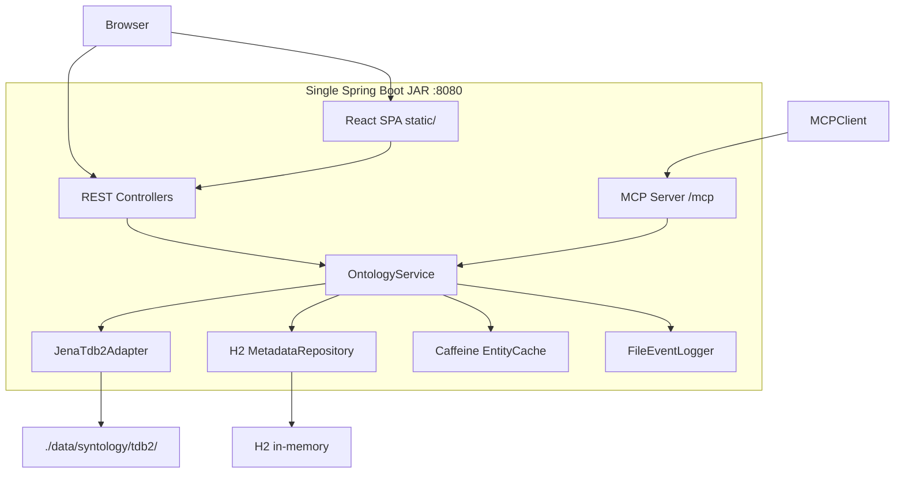
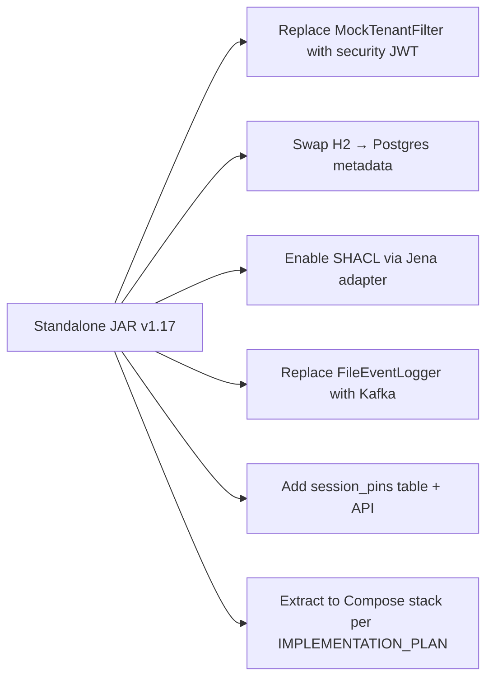

# Standalone Syntology Ontology Demo - Implementation Plan

**Version:** 1.0  
**Date:** 2026-07-12  
**Status:** Approved for implementation  
**Scope:** Single-JAR standalone demo per v1.17 Standalone Demo Focus document

## Context and Document Alignment

Two architecture sources drive this plan:

| Source | Role in this plan |
|--------|-------------------|
| [synanton-design-1.17.md §19](../architecture/platform/synanton-design-1.17.md) | Production target: `syntology` owns entity/relation resolution, version history, session pinning, capability matrix. Demo implements the core subset (resolve, version bump, graph fetch) and defers session pinning, merge/deprecate, Kafka, gRPC. |
| [v1.17 Standalone Demo Focus](../architecture/syntology/1.17/Syntology%20Ontology%20Management%20Module%20and%20UI%20%E2%80%93%20v1.17%20(Standalone%20Demo%20Focus).md) | **Primary implementation spec**: single JAR, H2 metadata, mock auth, embedded UI, MCP on `/mcp`, simplified validation. |

**Current repo state:** Step 0 scaffolding only - Gradle modules and UI package stubs exist; no source code, no Docker Compose, no demo data ([README.md](../../README.md)). Active modules: [`java/syntology`](../../java/syntology), [`ui/syntology-admin`](../../ui/syntology-admin).

**Explicit non-goals** (per v1.17 doc + user choice): `security`, `topology`, Docker Compose stack, SHACL/OWL reasoning, multi-tenancy, Kafka, Synton chat UI. These remain as empty monorepo placeholders for later.

---

## Target Architecture



**Run path:** `./gradlew :java:syntology:bootRun` → `http://localhost:8080` (UI + API + MCP).

---

## Backend: `java/syntology`

### Package layout (hexagonal, per v1.17 doc)

```
org.synanton.syntology
├── app/                    SyntologyApplication, config, DemoDataLoader
├── api/
│   ├── rest/               OntologyController, CapabilitiesController
│   ├── mcp/                McpController (STREAMABLE_HTTP tools)
│   └── dto/                request/response records
├── domain/
│   ├── model/              EntityType, RelationType, OntologyGraph, OntologyVersion
│   ├── service/            OntologyService
│   └── port/
│       ├── in/             OntologyUseCases
│       └── out/            OntologyAdapter, MetadataRepository, EventPublisher
└── infra/
    ├── jena/               JenaTdb2Adapter, SparqlQueries, GraphTransformer
    ├── jdbc/               H2MetadataRepository, Flyway V1__init.sql
    ├── cache/              CaffeineEntityCache
    ├── events/             FileEventLogger → syntology-events.log
    └── security/           MockTenantFilter (hard-coded tenant "demo")
```

### Key domain contracts

Implement `OntologyAdapter` SPI exactly as specified in the v1.17 doc:

```java
public interface OntologyAdapter {
    void init(String storagePath);
    OntologyGraph loadOntology(String tenant, String version);
    void persistOntology(String tenant, String version, OntologyGraph graph);
    boolean versionExists(String tenant, String version);
    void deleteVersion(String tenant, String version);
    boolean supportsFeature(Feature feature);  // BASIC_GRAPH_STORAGE, VERSIONING only
}
```

`OntologyService` methods (inbound port):
- `listVersions()`, `createVersion(turtleFile)`, `resolveEntity(label, version)`, `resolveRelation(label, version)`, `getGraph(version)`, `validateConcept(stub)`, `getCapabilities()`

### REST endpoints (v1.17 doc §3.3)

| Method | Path | Notes |
|--------|------|-------|
| GET | `/api/v1/ontology/versions` | List from H2 `ontology_versions` |
| POST | `/api/v1/ontology/versions` | Multipart Turtle upload → new TDB2 dataset, mark prior DEPRECATED |
| GET | `/api/v1/ontology/entities` | SPARQL resolve by label + version |
| GET | `/api/v1/ontology/relations` | SPARQL resolve by label + version |
| GET | `/api/v1/ontology/graph` | Cytoscape JSON `{nodes, edges}` |
| GET | `/api/v1/ontology/capabilities` | Reduced matrix (no SHACL/OWL) |
| POST | `/api/v1/ontology/validate` | Stub: label + URI presence check |

### MCP tools (v1.17 doc §5)

Host on `/mcp` using Spring MVC SSE/HTTP handler (lightweight custom implementation or `spring-ai` MCP starter if available - prefer minimal custom to avoid scope creep):

- `syntology.list_ontology` - `{version}` → entities + relations
- `syntology.get_entity` - `{version, label}` → entity details
- `syntology.create_entity` - stub create in active version

All tools delegate to `OntologyService`; tenant hard-coded to `demo`.

### Data layer

**H2 metadata** (Flyway `V1__init.sql` in `src/main/resources/db/migration/`):

```sql
CREATE TABLE ontology_versions (
    version_id   UUID PRIMARY KEY,
    tenant_id    VARCHAR(64) DEFAULT 'demo',
    version      VARCHAR(32) NOT NULL UNIQUE,
    label        VARCHAR(255),
    description  TEXT,
    graph_uri    VARCHAR(512),
    status       VARCHAR(20) DEFAULT 'ACTIVE',
    created_at   TIMESTAMP DEFAULT CURRENT_TIMESTAMP
);
```

**Jena TDB2:** datasets at `./data/syntology/tdb2/{tenant}/{version}/` (configurable via `syntology.storage.jena.path`).

**SPARQL graph fetch** (v1.17 doc §3.5): query `rdfs:Class`, `rdf:Property`, `rdfs:subClassOf`, `rdfs:domain`/`range` → transform to Cytoscape elements in `GraphTransformer`.

### Configuration keys (`application.yml`)

All prefixed `syntology.*` per v1.17 doc §3.6:
- `storage.adapter=jena`
- `storage.jena.path=./data/syntology/tdb2`
- `cache.entity_ttl_seconds=600`
- `mcp.server.path=/mcp`
- `tenant.default=demo`

### Bootstrap / seed data

On first start (empty `ontology_versions` table):
1. Load [`sample-ontology.ttl`](../../java/syntology/src/main/resources/sample-ontology.ttl) - Supply Chain ontology (~20 classes: Product, Supplier, Warehouse, Order, etc.)
2. Create version `1.0.0` with status `ACTIVE`
3. Persist to TDB2 under `demo/1.0.0/`

### Gradle changes to [`java/syntology/build.gradle.kts`](../../java/syntology/build.gradle.kts)

- Add Spring Boot application plugin + `bootJar` main class
- Swap Postgres → H2 (`runtimeOnly("com.h2database:h2")`, add H2 Flyway dependency)
- Add Gradle task `buildUi` that runs `pnpm --dir ../../ui/syntology-admin build` and copies `dist/` → `src/main/resources/static/`
- Wire `processResources.dependsOn(buildUi)` for production builds; skip in dev via `-PskipUi` property
- Add entries to [`gradle/libs.versions.toml`](../../gradle/libs.versions.toml): `h2`, `flyway-h2`

---

## Frontend: `ui/syntology-admin`

Replace stub [`package.json`](../../ui/syntology-admin/package.json) scripts with real Vite + React 18 + TypeScript setup.

### Scope (v1.17 doc §4.2 - demo features only)

| Feature | Page/Component |
|---------|----------------|
| Mock login (any username → tenant `demo`) | `pages/Login.tsx` |
| Version selector dropdown | `components/VersionSelector/` |
| Cytoscape graph (CoLa layout, zoom/pan/drag) | `pages/OntologyViewer.tsx` + `components/GraphCanvas/` |
| Node details side panel | `components/DetailsPanel/` |
| Search/filter highlight | `components/SearchBar/` |
| Version list + Turtle upload | `pages/Admin.tsx` |

**Out of scope:** SHACL panel, Synton chat, grants view, Redux, TanStack Query.

### UI structure (v1.17 doc §4.4)

```
ui/syntology-admin/src/
├── App.tsx, main.tsx
├── pages/          Login, OntologyViewer, Admin
├── components/     GraphCanvas, DetailsPanel, VersionSelector, SearchBar, Layout
├── services/       ontologyApi.ts, auth.ts (mock)
├── hooks/          useOntology.ts, useTenant.ts
├── context/        OntologyContext.tsx  (version, graph, selectedNode)
├── types/          ontology.ts
└── utils/          graphTransformer.ts
```

### State management

React Context + `useState`/`useEffect` (no Redux). `useOntology` fetches `/api/v1/ontology/graph?version=` on version change.

### Tech dependencies

- Vite, React 18, TypeScript 5, Tailwind CSS
- Cytoscape.js + cytoscape-cola layout
- axios (with mock tenant header interceptor)
- Vitest + Testing Library (smoke tests for Login, graph render)

### API proxy for dev

Vite dev server proxies `/api` and `/mcp` → `http://localhost:8080` so `pnpm dev` works against a running backend.

---

## Build and Run Workflow

```bash
# 1. Build UI + backend JAR
./gradlew :java:syntology:clean build

# 2. Run standalone demo
./gradlew :java:syntology:bootRun
# → http://localhost:8080

# 3. MCP smoke test
curl http://localhost:8080/mcp  # or mcp-cli against /mcp
```

Add [`scripts/run-standalone-demo.sh`](../../scripts/run-standalone-demo.sh) as a convenience wrapper.

---

## Testing Strategy

| Layer | What to test |
|-------|-------------|
| **Unit** | `OntologyService` with mocked adapter; `GraphTransformer` Cytoscape output shape |
| **Integration** | `@SpringBootTest` + temp TDB2 dir: seed TTL → GET graph returns nodes/edges; version bump deprecates prior |
| **UI** | Vitest: Login renders; `graphTransformer` converts API response to Cytoscape elements |
| **Manual demo script** | v1.17 doc §6.4: login → graph → node click → search → version switch → admin upload → MCP list |

No Playwright e2e in this phase (that's IMPLEMENTATION_PLAN Step 7 for the Compose stack).

---

## Alignment with Platform §19 (Future Evolution Path)

The hexagonal layout and API surface names match production so the demo can grow without rework:



Deferred production features from [synanton-design-1.17.md §19](../architecture/platform/synanton-design-1.17.md):
- `mergeEntities`, `deprecateType` (gated by synreview)
- Session pinning + `expirePinnedSessions`
- gRPC server for relix/synquest/planner
- Full capability matrix with OWL/SHACL tiers

---

## Implementation Order

Work in vertical slices so each step produces a runnable artifact:

| Step | Task | Deliverable |
|------|------|-------------|
| 1 | Backend skeleton | Spring Boot app, H2 + Flyway, config, health endpoint |
| 2 | Jena adapter + seed loader | TDB2 read/write, sample ontology bootstrap, SPARQL entity resolve |
| 3 | REST API | All 7 endpoints, Cytoscape graph JSON, stub validate |
| 4 | Domain services + cache | Caffeine entity cache, file event logger, capabilities matrix |
| 5 | MCP server | 3 tools on `/mcp` |
| 6 | UI scaffold | Vite/React/Tailwind, mock auth, routing |
| 7 | Graph viewer | Cytoscape canvas, version selector, details panel, search |
| 8 | Admin page | Version list, Turtle upload |
| 9 | Gradle UI integration | `buildUi` task, static resource copy |
| 10 | Tests + demo script | Integration tests, Vitest smoke, `run-standalone-demo.sh` |

**Done when:** `./gradlew :java:syntology:bootRun` serves UI at `:8080`, graph renders Supply Chain ontology, admin can upload a new Turtle version, MCP `list_ontology` returns entities.
