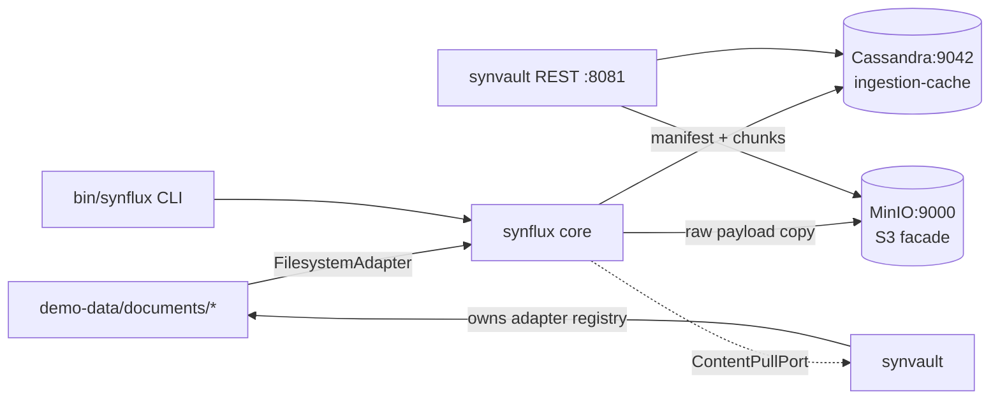

# Ingestion Pipeline (synvault + synflux + ingestion-cache) - Implementation Plan

**Version:** 1.0
**Date:** 2026-07-19
**Status:** Draft for review
**Scope:** Phase 1 delivers a working end-to-end ingestion demo: filesystem source → synflux pipeline → ingestion-cache (Cassandra) + object store (MinIO acting as S3 facade). No indexing engine, no enrichment, no embedding. Later phases layer those in.

---

## 1. Context and Document Alignment

Two architecture sources drive this plan:

| Source | Role in this plan |
|--------|-------------------|
| [synanton-design-1.18.md](../architecture/platform/synanton-design-1.18.md) §16 `synvault`, §17 `synflux`, §18 `ingestion-cache` | Production target contracts and data model. This plan implements a **strict subset**: no enrichment (§17 two-step chain-of-thought stage), no embedding, no tier movement, no GDPR cascade, no router. |
| [standalone-syntology-demo.md](./standalone-syntology-demo.md) | Style precedent for single-JAR, mock-tenant, embedded-UI demos. This plan follows the same conventions (hexagonal modules, Spring Boot, Flyway for schema, `demo` hard-coded tenant). |

**Current repo state:** `java/synvault/`, `java/synflux/`, `java/synflux-router/` are empty placeholders (`.gitkeep` only). No `ingestion-cache` submodule exists. None of the three appear in `settings.gradle.kts`. `java/shared/common/` is scaffolded but empty. See survey in this document's appendix.

**Explicit non-goals for Phase 1** - carried forward from the design doc but deferred:

- No `synquest`, no `relix`, no `gateway`, no `synapt` - Phase 1 has no query path.
- No `synflux-router` - a single core service ingests directly; router split is Phase 3.
- No enrichment stage (Pass 1 / Pass 2 chain-of-thought), no `analysis_cache`.
- No embedding stage, no `embedding_content_cache`, no vLLM.
- No tier movement (everything stays HOT), no Glacier, no cold-retrieval rehydration.
- No GDPR erasure cascade, no CAS on `source_ref_count`.
- No Kafka topics, no Avro schemas, no outbox dispatcher - synflux writes to the cache directly.
- No JWT, no ACLs, no multi-tenant - hard-coded tenant `"demo"`.
- No degraded-mode branching, no PGV validation on gRPC (there is no gRPC in Phase 1).

Everything on the deferred list is called out per module as a **Phase 2/3/4 seam** so the code today doesn't paint us into a corner.

---

## 2. Phase 1 Scope in One Sentence

> Given a local folder of documents, crawl it, parse each file into chunks, persist a manifest row + chunk payloads to Cassandra, and mirror the raw payload into MinIO (the S3 facade), so an operator can inspect both stores and confirm ingestion happened.

Success is verified by a single CLI command (`gradle :java:synflux:run --args="ingest --path=./demo-data/documents"`) plus a REST GET that lists what's in the manifest.

---

## 3. Target Architecture (Phase 1)



**Deployment model.** Two Spring Boot JARs plus two Docker containers:

- `java/synflux/` - CLI + Spring Boot service exposing `POST /ingest/run` (starts a crawl) and `GET /ingest/jobs/{id}` (status). Default port `:8082`.
- `java/synvault/` - Spring Boot service exposing `GET /content/{tenant}/{ref}` (fetches raw payload from MinIO) and `GET /manifest/{tenant}` (list). Default port `:8081`.
- `cassandra:5` - single node, keyspace `ingestion_cache`.
- `minio/minio:latest` - single instance, bucket `synanton-hot`.

`docker compose up` in `deployment/docker/` brings up both storage containers; the two Java services run via `bootRun` or as JARs.

**Trust zones.** All local; no auth. `MockTenantFilter` from the syntology demo pattern is copied so that requests carry `X-Tenant: demo`.

---

## 4. Module Boundaries

The three modules exist as separate Gradle projects even though Phase 1 has thin surfaces. Boundaries follow §16, §17, §18 of the design doc; drawing them now costs nothing and prevents "one big blob" later.

### 4.1 `java/synvault/` - Content Store + Adapter Registry (Phase 1 subset)

**Owns in Phase 1:**
- The `ContentAdapter` SPI (§29 of the design) - Java interface only.
- One first-party adapter: `FilesystemAdapter` (crawls a local folder, streams file bytes).
- The `ContentPullPort` - the callable interface synflux invokes to acquire content.
- The MinIO-backed object-store client (`ObjectStorePort` + `MinioObjectStoreAdapter`). This is the S3 facade - same AWS S3 SDK; swap endpoint to switch to real S3.
- REST endpoints: `GET /manifest/{tenant}` (proxies to ingestion-cache), `GET /content/{tenant}/{ref}` (streams from MinIO).

**Does not own in Phase 1:**
- Tier movement (Warm/Cold/Glacier) - deferred.
- Multiple adapters - only `FilesystemAdapter`.
- The manifest table itself - that lives in `ingestion-cache`; synvault reads through it.

### 4.2 `java/synflux/` - Ingestion Engine (Phase 1 subset)

**Owns in Phase 1:**
- The ingestion pipeline: acquire → parse → chunk → persist. Enrichment and embedding stages exist as **no-op pipeline steps** wired but disabled, so Phase 2 lands them by flipping a flag and dropping in an implementation.
- The `IngestionJob` model (id, tenant, source-path, state, counters) - in-memory + Cassandra `jobs` table.
- The crawl loop that walks a source, computes `content_ref_id` (UUIDv5 over `sha256(bytes)`), and idempotently upserts.
- SHA256 hashing (matches §17 SHA256 incremental cache) - used for idempotency, not yet for embedding-cache skip.
- REST endpoints: `POST /ingest/run` (body: `{"tenant":"demo","source":"filesystem","path":"..."}`), `GET /ingest/jobs/{id}`, `GET /ingest/jobs`.
- A CLI entry point (`main` method) so demos can be triggered without curl.

**Does not own in Phase 1:**
- Router (`synflux-router`) - deferred; core reads its own control-plane config directly.
- Two-step enrichment, vision captioning, cross-lang tokenisation - all deferred but the pipeline stage slots exist.
- Kafka production (the design has `synflux → ingestion-cache` via Kafka; Phase 1 skips Kafka).

### 4.3 `java/ingestion-cache/` - Cache Schema + DAO Library (Phase 1 subset)

**Owns in Phase 1:**
- The Cassandra keyspace and table definitions (via `cassandra-migration` or plain CQL script on startup).
- A thin DAO library (`IngestionCacheClient`) that both `synflux` (writes) and `synvault` (reads) depend on. Not a service - a shared library JAR.
- Read-through helpers: `manifestByRef`, `chunksByRef`, `listManifestByTenant`.

**Tables in Phase 1** (subset of §36 of the design):

```cql
CREATE KEYSPACE ingestion_cache
  WITH replication = {'class':'SimpleStrategy','replication_factor':1};

CREATE TABLE ingestion_cache.manifest (
  tenant_id            text,
  content_ref_id       uuid,
  ingested_at          timestamp,
  schema_version       int,
  chunk_strategy       text,
  chunk_strategy_version int,
  state                text,          -- ACQUIRED | PARSED | CHUNKED (Phase 1 terminal)
  storage_tier         text,          -- HOT only in Phase 1
  archive_location     text,          -- s3://synanton-hot/{tenant}/{ref}
  source_uri           text,          -- file:///abs/path
  source_sha256        text,
  size_bytes           bigint,
  mime_type            text,
  PRIMARY KEY ((tenant_id, content_ref_id))
);

CREATE TABLE ingestion_cache.chunks_payload (
  tenant_id            text,
  content_ref_id       uuid,
  chunk_ordinal        int,
  chunk_text           text,
  chunk_sha256         text,
  PRIMARY KEY ((tenant_id, content_ref_id), chunk_ordinal)
);

CREATE TABLE ingestion_cache.jobs (
  tenant_id            text,
  job_id               uuid,
  started_at           timestamp,
  completed_at         timestamp,
  state                text,          -- RUNNING | SUCCEEDED | FAILED
  source               text,          -- filesystem
  source_path          text,
  processed_count      int,
  error_count          int,
  last_error           text,
  PRIMARY KEY ((tenant_id), started_at, job_id)
) WITH CLUSTERING ORDER BY (started_at DESC, job_id ASC);
```

**Does not own in Phase 1:**
- `analysis_cache`, `image_caption_cache`, `embedding_content_cache` - added in Phase 2.
- Cross-tenant synthesis cache - deferred.
- Vacuum staggering - deferred; no TTLs yet.

---

## 5. Phased Roadmap

Phase 1 is the meat of this plan. Later phases are outlined so today's design choices survive.

| Phase | Deliverable | Adds | Modules touched |
|-------|-------------|------|-----------------|
| **1 (this plan)** | FS crawl → Cassandra + MinIO. No indexing. | `FilesystemAdapter`, manifest, chunks, MinIO facade | synvault, synflux, ingestion-cache |
| 2 | Enrichment + embedding | Pass-1/Pass-2 stages, `analysis_cache`, `embedding_content_cache`, vLLM stub | synflux (new stages), ingestion-cache (new tables) |
| 3 | Router split + Kafka | `synflux-router`, `ingestion_events` topic, Avro schemas | synflux-router (new module) |
| 4 | Query path online | synflux dispatches to `synquest`/`relix`; `dispatched_to_*` timestamps live | synflux (dispatch), ingestion-cache (new columns) |
| 5 | Tier movement + GDPR | Warm/Cold, tombstone erasure, CAS on source_ref_count | synvault (Tier Manager) |

Each phase is expected to be a distinct plan document; boundaries stay stable across all of them.

---

## 6. Prerequisites (must land before Phase 1 tasks start)

These are cross-cutting and blocking. Assign them **first**.

| # | Prereq | Home | Notes |
|---|--------|------|-------|
| P1 | `java/shared/common/` gains: `TenantContext`, `ProblemDetail`, `SubjectAssertion` (stub), `MockTenantFilter` | `java/shared/common/` | Currently empty; needed by both new services. Small - one file per class. |
| P2 | Add `java/synvault`, `java/synflux`, `java/ingestion-cache` to `settings.gradle.kts` | root | Survey shows they're intentionally excluded. |
| P3 | Add Cassandra + MinIO to `deployment/docker/compose.yaml` | `deployment/docker/` | File does not exist yet - create with just these two services + a `demo-data` bind mount. |
| P4 | `demo-data/documents/` seed folder with ~10 small text/markdown files | `demo-data/documents/` | Content doesn't matter; a mix of `.txt`, `.md`, `.html` exercises the parser branches. |
| P5 | Root `bin/synflux` shell script wrapping `gradle :java:synflux:run --args=...` | `bin/` (new) | Convenience for demos. |

---

## 7. Task Breakdown (Phase 1)

Ordered by dependency. Each task is scoped to ≤ 2 days of work for one engineer.

### 7.1 `java/ingestion-cache/` (foundation - must land before synflux/synvault touch it)

| # | Task | Deliverable |
|---|------|-------------|
| IC-1 | Create Gradle module; declare deps: `com.datastax.oss:java-driver-core`, Spring Boot starter (for autoconfig only), Testcontainers-Cassandra. | `build.gradle.kts` |
| IC-2 | Ship CQL schema (three tables above) as `src/main/resources/cql/V1__baseline.cql`. Load on first connect via a `SchemaInstaller` bean; idempotent. | Schema file + installer |
| IC-3 | Implement `IngestionCacheClient` DAO: `upsertManifest`, `insertChunk`, `insertChunks(batch)`, `readManifest`, `listManifest(tenant, limit, cursor)`, `readChunks(tenant, ref)`, `upsertJob`, `listJobs(tenant, limit)`. | DAO class + record types |
| IC-4 | Testcontainers integration test: spin real Cassandra, install schema, round-trip manifest + chunks. | `IngestionCacheClientIT` |
| IC-5 | Configuration record: `IngestionCacheProperties(contactPoints, port, dc, keyspace)` - read from Spring config; sensible defaults for `localhost:9042`. | Config class |

### 7.2 `java/synvault/`

| # | Task | Deliverable |
|---|------|-------------|
| SV-1 | Create Gradle module; deps: Spring Boot web, AWS S3 SDK v2, `shared/common`, `ingestion-cache`. | `build.gradle.kts` |
| SV-2 | Define SPI `ContentAdapter` (matches §29 shape but Phase 1 subset): `AdapterDescriptor descriptor()`, `Stream<ContentRef> list(String rootUri)`, `InputStream open(ContentRef)`, `Optional<Instant> lastModified(ContentRef)`. | Interface + `AdapterDescriptor` record + `ContentRef` record |
| SV-3 | Implement `FilesystemAdapter`: walks a directory recursively (bounded depth 32); filters by allow-listed MIME (via `Files.probeContentType`); yields one `ContentRef` per file. Symlink loops guarded. | Class + unit test |
| SV-4 | Implement `ContentPullPort` façade around adapter registry: `Stream<ContentRef> discover(String tenant, String rootUri)`, `InputStream open(String tenant, ContentRef)`. Registry maps `scheme://` → adapter. Only `file://` registered in Phase 1. | Class + adapter registry |
| SV-5 | Implement `ObjectStorePort` + `MinioObjectStoreAdapter`: `putObject(bucket, key, InputStream, size, contentType)`, `getObject(bucket, key)`, `headObject(bucket, key)`. Uses AWS S3 SDK v2 with path-style access and MinIO endpoint. | Port + adapter + config |
| SV-6 | REST endpoints: `GET /manifest/{tenant}` (paged), `GET /manifest/{tenant}/{ref}`, `GET /content/{tenant}/{ref}` (302 to presigned MinIO URL OR direct stream - pick presigned for demo). | Controller + integration test |
| SV-7 | Application class `SynvaultApplication` + `application.yaml` with all defaults; `MockTenantFilter` wired. | Boot entry |

### 7.3 `java/synflux/`

| # | Task | Deliverable |
|---|------|-------------|
| SF-1 | Create Gradle module; deps: Spring Boot web + batch (optional), `synvault`, `ingestion-cache`, Apache Tika (for parsing text out of `.md`/`.html`/`.txt`), Guava (for hashing). | `build.gradle.kts` |
| SF-2 | Define pipeline stage interface: `PipelineStage<In, Out>` with `String name()`, `Out apply(In in, StageContext ctx)`. Wire a `Pipeline` runner that iterates stages sequentially. Enrichment/embedding stages exist as `NoOpEnrichmentStage`, `NoOpEmbeddingStage` - registered but skipped. | Stage abstractions + runner |
| SF-3 | Implement `AcquireStage`: takes `ContentRef` → reads bytes via `ContentPullPort` → produces `AcquiredDocument(bytes, sha256, mime, sourceUri)`. Computes SHA256 once. | Stage class + test |
| SF-4 | Implement `ParseStage`: uses Tika to extract plain text from the byte stream; produces `ParsedDocument(text, metadata)`. Skips binaries (returns empty text but doesn't fail). | Stage class + test |
| SF-5 | Implement `ChunkStage`: fixed-window chunking, 400 tokens per chunk with 50-token overlap. Token approximation via whitespace-split (Phase 2 replaces with a real tokenizer). Produces `List<Chunk>`. | Stage class + test |
| SF-6 | Implement `PersistStage`: writes manifest row (state=CHUNKED) + chunks_payload rows in a logged batch; also PUTs the raw bytes into MinIO at `s3://synanton-hot/{tenant}/{ref}` via `ObjectStorePort`; records `archive_location` on the manifest. | Stage class + integration test |
| SF-7 | Implement `IngestionJobRunner`: orchestrates a crawl - creates a `job_id`, calls `ContentPullPort.discover`, runs the pipeline per `ContentRef`, updates the `jobs` row with counters, sets terminal state. Concurrency: bounded thread pool (`synflux.ingest.parallelism` = 4). | Runner class + test |
| SF-8 | REST endpoints: `POST /ingest/run` (body: `{tenant, source, path}` - returns job_id), `GET /ingest/jobs/{id}`, `GET /ingest/jobs`. | Controller + integration test |
| SF-9 | CLI entry: `SynfluxCli` - parses `ingest --path=… --tenant=demo`, calls the runner, tails progress on stdout, exits with code `0/1`. Same JAR as the service - Spring `CommandLineRunner` gated by `--cli` flag. | CLI class + smoke test |
| SF-10 | Idempotency: `content_ref_id = UUIDv5(namespace, "{tenant}:{sha256}")`. Second ingestion of the same file is a no-op (manifest already at CHUNKED with same sha256). Counter `skipped_duplicate` on the job. | Baked into runner + test |

### 7.4 Wiring & demo

| # | Task | Deliverable |
|---|------|-------------|
| W-1 | `deployment/docker/compose.yaml` - Cassandra + MinIO + healthchecks. Mount `../demo-data` into `/demo-data` on both Java services (for filesystem crawl). | Compose file |
| W-2 | `deployment/docker/synvault.Dockerfile`, `deployment/docker/synflux.Dockerfile` - multi-stage build, Java 21 JRE base. Optional for Phase 1 (services can also run via `bootRun`). | Two Dockerfiles |
| W-3 | `scripts/run-ingestion-demo.sh` - brings up Docker, waits for health, runs the CLI ingest against `demo-data/documents`, then `curl`s the manifest to prove it worked. | Script |
| W-4 | End-to-end acceptance test: spin containers via Testcontainers → run ingest against a fixture folder → assert manifest count matches file count → assert MinIO bucket contains expected keys. Lives in `test/acceptance/` (new). | `IngestionE2EAcceptanceIT` |
| W-5 | README section at repo root: "Run the ingestion demo" - three commands. | README edit |

---

## 8. Data Flow (Phase 1 walkthrough)

For a single file `demo-data/documents/foo.md`:

1. **CLI or `POST /ingest/run`** → `IngestionJobRunner.start(tenant="demo", source="filesystem", path="/demo-data/documents")` → returns `job_id`; writes `jobs` row with `state=RUNNING`.
2. **Discovery** → `ContentPullPort.discover("demo", "file:///demo-data/documents")` → `FilesystemAdapter.list(...)` yields `ContentRef(scheme=file, uri=file:///demo-data/documents/foo.md)`.
3. **Per-ref pipeline** (in bounded pool):
   - **AcquireStage** → `ContentPullPort.open(ref)` → reads bytes, computes `sha256`, `content_ref_id = UUIDv5(NS, "demo:{sha256}")`.
   - **ParseStage** → Tika extracts plain text.
   - **ChunkStage** → 400/50 fixed-window → `List<Chunk>`.
   - **NoOpEnrichmentStage** → passthrough.
   - **NoOpEmbeddingStage** → passthrough.
   - **PersistStage** →
     - `MinioObjectStoreAdapter.putObject("synanton-hot", "demo/{ref}", bytes, size, mime)` → gets `s3://synanton-hot/demo/{ref}`.
     - `IngestionCacheClient.upsertManifest(...)` with `state=CHUNKED`, `storage_tier=HOT`, `archive_location=s3://…`.
     - `IngestionCacheClient.insertChunks(batch)`.
4. **Job completion** → counters flushed, `jobs.state=SUCCEEDED`.
5. **Verification** →
   - `GET /manifest/demo?limit=100` → returns manifest rows.
   - `GET /content/demo/{ref}` → 302 to a MinIO presigned URL, browser downloads the original file.

---

## 9. Testing Strategy

Tiered per §48a of the design (unit → component-with-testcontainers → acceptance).

- **Unit tests** - each stage tested in isolation with in-memory fakes (`InMemoryObjectStore`, `InMemoryIngestionCacheClient`). Fast, run on every commit. Coverage target ≥ 80% for stages.
- **Component tests (Testcontainers)** - spin Cassandra and MinIO from Testcontainers; exercise `IngestionCacheClient` and `MinioObjectStoreAdapter` end-to-end. Runs on PR merge.
- **Acceptance test** - `test/acceptance/IngestionE2EAcceptanceIT`: full compose stack + real service JARs + fixture folder → assert manifest count + object-store keyset + job succeeded. Runs nightly.
- **Idempotency test** - ingest the same folder twice; assert second run reports `processed=N, skipped_duplicate=N, new=0`.
- **Failure test** - inject a malformed file that Tika throws on; assert the job continues, `error_count=1`, `last_error` set, other files still succeed.

**Non-goals for Phase 1 tests:** performance benchmarks, chaos tests, fuzzing - deferred until embeddings arrive (they're the hot loop that matters).

---

## 10. Configuration Surface (Phase 1)

All lives in `application.yaml` per service. Sensible defaults are baked in so `bootRun` works on a fresh clone with Docker up.

```yaml
# synflux/src/main/resources/application.yaml
synflux:
  ingest:
    parallelism: 4
    max-file-size-bytes: 104857600      # 100 MB
    chunk:
      strategy: fixed-window
      target-tokens: 400
      overlap-tokens: 50
  pipeline:
    enrichment.enabled: false           # Phase 2 flips this
    embedding.enabled: false            # Phase 2 flips this
ingestion-cache:
  contact-points: [localhost]
  port: 9042
  keyspace: ingestion_cache
  local-dc: datacenter1
synvault:
  object-store:
    endpoint: http://localhost:9000     # MinIO in dev; swap to https://s3.amazonaws.com for prod
    region: us-east-1
    path-style-access: true
    access-key: minioadmin
    secret-key: minioadmin
    hot-bucket: synanton-hot
```

Only the S3 endpoint changes between demo and production; everything else stays identical.

---

## 11. Risks and Open Questions

| Risk | Mitigation | Decision needed? |
|------|------------|------------------|
| Cassandra single-node is heavy for a laptop demo - 2 GB RAM min. | Note in README; offer H2 shim as a Phase 1.5 escape hatch if adoption suffers. | No, live with it. |
| Fixed-window chunking is naive - will need to be replaced. | Chunker is a plug (`ChunkStage` is stage-interface-compliant). | No. |
| Tika pulls a lot of transitive deps (~50 MB). | Constrain to `tika-core` + `tika-parsers-standard-package` minimal profile. | Yes - pick minimal profile. |
| No hash-collision handling on `content_ref_id = UUIDv5(sha256)`. | Accepted: SHA256 collisions aren't a Phase 1 concern. | No. |
| Test fixture folder must not include user files (privacy). | `demo-data/documents/` is committed with only synthetic content. | No. |
| Presigned URLs from MinIO leak in `GET /content` responses. | Fine for demo; Phase 3 replaces with proxy stream + auth. | No. |
| `settings.gradle.kts` comments say modules are intentionally excluded. Untidying that runs against the prior style. | Update the comment when un-excluding; keep syntology's phrasing pattern. | No. |

---

## 12. Definition of Done (Phase 1)

Phase 1 is complete when **all** of the following hold on a fresh clone:

1. `docker compose -f deployment/docker/compose.yaml up -d` brings Cassandra and MinIO to healthy state.
2. `./gradlew :java:synvault:bootRun` and `./gradlew :java:synflux:bootRun` start cleanly in separate terminals.
3. `./scripts/run-ingestion-demo.sh` completes with exit code 0 and prints "Ingested N documents from demo-data/documents".
4. `curl :8081/manifest/demo` returns a JSON array with N entries, each with `state=CHUNKED`, `storage_tier=HOT`, `archive_location` pointing to `s3://synanton-hot/demo/…`.
5. `mc ls minio/synanton-hot/demo/` (or MinIO console) shows N objects matching the manifest.
6. Re-running the demo yields `skipped_duplicate=N, new=0`.
7. `./gradlew test` and `./gradlew acceptanceTest` both pass.
8. The three new modules and one new shared/common set are the **only** additions - no unrelated churn.

---

## 13. Follow-on Phases (Signposted)

- **Phase 2** - Enrichment + embedding on a laptop-scale GPU rig (16 GB VRAM across 2 cards). Adds `analysis_cache`, `image_caption_cache`, `embedding_content_cache` to `ingestion-cache`. Flips `synflux.pipeline.enrichment.enabled` and `synflux.pipeline.embedding.enabled`. Introduces `java/synanton-llm-client` (per §27c) targeting an Ollama-served 7-8B Q4 LLM on GPU-0 and a HuggingFace TEI-served BGE embedder on GPU-1. Full plan: [ingestion-pipeline-Phase2.md](./ingestion-pipeline-Phase2.md).
- **Phase 3** - Router split. Introduces `synflux-router` as a second deployable that reads a Kafka topic (`ingestion_events`) and dispatches to synflux core workers. Phase 1's REST `/ingest/run` remains as a manual bypass.
- **Phase 4** - Query path. Adds `dispatched_to_synquest_at`, `dispatched_to_relix_at` columns; synflux dispatches through the SPIs defined in §28-§32 of the design doc.
- **Phase 5** - Tier movement + GDPR. Adds `synvault`'s `Tier Manager` (Warm/Cold movement) and the erase cascade from §10.

Each phase's plan lives as its own doc; this one closes when Phase 1's Definition of Done is met.

---

## Appendix - Current repo state (survey, 2026-07-19)

- `java/synvault/`, `java/synflux/`, `java/synflux-router/` are placeholders (`.gitkeep` only). No Gradle files, no source. Not listed in `settings.gradle.kts`.
- No `ingestion-cache` submodule anywhere.
- `java/shared/common/` has `build.gradle.kts` but no source files.
- `deployment/docker/compose.yaml` does not exist yet.
- `demo-data/documents/` does not exist yet (`demo-data/` has empty `users/` and `ontologies/`).
- `test/acceptance/` does not exist yet.
- Existing implementation work is concentrated in `java/syntology/` (~1,100 LOC) - see [standalone-syntology-demo.md](./standalone-syntology-demo.md).

Nothing in this plan conflicts with the syntology work; the two run side-by-side on the same JVM toolchain (Java 21, Spring Boot 3.3.5) and share `java/shared/common/`.
