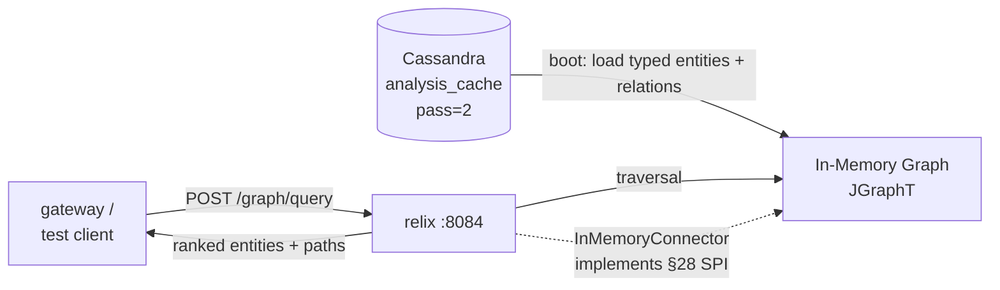

# 02 - relix - Phase 1 - GraphRAG Engine (In-Memory Graph PoC)

**Version:** 1.0
**Date:** 2026-07-19
**Status:** Draft for review
**Priority:** 2 of 5 in the query-path Phase 1 series (foundation, sibling to synquest).
**Depends on:** [ingestion-pipeline-Phase2.md](./ingestion-pipeline-Phase2.md) Definition of Done - `analysis_cache` populated with Pass-2 typed entities and relations.
**Scope:** Serve entity-centric and relation-traversal queries over the Phase 2 ingestion output. In-memory graph built at boot from Pass-2 analysis JSON. Single tenant, single connector (`InMemoryConnector` per design §28), REST-only.

---

## 1. Context and Document Alignment

| Source | Role |
|--------|------|
| [synanton-design-1.18.md §21 `relix`](../architecture/platform/synanton-design-1.18.md) | Production target - MCP/ACP, connector SPI v1.0, materialized graph views, bounded emulated traversal, Louvain communities, source_ref_count CAS. Phase 1 implements the **in-memory subset**. |
| [synanton-design-1.18.md §28 Relix Graph Connector SPI](../architecture/platform/synanton-design-1.18.md) | Contract this plan must respect - Phase 1 ships the `InMemoryConnector` first-party implementation only. |
| [ingestion-pipeline-Phase2.md](./ingestion-pipeline-Phase2.md) | Data source - `ingestion_cache.analysis_cache WHERE pass_number=2` carries typed entities and relations. |

**Explicit non-goals for Phase 1:**

- No `Neo4jConnector`, no `NeptuneConnector` - only `InMemoryConnector`.
- No MCP/ACP protocol server (§21 MCP tools are Phase 3+).
- No gRPC - Java in-process for Phase 1; the SPI shape is honoured but transport is a direct Java call.
- No Materialized Graph Views (MGV), no periodic refresh, no lag SLO.
- No Louvain community detection, no `community_id` property.
- No bounded emulated traversal - the in-memory graph supports every pattern natively.
- No cost calibration, no `ConnectorCostProfile` self-measurement - a stub `CostProfile` is returned.
- No `source_ref_count` CAS - Phase 1 doesn't delete entities.
- No pattern coverage matrix - all patterns declared `NATIVE`.
- No continuous probing.
- No cross-tenant, no ACL - single tenant.

---

## 2. Phase 1 in One Sentence

> Given Pass-2 typed entities and relations from `analysis_cache`, build an in-memory directed labelled multigraph at boot, expose an `ExecuteGraphQuery` REST endpoint that supports three query shapes (entity-lookup, one-hop neighbours, k-hop path), and return matching entities and paths with links back to `content_ref_id`s.

---

## 3. Target Architecture



**Deployment.** One Spring Boot service on port `:8084`. No new Docker containers.

**Storage.** Graph lives in JVM heap. Rebuilt on boot and on explicit `POST /graph/rebuild`. `analysis_cache` is the source of truth; the graph is a projection.

---

## 4. Data Contract

**Input:** `POST /graph/query`

Three query shapes in Phase 1:

**Shape 1 - entity lookup:**
```json
{
  "tenant": "demo",
  "shape": "entity_lookup",
  "params": {
    "label": "Acme Corp",
    "type": "Organization",       // optional; nullable narrows the match
    "limit": 10
  }
}
```

**Shape 2 - one-hop neighbours:**
```json
{
  "tenant": "demo",
  "shape": "one_hop",
  "params": {
    "entity_id": "…-uuid",
    "edge_types": ["supplies_to", "acquired"],   // optional filter
    "direction": "OUT",           // IN | OUT | BOTH
    "limit": 50
  }
}
```

**Shape 3 - k-hop path:**
```json
{
  "tenant": "demo",
  "shape": "k_hop_path",
  "params": {
    "from_entity_id": "…-uuid",
    "to_entity_id":   "…-uuid",
    "max_hops": 4,
    "max_paths": 10
  }
}
```

**Output (shape-independent envelope):**
```json
{
  "entities": [
    {
      "entity_id": "…",
      "label": "Acme Corp",
      "type": "Organization",
      "confidence": 0.92,
      "source_refs": [{"content_ref_id": "…", "chunk_ordinals": [3, 7]}]
    }
  ],
  "edges": [
    {
      "edge_id": "…",
      "from_entity_id": "…",
      "to_entity_id":   "…",
      "verb": "supplies_to",
      "confidence": 0.81,
      "source_refs": [{"content_ref_id": "…", "chunk_ordinals": [11]}]
    }
  ],
  "paths": [   // only populated for shape=k_hop_path
    {
      "hops": ["entity_a", "edge_1", "entity_b", "edge_2", "entity_c"],
      "score": 0.72
    }
  ],
  "trace": {
    "shape": "one_hop",
    "graph_generation": 4,
    "candidate_count": 12,
    "traversal_ms": 3,
    "total_ms": 8
  }
}
```

**Entity/edge identity.** Pass-2 outputs entity labels as strings. Phase 1 canonicalises via `entity_id = UUIDv5(NS_ENT, "{tenant}|{type}|{normalised_label}")` where `normalised_label = label.toLowerCase().trim().replaceAll("\\s+", " ")`. This gives idempotent aggregation across documents - the same "Acme Corp" mentioned in 12 chunks becomes one entity node with 12 `source_refs`.

Similarly `edge_id = UUIDv5(NS_EDGE, "{tenant}|{from_entity_id}|{verb}|{to_entity_id}")`.

---

## 5. Module Boundaries

**Owned by `java/relix/` in Phase 1:**
- In-memory graph (JGraphT `DirectedMultigraph`).
- Loader that reads Pass-2 JSON from `analysis_cache` and materialises the graph.
- The three query-shape executors.
- `InMemoryConnector` - implements the §28 SPI shape (interface-level; transport is direct Java call).
- REST endpoints: `POST /graph/query`, `POST /graph/rebuild`, `GET /health`, `GET /graph/stats`.

**Not owned in Phase 1:**
- Any external graph store (Neo4j/Neptune).
- MCP/ACP tools - Phase 3+.
- Reranking of entity candidates (would go on `gateway`).
- Any write path - Phase 1 is read-only projections from `analysis_cache`.

---

## 6. Prerequisites

| # | Prereq | Home | Notes |
|---|--------|------|-------|
| P1 | Ingestion Phase 2 DoD met - `analysis_cache` has Pass-2 rows. | - | Blocking. |
| P2 | Add `java/relix` to `settings.gradle.kts`. | root | New module. |
| P3 | Pass-2 JSON schema documented - `{typed_entities: [{label, type, confidence, chunk_ordinals[]}], relations: [{from, to, verb, confidence, chunk_ordinals[]}]}`. | ingestion Phase 2 | Loader validates against this schema. |

---

## 7. Task Breakdown

Ordered by dependency. Each task ≤ 2 days for one engineer.

| # | Task | Deliverable |
|---|------|-------------|
| RX-1 | Create Gradle module; deps: Spring Boot web, JGraphT-core 1.5.x, Jackson, `ingestion-cache` DAO, `shared/common`. | `build.gradle.kts` |
| RX-2 | Domain records: `Entity`, `Edge`, `Path`, `SourceRef`, `GraphQueryRequest`, `GraphQueryResponse`, `GraphStats`. | Records + tests |
| RX-3 | `Pass2AnalysisParser` - takes a Pass-2 `analysis_json` string, validates against JSON schema, returns typed `Pass2Result(entities[], relations[])`. Rejects malformed rows into an error counter without failing the load. | Class + tests |
| RX-4 | `EntityCanonicalizer` - computes `entity_id = UUIDv5(NS_ENT, key)` and `edge_id = UUIDv5(NS_EDGE, key)`. Merges duplicate entities across documents; accumulates `source_refs`. Confidence merge: max. | Class + tests |
| RX-5 | `GraphLoader` - iterates `analysis_cache WHERE tenant=? AND pass_number=2`, applies parser + canonicalizer, populates a `DirectedMultigraph<Entity, Edge>`. Idempotent, produces the same graph bytes given the same rows. Records max `created_at` seen for incremental reload. | Class + integration test |
| RX-6 | `EntityIndex` - maintains a `(normalised_label, type) → Set<Entity>` map alongside the graph for O(1) label lookup. Also a `(type) → List<Entity>` for type-scoped browses. | Class + tests |
| RX-7 | `EntityLookupExecutor` - implements shape 1. Reads from `EntityIndex`. | Class + tests |
| RX-8 | `OneHopExecutor` - implements shape 2. Uses `Graph.outgoingEdgesOf` / `incomingEdgesOf` with optional edge-type filter. | Class + tests |
| RX-9 | `KHopPathExecutor` - implements shape 3. BFS from `from_entity_id`, capped at `max_hops`, prunes to paths ending at `to_entity_id`, returns top `max_paths` by product of edge confidences. Simple, not the Yen/BFS-K-shortest variant. | Class + tests |
| RX-10 | `InMemoryConnector` - Java interface matching the §28 SPI shape (`executeGraphQuery`, `executeBulkMutation` - mutation throws UnsupportedOperationException in Phase 1, `getEngineDescriptor` returns stub cost profile with all patterns `NATIVE`). | Class + tests |
| RX-11 | `GraphQueryService` - dispatches on `shape` to the right executor. Returns `GraphQueryResponse` with trace. | Service + tests |
| RX-12 | REST controllers: `POST /graph/query`, `POST /graph/rebuild`, `GET /health`, `GET /graph/stats`. `MockTenantFilter` populates `TenantContext`. | Controllers + integration tests |
| RX-13 | `application.yaml`; `RelixApplication` boot class; on startup, run `GraphLoader.load(tenant="demo")`. Boot completes only when load is done. Log entity + edge counts. | Boot + config |
| RX-14 | E2E test: Testcontainers Cassandra → seed 30 fake Pass-2 rows with known entity mentions across documents → boot relix → run one query of each shape → assert expected entities/edges/paths returned. | `RelixE2EIT` |
| RX-15 | `/graph/rebuild` endpoint - swaps to a freshly-loaded graph atomically (build new, `AtomicReference.set`, GC old). Per-tenant mutex to prevent concurrent rebuilds. | Endpoint + test |

---

## 8. Data Flow

For query `{shape: "entity_lookup", params: {label: "Acme Corp", type: "Organization", limit: 10}}` on a demo corpus:

1. Boot (once) → `GraphLoader.load("demo")` scans `analysis_cache` where `pass_number=2`.
   - Row 1: `{entities: [{label:"Acme Corp", type:"Organization", conf:0.9, chunk_ordinals:[3]}, ...], relations: [...]}`.
   - Canonicaliser produces `entity_id_1 = UUIDv5(NS_ENT, "demo|Organization|acme corp")`.
   - Row 2 mentions the same "Acme Corp" - same `entity_id_1`, source_refs accumulate.
   - Graph ends up with 342 unique entities and 891 edges.
2. Request → `EntityLookupExecutor.execute(params)`.
3. `EntityIndex.lookup("acme corp", "Organization")` → returns `{entity_id_1}`.
4. Materialise `Entity` DTO with `source_refs` from the accumulated set.
5. Response envelope, trace timings, back to caller.

For `{shape: "one_hop", params: {entity_id: id_1, direction: "OUT", limit: 50}}`:
- `Graph.outgoingEdgesOf(entity_1)` → 7 edges → materialise 7 `Edge` DTOs + 7 target `Entity` DTOs → return.

For `{shape: "k_hop_path", from: id_A, to: id_B, max_hops: 4, max_paths: 10}`:
- BFS from A, depth ≤ 4, collect all paths ending at B.
- Score each path by product of edge confidences.
- Return top 10 paths.

---

## 9. Configuration Surface

```yaml
relix:
  graph:
    load-on-boot: true
    tenant: demo
  query:
    entity-lookup-default-limit: 10
    one-hop-default-limit: 50
    k-hop-max-hops-cap: 6
    k-hop-max-paths-cap: 100
  server:
    port: 8084
ingestion-cache:
  contact-points: [cassandra]
  port: 9042
  keyspace: ingestion_cache
  local-dc: datacenter1
```

---

## 10. Testing Strategy

- **Unit tests** - Canonicaliser (idempotent hashes, label normalisation edge cases), each executor against a hand-built 20-node graph.
- **Component tests (Testcontainers)** - Cassandra + seed Pass-2 rows → boot relix → run all three shapes.
- **Load idempotency** - same Cassandra content → identical graph bytes (via a stable serialisation).
- **Merge semantics** - inject "Acme Corp", "acme corp", "ACME  CORP" across 3 different rows; assert canonicalisation collapses to one entity with 3 source_refs.
- **Path pruning** - 4-hop query on a dense graph must respect `max_paths=10`; test the cap.
- **Malformed Pass-2 JSON** - inject one row with invalid JSON; loader logs + increments error counter but completes with the rest of the graph.
- **Rebuild atomicity** - while a `POST /graph/query` is running, `POST /graph/rebuild` completes; the running query still returns valid results from its snapshot.

---

## 11. Risks and Open Questions

| Risk | Mitigation |
|------|------------|
| Pass-2 output quality varies with LLM temperature - entity labels drift ("Acme Corp." vs "Acme Corp"). | Canonicalisation normalises whitespace and trailing punctuation; confidence merge is `max`, not sum. Documented as a Phase 2 improvement (fuzzy merge). |
| In-memory graph doesn't scale past ~100K entities on a laptop (JGraphT overhead ~500 B/node). | PoC target ~1K-10K entities; documented. Phase 2 swaps in `Neo4jConnector`. |
| K-hop BFS on dense graphs explodes. | `max_hops` capped at 6; `max_paths` capped at 100; per-request timeout 2 s (returns partial results if exceeded). |
| Confidence values from LLM are unreliable. | Not exposed as an SLO; scoring is descriptive, not ranking. Gateway is expected to score by other signals. |
| No incremental load - every new Phase 2 ingest run requires a `POST /graph/rebuild`. | Acceptable at PoC scale (~10 s rebuild for 10K entities). Phase 3 adds streaming updates. |
| The SPI `InMemoryConnector` doesn't yet run over gRPC. | Phase 3 adds gRPC transport per §28. Java interface shape is preserved so the switch is a transport layer, not a rewrite. |
| Two entities with identical `(type, normalised_label)` but semantically different (e.g. two companies named "Apple"). | Accepted collision; not solvable without disambiguation signals. Documented in Phase 1 non-goals. |

---

## 12. Definition of Done (Phase 1)

Phase 1 is complete when **all** of the following hold with Phase 2 ingestion DoD met:

1. `./gradlew :java:relix:bootRun` boots cleanly; on a 30-Pass-2-row corpus, boot completes in < 10 s; log line reports entity + edge counts.
2. `POST /graph/query { shape:"entity_lookup", … }` returns matching entities with populated `source_refs`.
3. `POST /graph/query { shape:"one_hop", … }` returns outgoing neighbours (or incoming, or both) with edges annotated with `verb` and `source_refs`.
4. `POST /graph/query { shape:"k_hop_path", … }` on a corpus where two entities are transitively connected returns at least one path with a coherent hop sequence.
5. `POST /graph/rebuild` runs concurrently with in-flight queries and leaves the graph consistent; second concurrent rebuild returns 409.
6. `GET /graph/stats` returns entity count, edge count, load-time, graph_generation.
7. p95 total_ms < 50 ms for entity_lookup and one_hop; < 500 ms for k_hop_path at max_hops=4 on the PoC corpus.
8. `./gradlew test` passes; the Testcontainers component test passes.
9. `InMemoryConnector` implements the §28 SPI Java interface (mutation throws `UnsupportedOperationException`, descriptor returns valid stub cost profile).
10. No modifications to `synvault`, `synflux`, `synanton-llm-client`, `ingestion-cache`.

---

## 13. Follow-on Phases (Signposted)

- **Phase 2 (relix)** - Fuzzy entity merge (embedding-based similarity), incremental Pass-2 stream consumer, entity deduplication feedback into `synreview`.
- **Phase 3 (relix)** - gRPC transport for the connector SPI; `Neo4jConnector` as a second first-party connector; MCP tool surface (§21 MCP/ACP).
- **Phase 4 (relix)** - Materialized Graph Views (MGV) with periodic refresh, MGV freshness SLO, cost calibration on real connectors.
- **Phase 5 (relix)** - Louvain community detection, `community_id` property on nodes, source_ref_count CAS for GDPR cascade.
- **Phase 6 (relix)** - Bounded emulated traversal, pattern coverage matrix populated per connector, cross-connector federated queries.

Each phase's plan lives as its own doc when needed.
