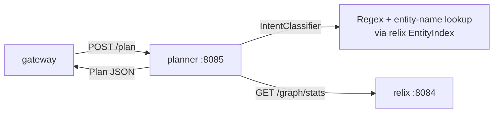

# 03 - planner - Phase 1 - Search Planner (Heuristic PoC)

**Version:** 1.0
**Date:** 2026-07-19
**Status:** Draft for review
**Priority:** 3 of 5 in the query-path Phase 1 series (first request-side module; sits between gateway and the two search foundations).
**Depends on:** [01-synquest-Phase1.md](./01-synquest-Phase1.md) and [02-relix-Phase1.md](./02-relix-Phase1.md) - the planner emits references to their contracts.
**Scope:** Given a query, decide which of `synquest` / `relix` (or both) to call, in what order, and with what parameters. Emit a linear execution plan for `gateway` to run. No cost estimation, no context budget, no cross-region logic.

---

## 1. Context and Document Alignment

| Source | Role |
|--------|------|
| [synanton-design-1.18.md §22 `planner`](../architecture/platform/synanton-design-1.18.md) | Production target - cost-based planner with cross-region penalty maps, follow-the-sun serving, context budget, GPU degraded mode branching, rerank policies. Phase 1 implements a **rule-based intent classifier** with a linear plan output. |
| [01-synquest-Phase1.md](./01-synquest-Phase1.md), [02-relix-Phase1.md](./02-relix-Phase1.md) | The two callable engines the plan targets. |

**Explicit non-goals for Phase 1:**

- No cost model - plans do not carry cost estimates.
- No `cross_region_penalty_ms` map - single region only.
- No follow-the-sun serving selection.
- No context budget arithmetic (§22 v1.1 budget node).
- No rerank node - rerank slot is left empty; `gateway` may attach a reranker later, planner doesn't allocate one.
- No GPU degraded-mode branching (no synflux degraded manifest visibility yet).
- No plan caching - every call re-plans; PoC scale.
- No LLM-driven intent classification - heuristics only. (The design's `Intent classification` v1.1 uses an LLM; Phase 1 uses regex + entity-name lookup.)
- No plan explain / trace beyond the plan itself.

---

## 2. Phase 1 in One Sentence

> Take an incoming query, classify it into one of `RETRIEVAL_ONLY | GRAPH_ONLY | HYBRID`, emit a linear plan with 1-3 steps (`synquest.search`, `relix.graph_query`, or both), and hand the plan to `gateway` for execution.

---

## 3. Target Architecture



**Deployment.** One Spring Boot service on port `:8085`. No new Docker containers.

**Runtime dependencies.** Planner queries `relix`'s `/graph/stats` at boot (and periodically) to know which entity types exist and how many nodes are indexed - this feeds the graph-heuristic threshold. Planner does not depend on `synquest` state; the retrieval branch is always available if the corpus is embedded.

---

## 4. Data Contract

**Input:** `POST /plan`
```json
{
  "tenant": "demo",
  "query": "who supplies Acme Corp?",
  "top_k": 20,
  "hints": {
    "prefer_graph": null,      // null | true | false - client override
    "prefer_retrieval": null
  }
}
```

**Output:**
```json
{
  "intent": "HYBRID",           // RETRIEVAL_ONLY | GRAPH_ONLY | HYBRID
  "steps": [
    {
      "step_id": "step-1",
      "engine": "relix",
      "call": "graph_query",
      "body": {
        "shape": "one_hop",
        "params": {
          "entity_label": "Acme Corp",
          "entity_type": null,
          "direction": "IN",
          "edge_types": ["supplies_to"],
          "limit": 50
        }
      },
      "depends_on": []
    },
    {
      "step_id": "step-2",
      "engine": "synquest",
      "call": "search",
      "body": {
        "query": "who supplies Acme Corp?",
        "top_k": 40,
        "top_k_dense": 100,
        "top_k_lexical": 100,
        "rrf_k": 60
      },
      "depends_on": []
    },
    {
      "step_id": "step-fusion",
      "engine": "gateway",
      "call": "fuse",
      "body": {
        "method": "content_ref_intersection_first_then_rrf",
        "top_k": 20
      },
      "depends_on": ["step-1", "step-2"]
    }
  ],
  "trace": {
    "classified_by": "heuristic",
    "signals": ["contains_question_word", "matched_entity:Acme Corp"],
    "planner_ms": 3
  }
}
```

`gateway` executes the plan by running independent steps in parallel and dependent steps in dependency order. Phase 1 always emits DAGs with at most 3 nodes.

---

## 5. Intent Classification (Phase 1 heuristics)

Phase 1 uses a deterministic rule set. Order matters - first rule that fires wins.

| # | Rule | Intent |
|---|------|--------|
| 1 | `hints.prefer_graph == true` → | `GRAPH_ONLY` |
| 2 | `hints.prefer_retrieval == true` → | `RETRIEVAL_ONLY` |
| 3 | Query contains a **question-word** (`who`, `what`, `which`, `whose`, `how many`) AND matches ≥ 1 entity label from `relix.EntityIndex` via case-insensitive substring → | `HYBRID` |
| 4 | Query matches ≥ 2 entity labels → | `GRAPH_ONLY` (relation lookup between them) |
| 5 | Query matches ≥ 1 entity label AND contains a **relation-verb** hint (`supplies`, `owns`, `acquired`, `parent of`, `subsidiary`, plus tenant-config list) → | `HYBRID` |
| 6 | Query is short (≤ 3 tokens) AND matches ≥ 1 entity label → | `GRAPH_ONLY` (treat as entity-lookup) |
| 7 | Otherwise → | `RETRIEVAL_ONLY` |

`EntityIndex` matching uses relix's exposed `GET /entities/labels?prefix=…` - an O(1) trie built alongside the graph. Planner keeps a local LRU cache of the last 10 000 matched labels to avoid a network hop per query.

**Configurable knobs:**
- `planner.intent.question-words` (default `[who, what, which, whose, how many, how much]`).
- `planner.intent.relation-verbs` (default `[supplies, supply, supplies to, owns, acquired, parent of, subsidiary of]`).

---

## 6. Plan Templates

Phase 1 defines four plan templates that emit deterministically from intent + parsed slots.

**T1 - `RETRIEVAL_ONLY`:** one `synquest.search` step. No fusion.

**T2 - `GRAPH_ONLY` (single entity):** one `relix.graph_query` step with `shape=entity_lookup`.

**T3 - `GRAPH_ONLY` (two entities):** one `relix.graph_query` step with `shape=k_hop_path`, `from_entity_label` and `to_entity_label` filled from matches, `max_hops=4`.

**T4 - `HYBRID`:** two independent steps (`relix.graph_query` shape=one_hop OR entity_lookup depending on slots, and `synquest.search`), plus a `gateway.fuse` step that depends on both. Fusion method: `content_ref_intersection_first_then_rrf` - hits whose `content_ref_id` also appears in the graph's `source_refs[].content_ref_id` set are promoted; the rest are ranked by RRF over the raw synquest results.

---

## 7. Module Boundaries

**Owned by `java/planner/` in Phase 1:**
- Intent classifier (rule engine, tunable via config).
- Slot extractor (entity-label matcher, verb hint matcher).
- Plan template renderer.
- `EntityIndex` cache with periodic refresh from `relix`.
- REST endpoint: `POST /plan`, `GET /health`, `GET /planner/stats`.

**Not owned:**
- Plan execution - that's `gateway`.
- Cost estimation - deferred.
- LLM-based intent classification - deferred to Phase 2.

---

## 8. Prerequisites

| # | Prereq | Home | Notes |
|---|--------|------|-------|
| P1 | `synquest` (01) and `relix` (02) Phase 1 DoD both met. | - | Blocking. |
| P2 | `relix` exposes `GET /entities/labels?prefix=…&limit=…` returning a trie snapshot for local caching. | relix (02) | Add-on task on relix: extends RX-12. |
| P3 | Add `java/planner` to `settings.gradle.kts`. | root | New module. |

**Note on P2.** This is a small addition to the relix plan (02). Track it as `RX-16: expose /entities/labels endpoint` - needed only when planner (03) starts.

---

## 9. Task Breakdown

Ordered by dependency. Each task ≤ 1 day for one engineer - this is a thin module.

| # | Task | Deliverable |
|---|------|-------------|
| PL-1 | Create Gradle module; deps: Spring Boot web, Jackson, `shared/common`. | `build.gradle.kts` |
| PL-2 | Domain records: `PlanRequest`, `PlanResponse`, `PlanStep`, `PlanTrace`, `Intent` enum. | Records + tests |
| PL-3 | `EntityLabelIndex` - LRU-cached view of relix's labels. Refresh on schedule (every 60 s) or on demand via `POST /planner/refresh-labels`. Backed by `HttpClient` calls to relix. | Class + tests (relix mocked) |
| PL-4 | `IntentClassifier` - implements the 7 rules in §5. Pure function of `(query, hints, matched_entities, matched_verbs)`. Returns `Intent` + `List<String> signals`. | Class + exhaustive rule-table tests |
| PL-5 | `SlotExtractor` - tokenises the query, finds entity-label matches (via `EntityLabelIndex`, case-insensitive, longest-match-first), and relation-verb matches (via config list). Returns `ExtractedSlots(entities[], verbs[], question_words[])`. | Class + tests |
| PL-6 | `PlanTemplateRenderer` - for each intent + slots, emit the concrete `PlanResponse` per §6. Deterministic given the same inputs. | Class + snapshot tests (one per template) |
| PL-7 | `PlanService` - orchestrates PL-4/5/6 and assembles `PlanTrace`. | Service + tests |
| PL-8 | REST controllers: `POST /plan`, `POST /planner/refresh-labels`, `GET /health`, `GET /planner/stats`. `MockTenantFilter`. | Controllers + integration tests |
| PL-9 | `application.yaml`; `PlannerApplication` boot class; on startup, do an initial label refresh from relix (blocking, with 30 s timeout). | Boot + config |
| PL-10 | E2E test: mock relix `/entities/labels` → run 20 hand-curated queries through `POST /plan` → assert intent + plan template + slot extraction match expected outputs. | `PlannerE2EIT` |

---

## 10. Data Flow

For query `"who supplies Acme Corp?"`:

1. `POST /plan` arrives.
2. `SlotExtractor`:
   - Tokens: `["who", "supplies", "acme", "corp"]`.
   - Entity match: `"Acme Corp"` (from `EntityLabelIndex` - longest-match trie hit at position 2).
   - Verb match: `"supplies"`.
   - Question word: `"who"`.
3. `IntentClassifier`:
   - Rule 3 fires (question word + 1 entity) → tentative `HYBRID`.
   - Rule 5 also fires (1 entity + relation verb) → confirms `HYBRID`.
4. `PlanTemplateRenderer.template("HYBRID")`:
   - Step 1: `relix.graph_query` with `shape=one_hop, entity_label="Acme Corp", direction=IN, edge_types=["supplies_to"]`.
   - Step 2: `synquest.search` with `query="who supplies Acme Corp?", top_k=40`.
   - Step 3: `gateway.fuse` with method `content_ref_intersection_first_then_rrf`, depends on both.
5. Response with trace: `{intent: "HYBRID", signals: ["contains_question_word", "matched_entity:Acme Corp", "matched_verb:supplies"], planner_ms: 3}`.

---

## 11. Configuration Surface

```yaml
planner:
  intent:
    question-words: [who, what, which, whose, how many, how much]
    relation-verbs: [supplies, supply, supplies to, owns, acquired, parent of, subsidiary of]
  labels:
    refresh-interval-seconds: 60
    boot-refresh-timeout-seconds: 30
    cache-max-entries: 10000
  relix:
    base-url: http://relix:8084
    timeout-ms: 3000
  server:
    port: 8085
```

---

## 12. Testing Strategy

- **Unit tests** - `IntentClassifier` gets a rule-by-rule truth table; `SlotExtractor` gets tokenisation + trie-match edge cases (multi-word entities, punctuation, case).
- **Snapshot tests** - for each of the four templates (T1-T4), a golden `PlanResponse` JSON. Any accidental change to plan shape breaks the test loudly.
- **Integration (mock relix)** - a WireMock stub serves `/entities/labels`. Run the 20 curated queries; assert per-query expected intent + template.
- **Refresh behaviour** - mock relix returns updated label set → planner picks up new labels within one refresh interval (test uses 2 s interval).

---

## 13. Risks and Open Questions

| Risk | Mitigation |
|------|------------|
| Rule-based intent is fragile - many real queries won't match cleanly. | Accepted at PoC. Rule 7 (`RETRIEVAL_ONLY`) is the catch-all, so worst case is a plain search. Phase 2 introduces an LLM classifier. |
| Entity-label trie stays stale between refreshes. | 60 s refresh + explicit `POST /planner/refresh-labels` for immediate updates. Documented. |
| Multi-word entity matching is O(n·m) worst case. | Trie-based longest-match is O(query_length) - bounded. |
| Verb list is English-only. | Documented; multilingual verbs are Phase 2. |
| Hints (`prefer_graph`, `prefer_retrieval`) can bypass intent - clients may abuse. | Both are advisory; gateway can override. Documented in API contract. |

---

## 14. Definition of Done (Phase 1)

Phase 1 is complete when **all** of the following hold with 01 and 02 DoD met:

1. `./gradlew :java:planner:bootRun` boots cleanly; boot log shows the initial label snapshot count.
2. `POST /plan` returns a valid `PlanResponse` for each of the 20 curated queries with expected intent + template.
3. `GET /planner/stats` reports the cached label count and last-refresh timestamp.
4. Each of the four templates (T1-T4) is exercised by at least one E2E test.
5. p95 planner latency < 10 ms (planner does no network I/O on the hot path; label cache is in-memory).
6. `./gradlew test` passes.
7. No modifications to `synquest`, `synvault`, `synflux`, `synanton-llm-client`, `ingestion-cache`. Only `relix` gains the `/entities/labels` endpoint (RX-16).

---

## 15. Follow-on Phases (Signposted)

- **Phase 2 (planner)** - LLM-driven intent classification behind a flag; use `synanton-llm-client` with a small model + JSON-schema-guarded response. Fallback to Phase 1 heuristics on LLM timeout.
- **Phase 3 (planner)** - Cost estimation node with per-engine cost model; plan comparison and cheapest-plan selection.
- **Phase 4 (planner)** - Cross-region penalty map integration, follow-the-sun serving selection.
- **Phase 5 (planner)** - Context budget node (§22 v1.1), rerank policy selection.
- **Phase 6 (planner)** - GPU degraded-mode branching, plan-time recall-drop admission control.

Each phase's plan lives as its own doc when needed.
