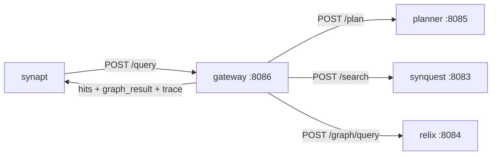

# 04 - gateway - Phase 1 - Query Gateway (Plan Executor PoC)

**Version:** 1.0
**Date:** 2026-07-19
**Status:** Draft for review
**Priority:** 4 of 5 in the query-path Phase 1 series (coordinator that stitches planner + synquest + relix into a single answer).
**Depends on:** [01-synquest-Phase1.md](./01-synquest-Phase1.md), [02-relix-Phase1.md](./02-relix-Phase1.md), [03-planner-Phase1.md](./03-planner-Phase1.md) - all three Phase 1 DoDs met.
**Scope:** Accept a query from `synapt`, ask `planner` for a plan, execute the plan (fan-out `synquest.search` and/or `relix.graph_query` in parallel), fuse results, return a unified response. No ACL, no rerank, no LLM synthesis, no cold-tier rehydration.

---

## 1. Context and Document Alignment

| Source | Role |
|--------|------|
| [synanton-design-1.18.md §23 `gateway`](../architecture/platform/synanton-design-1.18.md) | Production target - compile-time ACL injection, reranker port, cross-tenant cache router, runtime memory protection, LLM-context sanitisation, anomaly streaming, cold-tier rehydration. Phase 1 implements the **execute-plan skeleton** only. |
| [03-planner-Phase1.md](./03-planner-Phase1.md) | Contract - gateway consumes `PlanResponse` and executes each step. |
| [01-synquest-Phase1.md](./01-synquest-Phase1.md), [02-relix-Phase1.md](./02-relix-Phase1.md) | Callees - gateway maps `engine` in each plan step to the right service base URL. |

**Explicit non-goals for Phase 1:**

- No compile-time ACL injection - single tenant, no ACL.
- No reranker - plan does not include a rerank step; even if it did, gateway would ignore it. Phase 3+ wires the reranker port.
- No cross-tenant synthesis cache - no cache at all in Phase 1.
- No LLM synthesis of a final answer - the response is the ranked hits + graph result, no natural-language answer. Synthesis is Phase 2.
- No LLM-context sanitisation - no LLM in Phase 1.
- No cold-tier rehydration - Phase 1 assumes hot tier only (matches ingestion Phase 1 storage_tier=HOT).
- No anomaly streaming.
- No runtime memory protection / OOM guards.
- No budget enforcement (that's `synapt`).

---

## 2. Phase 1 in One Sentence

> Take a search request, get a plan from planner, run each step's HTTP call (independent steps in parallel), aggregate results into a `hits[]` + `graph_result{}` envelope, and return with a full execution trace.

---

## 3. Target Architecture



**Deployment.** One Spring Boot service on port `:8086`. No new Docker containers.

---

## 4. Data Contract

**Input:** `POST /query`
```json
{
  "tenant": "demo",
  "query": "who supplies Acme Corp?",
  "top_k": 20,
  "hints": {
    "prefer_graph": null,
    "prefer_retrieval": null
  }
}
```

**Output:**
```json
{
  "hits": [
    {
      "content_ref_id": "…",
      "chunk_ordinal": 3,
      "score": 0.0234,
      "score_dense": 0.87,
      "score_lexical": 4.12,
      "graph_promoted": true,          // this content_ref_id also appeared in the graph result
      "snippet": "…",
      "source_uri": "file:///…"
    }
  ],
  "graph_result": {
    "entities": [ … ],
    "edges": [ … ],
    "paths": [ … ]
  },
  "execution_trace": {
    "plan": { … },                     // verbatim from planner
    "steps": [
      { "step_id": "step-1", "engine": "relix", "started_ms": 0, "duration_ms": 12, "outcome": "OK" },
      { "step_id": "step-2", "engine": "synquest", "started_ms": 0, "duration_ms": 57, "outcome": "OK" },
      { "step_id": "step-fusion", "engine": "gateway", "started_ms": 57, "duration_ms": 2, "outcome": "OK" }
    ],
    "total_ms": 62,
    "warnings": []
  }
}
```

---

## 5. Plan Execution Model

**Step graph.** A `PlanResponse` is a DAG. Gateway topologically sorts steps by `depends_on`, then executes:

- All steps whose `depends_on` is empty → in parallel (bounded pool, size = `gateway.executor.parallelism`, default 8).
- Steps with dependencies → once their prerequisites complete.
- Failure of one step does NOT cancel others; each step is marked `OK | FAILED | TIMEOUT`. The response is assembled from whatever succeeded, with warnings.

**Step dispatch.** `engine` → HTTP endpoint mapping:

| engine | call | HTTP |
|--------|------|------|
| `synquest` | `search` | `POST http://synquest:8083/search` |
| `relix` | `graph_query` | `POST http://relix:8084/graph/query` |
| `gateway` | `fuse` | in-process, does not go over HTTP |

**Fusion (`gateway.fuse`).** Phase 1 supports exactly one fusion method: `content_ref_intersection_first_then_rrf` (matching the planner's default for HYBRID plans). Algorithm:

1. Collect `synquest.hits` from the retrieval step.
2. Collect `graph.entities[].source_refs[].content_ref_id ∪ graph.edges[].source_refs[].content_ref_id` from the graph step - call this set `graph_refs`.
3. Partition `synquest.hits` into `promoted` (where `content_ref_id ∈ graph_refs`) and `rest`.
4. Score `promoted` by their existing hybrid score + a fixed `graph_promotion_bonus` (default 0.1); mark `graph_promoted=true`.
5. Concatenate `promoted` (sorted by score desc) then `rest` (sorted by score desc); take top `top_k`.
6. Return `hits`.

Simple, deterministic, testable. Phase 2 introduces a more principled reranker.

**Timeouts.** Per-step timeout: `gateway.step-timeout-ms` (default 5000). Global request timeout: `gateway.request-timeout-ms` (default 8000). On global timeout, gateway returns whatever completed with a `PARTIAL` warning.

---

## 6. Failure semantics

| Scenario | Behaviour |
|---|---|
| Planner returns 5xx | Gateway retries once (100 ms backoff); if still 5xx, returns 502 to caller with `warnings: [planner_unavailable]`. |
| synquest step fails but plan has a relix step that succeeds | Response includes `graph_result` only; `hits: []`; `warnings: [synquest_step_failed]`. |
| relix step fails but plan has a synquest step | Response includes `hits` only (no graph_promotion applied); `warnings: [relix_step_failed]`. |
| Both engines fail | 503 with `warnings: [all_steps_failed]`. |
| Step times out | Marked `TIMEOUT`; treated as failed for that engine. |
| Global timeout exceeded before fusion completes | Return partial from what completed; `warnings: [global_timeout, partial_result]`. |

No retries for engine calls in Phase 1 (they're internal). Retry policy is a Phase 3+ concern.

---

## 7. Module Boundaries

**Owned by `java/gateway/` in Phase 1:**
- `PlanExecutor` - topological execution of a plan.
- HTTP clients for planner, synquest, relix.
- In-process `FusionEngine` implementing `content_ref_intersection_first_then_rrf`.
- REST endpoint: `POST /query`, `GET /health`, `GET /gateway/stats`.
- Execution trace assembly.

**Not owned:**
- Query planning - that's `planner` (03).
- ACL - no ACL in Phase 1.
- Rerank - deferred.
- LLM synthesis - deferred.
- Public API surface (auth, DTOs, rate limiting) - that's `synapt` (05).

---

## 8. Prerequisites

| # | Prereq | Home | Notes |
|---|--------|------|-------|
| P1 | 01, 02, 03 Phase 1 DoDs met. | - | Blocking. |
| P2 | Add `java/gateway` to `settings.gradle.kts`. | root | New module. |
| P3 | Confirm planner returns `gateway.fuse` steps only when both retrieval and graph steps precede it. | planner (03) | Verified by PL-10 test suite. |

---

## 9. Task Breakdown

Ordered by dependency. Each task ≤ 1-2 days.

| # | Task | Deliverable |
|---|------|-------------|
| GW-1 | Create Gradle module; deps: Spring Boot web + webflux (for `WebClient`), Jackson, `shared/common`. | `build.gradle.kts` |
| GW-2 | Domain records: `QueryRequest`, `QueryResponse`, `Hit`, `GraphResult`, `ExecutionTrace`, `StepTrace`, `StepOutcome` enum, `Warning`. | Records + tests |
| GW-3 | `PlannerClient`, `SynquestClient`, `RelixClient` - thin `WebClient` wrappers with per-service timeouts, log tagging. All construct their base URLs from config. | Clients + tests |
| GW-4 | `PlanExecutor` - accepts a `PlanResponse`, builds a DAG, runs a topological loop with bounded concurrency, records per-step timing/outcome. In-process `gateway.fuse` steps are dispatched directly. | Executor class + tests |
| GW-5 | `FusionEngine` - implements `content_ref_intersection_first_then_rrf` (see §5). Deterministic given the same inputs. | Class + snapshot tests |
| GW-6 | `QueryService` - the top-level orchestrator. Calls planner, calls PlanExecutor, assembles response. | Service + tests |
| GW-7 | REST controllers: `POST /query`, `GET /health`, `GET /gateway/stats`. `MockTenantFilter`. | Controllers + integration tests |
| GW-8 | `application.yaml`; `GatewayApplication` boot class. | Boot + config |
| GW-9 | Timeout + partial-result handling - implement the failure matrix in §6 with unit tests per row. | Handlers + tests |
| GW-10 | E2E test: WireMock stubs for planner/synquest/relix returning canned responses → run `POST /query` → assert fusion output, trace shape, warnings for injected failures. Four scenarios: happy path, synquest-only failure, relix-only failure, global timeout. | `GatewayE2EIT` |
| GW-11 | Metrics - `gateway_query_total{outcome}`, `gateway_step_duration_ms{engine,step_id}`, `gateway_fusion_promoted_ratio`. Exposed via Spring Actuator `/actuator/prometheus`. | Metric wiring + assertion in E2E |

---

## 10. Data Flow

For query `"who supplies Acme Corp?"`:

1. `POST /query` arrives.
2. Gateway → `PlannerClient.plan(request)` → `PlanResponse` with 3 steps (relix, synquest, fuse).
3. `PlanExecutor`:
   - t=0 ms: dispatch step-1 (relix.graph_query) and step-2 (synquest.search) in parallel.
   - t=12 ms: step-1 completes with `GraphResult` (5 entities, 12 edges).
   - t=57 ms: step-2 completes with 40 hits.
   - t=57 ms: step-fusion runs in-process → 20 fused hits with `graph_promoted=true` on 3 of them.
4. `QueryService` assembles `QueryResponse` with `hits`, `graph_result`, `execution_trace{plan, steps, total_ms=62, warnings=[]}`.
5. Return to caller.

---

## 11. Configuration Surface

```yaml
gateway:
  executor:
    parallelism: 8
  step-timeout-ms: 5000
  request-timeout-ms: 8000
  fusion:
    default-method: content_ref_intersection_first_then_rrf
    graph-promotion-bonus: 0.1
  planner:
    base-url: http://planner:8085
    timeout-ms: 3000
    retry-once-on-5xx: true
  synquest:
    base-url: http://synquest:8083
    timeout-ms: 5000
  relix:
    base-url: http://relix:8084
    timeout-ms: 5000
  server:
    port: 8086
```

---

## 12. Testing Strategy

- **Unit tests** - `FusionEngine` deterministic scoring against a golden case; `PlanExecutor` DAG scheduling with in-process fake step dispatchers.
- **Integration (WireMock)** - the four failure scenarios listed in §6, plus a happy path. Assert response body, warnings, HTTP status.
- **Timeout tests** - WireMock delays past step-timeout → assert outcome=TIMEOUT and correct fallback behaviour.
- **Trace correctness** - assert `steps` in the response contains one entry per plan step, timings monotonically increasing where dependencies exist.
- **Metric assertions** - after a run, `/actuator/prometheus` contains the expected counters.

---

## 13. Risks and Open Questions

| Risk | Mitigation |
|------|------------|
| Planner returns a step referencing an engine gateway doesn't know. | Reject the plan with `400` at execution time; log with `unknown_engine` counter. Enumerated set is `{synquest, relix, gateway}`. |
| Fusion method mismatch (planner says `fuse` but with a method gateway doesn't implement). | Phase 1 supports exactly one method; other values fall back to it with a `warnings: [unknown_fusion_method_fallback]`. |
| Slow engine drags request past global timeout even if others finished. | Global timeout at `request-timeout-ms`; return partial. Documented. |
| No circuit breaker per engine - a persistently-down engine gets a hit on every request. | Accepted at PoC; Resilience4j is a Phase 3 addition. |
| Fusion promotion bonus (`0.1`) is a magic number. | Exposed via config; snapshot test locks the default behaviour. |
| Response payload can be large (hits + graph). | No pagination in Phase 1; documented cap at `top_k=100` in synapt DTO validation. |

---

## 14. Definition of Done (Phase 1)

Phase 1 is complete when **all** of the following hold with 01, 02, 03 DoDs met:

1. `./gradlew :java:gateway:bootRun` boots cleanly.
2. `POST /query` end-to-end against real planner/synquest/relix services returns a well-formed `QueryResponse` with `hits`, optional `graph_result`, and complete `execution_trace`.
3. All four failure-matrix scenarios in §6 are exercised by tests and produce the specified behaviour.
4. p95 total_ms < 300 ms on the PoC corpus (10K chunks, ~1K entities), assuming synquest p95 ~100 ms and relix p95 ~50 ms.
5. `GET /gateway/stats` reports request count, avg step latencies per engine, warning-outcome ratio.
6. `graph_promoted` flag on hits is correct - verified in E2E test by planting a document known to both synquest (as a hit) and relix (as a source_ref) and asserting the flag.
7. `./gradlew test` passes; WireMock-based E2E test passes.
8. No modifications to `synquest`, `relix`, `planner`, `synvault`, `synflux`, `ingestion-cache`.

---

## 15. Follow-on Phases (Signposted)

- **Phase 2 (gateway)** - LLM synthesis step: call `synanton-llm-client` with retrieved hits + graph result → produce a natural-language answer. Adds `answer` to the response envelope.
- **Phase 3 (gateway)** - Reranker port integration; plan may now include a `rerank` step that gateway dispatches to a `VllmCrossEncoderRerankAdapter` (§30 SPI). Circuit breakers added.
- **Phase 4 (gateway)** - Compile-time ACL injection when `topology` module lands. ACL filter map is baked into synquest calls at request time.
- **Phase 5 (gateway)** - Cross-tenant synthesis cache (§23), LLM-context sanitisation (§23), cold-tier rehydration (§23 v1.17).
- **Phase 6 (gateway)** - Anomaly streaming, runtime memory protection, budget-aware execution.

Each phase's plan lives as its own doc when needed.
