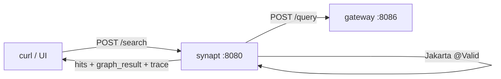

# 05 - synapt - Phase 1 - Public API (Thin REST Ingress)

**Version:** 1.0
**Date:** 2026-07-19
**Status:** Draft for review
**Priority:** 5 of 5 in the query-path Phase 1 series (top of the stack - the outward-facing surface).
**Depends on:** [04-gateway-Phase1.md](./04-gateway-Phase1.md) Definition of Done. Transitively 01, 02, 03.
**Scope:** Serve a public `POST /search` HTTP endpoint that validates the request, forwards to `gateway`, and returns the response. Jakarta Validation on the DTO (per v1.18 doc §24), mock tenant, no auth, no rate limiting, no budget enforcement, no JSON sanitisation.

---

## 1. Context and Document Alignment

| Source | Role |
|--------|------|
| [synanton-design-1.18.md §24 `synapt`](../architecture/platform/synanton-design-1.18.md) | Production target - JWT/API-key auth, budget enforcement with HTTP 429, rate limiting, global JSON sanitisation, Jakarta Validation, deprecation policy, CSP headers on responses. Phase 1 implements **Jakarta Validation + thin proxy** only. |
| [04-gateway-Phase1.md](./04-gateway-Phase1.md) | Downstream - synapt forwards `POST /search` to gateway's `POST /query` with minimal transformation. |

**Explicit non-goals for Phase 1:**

- No JWT validation, no API key checks - `MockTenantFilter` hard-codes tenant to `"demo"` from `X-Tenant` header (defaulted to `demo`).
- No budget enforcement, no HTTP 429, no `Retry-After`.
- No rate limiting.
- No global JSON sanitisation (v1.18 §24.1) - deferred until the security-hardening phase. `@AllowHtml` annotations are placed on the DTOs anyway so the future sanitiser turns on without a schema change.
- No CSP headers (v1.18 §49) - deferred with the same reasoning.
- No `execution_trace` filtering (production would strip internal fields for external callers) - Phase 1 returns the trace verbatim from gateway for observability.
- No deprecation policy machinery (§24 v1.17) - no fields are deprecated in Phase 1.
- No gRPC ingress - REST only.
- No `Warning: 299` headers.
- No cost-privacy handling.

---

## 2. Phase 1 in One Sentence

> Terminate HTTP, validate the request DTO with Jakarta Validation annotations (per v1.18 §24), forward to `gateway.POST /query`, and return the response unchanged.

---

## 3. Target Architecture



**Deployment.** One Spring Boot service on port `:8080` - the front door. No new Docker containers.

**Why not just call gateway directly?** In Phase 1 you could. But putting `synapt` in front now costs almost nothing and reserves the seams (auth filter, budget filter, DTO shape) that later phases fill. Removing `synapt` later would be much more disruptive than keeping it thin.

---

## 4. Data Contract

**Input:** `POST /search`
```json
{
  "query": "who supplies Acme Corp?",
  "top_k": 20,
  "hints": {
    "prefer_graph": null,
    "prefer_retrieval": null
  }
}
```

Tenant comes from the `X-Tenant` header (defaulted to `demo`), NOT from the body - this is the design-doc convention for `synapt`.

**Output:** identical to `gateway.QueryResponse` - see [04-gateway-Phase1.md §4](./04-gateway-Phase1.md).

**Error responses.** Structured 400 for validation failures, matching the shape defined in v1.18 §24:

```json
{
  "error": "validation_failed",
  "field_errors": [
    { "field": "query",  "code": "NotBlank", "message": "must not be blank" },
    { "field": "top_k",  "code": "Max",      "message": "must be less than or equal to 100" }
  ],
  "trace_id": "…"
}
```

Downstream failures (gateway 5xx) surface as `502` with `{"error":"upstream_failed", "detail":"…", "trace_id":"…"}`.

---

## 5. DTO Definitions (Phase 1 - with v1.18 annotations)

```java
public record SearchRequest(
    @NotBlank
    @Size(max = 2000)
    String query,

    @Min(1) @Max(100)
    Integer topK,          // JSON: "top_k"

    @Valid
    Hints hints
) {}

public record Hints(
    Boolean preferGraph,   // JSON: "prefer_graph"
    Boolean preferRetrieval
) {}
```

Fields not annotated because they are deliberately unconstrained in Phase 1:
- `hints.preferGraph` / `hints.preferRetrieval` - booleans, no size or pattern applies.

Rationale for these specific limits:
- `query` max 2000 - long enough for verbose questions, short enough to guard tokenisation blow-ups.
- `top_k` 1..100 - matches the practical response-payload cap (see gateway risks table).

**@AllowHtml placement.** No field in `SearchRequest` is HTML-bearing - none get `@AllowHtml`. When the v1.18 sanitiser turns on in a future phase, this DTO stays correct.

---

## 6. Module Boundaries

**Owned by `java/synapt/` in Phase 1:**
- Public REST endpoint `POST /search`, plus `GET /health`.
- `SearchRequest` / `Hints` DTOs with Jakarta Validation annotations.
- Global `@RestControllerAdvice` translating `MethodArgumentNotValidException` and downstream failures to the structured error shape.
- `MockTenantFilter` - reads `X-Tenant` (default `demo`), populates `TenantContext`.
- `GatewayClient` - thin `WebClient` wrapper posting to gateway `/query`.
- Request/response logging with a per-request `trace_id`.

**Not owned:**
- Query planning, execution, or fusion - that's gateway (04).
- Auth - deferred.
- Budget/rate limiting - deferred.
- Sanitisation - deferred (annotation surface is ready).

---

## 7. Prerequisites

| # | Prereq | Home | Notes |
|---|--------|------|-------|
| P1 | Gateway (04) Phase 1 DoD met. | - | Blocking. |
| P2 | Add `java/synapt` to `settings.gradle.kts`. | root | New module. |
| P3 | `shared/common` provides `MockTenantFilter`, `TenantContext`, `ProblemDetail` (already required by ingestion Phase 1 prereqs). | shared | Reuse. |

---

## 8. Task Breakdown

Ordered by dependency. Each task ≤ 1 day.

| # | Task | Deliverable |
|---|------|-------------|
| SA-1 | Create Gradle module; deps: Spring Boot web + validation, Jackson, `shared/common`. | `build.gradle.kts` |
| SA-2 | Records: `SearchRequest`, `Hints`, `SearchResponse` (reuses gateway's `QueryResponse` shape - copy the record definitions here for the public API surface so we don't leak an internal dep to future clients). | Records + tests |
| SA-3 | `GatewayClient` - `WebClient` wrapper: builds request from `SearchRequest + tenant`, calls `POST http://gateway:8086/query`, returns `SearchResponse`. Timeout, error mapping. | Client + tests |
| SA-4 | `SearchController` - `POST /search` with `@Valid @RequestBody SearchRequest`. Injects `TenantContext.current()`. Delegates to `GatewayClient`. | Controller + tests |
| SA-5 | `GlobalExceptionHandler` (`@RestControllerAdvice`) - handles `MethodArgumentNotValidException` → 400 with structured body per v1.18 §24; `WebClientResponseException` → 502; catch-all → 500 with `trace_id`. | Class + tests |
| SA-6 | `MockTenantFilter` - reads `X-Tenant` header (default `demo`), populates `TenantContext` via `ThreadLocal`; installs the filter in the Spring Security-less filter chain. | Filter + test |
| SA-7 | Request-response logging with MDC - `trace_id` = UUID per request, added to MDC on entry, cleared on exit. Log at INFO with `{trace_id, tenant, path, status, duration_ms}`. | Filter/interceptor + tests |
| SA-8 | `application.yaml`; `SynaptApplication` boot class; `management.endpoints.web.exposure.include=health,info,prometheus` - Actuator only. | Boot + config |
| SA-9 | E2E test: WireMock stub for gateway → run `POST /search` with (a) valid body → assert forwards correctly + returns 200 + body; (b) `top_k=200` → assert 400 with field_errors; (c) `query=""` → assert 400; (d) gateway returns 500 → assert 502; (e) missing `X-Tenant` → assert defaulted to `demo`. | `SynaptE2EIT` |

---

## 9. Data Flow

For request `POST /search  X-Tenant: demo  body={"query":"who supplies Acme Corp?", "top_k": 20}`:

1. `MockTenantFilter` reads `X-Tenant` → `TenantContext.set("demo")`, assigns `trace_id`.
2. Spring routes to `SearchController.search(@Valid SearchRequest, ...)`.
3. Jakarta Validation runs on `SearchRequest` - passes.
4. `GatewayClient.query(request, tenant="demo")` → `POST http://gateway:8086/query` with body `{tenant:"demo", query:..., top_k:20, hints:...}`.
5. Gateway responds with `QueryResponse` payload.
6. `SearchController` returns `200 OK` with the payload.
7. Filter clears MDC on exit; access log line emitted.

Invalid request (missing `query`):
1. Jakarta Validation fails.
2. `GlobalExceptionHandler` catches `MethodArgumentNotValidException` → returns 400 with `field_errors`.
3. No downstream call is made.

---

## 10. Configuration Surface

```yaml
synapt:
  gateway:
    base-url: http://gateway:8086
    timeout-ms: 10000
  server:
    port: 8080
  tenant:
    default: demo             # used when X-Tenant header is missing
  logging:
    access-log: true          # emit one line per request at INFO
management:
  endpoints:
    web:
      exposure:
        include: health,info,prometheus
```

---

## 11. Testing Strategy

- **Unit tests** - DTO validation edge cases: empty query, query at max size, top_k at bounds, `null` hints.
- **Controller slice tests** (`@WebMvcTest`) - happy path, validation failures, all 4 error shapes.
- **Integration (WireMock)** - the five scenarios in SA-9.
- **Trace-id propagation** - assert MDC-populated `trace_id` appears in the response body's error path AND in the access log.
- **Tenant defaulting** - asserted in SA-9(e).

---

## 12. Risks and Open Questions

| Risk | Mitigation |
|------|------------|
| No auth on the public endpoint. | Documented; running behind a private network / dev-mode only. Phase 2 adds JWT. |
| Trace fields returned to callers may leak internal engine topology. | Acceptable for PoC - observability trumps opacity. Phase 3 introduces `execution_trace.public_view`. |
| Tenant header can be arbitrarily set - a malicious dev could impersonate. | Acceptable; there's no data isolation in Phase 1 anyway. Phase 2 (auth) resolves. |
| DTO changes are breaking. | `@Valid` is compile-time; adding fields is backward-compatible. Any renames would break external clients - not a concern until we have any. |
| The Jakarta Validation annotations are the "seam" for the v1.18 sanitiser but the sanitiser isn't wired yet. | Documented. Adding it later is a bean registration + one dependency; no DTO touches. |
| Downstream trace_id propagation. | Not yet - `synapt` generates a local `trace_id` but does not forward it to gateway as a header. Phase 2 adds `X-Trace-Id` propagation end-to-end. |

---

## 13. Definition of Done (Phase 1)

Phase 1 is complete when **all** of the following hold with 01, 02, 03, 04 DoDs met:

1. `./gradlew :java:synapt:bootRun` starts cleanly on port `:8080`.
2. `curl -X POST -H 'Content-Type: application/json' -H 'X-Tenant: demo' :8080/search -d '{"query":"who supplies Acme Corp?","top_k":20}'` returns a valid response with `hits[]`, optional `graph_result`, and full `execution_trace`.
3. All five E2E scenarios in SA-9 pass.
4. `top_k > 100`, `query=""`, `query` at 2001 chars, and missing body each produce a structured 400 with populated `field_errors`.
5. p95 synapt overhead (excluding gateway) < 5 ms - synapt is a thin pipe.
6. Missing `X-Tenant` defaults to `"demo"`.
7. `./gradlew test` passes.
8. `/actuator/health` reports `UP`; `/actuator/prometheus` exposes at minimum `http_server_requests_seconds_*`.
9. No modifications to any other module.

---

## 14. Follow-on Phases (Signposted)

- **Phase 2 (synapt)** - JWT/API-key authentication (§26 IdP integration), `X-Trace-Id` propagation to gateway, error-response redaction for external callers.
- **Phase 3 (synapt)** - Rate limiting per tenant (`synapt.rate_limit_per_tenant_qps`), budget enforcement with HTTP 429 + `Retry-After` (§24).
- **Phase 4 (synapt)** - Global JSON sanitisation (v1.18 §24.1) - wire the OWASP Jackson deserialiser; DTOs already prepared. CSP headers (v1.18 §49) via `WebFilter`. `@AllowHtml` on any newly-added rich fields.
- **Phase 5 (synapt)** - Deprecation policy machinery (§24 v1.17) - `@deprecated` field annotations, `Warning: 299` header, deprecation metrics.
- **Phase 6 (synapt)** - gRPC ingress (mirroring REST surface), MCP session revalidation, cross-region routing.

Each phase's plan lives as its own doc when needed.
