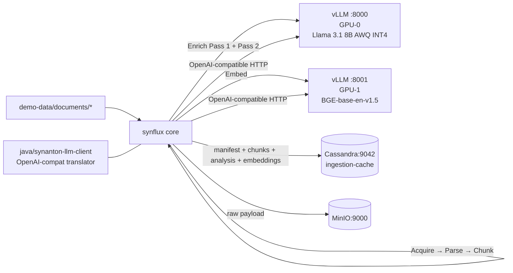

# Ingestion Pipeline - Phase 2 - LLM Enrichment + Embeddings (16 GB / 2 GPUs PoC)

**Version:** 1.0
**Date:** 2026-07-19
**Status:** Draft for review
**Depends on:** [ingestion-pipeline-Phase1.md](./ingestion-pipeline-Phase1.md) (Definition of Done)
**Scope:** Add LLM-driven two-pass enrichment and dense embeddings to the ingestion pipeline. Serve both models with **vLLM**, sized to fit on a laptop-class rig with **~16 GB total VRAM across 2 cards** (8 GB per card). Still no indexing engine - the goal is to fully populate the enrichment and embedding caches so Phase 4 can wire the query path.

---

## 1. Context and Document Alignment

| Source | Role in this plan |
|--------|-------------------|
| [synanton-design-1.18.md](../architecture/platform/synanton-design-1.18.md) §17 `synflux` (two-step chain-of-thought enrichment, SHA256 cache, vision captioning), §18 `ingestion-cache` (analysis_cache, image_caption_cache, embedding_content_cache), §27c `synanton-llm-client` (provider-agnostic LLM client) | Production target. Phase 2 implements the **text-only** subset - no vision, no cross-tenant synthesis cache, no prompt/model version tracking yet. |
| [ingestion-pipeline-Phase1.md](./ingestion-pipeline-Phase1.md) | Foundation. Phase 1's `NoOpEnrichmentStage` and `NoOpEmbeddingStage` slots are what Phase 2 replaces. All Phase 1 code paths remain intact when the new stages are flag-disabled. |
| [standalone-syntology-demo.md](./standalone-syntology-demo.md) | Precedent for single-JAR, mock-tenant Spring Boot demos. Phase 2 keeps the same conventions. |

**Explicit non-goals for Phase 2:**

- No indexing (still no `synquest`, no `relix`) - enrichment output goes into caches, nowhere else yet.
- No reranker - Phase 2 leaves ~2 GB of headroom on GPU-1 for the reranker to land in a later phase.
- No vision captioning (`image_caption_cache` table is created but not populated in Phase 2).
- No prompt/model version tracking in `synreview` - deferred to Phase 5+.
- No provider negotiation across multiple LLM providers - Phase 2 is vLLM-only. The `synanton-llm-client` library ships with the OpenAI-compatible provider translator only; other translators (Anthropic, Bedrock, Vertex, Cohere) are stubs.
- No router split, no Kafka - the pipeline is still an in-process crawler as in Phase 1.
- No degraded-mode fallback - if the LLM is down, the pipeline stops. Ingested Phase-1 payloads remain queryable via `synvault`; enrichment resumes when the LLM is back.
- No JWT, no ACLs - hard-coded tenant `"demo"`.

---

## 2. Phase 2 in One Sentence

> With Phase 1's `state=CHUNKED` manifest as input, run each chunk through a two-pass LLM enrichment (Pass 1 lightweight, Pass 2 typed) and a dense embedding, persist the outputs to `analysis_cache` and `embedding_content_cache`, and advance the manifest to `state=ENRICHED` / `state=EMBEDDED` - all within a 16 GB / 2-GPU budget using vLLM.

Success is verified by a single command that ingests `demo-data/documents/`, then a REST GET returns per-document Pass-1 summaries, Pass-2 typed entities, and 768-dim embedding vectors.

---

## 3. Target Architecture (Phase 2)



**Deployment model.** Phase 1's two Java services plus two Docker containers are unchanged. Two **new** GPU-backed containers are added:

- `vllm-llm` - vLLM 0.6.x, `CUDA_VISIBLE_DEVICES=0`, serves Llama 3.1 8B Instruct AWQ INT4 on `:8000`.
- `vllm-embed` - vLLM 0.6.x, `CUDA_VISIBLE_DEVICES=1`, serves `BAAI/bge-base-en-v1.5` in embedding mode (`--task embed`) on `:8001`.

Both expose OpenAI-compatible endpoints (`/v1/chat/completions`, `/v1/embeddings`) so a single `synanton-llm-client` translator handles both.

`docker compose up` brings up all four containers (Cassandra + MinIO from Phase 1, plus vllm-llm + vllm-embed). GPU passthrough via the NVIDIA Container Toolkit; the compose file uses `deploy.resources.reservations.devices` with the standard `driver: nvidia` block.

---

## 4. Model Selection & VRAM Budget

The critical constraint: 2 cards × 8 GB = 16 GB total. Every choice below is anchored to this budget.

### 4.1 LLM (GPU-0, 8 GB budget)

**Chosen model:** `hugging-quants/Meta-Llama-3.1-8B-Instruct-AWQ-INT4`.

| Slice | Size |
|-------|-----:|
| Model weights (AWQ INT4) | ~5.1 GB |
| KV cache (max_model_len=4096, max_num_seqs=4) | ~1.5 GB |
| CUDA + activations overhead | ~0.6 GB |
| **Total** | **~7.2 GB** (headroom ~0.8 GB) |

**vLLM launch flags:**
```
--model hugging-quants/Meta-Llama-3.1-8B-Instruct-AWQ-INT4
--quantization awq_marlin
--dtype half
--max-model-len 4096
--max-num-seqs 4
--gpu-memory-utilization 0.85
--enable-prefix-caching
--served-model-name llama-3.1-8b-instruct
```

**Rationale.** AWQ INT4 is vLLM's most stable low-memory path. `awq_marlin` kernel gives near-FP16 throughput. `max_num_seqs=4` bounds the KV cache to the calculated ~1.5 GB; batches larger than 4 requests queue at the HTTP layer. `enable-prefix-caching` massively speeds up Pass 1 → Pass 2 because the shared system prompt is reused.

**Alternative (Q4_K_M GGUF).** vLLM v0.6+ supports GGUF experimentally. If AWQ is unavailable for the exact model revision, fall back to `bartowski/Meta-Llama-3.1-8B-Instruct-GGUF` (`Q4_K_M` file) with `--quantization gguf`. Recorded here as a fallback, not primary.

### 4.2 Embedding model (GPU-1, 8 GB budget)

**Chosen model:** `BAAI/bge-base-en-v1.5` (768-dim, English).

| Slice | Size |
|-------|-----:|
| Model weights (fp16) | ~0.44 GB |
| Batch activation buffer (batch=32, seq=512) | ~0.4 GB |
| CUDA + activations overhead | ~0.4 GB |
| **Total** | **~1.2 GB** (headroom ~6.8 GB) |

**vLLM launch flags:**
```
--model BAAI/bge-base-en-v1.5
--task embed
--dtype half
--max-model-len 512
--gpu-memory-utilization 0.30
--served-model-name bge-base-en-v1.5
```

`--gpu-memory-utilization 0.30` deliberately leaves ~5 GB free on card 1 so a reranker (BGE reranker base ~0.5 GB) and future models can co-locate later.

**Alternatives.** If the deployment must handle non-English content, swap to `intfloat/multilingual-e5-base` (768-dim, ~1.1 GB) - same launch shape. If English-only and higher recall is worth the memory, `BAAI/bge-large-en-v1.5` (1024-dim, ~1.3 GB) still fits comfortably.

### 4.3 What does not fit

For explicit clarity - these are **out** for Phase 2:
- Llama 3.1 70B in any quantization (>35 GB even at Q4).
- Any 13-14B model at FP16.
- Mixtral 8x7B (~26 GB even Q4).
- Whisper-large, LLaVA, or any multimodal model - vision is Phase 5+.

### 4.4 Throughput expectations (PoC-scale)

Rough numbers for calibration, not SLO:

| Operation | Latency (est.) | Throughput |
|-----------|---------------:|-----------:|
| Pass 1 (per chunk, 400 tok in, 200 tok out) | ~1.5 s | ~2-3 chunks/s |
| Pass 2 (per document, ~1500 tok in, ~500 tok out) | ~5 s | ~0.2 docs/s |
| Embedding (per chunk, 400 tok, batch 32) | ~50 ms/chunk | ~500 chunks/s |

So a 100-document / 2000-chunk demo run completes in roughly 10-20 minutes of pipeline time on this rig - embeddings are essentially free; the LLM Pass 2 dominates.

---

## 5. New Ingestion-Cache Tables

Extend the Phase 1 schema. Additive only - no touching existing tables.

```cql
CREATE TABLE ingestion_cache.analysis_cache (
  tenant_id            text,
  content_ref_id       uuid,
  chunk_ordinal        int,
  pass_number          int,               -- 1 or 2
  model_id             text,              -- e.g. llama-3.1-8b-instruct
  prompt_version       text,              -- git-hash of prompt template
  analysis_json        text,              -- Pass-1: {summary, entity_strings[]}; Pass-2: {typed_entities[], relations[]}
  input_sha256         text,              -- sha256 of the exact prompt input; enables reuse
  created_at           timestamp,
  PRIMARY KEY ((tenant_id, content_ref_id), chunk_ordinal, pass_number)
);

CREATE TABLE ingestion_cache.embedding_content_cache (
  tenant_id            text,
  content_ref_id       uuid,
  chunk_ordinal        int,
  model_id             text,              -- bge-base-en-v1.5
  chunk_sha256         text,              -- enables cross-document reuse when chunks are identical
  embedding            blob,              -- float16[768] LZ4-compressed
  embedding_dim        int,
  created_at           timestamp,
  PRIMARY KEY ((tenant_id, content_ref_id), chunk_ordinal, model_id)
);

CREATE TABLE ingestion_cache.image_caption_cache (
  tenant_id            text,
  content_ref_id       uuid,
  image_ordinal        int,
  model_id             text,              -- reserved; unused in Phase 2
  caption_text         text,
  input_sha256         text,
  created_at           timestamp,
  PRIMARY KEY ((tenant_id, content_ref_id), image_ordinal)
);
```

`image_caption_cache` ships in Phase 2's schema migration but is only written from Phase 5 onwards. Creating it now avoids a schema bump later.

**Manifest state values (extended):**

The `manifest.state` column now accepts `ACQUIRED | PARSED | CHUNKED | ENRICHED | EMBEDDED` (design §17). Phase 2 terminal state is `EMBEDDED`. `INDEXED` remains reserved for Phase 4.

Two new manifest columns:
- `embedding_quality text` - `FULL` (default) / `DEGRADED` (unused in Phase 2; reserved per §17 GPU degraded mode).
- `enrichment_model_id text` - model that produced Pass-2 for this document.

Applied via a new CQL migration `V2__enrichment_and_embeddings.cql`.

---

## 6. Module Boundaries (delta from Phase 1)

### 6.1 New module: `java/synanton-llm-client/`

Per §27c of the design doc. Phase 2 ships the **subset** needed to talk to vLLM's OpenAI-compatible endpoints.

**Owns:**
- `LlmClient` interface: `complete(CompletionRequest)`, `embed(EmbedRequest)`.
- `OpenAiCompatTranslator` - the single provider translator shipped in Phase 2. Maps `CompletionRequest` → `POST /v1/chat/completions`, `EmbedRequest` → `POST /v1/embeddings`.
- `LlmClientConfig`: base URL, model name, timeout, retry policy, connection pool size.
- Reasoning-block detection stub (per §27c) - returns `Optional.empty()` in Phase 2 since Llama 3.1 has no reasoning blocks.
- Retry with exponential backoff, respects `Retry-After` header.
- Metrics emission hooks (via a `LlmMetricsCollector` interface - implemented by callers, per §27c).

**Does not own in Phase 2:**
- Provider negotiation (only OpenAI-compat exists).
- Streaming responses - Phase 2 is request/response only. Streaming lands with the query path in Phase 4.
- Function-calling / tool-use APIs.

### 6.2 `java/synflux/` - new stages + LLM client wiring

**Owns in Phase 2 (new):**
- `EnrichStage` - replaces `NoOpEnrichmentStage`. Internally runs `PassOneEnricher` then `PassTwoEnricher`.
- `PassOneEnricher` (per-chunk): prompt template `pass1-chunk-summary.mustache`, output JSON `{summary, entity_strings[]}`. Cache-checks against `analysis_cache` keyed by `input_sha256`.
- `PassTwoEnricher` (per-document, uses Pass-1 outputs): prompt template `pass2-document-entities.mustache`, output JSON `{typed_entities[{label, type, confidence}], relations[{from, to, verb, confidence}]}`.
- `EmbedStage` - replaces `NoOpEmbeddingStage`. Batches chunks (batch size 32), calls `LlmClient.embed`, writes to `embedding_content_cache`. Cache-checks against `chunk_sha256`.
- `PromptTemplates` - Mustache templates for Pass 1 / Pass 2, version-tagged by git hash.
- `EnrichmentProperties`, `EmbeddingProperties` - Spring config beans.
- Extended `IngestionJobRunner` - new counters `enriched_count`, `embedded_count`, `enrichment_cache_hits`, `embedding_cache_hits`.

**Does not own:**
- The LLM client itself - that's `synanton-llm-client`.
- Vector search - deferred.

### 6.3 `java/ingestion-cache/` - schema extension + DAO extension

**Owns (new):**
- `V2__enrichment_and_embeddings.cql` migration (three new tables + two new manifest columns).
- DAO additions on `IngestionCacheClient`: `upsertAnalysis`, `readAnalysis`, `readAnalysisByInputHash`, `upsertEmbedding`, `readEmbedding`, `readEmbeddingByChunkHash`.
- LZ4 codec helpers for the `embedding` blob column (LZ4 chosen for CPU speed; matches the design doc's implicit assumption).

**Does not own:**
- Any streaming/scan API for embeddings - Phase 4 (query path) adds that.

### 6.4 `java/synvault/` - no changes

Phase 2 does not touch `synvault`. The service continues to expose Phase-1 endpoints only. Adding `GET /manifest/{tenant}/{ref}/enrichment` and `GET /manifest/{tenant}/{ref}/embeddings` is tempting but deferred to Phase 4 where the query path uses them.

**One exception:** `GET /manifest/{tenant}` returns richer rows now that new columns exist (`state=EMBEDDED`, `enrichment_model_id`). This is a zero-code change - the DTO uses field-selection.

---

## 7. Prerequisites (must land before Phase 2 tasks start)

| # | Prereq | Home | Notes |
|---|--------|------|-------|
| P1 | Phase 1 Definition of Done met - the pipeline ingests to `state=CHUNKED` end-to-end. | - | Non-negotiable. |
| P2 | Host has NVIDIA driver + NVIDIA Container Toolkit installed; `nvidia-smi` shows 2 GPUs with ≥ 8 GB each. | dev host | Documented in the demo README. |
| P3 | Add `java/synanton-llm-client` to `settings.gradle.kts`. | root | New module. |
| P4 | HuggingFace hub token stored in `~/.cache/huggingface/token` - needed for gated Llama 3.1 model downloads. | dev host | One-time step per developer; documented in demo README. |
| P5 | Prompt templates version-tagged. `PromptTemplates` bean reads templates from classpath and stamps their git blob SHA as `prompt_version` at boot. | synflux | Enables Phase 2 cache invalidation when prompts change. |

---

## 8. Task Breakdown (Phase 2)

Ordered by dependency. Each task ≤ 2 days for one engineer.

### 8.1 `java/synanton-llm-client/` (new module)

| # | Task | Deliverable |
|---|------|-------------|
| LC-1 | Create Gradle module; deps: Java HTTP client 2.x (built-in `java.net.http`), Jackson, `shared/common`. No Spring dependency - this is a plain library JAR. | `build.gradle.kts` |
| LC-2 | Define API: `CompletionRequest`, `CompletionResponse`, `EmbedRequest`, `EmbedResponse` records; `LlmClient` interface. | Records + interface |
| LC-3 | Implement `OpenAiCompatTranslator` + `HttpLlmClient` - the concrete `LlmClient` speaking OpenAI-compat over HTTP. Retries: 3 attempts, exponential backoff, 429/5xx retryable, 4xx-non-429 not retryable. | Classes + tests |
| LC-4 | JSON schema validation for LLM outputs - a `JsonResponseValidator` wraps a completion request and rejects malformed JSON. Retries with a "your last response was invalid, try again" turn. Max 2 retries then fail. | Class + tests |
| LC-5 | Testcontainers integration test using [`vllm/vllm-openai:latest`](https://hub.docker.com/r/vllm/vllm-openai) with `--task embed` + a tiny embedding model (e.g. `sentence-transformers/all-MiniLM-L6-v2`) to exercise the real HTTP path without pulling the full 5 GB LLM. | `HttpLlmClientIT` |

### 8.2 `java/ingestion-cache/` (schema + DAO extension)

| # | Task | Deliverable |
|---|------|-------------|
| IC-6 | Ship `V2__enrichment_and_embeddings.cql` - creates the three new tables and adds `embedding_quality`, `enrichment_model_id` to `manifest`. | Migration file |
| IC-7 | Extend `IngestionCacheClient` with `upsertAnalysis`, `readAnalysis`, `readAnalysisByInputHash`. Analysis rows use `input_sha256` as a secondary look-aside cache (in-memory `Caffeine` fronts Cassandra). | DAO methods + Caffeine layer + tests |
| IC-8 | Extend `IngestionCacheClient` with `upsertEmbedding`, `readEmbedding`, `readEmbeddingByChunkHash`. LZ4-compress on write, decompress on read. Same Caffeine look-aside. | DAO methods + LZ4 codec + tests |
| IC-9 | Testcontainers integration test: round-trip Pass-1 JSON, Pass-2 JSON, embedding blob (768-dim); assert `input_sha256` reuse skips a second write. | `AnalysisAndEmbeddingCacheIT` |

### 8.3 `java/synflux/` (new stages)

| # | Task | Deliverable |
|---|------|-------------|
| SF-11 | Add `synanton-llm-client` as a dependency; wire `HttpLlmClient` beans for the LLM base URL and the embedding base URL (two beans, `@Qualifier("llm")` and `@Qualifier("embed")`). | Config + beans |
| SF-12 | Ship prompt templates: `pass1-chunk-summary.mustache`, `pass2-document-entities.mustache`. Include JSON-schema-in-prompt so the model returns strict JSON. Store under `synflux/src/main/resources/prompts/`. | Templates + `PromptTemplates` bean |
| SF-13 | Implement `PassOneEnricher`: per-chunk call; input_sha256 = sha256("v1|{prompt_version}|{model_id}|{chunk_text}"); cache-check; call LLM; parse JSON; store to `analysis_cache`. | Class + unit tests (LLM mocked) + component test |
| SF-14 | Implement `PassTwoEnricher`: aggregates Pass-1 outputs for a document, submits one call per doc; same caching pattern with a document-scoped input hash. | Class + tests |
| SF-15 | Implement `EnrichStage`: orchestrates Pass 1 (concurrent over chunks, bounded by `enrichment.parallelism=4`) then Pass 2 (single call per doc). Advances manifest `state=ENRICHED`, sets `enrichment_model_id`. | Stage class + tests |
| SF-16 | Implement `EmbedStage`: batches all chunks of a doc (batch size 32, split larger docs); one embed call per batch; cache-check per chunk by `chunk_sha256`; store LZ4-compressed embeddings. Advances `state=EMBEDDED`. | Stage class + tests |
| SF-17 | Wire the new stages into the pipeline. Feature flags `synflux.pipeline.enrichment.enabled=true`, `synflux.pipeline.embedding.enabled=true` default to `false` in the base profile; the `phase2` profile sets both to `true`. | Config wiring + `application-phase2.yaml` |
| SF-18 | Extend `IngestionJobRunner` counters: `enriched_count`, `embedded_count`, `enrichment_cache_hits`, `embedding_cache_hits`, `enrichment_errors`, `embedding_errors`. Persist to `jobs`. | Runner extension + tests |
| SF-19 | Error handling: per-chunk enrichment failure logs, increments error counter, but does not fail the job. Per-doc Pass-2 failure marks that doc's manifest `state=CHUNKED` (leaves it unenriched) and increments the doc-level error counter. | Error paths + tests |
| SF-20 | Idempotent re-runs: re-ingesting an already-EMBEDDED document is a no-op; counters report `skipped_already_embedded=N`. | Runner logic + test |

### 8.4 Deployment / wiring

| # | Task | Deliverable |
|---|------|-------------|
| W-6 | Extend `deployment/docker/compose.yaml` with `vllm-llm` and `vllm-embed` services. GPU device reservations via `deploy.resources.reservations.devices`, one card each. Healthchecks: HTTP `GET /health` on both. | Compose extension |
| W-7 | Compose profile `phase2` - brings up Phase 1 stack + the two vLLM containers. Default profile still runs Phase 1-only for developers without a GPU rig. | Compose profiles |
| W-8 | `scripts/pull-models.sh` - pre-downloads Llama 3.1 8B AWQ and BGE-base into a persistent Docker volume (`hf-cache`) so container startup isn't slow. Uses the developer's HF token. | Script |
| W-9 | Update `scripts/run-ingestion-demo.sh` - accepts `--phase=1|2` flag; Phase 2 waits for vLLM readiness before triggering ingest. | Script edit |
| W-10 | End-to-end acceptance test extension: `IngestionPhase2E2EAcceptanceIT` reuses the Phase 1 harness but asserts `state=EMBEDDED`, non-empty `analysis_cache` rows for every chunk, and non-null `embedding` blobs of the right dimension. Runs opt-in only (requires `SYNANTON_GPU=true` env). | Test extension |
| W-11 | README section: "Run the Phase 2 demo (needs 2× 8 GB GPUs)". Three commands (pull models, up, run). | README edit |

---

## 9. Data Flow (Phase 2 walkthrough)

For a single Phase-1-CHUNKED document `foo.md` with 5 chunks:

1. Job kicks off in `phase2` profile; runner discovers docs whose manifest `state=CHUNKED`.
2. **EnrichStage** runs.
   - Pass 1 fans out 5 chunk-scope calls to `vllm-llm` (`POST /v1/chat/completions` with `pass1-chunk-summary`, JSON-schema-guarded). Each call: ~400 tokens in, ~200 tokens out. Concurrency 4.
   - Each Pass-1 response is parsed → `AnalysisCacheEntry(pass=1, summary, entity_strings[])` → `IngestionCacheClient.upsertAnalysis(...)`.
   - Pass 2 aggregates the 5 Pass-1 outputs into one `pass2-document-entities` prompt (~1500 tokens in, ~500 tokens out). Output → `AnalysisCacheEntry(pass=2, typed_entities[], relations[])`.
   - Manifest `state=ENRICHED`, `enrichment_model_id="llama-3.1-8b-instruct"`.
3. **EmbedStage** runs.
   - All 5 chunks batched into one `POST /v1/embeddings` call to `vllm-embed`. Response: 5 float16[768] vectors.
   - Each vector → `EmbeddingCacheEntry(model_id="bge-base-en-v1.5", chunk_sha256, embedding=LZ4(fp16[768]))` → `upsertEmbedding`.
   - Manifest `state=EMBEDDED`, `embedding_quality=FULL`.
4. **Job completion** - counters flushed to the `jobs` row; overall `state=SUCCEEDED`.

Cache-hit paths:
- Re-run on the same corpus with unchanged prompts and unchanged content → 100 % `analysis_cache` hits and 100 % `embedding_content_cache` hits. Total LLM/embed calls: 0. Runtime dominated by Cassandra reads.
- Prompt change → `prompt_version` changes → `input_sha256` differs → full re-enrichment; embeddings still hit cache.
- Model change (`llama-3.1` → `qwen-2.5`) → `model_id` differs → full re-enrichment; embeddings again unaffected.

---

## 10. Testing Strategy

Tiered per §48a of the design doc.

- **Unit tests** - `PassOneEnricher`, `PassTwoEnricher`, `EnrichStage`, `EmbedStage` tested with a `FakeLlmClient` that returns canned responses. Fast; runs on every commit. Coverage target ≥ 80 % on new stages.
- **Component tests (Testcontainers)** - spin `vllm/vllm-openai` with a **tiny** model (`sentence-transformers/all-MiniLM-L6-v2` for embed, `Qwen/Qwen2.5-0.5B-Instruct` for text generation) so tests don't require an 8 GB GPU. These verify the OpenAI-compat translator against a real vLLM process. CPU-only vLLM works for MiniLM; the tiny Qwen model fits comfortably in 4 GB CPU RAM.
- **`test:llm` staging tier** - the "real model" tests. Runs opt-in against the full-size vLLM containers on a GPU rig. Gated by env var `SYNANTON_TEST_LLM=true`. Per §48a of the design doc; results cached by `(model_id, prompt_version, input_sha256)` in the CI test-LLM cache. Runs nightly, not per-PR.
- **Determinism guardrail** - Pass 1 / Pass 2 tests use `temperature=0` + `seed=42`. The LLM output is not asserted verbatim (that's brittle), but structural properties are: JSON parseable, entity list non-empty on non-trivial input, entity strings match a regex, JSON schema validates.
- **Cache reuse test** - ingest → capture LLM call count → ingest the same corpus again → assert LLM call count = 0.
- **Idempotency test** - same as Phase 1's; extended to assert `enrichment_cache_hits=N * passes, embedding_cache_hits=N`.
- **Failure injection test** - vLLM returns 503 → job's `enrichment_errors` counter increments, unaffected docs still complete.

---

## 11. Configuration Surface (Phase 2 delta)

Added to `synflux/src/main/resources/application-phase2.yaml`:

```yaml
synflux:
  pipeline:
    enrichment.enabled: true
    embedding.enabled: true
  enrichment:
    pass1.parallelism: 4
    pass1.temperature: 0.0
    pass1.max-tokens: 300
    pass2.parallelism: 1                # one call per document; parallelism at doc level
    pass2.temperature: 0.0
    pass2.max-tokens: 800
    prompt-templates-path: classpath:/prompts/
  embedding:
    batch-size: 32
    max-tokens-per-input: 512
  llm-client:
    llm:
      base-url: http://vllm-llm:8000/v1
      model: llama-3.1-8b-instruct
      timeout-ms: 60000
      max-retries: 3
    embed:
      base-url: http://vllm-embed:8001/v1
      model: bge-base-en-v1.5
      timeout-ms: 15000
      max-retries: 3
```

`vllm-llm` container args (in compose):

```
python -m vllm.entrypoints.openai.api_server
  --model hugging-quants/Meta-Llama-3.1-8B-Instruct-AWQ-INT4
  --quantization awq_marlin
  --dtype half
  --max-model-len 4096
  --max-num-seqs 4
  --gpu-memory-utilization 0.85
  --enable-prefix-caching
  --served-model-name llama-3.1-8b-instruct
  --port 8000
```

`vllm-embed` container args:

```
python -m vllm.entrypoints.openai.api_server
  --model BAAI/bge-base-en-v1.5
  --task embed
  --dtype half
  --max-model-len 512
  --gpu-memory-utilization 0.30
  --served-model-name bge-base-en-v1.5
  --port 8001
```

---

## 12. Risks and Open Questions

| Risk | Mitigation | Decision needed? |
|------|------------|------------------|
| Llama 3.1 gated model - first-time users hit HF login. | Documented in P4 + README; script `pull-models.sh` fails clearly with instructions. | No. |
| KV cache OOM if `max_num_seqs` misconfigured. | Bounded by launch flag; smoke test at container startup runs a single 4K completion and asserts VRAM usage < 7.5 GB. | No. |
| Pass 2 aggregate prompt for a large document may exceed 4K context. | `PassTwoEnricher` truncates Pass-1 summaries when the composed prompt would exceed 3500 tokens (leaving 500 for output); records `truncated=true` on the analysis row. | No. |
| Non-English documents - BGE-base is English-only. | Doc'd in Phase 2 README; alt model `intfloat/multilingual-e5-base` behind a config swap. | No. |
| vLLM cold start is slow (~90 s for 8B AWQ). | Healthcheck accepts this window; `scripts/run-ingestion-demo.sh` waits up to 3 minutes. | No. |
| GPU driver / CUDA version mismatch on developer laptops. | Compose file pins `nvidia/cuda:12.4` base image via vLLM image tag; README lists supported driver ≥ 550. | No. |
| Determinism - even with temp=0 seed=42, vLLM may vary slightly on batching boundaries. | Tests assert structural properties only, not verbatim outputs. | No. |
| Prompt-version drift silently reprocesses cache. | `prompt_version` is a git blob SHA computed at boot; any change surfaces as a metric spike (`enrichment_cache_miss_total`). | No. |
| Cost visibility - LLM calls aren't yet in `cost` schema. | Deferred to Phase 4 alongside the query path. Emit local metrics only. | No. |

---

## 13. Definition of Done (Phase 2)

Phase 2 is complete when **all** of the following hold on a rig with 2× 8 GB GPUs:

1. `docker compose --profile phase2 -f deployment/docker/compose.yaml up -d` brings Cassandra, MinIO, `vllm-llm`, `vllm-embed` all to healthy state within 3 minutes.
2. `nvidia-smi` shows `vllm-llm` on GPU-0 using ≤ 7.5 GB, `vllm-embed` on GPU-1 using ≤ 2 GB.
3. `./scripts/run-ingestion-demo.sh --phase=2` completes with exit code 0 on a fresh `demo-data/documents/` corpus (~10 files). Runtime target ≤ 10 minutes for a 10-doc corpus.
4. `curl :8081/manifest/demo` returns rows with `state=EMBEDDED`, `enrichment_model_id="llama-3.1-8b-instruct"`, `embedding_quality=FULL`.
5. A direct CQL query `SELECT count(*) FROM ingestion_cache.analysis_cache WHERE tenant_id='demo'` returns `chunks × 2` (one Pass-1 + one Pass-2 per chunk-aggregated-doc).
6. A direct CQL query `SELECT count(*) FROM ingestion_cache.embedding_content_cache WHERE tenant_id='demo'` returns `chunks`.
7. Re-running the demo yields `enrichment_cache_hits > 0.9 * chunks * 2` and `embedding_cache_hits = chunks`; zero LLM calls confirmed via vLLM `/metrics`.
8. `./gradlew test` passes; `SYNANTON_TEST_LLM=true ./gradlew stagingTest` passes on the GPU rig.
9. Phase 1's Definition of Done remains green - no regressions.
10. `java/synanton-llm-client` is the only new module; `synvault` is untouched.

---

## 14. Follow-on Phases (Signposted)

- **Phase 3** - Router split + Kafka. Introduces `synflux-router` and the `ingestion_events` topic. Phase 2's stages become the worker-side execution surface; the crawler's `/ingest/run` endpoint moves to the router.
- **Phase 4** - Query path online. `synquest` (dense + BM25 hybrid) reads `embedding_content_cache`; `relix` reads Pass-2 typed entities/relations. `synapt` REST `/search` becomes wired end-to-end.
- **Phase 5** - Vision + multilingual. Adds `image_caption_cache` writers (LLaVA or Qwen2-VL if it fits), swaps embedding model to `bge-m3` for multilingual, adds the reranker on the ~5 GB headroom left on GPU-1 in Phase 2.
- **Phase 6** - Prompt/model versioning integration with `synreview` (§27a), degraded-mode fallback, GPU-preemption robustness.
- **Phase 7** - Tier movement + GDPR erasure (deferred from Phase 1's follow-on list).

Each phase's plan lives as its own doc. This one closes when Phase 2's Definition of Done is met.

---

## Appendix - Why vLLM for both?

The user selected vLLM for both LLM and embedding serving (over the Ollama + TEI alternative). Rationale codified here so a future maintainer knows why:

- **Single ops surface.** One container image (`vllm/vllm-openai`), two invocations. Same launch flags, same OpenAI-compat client, same metrics schema (`/metrics` Prometheus endpoint).
- **Design-doc consistency.** §17, §43, §27c all reference vLLM. Using it in Phase 2 means the code path from PoC to production is a scale-up, not a re-architecture.
- **Prefix caching.** vLLM's shared-prefix KV caching (`--enable-prefix-caching`) is a big win when Pass 1 shares a long system prompt across every chunk call - often 3-5× throughput improvement on the enrichment loop.
- **Path to AWQ Marlin.** vLLM's AWQ kernel is the fastest low-VRAM path for Llama 3.1 8B, better than llama.cpp's Q4_K_M in throughput and comparable in memory.
- **Cost of the trade.** vLLM is heavier at startup (~90 s cold) and requires NVIDIA + CUDA (no CPU/Metal fallback). This is fine for a GPU rig demo; developers without GPUs use the Phase 1 profile.

If the trade later flips (e.g. Ollama's throughput closes the gap and dev ergonomics matter more), swap by writing a second provider translator in `synanton-llm-client` - nothing in `synflux` needs to change.
