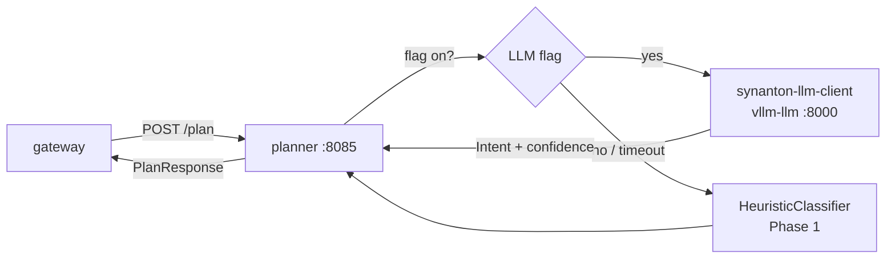

# 02 - planner - Phase 2 - LLM-Driven Intent Classification (Flag-Gated)

**Version:** 1.0
**Date:** 2026-07-21
**Status:** Draft for review
**Depends on:** [01-ingestion-pipeline.md](./01-ingestion-pipeline.md) (Phase 2 DoD met - `synanton-llm-client` exists and vLLM is up). [../phase1/03-planner.md](../phase1/03-planner.md) (Phase 1 DoD met).
**Scope:** Replace the Phase 1 heuristic-only path with an optional LLM-driven intent classifier, behind a per-tenant feature flag. Phase 1 heuristics remain the fallback on LLM timeout, quota exhaustion, or when the flag is off. No cost estimation, no cross-region logic, no context budget - those are Phase 3 and 4.

---

## 1. Context and Document Alignment

| Source | Role |
|--------|------|
| [synanton-design-1.19.md §22 `planner`](../../architecture/synanton-design-1.19.md) | Production target - cost-based planner, cross-region penalty map, follow-the-sun serving, context budget, rerank policy selection. Phase 2 adds **LLM intent classification** only; everything else deferred. |
| [../phase1/03-planner.md](../phase1/03-planner.md) | Phase 1 baseline - 7-rule heuristic classifier + 4 plan templates. Phase 2 is additive; heuristics remain the fallback. |
| [01-ingestion-pipeline.md](./01-ingestion-pipeline.md) | Supplies `synanton-llm-client` (`LlmClient` interface + `OpenAiCompatTranslator`). Planner uses the same library via a `@Qualifier("llm")` bean. |

**Explicit non-goals for Phase 2:**

- No cost-estimation node - plans still carry no cost metadata.
- No cross-region penalty logic - single region only.
- No context-budget arithmetic (§22 budget node).
- No rerank-policy selection - reranker is Phase 3.
- No follow-the-sun serving.
- No GPU-degraded-mode branching - degraded mode is Phase 4.
- No plan caching - every call re-plans.
- No streaming responses - request/response only.

---

## 2. Phase 2 in One Sentence

> When `planner.llm.enabled=true`, classify query intent by calling the LLM with a JSON-schema-guarded prompt; on timeout or LLM error, transparently fall back to the Phase 1 heuristic classifier - the caller always gets the same `PlanResponse` shape.

---

## 3. Target Architecture



**Deployment.** Same Spring Boot service on `:8085` as Phase 1. No new Docker containers - uses the `vllm-llm` container that landed in ingestion Phase 2.

---

## 4. Data Contract (delta from Phase 1)

**Input:** unchanged - `POST /plan` body identical to Phase 1.

**Output:** `PlanResponse` gains two new optional fields in `trace`:

```json
{
  "intent": "HYBRID",
  "steps": [ … ],
  "trace": {
    "classified_by": "llm",
    "llm_model": "llama-3.1-8b-instruct",
    "llm_confidence": 0.92,
    "llm_latency_ms": 210,
    "signals": [],
    "fallback_reason": null,
    "planner_ms": 218
  }
}
```

When the heuristic fallback fires:
```json
{
  "trace": {
    "classified_by": "heuristic",
    "fallback_reason": "llm_timeout",
    "signals": ["contains_question_word", "matched_entity:Acme Corp"]
  }
}
```

`classified_by` is `"llm"` or `"heuristic"`. Both are valid - callers must not depend on a particular value. `fallback_reason ∈ {null, "llm_timeout", "llm_error", "flag_disabled"}`.

---

## 5. LLM Intent Classification Design

### 5.1 Prompt

The classification prompt uses a JSON-schema-guarded response following the same pattern as Pass 1/2 in `synflux`. Template: `planner-intent-classify.mustache`.

```
System: You are a search intent classifier for an enterprise knowledge platform.
        Respond ONLY with valid JSON matching the schema below. Do not explain.
        Schema: {"intent": "RETRIEVAL_ONLY | GRAPH_ONLY | HYBRID",
                 "confidence": <0.0-1.0>,
                 "entity_hints": ["<name>", ...],
                 "relation_hints": ["<verb>", ...]}

User: Query: "{{query}}"
      Known entity types: {{entity_types_csv}}
      Known relation verbs: {{relation_verbs_csv}}
      Tenant: {{tenant}}
```

**Parameters:** `temperature=0`, `max_tokens=150`, `seed=42`. The small output budget (150 tokens) minimises latency; the JSON schema in the system prompt keeps the output parseable.

### 5.2 Fallback logic

```
classify(query, hints, tenant):
  if not flag_enabled(tenant):
    return HeuristicClassifier.classify(query, hints)   # fallback_reason=flag_disabled
  try:
    result = LlmClient.complete(prompt, timeout=2000ms)
    parsed = JsonResponseValidator.validate(result, schema)
    return PlanTemplateRenderer.render(parsed.intent, slots_from(parsed + query))
  catch TimeoutException:
    metrics.increment("planner_llm_fallback_total", reason="timeout")
    return HeuristicClassifier.classify(query, hints)   # fallback_reason=llm_timeout
  catch LlmResponseValidationException:
    metrics.increment("planner_llm_fallback_total", reason="bad_response")
    return HeuristicClassifier.classify(query, hints)
```

Timeout of 2000 ms is deliberately tight - the planner is on the hot search path. A slow LLM must not hold up the user.

### 5.3 Entity context injection

The prompt receives `entity_types_csv` (distinct types from `EntityLabelIndex`) and `relation_verbs_csv` (from config). This gives the LLM grounding without requiring it to have domain knowledge. The same `EntityLabelIndex` is used as in Phase 1; it refreshes every 60 s.

---

## 6. Module Boundaries (delta from Phase 1)

**New / changed in `java/planner/`:**
- `LlmIntentClassifier` - wraps `LlmClient` with the classification prompt, JSON schema validation, and timeout-fence.
- `IntentClassificationResult` - new record: `{intent, confidence, entity_hints[], relation_hints[], llm_model, llm_latency_ms}`.
- `ClassifierRouter` - selects `LlmIntentClassifier` or `HeuristicClassifier` based on the per-tenant flag.
- `PlannerProperties` extended: `llm.*` sub-section.
- `PlanTrace` extended: `classified_by`, `llm_model`, `llm_confidence`, `llm_latency_ms`, `fallback_reason`.
- `planner-intent-classify.mustache` template (new resource).

**Not changed:**
- `HeuristicClassifier`, `SlotExtractor`, `PlanTemplateRenderer`, `EntityLabelIndex` - unchanged from Phase 1.
- `PlanResponse` schema - additive trace fields only, fully backward-compatible.

---

## 7. Prerequisites

| # | Prereq | Home | Notes |
|---|--------|------|-------|
| P1 | Phase 1 planner DoD met - heuristic classifier works end-to-end. | - | Non-negotiable. |
| P2 | `synanton-llm-client` (from ingestion Phase 2) is published as a Gradle artifact. | `java/synanton-llm-client` | Blocking: planner depends on `LlmClient` interface. |
| P3 | `vllm-llm` container is up in the `phase2` compose profile and healthy. | `deployment/docker/compose.yaml` | Already landed with ingestion Phase 2. |
| P4 | Add `synanton-llm-client` as a Gradle dependency in `java/planner/build.gradle.kts`. | planner | One-line change. |

---

## 8. Task Breakdown

Ordered by dependency. Each task ≤ 1-2 days.

| # | Task | Deliverable |
|---|------|-------------|
| PL2-1 | Add `synanton-llm-client` dependency; add `@Qualifier("llm") LlmClient` bean to the planner Spring context, wired to `vllm-llm` base URL. | Config + bean |
| PL2-2 | Write `planner-intent-classify.mustache` template (system + user turns, JSON schema embed). Unit test: render with sample query + entity_types → assert no template syntax errors. | Template + render test |
| PL2-3 | Implement `IntentClassificationResult` record and JSON deserialisation + schema validation (reuse `JsonResponseValidator` from `synanton-llm-client`). | Record + validator tests |
| PL2-4 | Implement `LlmIntentClassifier`: call `LlmClient.complete()` with a 2000 ms timeout fence, parse output, return `IntentClassificationResult`. Expose a `LlmMetricsCollector` hook for planner-side counters. | Class + tests (LLM mocked) |
| PL2-5 | Implement `ClassifierRouter`: reads `planner.llm.enabled` (global flag) + `planner.llm.enabled-tenants` (per-tenant allow-list). Dispatches to `LlmIntentClassifier` or `HeuristicClassifier`. On any exception or timeout, catches, increments `planner_llm_fallback_total{reason}`, logs WARN, returns heuristic result. | Class + tests |
| PL2-6 | Extend `PlanTrace`: add `classified_by`, `llm_model`, `llm_confidence`, `llm_latency_ms`, `fallback_reason` (all nullable). Snapshot tests for both `"llm"` and `"heuristic"` trace shapes. | Record extension + tests |
| PL2-7 | Metrics: `planner_llm_classify_total{intent, tenant}`, `planner_llm_latency_ms` histogram, `planner_llm_fallback_total{reason, tenant}`. Wire via `LlmMetricsCollector`. | Metrics + assertion in E2E |
| PL2-8 | E2E test (`PlannerLlmE2EIT`): Wiremock stub for `vllm-llm` returning canned JSON → run 10 queries → assert `classified_by=llm`. Second set: stub returns 504 → assert `classified_by=heuristic`, `fallback_reason=llm_timeout`. | `PlannerLlmE2EIT` |
| PL2-9 | Feature-flag toggle test: `planner.llm.enabled=false` → all calls route to heuristic; LLM stub receives zero requests. | Embedded in E2E |
| PL2-10 | Update `application-phase2.yaml` with `planner.llm.*` defaults; set `enabled=true` in phase2 profile only. | Config file |

---

## 9. Data Flow

For query `"who is the largest customer of Acme Corp?"` with `planner.llm.enabled=true`:

1. `POST /plan` arrives.
2. `ClassifierRouter` sees flag on → dispatches to `LlmIntentClassifier`.
3. `LlmIntentClassifier` renders the prompt with `entity_types=["ORGANIZATION", "PERSON", ...]` and `relation_verbs=["supplies","owns",...]`.
4. `LlmClient.complete()` → `POST http://vllm-llm:8000/v1/chat/completions` → response `{"intent":"GRAPH_ONLY","confidence":0.91,"entity_hints":["Acme Corp"],"relation_hints":["customer_of"]}`.
5. JSON schema validates → `IntentClassificationResult{intent=GRAPH_ONLY, confidence=0.91, ...}`.
6. `PlanTemplateRenderer.render(GRAPH_ONLY, slots{entity="Acme Corp"})` → one-step plan: `relix.graph_query(shape=entity_lookup, entity_label="Acme Corp", direction=OUT, edge_types=["customer_of"])`.
7. `PlanResponse` returned with `trace.classified_by="llm"`, `llm_latency_ms=210`, `planner_ms=215`.

For a vLLM timeout at step 4:
4b. `TimeoutException` caught → metric `planner_llm_fallback_total{reason=llm_timeout}` incremented.
5b. `HeuristicClassifier.classify()` runs → HYBRID (rule 3 fires on "who", "Acme Corp").
7b. Response with `trace.classified_by="heuristic"`, `fallback_reason="llm_timeout"`.

---

## 10. Configuration Surface (Phase 2 delta)

```yaml
planner:
  llm:
    enabled: false                          # global off; override per profile
    enabled-tenants: []                     # if non-empty, only these tenants use LLM
    base-url: http://vllm-llm:8000/v1       # reuses the ingestion-phase2 container
    model: llama-3.1-8b-instruct
    timeout-ms: 2000
    temperature: 0.0
    max-tokens: 150
    seed: 42
    max-retries: 1                          # one retry before falling back
  intent:
    question-words: [who, what, which, whose, how many, how much]
    relation-verbs: [supplies, supply, owns, acquired, parent of, subsidiary of]
  labels:
    refresh-interval-seconds: 60
    cache-max-entries: 10000
  server:
    port: 8085
```

In `application-phase2.yaml` (activation profile):
```yaml
planner:
  llm:
    enabled: true
```

---

## 11. Testing Strategy

- **Unit tests** - `LlmIntentClassifier` tested with `FakeLlmClient`; exercises all output shapes (valid JSON, malformed JSON, empty response). `ClassifierRouter` tests cover flag-on/off and per-tenant allow-list.
- **Snapshot tests** - four golden `PlanResponse` JSON snapshots extended with the new `trace` fields; one for each `classified_by` × fallback scenario.
- **WireMock E2E** - canned vLLM stubs exercising happy path, timeout, 500 error, and flag-disabled paths (PL2-8/9).
- **Latency regression** - when `enabled=false`, planner p95 must remain < 10 ms (same as Phase 1 DoD). Assert in a benchmark fixture.
- **Fallback rate metric** - after injecting 10 timeout scenarios, assert `planner_llm_fallback_total` counter = 10.

---

## 12. Risks and Open Questions

| Risk | Mitigation |
|------|------------|
| LLM output varies despite `temperature=0, seed=42` - structural properties break. | Tests assert structure (JSON schema), not verbatim output. `JsonResponseValidator` retries once on bad JSON. |
| 2000 ms timeout is tight on a loaded rig. | Configurable via `planner.llm.timeout-ms`. Fallback is always available. |
| Prompt leaks entity labels from other tenants. | `entity_types_csv` is derived from `EntityLabelIndex` which is tenant-scoped in Phase 3+. Phase 2 is single-tenant; not a concern yet. Mark as Phase 3 hardening item. |
| LLM classification is worse than heuristics on short/ambiguous queries. | Metrics `planner_llm_fallback_total` and intent distribution logged. A/B switchable via flag per tenant. |
| vLLM is shared with ingestion enrichment - concurrent load may slow classification. | Planner's 2000 ms budget is independent of enrichment. If contention is detected, a dedicated LLM instance (Phase 3) separates the workloads. |

---

## 13. Definition of Done (Phase 2)

Phase 2 is complete when **all** of the following hold with Phase 1 planner DoD and ingestion Phase 2 DoD met:

1. `planner.llm.enabled=true` in the `phase2` profile; `false` in the default profile - no behaviour change for developers without GPUs.
2. `POST /plan` with LLM enabled returns `trace.classified_by="llm"` and a structurally valid `PlanResponse` within 3000 ms p95.
3. Injecting a 5000 ms vLLM delay produces `trace.classified_by="heuristic"` and `fallback_reason="llm_timeout"` - no user-visible error.
4. `planner_llm_classify_total`, `planner_llm_latency_ms`, `planner_llm_fallback_total` counters are reachable via `/actuator/prometheus`.
5. `./gradlew test` passes; `PlannerLlmE2EIT` green (WireMock-based, no GPU required).
6. Phase 1 planner DoD remains fully green - no regressions.
7. No modifications to `gateway`, `synquest`, `relix`, `synvault`, `synflux`, or `ingestion-cache`.

---

## 14. Follow-on Phases (Signposted)

- **Phase 3 (planner)** - Cost estimation node: per-engine cost model, cheapest-plan selection from multiple candidate plans.
- **Phase 4 (planner)** - Cross-region penalty map, follow-the-sun serving. Tenant-scoped `EntityLabelIndex` once `topology` module is real.
- **Phase 5 (planner)** - Context budget node (§22 v1.1), rerank policy selection, GPU degraded-mode branching.
