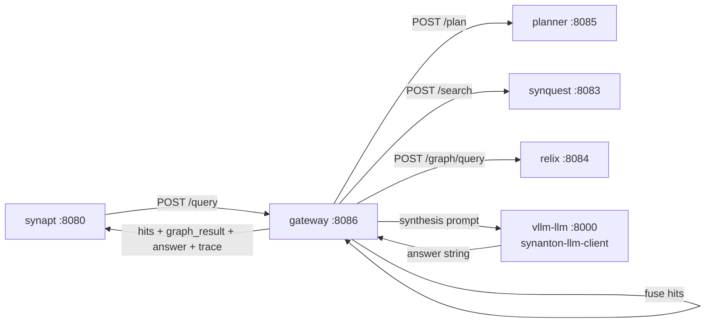

# 03 - gateway - Phase 2 - LLM Synthesis Step

**Version:** 1.0
**Date:** 2026-07-21
**Status:** Draft for review
**Depends on:** [01-ingestion-pipeline.md](./01-ingestion-pipeline.md) (Phase 2 DoD - `synanton-llm-client` exists and vLLM is up). [../phase1/04-gateway.md](../phase1/04-gateway.md) (Phase 1 DoD met).
**Scope:** Add an LLM synthesis step to the query path. After fusion, gateway calls `synanton-llm-client` with the retrieved hits and optional graph result to produce a natural-language `answer`. The `answer` field is added to `QueryResponse`. No ACL, no reranker, no cold-tier rehydration, no cross-tenant cache - those are Phase 3 and beyond.

---

## 1. Context and Document Alignment

| Source | Role |
|--------|------|
| [synanton-design-1.19.md §23 `gateway`](../../architecture/synanton-design-1.19.md) | Production target - compile-time ACL injection, reranker port, cross-tenant synthesis cache, LLM-context sanitisation, cold-tier rehydration, anomaly streaming. Phase 2 adds the **synthesis step** only. |
| [../phase1/04-gateway.md](../phase1/04-gateway.md) | Phase 1 baseline - plan executor + fusion. Phase 2 is additive; Phase 1 execution logic is unchanged. |
| [01-ingestion-pipeline.md](./01-ingestion-pipeline.md) | Supplies `synanton-llm-client`. Gateway Phase 2 uses the same `LlmClient` + `OpenAiCompatTranslator` via a `@Qualifier("llm")` bean. |

**Explicit non-goals for Phase 2:**

- No compile-time ACL injection - single tenant, no ACL.
- No reranker - reranker port is Phase 3.
- No cross-tenant synthesis cache - no Redis in Phase 2.
- No LLM-context sanitisation (§23) - deferred to Phase 4 with the OWASP sanitiser.
- No cold-tier rehydration - Phase 1 hot-tier assumption unchanged.
- No anomaly streaming.
- No budget-aware execution (token-budget guards) - deferred to Phase 4.
- No streaming synthesis response - request/response only.

---

## 2. Phase 2 in One Sentence

> After retrieving hits and graph results (Phase 1), send the top-K hits + graph entities as context to the LLM and append the returned natural-language answer to the `QueryResponse.answer` field.

---

## 3. Target Architecture



**Deployment.** Same Spring Boot service on `:8086`. Uses the `vllm-llm` container from ingestion Phase 2 - no new containers.

---

## 4. Data Contract (delta from Phase 1)

**Output:** `QueryResponse` gains one new field:

```json
{
  "hits": [ … ],
  "graph_result": { … },
  "answer": "Acme Corp is primarily supplied by Globex Manufacturing (3 contracts) and Initech Ltd (1 contract), both headquartered in the Midwest region.",
  "execution_trace": {
    "plan": { … },
    "steps": [ … ],
    "synthesis": {
      "model": "llama-3.1-8b-instruct",
      "prompt_tokens": 1240,
      "completion_tokens": 52,
      "latency_ms": 1840,
      "outcome": "OK"
    },
    "total_ms": 1960,
    "warnings": []
  }
}
```

`answer` is `null` when:
- No hits were returned (empty result).
- Synthesis timed out - `execution_trace.synthesis.outcome="TIMEOUT"`.
- Synthesis returned a malformed response - `outcome="ERROR"`.
- The synthesis flag is off - `outcome="DISABLED"`.

In all failure cases, gateway returns the non-null `hits` and `graph_result` so the caller always gets usable results even without the answer.

---

## 5. Synthesis Step Design

### 5.1 Context construction

Gateway assembles the synthesis prompt from:
- **System prompt:** `synthesis-system.mustache` - instructs the model to answer strictly from the provided context, cite by document title, and be concise (target ≤ 100 words).
- **Context block:** top-N hits (default N = `gateway.synthesis.context-hits`, 10) formatted as numbered passages with `source_uri` and `snippet`. Graph entities appended as a brief bulleted list.
- **User turn:** the original query.

Context is truncated to `gateway.synthesis.max-context-tokens` (default 3000) to stay within the 4096-token budget while leaving room for output.

### 5.2 Synthesis call

```
SynthesisResult synthesise(QueryRequest req, List<Hit> hits, GraphResult graph):
  if not synthesis_enabled(req.tenant):
    return SynthesisResult.disabled()
  prompt = PromptBuilder.build(req.query, hits.take(contextHits), graph)
  try:
    resp = llmClient.complete(prompt, timeout=synthesis_timeout_ms)
    return SynthesisResult.ok(resp.text, resp.usage)
  catch TimeoutException:
    metrics.increment("gateway_synthesis_timeout_total")
    return SynthesisResult.timeout()
  catch LlmException:
    metrics.increment("gateway_synthesis_error_total")
    return SynthesisResult.error()
```

### 5.3 Placement in the execution flow

The synthesis call happens **after** fusion completes, as a new terminal step. It is **not** in the plan DAG (the planner does not emit it - it is always injected by gateway when enabled). This avoids polluting the planner with LLM-synthesis policy; gateway owns this decision.

If fusion produced empty hits and an empty graph, synthesis is skipped; `answer=null`, no LLM call, no additional latency.

---

## 6. Module Boundaries (delta from Phase 1)

**New / changed in `java/gateway/`:**
- `SynthesisService` - builds the context prompt, calls `LlmClient`, returns `SynthesisResult`.
- `SynthesisResult` - sealed class: `Ok(answer, usage)`, `Timeout`, `Error`, `Disabled`, `SkippedEmpty`.
- `PromptBuilder` - assembles the system + context + user prompt from hits and graph, with truncation.
- `synthesis-system.mustache` template (new resource).
- `QueryResponse` extended: `answer` field (nullable String), `execution_trace.synthesis` object.
- `QueryService` extended: after fusion, call `SynthesisService.synthesise(...)`, attach result.
- `GatewayProperties` extended: `synthesis.*` sub-section.

**Not changed:**
- `PlanExecutor`, `FusionEngine`, `PlannerClient`, `SynquestClient`, `RelixClient` - unchanged from Phase 1.

---

## 7. Prerequisites

| # | Prereq | Home | Notes |
|---|--------|------|-------|
| P1 | Phase 1 gateway DoD met - plan execution and fusion work end-to-end. | - | Non-negotiable. |
| P2 | `synanton-llm-client` JAR available on the classpath. | `java/synanton-llm-client` | Blocking. |
| P3 | `vllm-llm` container up and healthy in the `phase2` compose profile. | `deployment/docker/compose.yaml` | Already present from ingestion Phase 2. |
| P4 | Add `synanton-llm-client` and `mustache-compiler` dependencies to `java/gateway/build.gradle.kts`. | gateway | Two lines. |

---

## 8. Task Breakdown

Ordered by dependency. Each task ≤ 1-2 days.

| # | Task | Deliverable |
|---|------|-------------|
| GW2-1 | Add `synanton-llm-client` and Mustache dependencies; wire `@Qualifier("llm") LlmClient` bean. | Config + beans |
| GW2-2 | Write `synthesis-system.mustache` template. Unit test: render with sample hits + graph → assert token estimate stays ≤ budget. | Template + render test |
| GW2-3 | Implement `PromptBuilder`: constructs context from `List<Hit>` (take first N, format as numbered passages) and `GraphResult` (entity bullet list). Truncates to `max-context-tokens` by dropping trailing passages. | Class + unit tests |
| GW2-4 | Implement `SynthesisResult` sealed class (four variants) and `SynthesisService` with `LlmMetricsCollector` wiring. | Classes + unit tests (LLM mocked) |
| GW2-5 | Extend `QueryResponse`: add `answer` (nullable String) and `execution_trace.synthesis` (nullable object). Extend `ExecutionTrace` record. | Records + snapshot tests |
| GW2-6 | Extend `QueryService`: after fusion, invoke `SynthesisService.synthesise()` and attach result. Attach `synthesis` to trace. | Service + unit tests |
| GW2-7 | Metrics: `gateway_synthesis_total{outcome}` counter, `gateway_synthesis_latency_ms` histogram, `gateway_synthesis_context_tokens` histogram. | Metrics + Prometheus assertion |
| GW2-8 | E2E test (`GatewaySynthesisE2EIT`): WireMock stubs for planner/synquest/relix **and** vllm-llm. Scenarios: (a) happy path - assert `answer` non-null, ≥ 10 words; (b) vllm 504 → assert `answer=null`, `synthesis.outcome=TIMEOUT`, hits still returned; (c) empty hits → assert `answer=null`, `synthesis.outcome=SKIPPED_EMPTY`; (d) `enabled=false` → assert `answer=null`, `synthesis.outcome=DISABLED`. | `GatewaySynthesisE2EIT` |
| GW2-9 | Update `application-phase2.yaml` with `gateway.synthesis.*` defaults. | Config file |

---

## 9. Data Flow

For query `"who supplies Acme Corp?"` with all engines returning results and synthesis enabled:

1. `POST /query` arrives at gateway (from synapt).
2. Planner → HYBRID plan (steps: relix, synquest, fuse) - same as Phase 1.
3. `PlanExecutor` runs steps in parallel → 20 fused `hits` with `graph_result`.
4. **New in Phase 2:** `SynthesisService.synthesise()`:
   - `PromptBuilder` takes top-10 hits + graph entities, renders prompt (~1200 tokens).
   - `LlmClient.complete()` → `POST http://vllm-llm:8000/v1/chat/completions` → answer text.
   - Total synthesis latency: ~1800 ms.
5. `QueryResponse` assembled: `hits[20]`, `graph_result`, `answer="Acme Corp is primarily supplied by..."`, `trace.synthesis{outcome=OK, latency_ms=1840}`.
6. Total p95: ~2100 ms (synthesis dominates; plan execution ~200 ms).

---

## 10. Configuration Surface (Phase 2 delta)

```yaml
gateway:
  synthesis:
    enabled: false                        # override per profile
    context-hits: 10                      # how many hits to include in the context
    max-context-tokens: 3000              # truncate prompt to this
    timeout-ms: 8000                      # synthesis call timeout
    temperature: 0.3                      # slight creativity; 0.0 for fully deterministic
    max-tokens: 150                       # keep answers concise
    model: llama-3.1-8b-instruct
    base-url: http://vllm-llm:8000/v1
```

In `application-phase2.yaml`:
```yaml
gateway:
  synthesis:
    enabled: true
```

---

## 11. Testing Strategy

- **Unit tests** - `PromptBuilder`: token estimation, truncation at boundary, empty hits / graph inputs. `SynthesisService`: all four `SynthesisResult` variants via `FakeLlmClient`.
- **Snapshot tests** - `QueryResponse` with and without `answer`; `ExecutionTrace` with `synthesis` block.
- **WireMock E2E** - four scenarios in GW2-8 (no GPU required).
- **Latency regression** - Phase 1 DoD mandated p95 < 300 ms without synthesis; assert that `enabled=false` latency is unchanged.
- **Token budget test** - construct a prompt that would exceed `max-context-tokens` → `PromptBuilder` truncates, resulting prompt is below budget.

---

## 12. Risks and Open Questions

| Risk | Mitigation |
|------|------------|
| Synthesis is slow (~2 s) - p95 jumps significantly. | Accepted for Phase 2 (PoC). Phase 4 introduces cross-tenant synthesis cache (Redis). Synthesis latency is additive to the plan-execution latency but is parallelisable in Phase 4. |
| Answer hallucination (model invents facts not in context). | System prompt instructs strict context adherence. Phase 5 may add citation scoring. Documented as a known PoC limitation. |
| LLM prompt injection via user query. | Mitigation deferred to Phase 4 (LLM-context sanitisation, §23). Phase 2 trusts the query content (single-tenant demo). |
| Synthesis prompt token overflow for very long snippets. | `PromptBuilder` enforces `max-context-tokens` truncation. Edge-case unit tested. |
| vLLM shared with ingestion enrichment - concurrent synthesis + enrichment may OOM. | Phase 2 is sequential demo use; acceptable. Phase 3+ separates workloads or adds a second LLM instance. |

---

## 13. Definition of Done (Phase 2)

Phase 2 is complete when **all** of the following hold with Phase 1 gateway DoD and ingestion Phase 2 DoD met:

1. `gateway.synthesis.enabled=true` in the `phase2` profile; `false` in the default profile.
2. `POST /query` with synthesis enabled returns `answer` non-null, ≥ 10 words, coherent with the returned hits.
3. Phase 2 composite DoD per master plan: `QueryResponse.answer` is ≥ 20 words and non-empty on the demo corpus.
4. vLLM 504 → `answer=null`, `synthesis.outcome=TIMEOUT`, hits and graph_result still returned. HTTP status `200`.
5. Empty hits → `answer=null`, `synthesis.outcome=SKIPPED_EMPTY`. No LLM call made (asserted via vllm stub call count = 0).
6. `gateway_synthesis_total{outcome=OK}` and `gateway_synthesis_latency_ms` visible in `/actuator/prometheus`.
7. `GatewaySynthesisE2EIT` passes (WireMock-based).
8. Phase 1 gateway DoD remains fully green - no regressions.
9. No modifications to `planner`, `synquest`, `relix`, `synvault`, `synflux`, `ingestion-cache`.

---

## 14. Follow-on Phases (Signposted)

- **Phase 3 (gateway)** - Reranker port integration (`VllmCrossEncoderRerankAdapter`); circuit breakers per engine (Resilience4j).
- **Phase 4 (gateway)** - Compile-time ACL injection, cross-tenant synthesis cache (Redis), LLM-context sanitisation, budget-aware execution.
- **Phase 5 (gateway)** - Cold-tier rehydration (`X-Synanton-Cold-Rehydration` header), GPU degraded-mode branching.
