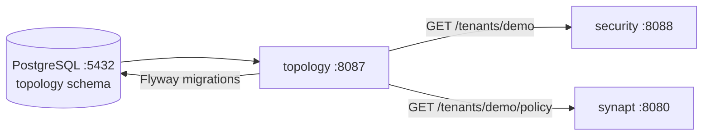

# 06 - topology - Phase 2 - Org/ACL/Policy Store Foundation

**Version:** 1.0
**Date:** 2026-07-21
**Status:** Draft for review
**Depends on:** Phase 2 is the **first real implementation** of this module; Phase 1 left it as an empty stub with a hardcoded `"demo"` tenant across all services.
**Scope:** Stand up the authoritative PostgreSQL schema (`organizations`, `acl_grants`, `topology_outbox`) with Flyway migrations. Seed the `"demo"` tenant and a minimal `TopologyQueryApi` for reading policy. No outbox dispatcher, no ACL propagation fanout, no Neo4j projection, no HIGH_SECURITY two-phase ACL - those are Phase 3 and 4.

---

## 1. Context and Document Alignment

| Source | Role |
|--------|------|
| [synanton-design-1.19.md §25 `topology`](../../architecture/synanton-design-1.19.md) | Production target - outbox dispatcher, Neo4j projection for fast `resolveUserScope`, two-phase ACL propagation (HIGH_SECURITY), full audit schema, regulatory profiles. Phase 2 implements the **schema + read API** only. |
| [05-security.md](./05-security.md) | Consumer - security Phase 2 validates `tenant_id` claims by looking up known tenants; can use topology's `GET /tenants/{id}` or the static `security.known-tenants` fallback. |
| [synanton-design-1.19.md §35 PostgreSQL Schema](../../architecture/synanton-design-1.19.md) | Definitive schema specification. Phase 2 ships a subset (no `api_keys`, no `role_assignments` yet). |

**Explicit non-goals for Phase 2:**

- No `TopologyMutationApi.grant()` / `TopologyMutationApi.revoke()` - Phase 3.
- No outbox dispatcher (fan-out gRPC notifications to synquest/gateway/relix) - Phase 3.
- No Neo4j projection (`resolveUserScope`) - Phase 3.
- No ACL enforcement in synquest, relix, or gateway - Phase 4.
- No HIGH_SECURITY two-phase ACL propagation - Phase 4.
- No cross-region data residency enforcement - Phase 4.
- No `regulatory_profile` enforcement logic - schema column created, no business logic.
- No cost/budget policy processing - columns created, no enforcement.

---

## 2. Phase 2 in One Sentence

> Create the `topology` PostgreSQL schema with Flyway, seed the `"demo"` tenant, expose a read-only `GET /tenants/{id}` and `GET /tenants/{id}/policy` API, and give security and synapt a place to look up real tenant configuration instead of a hardcoded string.

---

## 3. Target Architecture



**Deployment.** New Spring Boot service on `:8087`. Uses the existing PostgreSQL container (already in the compose file from Phase 1, unused until now). No new Docker containers.

---

## 4. Data Contracts

### 4.1 GET /tenants/{tenant_id}

**Response (200):**
```json
{
  "tenant_id": "demo",
  "name": "Demo Tenant",
  "regulatory_profile": "STANDARD",
  "created_at": "2026-07-21T00:00:00Z"
}
```

**Error (404):**
```json
{ "error": "tenant_not_found", "tenant_id": "demo" }
```

### 4.2 GET /tenants/{tenant_id}/policy

**Response (200):**
```json
{
  "tenant_id": "demo",
  "tiering_policy": {
    "hot_days": 30,
    "warm_days": 90,
    "cold_class": "GLACIER_IR"
  },
  "budget_policy": {
    "monthly_gpu_minutes": 1000,
    "alert_thresholds": [0.7, 0.9]
  },
  "rerank_policy": {
    "model_id": null,
    "policy": "OPTIONAL",
    "candidate_pool_size": 100,
    "top_n": 20
  },
  "data_residency_policy": {
    "allowed_regions": ["us-east-1"],
    "fail_closed": true
  }
}
```

Policy fields map directly to `topology.organizations` JSONB columns (see §35 of the design doc).

### 4.3 GET /health

Standard Spring Actuator health endpoint including PostgreSQL connectivity check.

---

## 5. PostgreSQL Schema (Phase 2 subset)

Phase 2 ships **three tables** via Flyway migration `V1__topology_foundation.sql`:

```sql
CREATE TABLE topology.organizations (
  org_id                UUID PRIMARY KEY        DEFAULT gen_random_uuid(),
  name                  TEXT NOT NULL,
  data_residency_policy JSONB,
  tiering_policy        JSONB,
  rerank_policy         JSONB,
  budget_policy         JSONB,
  outbound_auth_profiles JSONB,
  regulatory_profile    TEXT    NOT NULL        DEFAULT 'STANDARD',
  cost_privacy          JSONB,
  created_at            TIMESTAMPTZ NOT NULL    DEFAULT now(),
  updated_at            TIMESTAMPTZ NOT NULL    DEFAULT now()
);

CREATE TABLE topology.acl_grants (
  grant_id              UUID PRIMARY KEY        DEFAULT gen_random_uuid(),
  org_id                UUID NOT NULL           REFERENCES topology.organizations(org_id),
  subject_id            UUID NOT NULL,
  subject_type          TEXT NOT NULL,          -- USER | GROUP
  resource_id           UUID NOT NULL,
  resource_type         TEXT NOT NULL,          -- SPACE | PROJECT | FOLDER | DOCUMENT
  permission            TEXT NOT NULL,
  propagation_state     TEXT NOT NULL           DEFAULT 'PENDING_PROPAGATION',
  created_at            TIMESTAMPTZ NOT NULL    DEFAULT now(),
  propagated_at         TIMESTAMPTZ
);

CREATE TABLE topology.topology_outbox (
  outbox_id             UUID PRIMARY KEY        DEFAULT gen_random_uuid(),
  event_type            TEXT NOT NULL,
  payload               JSONB NOT NULL,
  created_at            TIMESTAMPTZ NOT NULL    DEFAULT now(),
  dispatched_at         TIMESTAMPTZ,
  ack_state             JSONB
);
```

**Flyway migration `V2__seed_demo_tenant.sql`:**
```sql
INSERT INTO topology.organizations (org_id, name, regulatory_profile, tiering_policy, budget_policy, rerank_policy)
VALUES (
  '00000000-0000-0000-0000-000000000001',
  'Demo Tenant',
  'STANDARD',
  '{"hot_days":30,"warm_days":90,"cold_class":"GLACIER_IR"}',
  '{"monthly_gpu_minutes":1000,"alert_thresholds":[0.7,0.9]}',
  '{"model_id":null,"policy":"OPTIONAL","candidate_pool_size":100,"top_n":20}'
);
```

The `demo` tenant has a stable UUID (`00000000-0000-0000-0000-000000000001`) for deterministic test assertions.

**Columns deferred to Phase 3+** (schema is forward-compatible; columns added via `ALTER TABLE` in later migrations):
- `security.api_keys` table - Phase 3.
- `security.role_assignments` table - Phase 5.
- `topology.tenant_policy.cross_region_penalty_ms JSONB` - Phase 4.
- `topology.tenant_policy.security_sanitizer_overrides JSONB` - Phase 4.

---

## 6. Module Boundaries

**Owned by `java/topology/` in Phase 2:**
- Flyway migrations `V1` and `V2` (schema + seed).
- `OrganizationRepository` - Spring Data JPA or plain `JdbcTemplate` with `ObjectMapper` for JSONB columns.
- `PolicyMapper` - maps JSONB columns to typed policy records (`TieringPolicy`, `BudgetPolicy`, etc.).
- REST controllers: `GET /tenants/{id}`, `GET /tenants/{id}/policy`, `GET /health`.
- `TopologyQueryApi` interface + implementation (used internally by other modules via HTTP; no gRPC in Phase 2).

**Not owned in Phase 2:**
- `TopologyMutationApi` (grant/revoke) - Phase 3.
- Outbox dispatcher - Phase 3.
- Neo4j projection - Phase 3.
- Any ACL enforcement - Phase 4.

---

## 7. Prerequisites

| # | Prereq | Home | Notes |
|---|--------|------|-------|
| P1 | Add `java/topology` to `settings.gradle.kts`. | root | New module. |
| P2 | PostgreSQL container already in `deployment/docker/compose.yaml` (added in Phase 1 for future use with an empty schema). | compose | Already present; Phase 2 adds the `topology` schema and Flyway. |
| P3 | Add `org.postgresql:postgresql`, `org.flywaydb:flyway-core`, `org.springframework.boot:spring-boot-starter-jdbc` dependencies. | topology build.gradle.kts | Standard Spring Boot stack. |
| P4 | Create `topology` schema in PostgreSQL: `CREATE SCHEMA IF NOT EXISTS topology;` - included in Flyway baseline. | V1 migration | Done automatically by Flyway. |

---

## 8. Task Breakdown

Ordered by dependency. Each task ≤ 1-2 days.

| # | Task | Deliverable |
|---|------|-------------|
| TP-1 | Create Gradle module; deps: Spring Boot web + jdbc, Flyway, PostgreSQL driver, Jackson (for JSONB), `shared/common`. | `build.gradle.kts` |
| TP-2 | Write Flyway migration `V1__topology_foundation.sql` (three tables, CREATE SCHEMA). Write `V2__seed_demo_tenant.sql`. | Migration files |
| TP-3 | Implement `OrganizationRepository`: `findById(tenant_id)` using `JdbcTemplate` with `ObjectMapper` JSONB deserialisation. Cache in Caffeine (TTL 60 s, max 1000 entries) - policy data is rarely updated in Phase 2. | Repository + cache + unit tests |
| TP-4 | Implement `PolicyMapper`: maps raw `Map<String,Object>` from JSONB to `TieringPolicy`, `BudgetPolicy`, `RerankPolicy`, `DataResidencyPolicy` records. All fields nullable-safe. | Mapper + unit tests |
| TP-5 | REST controllers: `GET /tenants/{id}` → 200/404; `GET /tenants/{id}/policy` → 200/404. `GlobalExceptionHandler` for `TenantNotFoundException`. | Controllers + @WebMvcTest |
| TP-6 | `application.yaml`; `TopologyApplication` boot class; Spring Actuator with datasource health indicator. | Boot + config |
| TP-7 | Testcontainers integration test (`TopologyIT`): spin PostgreSQL, run Flyway, assert: (a) `GET /tenants/demo` → 200 with correct name and regulatory_profile; (b) `GET /tenants/demo/policy` → 200 with tiering_policy.hot_days=30; (c) `GET /tenants/unknown` → 404. | `TopologyIT` |
| TP-8 | Update `deployment/docker/compose.yaml` `phase2` profile: add `topology` service; configure `TOPOLOGY_DB_URL`, `TOPOLOGY_DB_USER`, `TOPOLOGY_DB_PASSWORD` env vars. | Compose extension |
| TP-9 | Update security service `application-phase2.yaml` to replace `security.known-tenants=["demo"]` with a `topology.base-url=http://topology:8087` config and a `TopologyClient` bean that calls `GET /tenants/{id}` for tenant validation. | Security + topology integration |
| TP-10 | Metrics: `topology_tenant_lookup_total{outcome}` counter, `topology_policy_cache_hit_total`. | Metrics + assertion |

---

## 9. Data Flow

For a synapt JWT validation that checks `tenant_id = "acme"` (a hypothetical unknown tenant):

1. Synapt → `POST security:8088/auth/validate` with JWT containing `tenant_id="acme"`.
2. Security → `GET topology:8087/tenants/acme`.
3. Topology: `OrganizationRepository.findById("acme")` → empty (no row).
4. Topology → `404 {"error":"tenant_not_found"}`.
5. Security → `401 {"error":"invalid_token", "reason":"tenant_unknown"}`.
6. Synapt → `401` to the caller.

For the `demo` tenant (warm path):
2b. Cache hit in `OrganizationRepository` → no PostgreSQL query.
3b. Topology → `200 {"tenant_id":"demo",...}`.
4b. Security stores `tenant_id=demo` as valid → caches the `SubjectAssertion`.

---

## 10. Configuration Surface

```yaml
topology:
  db:
    url: jdbc:postgresql://postgres:5432/synanton
    username: ${TOPOLOGY_DB_USER:topology}
    password: ${TOPOLOGY_DB_PASSWORD:topology-dev}
    schema: topology
  cache:
    tenant-ttl-seconds: 60
    tenant-max-entries: 1000
  server:
    port: 8087
spring:
  flyway:
    locations: classpath:db/migration
    schemas: topology
    baseline-on-migrate: true
management:
  endpoints:
    web:
      exposure:
        include: health,prometheus
```

---

## 11. Testing Strategy

- **Unit tests** - `PolicyMapper`: null-safe deserialisation of all JSONB sub-objects; partial JSONB (only `tiering_policy` set, rest null). `OrganizationRepository` with mocked `JdbcTemplate`.
- **Testcontainers integration (`TopologyIT`)** - real PostgreSQL; Flyway applies; three scenarios from TP-7.
- **Flyway idempotency test** - run migrations twice on the same DB; assert no errors and no duplicate rows.
- **Caffeine cache test** - assert that a second `GET /tenants/demo` within 60 s makes zero DB calls (spy on `JdbcTemplate`).
- **Security × topology integration** - with both services running via Testcontainers, assert that `POST /auth/validate` with a `tenant_id=demo` JWT succeeds and with `tenant_id=nonexistent` returns `401 reason=tenant_unknown`.

---

## 12. Risks and Open Questions

| Risk | Mitigation |
|------|------------|
| JSONB column mapping to Java records is verbose. | `ObjectMapper` with `@JsonIgnoreProperties(ignoreUnknown=true)` handles schema evolution gracefully. |
| Flyway baseline-on-migrate in a non-empty DB (if Phase 1 left a partial schema). | Phase 1 left PostgreSQL empty; `baseline-on-migrate=true` is a safety net for dev envs that have been partially set up. |
| Topology and security are a circular dependency (security uses topology to validate tenants). | No circular dependency at runtime - security calls topology via HTTP. Both start independently; security fails validate calls until topology is up (handled as `503 auth_service_unavailable`). |
| `demo` tenant UUID is hardcoded in the seed - clashes if someone creates another demo tenant. | Seed uses a deterministic UUID (all-zeros with suffix `1`). Only one demo tenant in Phase 2. |
| Policy JSONB columns may be null for newly-created tenants. | `PolicyMapper` defaults all null columns to safe defaults (e.g. `TieringPolicy{hot_days=30, warm_days=90, cold_class=null}`). |

---

## 13. Definition of Done (Phase 2)

Phase 2 is complete when **all** of the following hold:

1. `./gradlew :java:topology:bootRun` starts cleanly on `:8087` with PostgreSQL up.
2. `GET /tenants/demo` returns `200` with `name="Demo Tenant"` and `regulatory_profile="STANDARD"`.
3. `GET /tenants/demo/policy` returns `200` with `tiering_policy.hot_days=30`.
4. `GET /tenants/nonexistent` returns `404`.
5. `TopologyIT` (Testcontainers) passes: Flyway runs cleanly, seed data present, three API scenarios verified.
6. Security Phase 2 `SecurityE2EIT` scenario (tenant validation via topology) passes end-to-end with both services running.
7. `topology_tenant_lookup_total` and cache-hit counters visible in `/actuator/prometheus`.
8. PostgreSQL is the only external dependency (no Cassandra, no MinIO required to start topology).

---

## 14. Follow-on Phases (Signposted)

- **Phase 3 (topology)** - `TopologyMutationApi.grant()` and `revoke()`, outbox dispatcher (fan-out gRPC notifications to synquest, gateway, relix), Neo4j projection for fast `resolveUserScope`.
- **Phase 4 (topology)** - HIGH_SECURITY two-phase ACL propagation, `cross_region_penalty_ms` column, residency policy enforcement, full audit schema.
- **Phase 5 (topology)** - GDPR erasure cascade, `BackupVerificationWorkflow` integration, stable schema (no further major changes planned).
