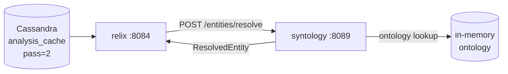

# 07 - syntology - Phase 2 - Pass-2 Entity Type Resolution

**Version:** 1.0
**Date:** 2026-07-21
**Status:** Draft for review
**Depends on:** [01-ingestion-pipeline.md](./01-ingestion-pipeline.md) (Phase 2 DoD - `analysis_cache` populated with `typed_entities[]`). [standalone-syntology-demo.md](../demo/standalone-syntology-demo.md) (standalone track DoD - ontology management API and base ontology exist).
**Scope:** First integration between the syntology ontology service and the ingestion pipeline. Pass-2 typed-entity strings from `analysis_cache` are resolved against the loaded ontology; unknown types are flagged. Adds `POST /entities/resolve` endpoint and a webhook-style listener that relix can query. No SHACL validation, no ontology versioning per tenant, no session pinning - those are Phase 3 and 4.

---

## 1. Context and Document Alignment

| Source | Role |
|--------|------|
| [synanton-design-1.19.md §19 `syntology`](../../architecture/synanton-design-1.19.md) | Production target - SHACL validation, ontology versioning, session pinning, capability matrix, multi-tenant, cross-version entity alignment. Phase 2 implements **entity type resolution** only. |
| [standalone-syntology-demo.md](../demo/standalone-syntology-demo.md) | Foundation - the standalone track ships the ontology management API (`POST /ontologies`, `GET /ontologies/{id}/entity-types`) and a base ontology. Phase 2 builds on top of that. |
| [01-ingestion-pipeline.md](./01-ingestion-pipeline.md) | Data source - `analysis_cache.analysis_json` for `pass_number=2` contains `typed_entities[{label, type, confidence}]`. Phase 2 resolves the `type` strings against syntology. |
| [../phase1/02-relix.md](../phase1/02-relix.md) | Consumer - relix Phase 1 loaded Pass-2 typed entities as raw strings. Phase 2 gives relix a resolution endpoint so it can load canonical types instead. |

**Explicit non-goals for Phase 2:**

- No SHACL validation - Phase 4.
- No ontology versioning per tenant (session pinning) - Phase 3.
- No ontology lint - Phase 4.
- No cross-tenant entity type sharing - Phase 3.
- No streaming entity resolution - request/response only.
- No multi-tenant ontology management - the base ontology is shared across all tenants in Phase 2.

---

## 2. Phase 2 in One Sentence

> Given a list of `{label, type}` pairs from Pass-2 analysis, resolve each `type` string against the active ontology, return `{label, canonical_type, confidence, known: true|false}` for each, and flag unknown types for downstream handling.

---

## 3. Target Architecture



`syntology` runs on `:8089`. Relix calls it at boot (and periodically) to resolve the entity types from the Pass-2 analysis. Synapt and gateway do not call syntology directly in Phase 2.

---

## 4. Data Contract

### 4.1 POST /entities/resolve

**Request:**
```json
{
  "tenant_id": "demo",
  "ontology_id": null,
  "entities": [
    { "label": "Acme Corp",  "type": "ORGANIZATION" },
    { "label": "John Smith", "type": "PERSON" },
    { "label": "foobar",     "type": "UNKNOWN_WIDGET" }
  ]
}
```

`ontology_id=null` means "use the active ontology for this tenant" (Phase 2: always the base ontology).

**Response (200):**
```json
{
  "resolved": [
    { "label": "Acme Corp",  "type": "ORGANIZATION", "canonical_type": "Organization", "known": true,  "confidence_floor": 0.75 },
    { "label": "John Smith", "type": "PERSON",        "canonical_type": "Person",       "known": true,  "confidence_floor": 0.80 },
    { "label": "foobar",     "type": "UNKNOWN_WIDGET","canonical_type": null,            "known": false, "confidence_floor": 0.0 }
  ],
  "unknown_count": 1,
  "ontology_id": "base-v1",
  "ontology_version": "1.0"
}
```

`confidence_floor` is the minimum confidence score the ontology assigns to entities of this canonical type (used by relix to decide graph inclusion thresholds). Unknown types have `confidence_floor=0.0` and are included in the graph with a warning.

### 4.2 GET /entity-types

Returns all entity types defined in the active ontology (replaces Phase 1's raw type strings with canonical names):

```json
{
  "ontology_id": "base-v1",
  "entity_types": [
    { "id": "Organization", "description": "…", "confidence_floor": 0.75 },
    { "id": "Person",       "description": "…", "confidence_floor": 0.80 },
    { "id": "Location",     "description": "…", "confidence_floor": 0.70 },
    { "id": "Product",      "description": "…", "confidence_floor": 0.65 }
  ]
}
```

Relix uses this endpoint to warm its `EntityLabelIndex` (instead of using raw Pass-2 type strings), and planner uses it to populate the LLM classification prompt (Phase 2 planner plan `02-planner.md §5.3`).

---

## 5. Implementation Design

### 5.1 Ontology in Phase 2

The base ontology (`base-v1`) ships as a JSON resource file (`syntology/src/main/resources/ontologies/base-v1.json`). It is loaded into memory at startup by `OntologyLoader`. A type-lookup trie is built over `id` and `aliases[]` for O(1) case-insensitive resolution.

Phase 3 introduces persistent ontology storage (PostgreSQL) and per-tenant versioning. For now, the in-memory base ontology is authoritative.

### 5.2 Type resolution algorithm

```
resolve(type_string):
  normalized = type_string.trim().toUpperCase()
  if trie.contains(normalized):
    entry = trie.get(normalized)
    return ResolvedEntity{canonical_type=entry.id, known=true, confidence_floor=entry.confidence_floor}
  # Try fuzzy: strip underscores/hyphens and check again
  fuzzy = normalized.replaceAll("[_-]", "")
  if trie.contains(fuzzy):
    entry = trie.get(fuzzy)
    return ResolvedEntity{canonical_type=entry.id, known=true, confidence_floor=entry.confidence_floor}
  # Unknown
  metrics.increment("syntology_unknown_type_total", type=type_string)
  return ResolvedEntity{canonical_type=null, known=false, confidence_floor=0.0}
```

Phase 2 does not suggest corrections for unknown types; it just flags them. Phase 4 adds SHACL-based correction hints.

### 5.3 Integration with relix

Relix Phase 1 loads Pass-2 entities from `analysis_cache` as raw type strings (`"ORGANIZATION"`, `"PERSON"`, etc.) and uses them as graph node labels. Phase 2 modifies `relix` startup to:

1. Call `GET syntology:8089/entity-types` → load canonical type list with `confidence_floor` values.
2. For each Pass-2 entity before inserting into the in-memory graph, call `POST /entities/resolve` (batch call for all entities in a document).
3. Use `canonical_type` as the graph node `type` property; `confidence_floor` as the inclusion threshold (entities with `analysis_json.confidence < confidence_floor` are skipped).

This is a **relix change** (a delta on `02-relix.md` Phase 1 plan), tracked here as it is triggered by the syntology Phase 2 work.

---

## 6. Module Boundaries (delta from standalone track)

**New / changed in `java/syntology/`:**
- `EntityTypeResolver` - type-string → `ResolvedEntity` via trie lookup with fuzzy fallback.
- `OntologyLoader` - loads `base-v1.json` from classpath; builds lookup trie.
- `base-v1.json` ontology definition file (new resource).
- New REST endpoints: `POST /entities/resolve`, `GET /entity-types`.
- `syntology_unknown_type_total{type}` Prometheus counter.

**Unchanged from standalone track:**
- Ontology CRUD endpoints (`POST /ontologies`, `GET /ontologies/{id}`, etc.).
- Admin UI embedded in the JAR.
- Session management.

**Delta on `java/relix/` (tracked here):**
- Startup: call `GET syntology:8089/entity-types` to warm type list.
- Graph loader: batch `POST /entities/resolve` before inserting Pass-2 entities.
- Exclude entities below `confidence_floor`. Log skipped entities at DEBUG.
- Add `syntology.base-url` config key; fallback: skip resolution if syntology is unreachable (log WARN, use raw type strings - Phase 1 behaviour).

---

## 7. Prerequisites

| # | Prereq | Home | Notes |
|---|--------|------|-------|
| P1 | Standalone syntology track DoD met - ontology management API works, `GET /ontologies/{id}/entity-types` returns type definitions. | standalone track | Blocking: Phase 2 extends this endpoint. |
| P2 | Ingestion Phase 2 DoD met - `analysis_cache` populated with `pass_number=2` rows containing `typed_entities[]`. | [01-ingestion-pipeline.md](./01-ingestion-pipeline.md) | Blocking: resolution requires real Pass-2 data. |
| P3 | `base-v1.json` ontology definition authored. Minimum required types: `Organization`, `Person`, `Location`, `Product`, `Event`. | syntology | Part of SY2-1. |

---

## 8. Task Breakdown

Ordered by dependency. Each task ≤ 1-2 days.

| # | Task | Deliverable |
|---|------|-------------|
| SY2-1 | Author `base-v1.json` with at minimum 5 entity types, their `id`, `description`, `aliases[]`, and `confidence_floor`. | JSON resource file |
| SY2-2 | Implement `OntologyLoader`: reads `base-v1.json` from classpath, builds case-insensitive trie over `id + aliases`. Startup: load and validate; fail fast if file missing or malformed. | Class + tests |
| SY2-3 | Implement `EntityTypeResolver.resolve(type_string) → ResolvedEntity` per §5.2 (exact match, fuzzy match, unknown). | Class + unit tests (known, fuzzy, unknown) |
| SY2-4 | Implement `POST /entities/resolve` controller: accepts `{tenant_id, ontology_id, entities[]}`, calls `EntityTypeResolver.resolve()` for each, returns `ResolvedEntitiesResponse`. | Controller + @WebMvcTest |
| SY2-5 | Implement `GET /entity-types` controller: returns the full trie contents as a typed list. | Controller + test |
| SY2-6 | Add `syntology_unknown_type_total{type}`, `syntology_resolve_batch_size` histogram. | Metrics + Prometheus assertion |
| SY2-7 | **Relix delta** - update `java/relix` graph loader: (a) call `GET /entity-types` at startup to build canonical type map; (b) batch call `POST /entities/resolve` per document before graph insertion; (c) skip entities below `confidence_floor`; (d) add `syntology.base-url` config with fallback on unreachable. | Relix changes + unit tests |
| SY2-8 | Integration test (`SyntologyResolveIT`): load `base-v1.json` in-memory, POST a batch of 10 entities (mix of known, fuzzy, unknown), assert per-entity `known` field and `unknown_count`. | `SyntologyResolveIT` |
| SY2-9 | End-to-end test (`SyntologyRelixIT`): ingest `demo-data/documents/` through Phase 2 pipeline, run relix graph load, assert `GET relix:8084/graph/stats` shows entity counts using canonical types (not raw strings). | `SyntologyRelixIT` (Testcontainers) |

---

## 9. Data Flow

After ingestion Phase 2 completes for document `contract.pdf` (5 chunks, 8 Pass-2 entities):

1. Relix graph loader starts; calls `GET syntology:8089/entity-types` → warms canonical type map (`Organization:0.75`, `Person:0.80`, ...).
2. For `contract.pdf`, reads `analysis_cache` pass=2 → `typed_entities: [{label:"Acme Corp", type:"ORGANIZATION", confidence:0.88}, {label:"J. Smith", type:"PERSON", confidence:0.71}, {label:"foobar", type:"UNKNOWN_WIDGET", confidence:0.45}]`.
3. Relix → `POST syntology:8089/entities/resolve` batch of 3.
4. Syntology resolves: `ORGANIZATION→Organization(floor=0.75, known=true)`, `PERSON→Person(floor=0.80, known=true)`, `UNKNOWN_WIDGET→null(known=false)`.
5. Relix: `Acme Corp` confidence 0.88 ≥ floor 0.75 → inserted as `Organization` node. `J. Smith` confidence 0.71 < floor 0.80 → **skipped** (logged at DEBUG). `foobar` → unknown, skipped.
6. `GET relix:8084/graph/stats` shows `Organization: 1 node` with canonical label.

---

## 10. Configuration Surface (Phase 2 delta)

In `syntology/src/main/resources/application.yaml`:
```yaml
syntology:
  ontology:
    base-ontology-path: classpath:/ontologies/base-v1.json
  server:
    port: 8089
```

In `relix/src/main/resources/application.yaml` (new section):
```yaml
relix:
  syntology:
    base-url: http://syntology:8089
    timeout-ms: 2000
    enabled: true
    fallback-on-unavailable: true   # use raw type strings if syntology is down
```

---

## 11. Testing Strategy

- **Unit tests** - `OntologyLoader`: parse valid JSON, parse JSON with unknown fields (tolerated), fail on malformed. `EntityTypeResolver`: exact match, fuzzy match (underscore strip), unknown type.
- **Batch resolution test** - 100-entity batch: assert all known types resolve correctly, unknown types return `known=false`.
- **Testcontainers integration (`SyntologyResolveIT`)** - in-process Spring Boot; no external deps. Eight scenarios.
- **Relix integration (`SyntologyRelixIT`)** - full stack with Testcontainers (Cassandra, syntology, relix). Post ingestion, assert canonical type nodes in relix graph.
- **Confidence floor test** - entity with `confidence < floor` must not appear in the graph; assert via `GET /graph/stats`.
- **Syntology-unavailable fallback** - stop the syntology container; assert relix still loads the graph using raw type strings (WARN logged); `SyntologyRelixIT` scenario.

---

## 12. Risks and Open Questions

| Risk | Mitigation |
|------|------------|
| LLM may emit type strings that don't match any ontology type. | Fuzzy matching (underscore strip) catches the most common case. Unknown types are included in the graph with `confidence_floor=0.0` and a warning in the entity metadata. |
| `confidence_floor` thresholds in `base-v1.json` are arbitrary. | These are configurable per entity type in the JSON. Phase 3 adds a UI for adjusting them. |
| Relix calls syntology on every graph load - startup is sequential. | Batched per document. Syntology's in-memory trie lookup is O(n·entity_count) - negligible. |
| Syntology is unavailable at relix startup. | `fallback-on-unavailable=true` - relix uses raw type strings (Phase 1 behaviour). WARN logged. |
| `base-v1.json` entity types don't align with actual Pass-2 LLM output. | The LLM prompt template (`pass2-document-entities.mustache`) includes the known entity types as a constrained list in Phase 2 (added as part of SY2-1 + SF-12 coordination). |

---

## 13. Definition of Done (Phase 2)

Phase 2 is complete when **all** of the following hold with standalone syntology track DoD and ingestion Phase 2 DoD met:

1. `POST /entities/resolve` returns `known=true` for `ORGANIZATION`, `PERSON`, `LOCATION`, `PRODUCT` and `known=false` for unknown strings.
2. `GET /entity-types` returns all types from `base-v1.json` with `confidence_floor` values.
3. Relix graph load after Phase 2 ingestion uses canonical types (e.g. `Organization`, not `ORGANIZATION`) for all known entity types.
4. Entities below `confidence_floor` are absent from the relix graph (verified by `SyntologyRelixIT`).
5. `syntology_unknown_type_total` counter increments on unknown types; visible in `/actuator/prometheus`.
6. `SyntologyResolveIT` and `SyntologyRelixIT` pass.
7. When syntology is down, relix starts normally with raw type strings (WARN logged).

---

## 14. Follow-on Phases (Signposted)

- **Phase 3 (syntology)** - Persistent ontology storage (PostgreSQL), per-tenant versioning, session pinning, `POST /entities/resolve` returns version-specific results.
- **Phase 4 (syntology)** - SHACL validation, ontology lint, cross-version entity alignment.
- **Phase 5 (syntology)** - Ontology surface stable; no major changes planned.
