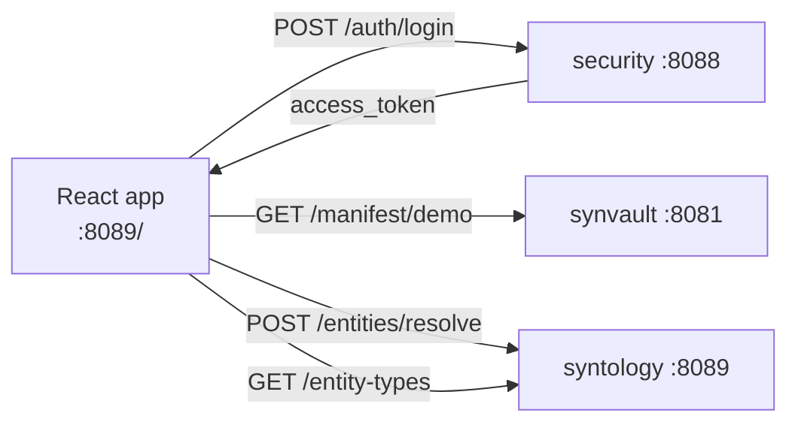

# 08 - syntology-admin (UI) - Phase 2 - Corpus Browser + Auth

**Version:** 1.0
**Date:** 2026-07-21
**Status:** Draft for review
**Depends on:** [07-syntology.md](./07-syntology.md) (Phase 2 DoD - `POST /entities/resolve` and `GET /entity-types` available). [05-security.md](./05-security.md) (Phase 2 DoD - JWT issuance available for login). [04-synapt.md](./04-synapt.md) (Phase 2 - synapt returns `meta.trace_id` in responses).
**Scope:** Add a login screen (JWT-based), a corpus browser view (manifest rows + Pass-2 entities per document), and keep the existing ontology admin views. No general Synanton chat/search UI - that is Phase 4 or later. No multi-tenant UI - demo tenant only.

---

## 1. Context and Document Alignment

| Source | Role |
|--------|------|
| [synanton-design-1.19.md §46a Future UI Addenda](../../architecture/synanton-design-1.19.md) | Production target - general search UI, CSP Trusted Types, no inline styles, `<SafeHtml />` wrapper. Phase 2 adds a **corpus browser view** and **login screen** only. CSP `enforce` mode and the search UI are Phase 4. |
| [standalone-syntology-demo.md](../demo/standalone-syntology-demo.md) | Foundation - the standalone track ships the ontology admin UI (React embedded in the syntology Spring Boot JAR on `:8089`). Phase 2 extends that same React app. |
| [07-syntology.md](./07-syntology.md) | API source for entity type data; corpus browser also displays resolution results. |
| [05-security.md](./05-security.md) | Auth source - login form calls `POST security:8088/auth/login`, stores the JWT in memory. |

**Explicit non-goals for Phase 2:**

- No general search UI (natural-language query → hits + answer) - Phase 4.
- No CSP `enforce` mode or Trusted Types - Phase 4.
- No `<SafeHtml />` wrapper - Phase 4 (DOMPurify integration deferred).
- No multi-tenant tenant switcher - Phase 3.
- No dark mode, no accessibility audit - not scheduled.
- No real-time updates (WebSocket) - Phase 5+.

---

## 2. Phase 2 in One Sentence

> Add a login screen that stores a JWT in React state (never localStorage), and a corpus browser tab showing manifest rows with their state, enrichment model, and resolved Pass-2 entities - so operators can visually verify the Phase 2 ingestion output.

---

## 3. Target Architecture



**Deployment.** Same React app embedded in the syntology Spring Boot JAR (served as static assets from `:8089/`). No new containers. The app makes direct browser-to-service API calls (all services must have CORS configured for `http://localhost:8089`).

---

## 4. UI Feature Inventory (Phase 2)

### 4.1 Login screen

A simple login form (`/login` route):
- Fields: `username`, `password`.
- On submit: `POST security:8088/auth/login → {access_token, expires_in}`.
- On success: store `access_token` in React context (in-memory state; **never** `localStorage` or `sessionStorage`, per §48b UI Security Guidelines).
- On failure: show inline error `"Invalid credentials. Please try again."`.
- All subsequent API calls include `Authorization: Bearer <access_token>` header.
- Auto-redirect to `/login` when the token is absent or expired (401 response from any API).

### 4.2 Corpus browser tab

A new tab `"Corpus"` in the existing navigation bar. Displays a paginated table of manifest rows fetched from `GET synvault:8081/manifest/demo`.

**Table columns:**
| Column | Source |
|--------|--------|
| Content Ref ID | `manifest.content_ref_id` |
| Source URI | `manifest.source_uri` (truncated + tooltip) |
| State | `manifest.state` (badge: CHUNKED=yellow, ENRICHED=orange, EMBEDDED=green) |
| Enrichment Model | `manifest.enrichment_model_id` |
| Embedding Quality | `manifest.embedding_quality` |
| Updated | `manifest.updated_at` (relative time) |

**Row expansion:** clicking a row opens an inline panel showing:
- A list of Pass-2 typed entities (fetched from `POST syntology:8089/entities/resolve` using the entities from the document's `analysis_cache`, which are first fetched from `GET synvault:8081/manifest/demo/{ref}/analysis`).
- Entity columns: `label`, `canonical_type` (coloured badge if `known=true`; grey if `known=false`), `confidence` (progress bar).
- A count `{N known / M total entities}`.

**Pagination:** client-side over the full manifest list (paginated at 20 rows per page). Synvault Phase 2 returns all manifest rows; server-side pagination is Phase 3.

### 4.3 Entity types reference tab

A new tab `"Ontology Types"` showing the output of `GET syntology:8089/entity-types` in a sortable table: type ID, description, confidence floor. This gives operators visibility into what types the resolution step recognises.

---

## 5. Module Boundaries (delta from standalone track)

**New / changed in the React app (served from `syntology/src/main/resources/static/`):**
- `LoginPage` component + `/login` route.
- `AuthContext` - React context storing `{token, subject_id, tenant_id, expires_at}`. Clears on logout or 401.
- `useAuth` hook - returns the current token and an `isAuthenticated` boolean.
- `apiClient` utility - wraps `fetch`, injects `Authorization: Bearer <token>`, handles 401 (clears auth context, redirects to `/login`).
- `CorpusBrowser` component - manifest table with row expansion.
- `EntityPanel` sub-component - entity list within a row expansion.
- `OntologyTypesTable` component - canonical type reference.
- CORS configuration added to `syntology`, `synvault`, and `security` Spring Boot services (allow `http://localhost:8089`).

**Unchanged:**
- All existing ontology admin views (ontology list, entity type editor, relation type editor).
- syntology Spring Boot JAR structure - static assets continue to be served from `/`.

---

## 6. Prerequisites

| # | Prereq | Home | Notes |
|---|--------|------|-------|
| P1 | Standalone syntology track DoD met - existing React app builds and serves from `:8089/`. | standalone track | Non-negotiable. |
| P2 | Security Phase 2 DoD met - `POST /auth/login` returns `access_token`. | [05-security.md](./05-security.md) | Blocking for login screen. |
| P3 | Syntology Phase 2 DoD met - `POST /entities/resolve` and `GET /entity-types` available. | [07-syntology.md](./07-syntology.md) | Blocking for corpus browser entity panel and types tab. |
| P4 | Synvault exposes `GET /manifest/demo/{ref}/analysis` returning Pass-2 analysis JSON for a single content ref. | synvault (minor extension) | Tracked as `SA2-EXT-1` below. |
| P5 | CORS configured on security, synvault, syntology for `http://localhost:8089`. | Each service | One `@Bean CorsConfigurationSource` per service. |

**SA2-EXT-1 (synvault minor extension):** Add `GET /manifest/{tenant}/{ref}/analysis` returning the Pass-2 `analysis_json` from `analysis_cache` for that document. This is a read-only Cassandra query through the `ingestion-cache` DAO. One new controller method in `synvault`.

---

## 7. Task Breakdown

Ordered by dependency. Each task ≤ 1-2 days.

| # | Task | Deliverable |
|---|------|-------------|
| UI2-1 | Add CORS `@Bean` to syntology, synvault, security Spring Boot services (`allowedOrigins: http://localhost:8089, allowedMethods: GET,POST, allowedHeaders: Authorization,Content-Type`). | CORS beans + integration test per service |
| UI2-2 | **synvault extension (SA2-EXT-1)**: add `GET /manifest/{tenant}/{ref}/analysis` reading `analysis_cache` pass=2 rows via `IngestionCacheClient`. Returns `{content_ref_id, typed_entities[], relations[]}`. | New endpoint + test |
| UI2-3 | Implement `AuthContext` + `useAuth` hook. Store token in React state (component-level, not module-level global, to survive hot-reload cleanly). | Context + hook + unit test (React Testing Library) |
| UI2-4 | Implement `apiClient` utility: wraps `fetch`, injects `Authorization`, intercepts 401 → calls `AuthContext.logout()` + `navigate("/login")`. | Utility + tests |
| UI2-5 | Implement `LoginPage`: form, submit handler calling `POST security:8088/auth/login`, success/failure states, redirect to `/` on success. | Component + test |
| UI2-6 | Add `/login` route to the React Router config. Wrap all other routes in `<RequireAuth>` HOC that redirects to `/login` if `!isAuthenticated`. | Route config change + test |
| UI2-7 | Implement `CorpusBrowser` component: fetch `GET synvault:8081/manifest/demo` (with auth header), display paginated table with state badges. Loading skeleton, empty state, error state. | Component + test |
| UI2-8 | Implement `EntityPanel` sub-component: fetch `GET synvault:8081/manifest/demo/{ref}/analysis`, then call `POST syntology:8089/entities/resolve`, display entity list with known/unknown badges and confidence bars. | Component + test |
| UI2-9 | Implement `OntologyTypesTable` component: fetch `GET syntology:8089/entity-types`, display sortable table. | Component + test |
| UI2-10 | Add `"Corpus"` and `"Ontology Types"` tabs to the navigation bar. Route to `CorpusBrowser` and `OntologyTypesTable`. | Nav change |
| UI2-11 | E2E browser test (Playwright or Cypress): (a) login as `alice` → redirected to `/`; (b) navigate to Corpus tab → manifest table loads; (c) expand a row → entities shown with canonical types; (d) navigate to Ontology Types → types table loads; (e) logout (if logout button added) → redirected to `/login`. | E2E test file |
| UI2-12 | Build integration: `./gradlew :java:syntology:bootJar` must include the updated React build. Update the React build step in the syntology Gradle module. | Gradle task + CI verification |

---

## 8. Data Flow

For an operator opening the corpus browser after Phase 2 ingestion:

1. Browser navigates to `http://localhost:8089/`. `RequireAuth` checks `isAuthenticated=false` → redirects to `/login`.
2. `LoginPage`: operator enters `alice / demo-password-1` → `POST http://localhost:8088/auth/login` → `{access_token: "eyJ..."}`. `AuthContext` stores token. Redirect to `/`.
3. Operator clicks `"Corpus"` tab. `CorpusBrowser` mounts → `GET http://localhost:8081/manifest/demo` (with `Authorization: Bearer eyJ...`) → array of 10 manifest rows.
4. Table renders 10 rows. `contract.pdf` shows state badge `EMBEDDED` (green), `enrichment_model_id=llama-3.1-8b-instruct`.
5. Operator clicks row for `contract.pdf`. `EntityPanel` mounts → `GET /manifest/demo/{ref}/analysis` → `{typed_entities: [{label:"Acme Corp", type:"ORGANIZATION", confidence:0.88}, ...]}`.
6. `EntityPanel` → `POST /entities/resolve` → `[{canonical_type:"Organization", known:true, confidence_floor:0.75}, ...]`.
7. Panel shows: `Acme Corp - Organization (confidence 88%)` in green, `J. Smith - Person (confidence 71%)` in yellow (below `confidence_floor=0.80`), with a note `"1 entity below confidence floor"`.

---

## 9. Security Considerations for the UI

Following §48b UI Security Guidelines:

- **Token storage:** `access_token` stored in React state only (`AuthContext` in-memory). **Never** `localStorage`/`sessionStorage`. Token is lost on page refresh - the operator must re-login. This is a deliberate trade-off for Phase 2 security posture; Phase 3 may introduce HttpOnly refresh cookies.
- **XSS:** No `dangerouslySetInnerHTML` in Phase 2 UI. All entity labels and source URIs are rendered as text nodes (React default escaping). If entity labels need to contain HTML in a future phase, they must be sanitised with DOMPurify before rendering.
- **External links:** source URIs rendered as `<a href={uri} target="_blank" rel="noopener noreferrer">`. URL scheme validation: only `http://` and `https://` URIs rendered as links; others rendered as plain text.
- **CORS:** restricted to `http://localhost:8089` - tight enough for the Phase 2 dev environment.

---

## 10. Configuration Surface (Phase 2 delta)

In each Spring Boot service (syntology, synvault, security), add:

```yaml
cors:
  allowed-origins: ["http://localhost:8089"]
  allowed-methods: ["GET", "POST", "OPTIONS"]
  allowed-headers: ["Authorization", "Content-Type"]
  max-age: 3600
```

In the React app (`syntology/ui/.env.development`):
```
REACT_APP_SECURITY_BASE_URL=http://localhost:8088
REACT_APP_SYNVAULT_BASE_URL=http://localhost:8081
REACT_APP_SYNTOLOGY_BASE_URL=http://localhost:8089
```

---

## 11. Testing Strategy

- **Unit tests (React Testing Library)** - `AuthContext`: token set/clear. `apiClient`: 401 response triggers logout. `LoginPage`: form submission with success and failure mocked. `CorpusBrowser`: correct table render from mocked API response, loading/error states. `EntityPanel`: entity resolution with known and unknown types. `OntologyTypesTable`: render from mocked type list.
- **E2E (Playwright)** - five scenarios from UI2-11.
- **Security regression** - assert no `localStorage.setItem` calls in the auth flow (can be checked via Playwright `page.evaluate(() => Object.keys(localStorage))`).
- **CORS verification** - browser E2E test confirms cross-origin requests to security/synvault succeed without CORS errors in the console.

---

## 12. Risks and Open Questions

| Risk | Mitigation |
|------|------------|
| Token lost on page refresh - operator must re-login. | Documented and accepted for Phase 2. Phase 3 introduces HttpOnly refresh cookies for persistent sessions. |
| Entity panel makes two sequential API calls (manifest → analysis, then resolve) - may be slow. | Both calls are fast (Cassandra read + in-memory trie). Combined p95 < 200 ms expected. No pre-fetching needed in Phase 2. |
| Source URIs from ingestion may contain unusual schemes. | URL scheme allow-list (`http:`, `https:`) renders dangerous URIs as plain text. No XSS risk. |
| CORS `allowedOrigins: localhost:8089` blocks testing from different ports. | Test profile overrides to `*` if needed; production restricts tightly. Documented. |
| React build not included in the syntology JAR if the Gradle task is misconfigured. | CI runs `./gradlew :java:syntology:bootJar` and asserts the JAR contains `static/index.html` (UI2-12). |

---

## 13. Definition of Done (Phase 2)

Phase 2 is complete when **all** of the following hold with security, syntology, and synvault Phase 2 DoDs met:

1. Navigating to `http://localhost:8089/` redirects to `/login` when unauthenticated.
2. Login as `alice` / `demo-password-1` → authenticated, redirected to the main view.
3. Corpus tab shows manifest rows with correct state badges after Phase 2 ingestion.
4. Expanding a row shows Pass-2 entities with `canonical_type` badges (Organisation, Person, etc.) and a confidence bar.
5. `"1 entity below confidence floor"` note appears when an entity's confidence is below the floor.
6. Ontology Types tab shows all types from `base-v1.json`.
7. No `localStorage.setItem` calls found in the Playwright E2E session (security assertion).
8. All Playwright E2E scenarios (UI2-11) pass.
9. `./gradlew :java:syntology:bootJar` produces a JAR containing `static/index.html`.
10. Phase 1 (standalone track) ontology admin views remain functional after the Phase 2 additions.

---

## 14. Follow-on Phases (Signposted)

- **Phase 3 (syntology-admin UI)** - Auth screen gains "stay logged in" via HttpOnly refresh cookies. Multi-tenant tenant switcher. Still ontology-focused.
- **Phase 4 (syntology-admin UI)** - CSP `enforce` mode (Trusted Types, no inline styles). `<SafeHtml />` wrapper backed by DOMPurify for any rich-text fields. First version of the general Synanton search UI (natural-language search → hits + answer).
- **Phase 5 (syntology-admin UI)** - UI stable after Phase 4; chat UI iterates independently.
