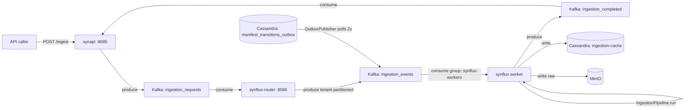

# 01 - Ingestion Pipeline - Phase 3 - Kafka Outbox, Router, Worker Consumer

**Version:** 1.0
**Date:** 2026-07-24
**Status:** Draft for review
**Depends on:** `01-ingestion-pipeline` Phase 2 DoD met (`state=EMBEDDED`, real embeddings)
**Scope:** Wire Kafka into the ingestion path. Add `synflux-router` (new service). Move `synflux` to Kafka worker mode. Extend `shared/common` with `RequestContext` and Kafka client factory. Add Anthropic direct translator to `synanton-llm-client`.

---

## 1. Context and Document Alignment

| Source | Role in this plan |
|--------|-------------------|
| [synanton-design-1.19.md](../../architecture/platform/synanton-design-1.19.md) §17 `synflux` (worker mode, Kafka consumer), §27c `synanton-llm-client` (provider negotiation, second translator), §32 `synflux-router` (partition-by-tenant routing) | Production target. Phase 3 implements the Kafka worker path and router; the inline fallback remains. |
| [01-ingestion-pipeline Phase 2](../phase2/01-ingestion-pipeline.md) | Foundation. `EnrichStage`, `EmbedStage`, and `IngestionPipeline.run()` are reused unchanged as the worker execution surface. |
| [06-security Phase 3](./06-security.md) | `RequestContext` populated from JWT/API-key by `TenantContextFilter`; passed into Kafka message headers. |

**Explicit non-goals for Phase 3:**

- No multi-broker Kafka - single broker, KRaft mode, no replication factor > 1.
- No schema registry (Avro/Protobuf) - messages are JSON over Kafka with a shared `IngestJobRequest` schema validated at send/receive time.
- No cross-region Kafka - Phase 5.
- No dynamic partition rebalancing - static 4 partitions per topic.
- No DLQ (dead-letter queue) - failed jobs log and are retried via manual `/ingest/run` fallback; DLQ is Phase 4.
- `synflux-router` does not yet auto-scale workers - Phase 4.

---

## 2. Phase 3 in One Sentence

> Replace the inline `POST /ingest/run` path with a Kafka-backed pipeline: `synapt POST /ingest` enqueues to `ingestion_requests`, `synflux-router` partitions by tenant into `ingestion_events`, and `synflux` worker consumers execute the existing `IngestionPipeline.run()` - making the ingestion path decoupled, observable, and horizontally scalable.

---

## 3. Target Architecture



**Deployment model.** New containers in Phase 3:
- `kafka` - Apache Kafka 3.7 in KRaft mode, single broker, port 9092.
- `synflux-router` - new Spring Boot service, port 8086.
- `synflux` starts with both `@RestController` (manual fallback) and `KafkaIngestConsumer` active.

---

## 4. Data Contracts

### 4.1 `IngestJobRequest` (Kafka message, JSON)
```json
{
  "tenantId": "demo",
  "manifestId": "3fa85f64-5717-4562-b3fc-2c963f66afa6",
  "jobId": "7c9e6679-7425-40de-944b-e07fc1f90ae7",
  "priority": 5,
  "traceId": "b7e2a1c3-dead-beef-0000-aabbccddeeff"
}
```

### 4.2 `IngestJobResult` (Kafka message, `ingestion_completed` topic)
```json
{
  "jobId": "7c9e6679-7425-40de-944b-e07fc1f90ae7",
  "tenantId": "demo",
  "state": "EMBEDDED",
  "entityCount": 42,
  "embeddingCount": 17,
  "durationMs": 8340,
  "errorMessage": null
}
```

### 4.3 `POST /ingest` response (synapt → caller)
```json
{
  "job_id": "7c9e6679-7425-40de-944b-e07fc1f90ae7",
  "status": "QUEUED",
  "manifest_id": "3fa85f64-5717-4562-b3fc-2c963f66afa6",
  "estimated_wait_seconds": 15
}
```

### 4.4 `GET /router/status` response
```json
{
  "topics": {
    "ingestion_requests": { "partitions": 4, "consumer_lag": 3 },
    "ingestion_events": { "partitions": 4, "consumer_lag": 7 }
  },
  "paused_tenants": ["demo2"]
}
```

---

## 5. Implementation Design

### 5.1 `shared/common` - EXT additions

**`KafkaClientConfig`** - a Spring `@Configuration` class that creates a `KafkaProducer<String, String>` bean and a `KafkaConsumer<String, String>` factory bean. Uses `org.apache.kafka:kafka-clients` (native, no Spring Kafka dependency). Config keys: `kafka.bootstrap-servers`, `kafka.producer.acks=all`, `kafka.producer.linger-ms=5`, `kafka.consumer.auto-offset-reset=earliest`, `kafka.consumer.enable-auto-commit=false`. Commit is manual after successful processing.

**`RequestContext`** - a Java `record(String tenantId, String userId, String traceId)`. `RequestContextHolder` stores it in a `ThreadLocal<RequestContext>`. Cleared in a finally block after each request.

**`TenantContextFilter`** - a `OncePerRequestFilter` that extracts `tenantId` from the validated `SubjectAssertion` (stored in `SecurityContext`) and `traceId` from the `X-Trace-Id` header (or generates one if absent). Sets both into `RequestContextHolder` and into MDC keys `tenant_id`, `trace_id`, `user_id`.

**`TraceIdFilter`** - ordered before `TenantContextFilter`. Reads or generates `X-Trace-Id` UUID, stores it in the response header.

### 5.2 `ingestion-cache` - EXT: Kafka outbox table

Cassandra migration `V2_1__kafka_outbox.cql`:
```cql
CREATE TABLE ingestion_cache.manifest_transitions_outbox (
  tenant_id   text,
  event_id    timeuuid,
  manifest_id uuid,
  transition_from text,
  transition_to   text,
  topic       text,
  published   boolean,
  created_at  timestamp,
  PRIMARY KEY ((tenant_id), event_id)
) WITH CLUSTERING ORDER BY (event_id DESC);
```

**`OutboxPublisher`** - a `@Component` that runs on a `ScheduledExecutorService` (single thread) every 2 seconds. Queries `manifest_transitions_outbox WHERE published=false LIMIT 100`, publishes each row to `KafkaProducer` with topic from the row, then sets `published=true`. Uses `KafkaProducer.flush()` before marking. On producer exception, logs and skips - the next poll will retry (at-least-once).

### 5.3 `synflux` - EXT: worker mode

**`KafkaIngestConsumer`** - a `@Component` holding a `KafkaConsumer` subscribed to `ingestion_events`, consumer group `synflux-workers`. Poll loop runs on a dedicated thread from `synflux.kafka.consumer-threads` (default 2). For each record:
1. Deserialise JSON → `IngestJobRequest`.
2. Set `RequestContextHolder` from message headers (`tenant_id`, `trace_id`).
3. Dispatch to `IngestionPipeline.run(job)` - the Phase 2 pipeline unchanged.
4. On success: produce `IngestJobResult` to `ingestion_completed` topic; commit offset.
5. On exception: log, do not commit (message will be re-delivered up to `synflux.kafka.max-retries=3` times via a simple retry counter in a local map; after max-retries, commit and mark job `FAILED`).

New job states: `QUEUED` (written by `POST /ingest` before enqueue), `PROCESSING` (written by consumer on receive), `EMBEDDED` (terminal success, same as Phase 2), `FAILED` (terminal failure).

**`POST /ingest/run`** (manual fallback) - unchanged endpoint but now also writes an outbox row to `manifest_transitions_outbox` before invoking inline, so the state transitions are always tracked.

**Metrics:** `synflux_consumer_lag{topic, partition}` - updated every 30 s from `KafkaConsumer.metrics()` and exposed via `MicrometerKafkaMetricsBinder`.

### 5.4 `synflux-router` - NEW (first real implementation)

Port 8086. Stateless Spring Boot service. No persistent store - relies entirely on Kafka consumer offsets.

**Consumer:** subscribes to `ingestion_requests` (group `synflux-router`). Routes each `IngestJobRequest` to `ingestion_events` with partition key = `tenantId` (Kafka default `StringSerializer` with `tenantId` as the Kafka message key ensures all messages for a tenant land on the same partition - round-robin across workers on the consumer side within that partition).

**Pause/resume:** `POST /router/pause/{tenantId}` - adds `tenantId` to an in-memory `Set<String> pausedTenants`. Consumer loop skips producing to `ingestion_events` for paused tenants (messages are still consumed from `ingestion_requests` and held in a local queue of max 1000 items; backpressure applied via `KafkaConsumer.pause(partition)` when queue is full).

**Admin REST:**
- `GET /router/status` - returns lag per partition for both watched topics.
- `POST /router/pause/{tenantId}` → 200 OK.
- `POST /router/resume/{tenantId}` → 200 OK + drains the local queue.

**Resilience:** if `ingestion_events` producer throws, the router retries 3× with 100 ms backoff, then skips the message and emits metric `synflux_router_drop_total{tenant}`.

### 5.5 `synanton-llm-client` - EXT: Anthropic direct translator

**`AnthropicDirectTranslator`** - implements `LlmProviderTranslator`. Maps `LlmRequest` → Anthropic Messages API body: `{ model, max_tokens, messages: [{role, content}] }`. Response mapping: `content[0].text` → `LlmResponse.text`. Streaming is `false` only in Phase 3 (streaming SSE is Phase 4). Handles Anthropic-specific error codes: `529 Overloaded` → retryable; `400 invalid_request_error` → not retryable.

**`LlmClientFactory`** - selects translator at startup based on `llm.provider` config value: `openai-compat` (default), `anthropic-direct`, or `bedrock` (stub, throws `UnsupportedOperationException` in Phase 3). Resolves to a single `LlmClient` instance injected into callers.

**Unit tests:** `AnthropicTranslatorTest` - verifies JSON serialisation of a `LlmRequest` to the Anthropic body schema, and deserialisation of a canned Anthropic response. Uses `JsonSchema` validation against the published Anthropic Messages API schema.

---

## 6. Module Boundaries

| Module | Owns in Phase 3 | Does not own |
|--------|----------------|--------------|
| `shared/common` | `KafkaClientConfig`, `RequestContext`, `RequestContextHolder`, `TenantContextFilter`, `TraceIdFilter` | Kafka topic management, consumer group logic |
| `ingestion-cache` | `manifest_transitions_outbox` table, `OutboxPublisher` | Kafka producer (uses `shared/common` bean) |
| `synflux` | `KafkaIngestConsumer`, new job states, `POST /ingest/run` outbox integration | Router logic, topic creation |
| `synflux-router` | `ingestion_requests` consumer, `ingestion_events` producer, pause/resume, admin REST | Execution of ingestion jobs |
| `synanton-llm-client` | `AnthropicDirectTranslator`, `LlmClientFactory` provider selection | Bedrock or Vertex translators (Phase 5) |

---

## 7. Prerequisites

| # | Prereq | Home | Notes |
|---|--------|------|-------|
| 1 | Phase 2 ingestion pipeline DoD met (`state=EMBEDDED` end-to-end). | - | Non-negotiable. |
| 2 | Kafka 3.7 KRaft available via `docker compose --profile phase3`. | `deployment/docker/compose.yaml` | Add `kafka` service with KRaft config; no ZooKeeper. |
| 3 | `shared/common` module exists and is in `settings.gradle.kts`. | root | Phase 2 assumes it; Phase 3 extends it. |
| 4 | `security` Phase 3 deployed - `TenantContextFilter` depends on `SubjectAssertion` from the security JWT/API-key resolution chain. | `security` | Can be stubbed for integration tests. |
| 5 | Topics pre-created: `ingestion_requests` (4p, RF=1), `ingestion_events` (4p, RF=1), `ingestion_completed` (4p, RF=1). | Kafka init script | `scripts/kafka-init.sh` creates topics on first run. |

---

## 8. Task Breakdown

| # | Task | Deliverable | Est. |
|---|------|-------------|------|
| IP3-1 | Add `kafka-clients` dep to `shared/common`; implement `KafkaClientConfig` beans (producer + consumer factory). | Config class + unit test | 1 day |
| IP3-2 | Implement `RequestContext` record, `RequestContextHolder`, `TenantContextFilter`, `TraceIdFilter`. | 4 classes + unit tests | 1 day |
| IP3-3 | Write Cassandra migration `V2_1__kafka_outbox.cql`; add `OutboxPublisher` + unit test (mock producer). | Migration + class | 1 day |
| IP3-4 | Implement `KafkaIngestConsumer` in `synflux`; wire into Spring lifecycle; add `QUEUED`/`PROCESSING`/`FAILED` job states. | Consumer class + state enum | 2 days |
| IP3-5 | Update `POST /ingest/run` to write outbox row; integration test (Testcontainers Kafka + Cassandra). | Endpoint change + `IngestPipelineKafkaIT` | 1 day |
| IP3-6 | Create `java/synflux-router/` Gradle module; implement consumer + router + pause/resume + admin REST. | New module (all classes) | 2 days |
| IP3-7 | Router integration test: produce to `ingestion_requests`, assert message appears on `ingestion_events` with correct partition key. | `RouterIT` (Testcontainers) | 1 day |
| IP3-8 | Implement `AnthropicDirectTranslator` + `LlmClientFactory` provider selection; unit tests. | 2 classes + tests | 1 day |
| IP3-9 | Add `kafka` service to compose; write `scripts/kafka-init.sh`; add `synflux-router` service. | Compose + scripts | 1 day |
| IP3-10 | End-to-end acceptance test: call `POST /ingest` → assert job appears as `QUEUED` → assert eventually `EMBEDDED` (poll with 30 s timeout). | `IngestionPhase3E2EIT` | 2 days |

---

## 9. Testing Strategy

- **Unit:** `OutboxPublisher` with a mock `KafkaProducer` asserting poll-then-produce-then-mark. `KafkaIngestConsumer` with a mock `IngestionPipeline`. `AnthropicDirectTranslator` JSON schema validation.
- **Integration (Testcontainers):** Kafka + Cassandra containers. `RouterIT` verifies partition routing. `IngestPipelineKafkaIT` verifies the full consumer-execute-produce loop with a tiny synthetic job.
- **E2E:** `IngestionPhase3E2EIT` starts the full compose stack (`--profile phase3`), calls `POST /ingest`, polls `GET /jobs/{id}` until `state=EMBEDDED` or timeout 60 s.
- **Pause/resume:** `RouterPauseIT` - pauses tenant, sends 5 messages, asserts none reach `ingestion_events`; resumes, asserts all 5 delivered.

---

## 10. Configuration Surface

```yaml
# synflux/src/main/resources/application-phase3.yaml
synflux:
  kafka:
    consumer-threads: 2
    max-retries: 3
    retry-backoff-ms: 500
  pipeline:
    enrichment.enabled: true
    embedding.enabled: true

# synflux-router/src/main/resources/application.yaml
synflux-router:
  kafka:
    ingestion-requests-topic: ingestion_requests
    ingestion-events-topic: ingestion_events
    pause-queue-max-size: 1000
    producer-retry-attempts: 3
    producer-retry-backoff-ms: 100
server:
  port: 8086

# shared/common (consumed by all services)
kafka:
  bootstrap-servers: kafka:9092
  producer:
    acks: all
    linger-ms: 5
    compression-type: lz4
  consumer:
    auto-offset-reset: earliest
    enable-auto-commit: false
    session-timeout-ms: 30000

# synanton-llm-client (new config key)
llm:
  provider: openai-compat   # openai-compat | anthropic-direct | bedrock
  anthropic:
    base-url: https://api.anthropic.com/v1
    api-key: ${ANTHROPIC_API_KEY}
    model: claude-3-5-haiku-20241022
    max-tokens: 1024
```

---

## 11. Risks and Open Questions

| Risk | Mitigation | Decision |
|------|------------|----------|
| Kafka cold-start race: `synflux-router` starts before topics exist. | `kafka-init.sh` runs as a compose `init` container with `depends_on: kafka`; router retries topic lookup for 60 s. | No action needed beyond init script. |
| At-least-once delivery causes duplicate job execution. | `IngestionPipeline.run()` is already idempotent (Phase 2 cache-hit check). Duplicate jobs increment `skipped_already_embedded`. | Idempotency already designed in. |
| `OutboxPublisher` Cassandra poll at 2 s adds 2 s latency to the enqueue path. | Acceptable for Phase 3 demo. Phase 4 adds a direct producer path bypassing the outbox for low-latency tenants. | Decision: 2 s outbox delay accepted in Phase 3. |
| Router pause queue overflow (>1000 messages) applies backpressure to `ingestion_requests` consumer - topic lag grows. | Expected; operator must resume or the queue drains naturally. Documented in runbook. | No structural risk. |
| Anthropic API key management in dev. | Use `ANTHROPIC_API_KEY` env var; compose reads from `.env`. Never committed. | Standard env-var practice. |

---

## 12. Definition of Done (Phase 3)

1. `docker compose --profile phase3 up -d` brings Kafka, all Phase 2 containers, and `synflux-router` to healthy state within 2 minutes.
2. `POST /synapt/ingest` (authenticated with a valid API key) returns HTTP 202 with `{ "status": "QUEUED" }`.
3. `GET /synapt/jobs/{job_id}` transitions through `QUEUED → PROCESSING → EMBEDDED` within 60 s for a 5-document corpus.
4. `synflux_consumer_lag` metric is visible in Prometheus and drops to 0 after job completion.
5. `GET /router/status` returns correct per-partition lag for both `ingestion_requests` and `ingestion_events`.
6. `POST /router/pause/demo` pauses routing; new ingest calls are held; `POST /router/resume/demo` delivers them.
7. `AnthropicDirectTranslatorTest` and `LlmClientFactoryTest` pass in CI (no GPU required).
8. Phase 2 Definition of Done remains green - no regressions on the inline fallback path.
9. `OutboxPublisher` publishes all pending rows within 4 s (two poll cycles) under integration test.
10. `TenantContextFilter` correctly isolates `tenant_id` MDC across concurrent requests (verified by concurrent-request unit test).

---

## 13. Follow-on Phases (Signposted)

- **Phase 4** - DLQ for `synflux` worker failures; dynamic partition rebalancing; `synflux-router` auto-scales worker count based on consumer lag.
- **Phase 4** - Streaming LLM responses in `synanton-llm-client` (SSE); `bedrock` translator implementation.
- **Phase 5** - Multi-broker Kafka with replication factor 3; Avro schema registry; cross-region topic mirroring.
- **Phase 5** - `OutboxPublisher` replaced with Kafka Streams-based exactly-once delivery.
