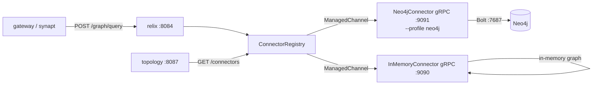

# 02 - relix - Phase 3 - gRPC Connector SPI, InMemory gRPC, Neo4jConnector

**Version:** 1.0
**Date:** 2026-07-24
**Status:** Draft for review
**Depends on:** `relix` Phase 2 DoD met; `shared/common` Phase 3 `RequestContext` available
**Scope:** Introduce the `GraphConnector` gRPC SPI. Move `InMemoryConnector` to a gRPC server. Add `Neo4jConnector` as an optional first-party gRPC connector. Wire `ConnectorRegistry` to discover connectors via static config or topology API.

---

## 1. Context and Document Alignment

| Source | Role in this plan |
|--------|-------------------|
| [synanton-design-1.19.md](../../architecture/platform/synanton-design-1.19.md) §19 `relix` (graph retrieval, connector SPI, gRPC transport), §38 Neo4j integration (optional connector) | Production target. Phase 3 implements the gRPC SPI and both first-party connectors. |
| [relix Phase 2](../phase2/) | Foundation. Phase 2 `relix` served graph queries via an in-process `InMemoryConnector` bean. Phase 3 moves that connector behind a gRPC interface without changing the query results. |
| [07-topology Phase 3](./07-topology.md) | `topology.GET /connectors` discovery endpoint consumed by `ConnectorRegistry`. |

**Explicit non-goals for Phase 3:**

- No TLS for gRPC channels - plain-text `ManagedChannel` only. mTLS is Phase 5.
- No connector health-based failover - `ConnectorRegistry` maps one channel per connector ID; failover is Phase 4.
- No streaming gRPC (`ServerStreamingRpc`) - request/response only. Streaming for large result sets is Phase 5.
- Neo4j is not added to the default compose - it is an optional profile (`--profile neo4j`). Phase 3 DoD does not require a running Neo4j.
- No Cypher injection prevention beyond parameterised queries - all queries use `$param` style.

---

## 2. Phase 3 in One Sentence

> Move `relix`'s `InMemoryConnector` from an in-process bean to a gRPC server, define the `GraphConnector` proto SPI that all connectors must implement, add `Neo4jConnector` as the second first-party connector, and wire `ConnectorRegistry` to discover connectors from static config - leaving the relix query results unchanged from Phase 2.

---

## 3. Target Architecture



**Deployment model.** `InMemoryConnector` runs as a gRPC server on port 9090 in the same JVM as relix (same Spring Boot process, different port via `grpc.server.port=9090`). In a future phase it can be split to a separate process without changing the SPI. `Neo4jConnector` is a separate deployable (`java/relix-neo4j-connector/`) started only under the `neo4j` compose profile.

---

## 4. Data Contracts

### 4.1 `graph_connector.proto`
```protobuf
syntax = "proto3";
package synanton.relix.v1;

service GraphConnector {
  rpc Query(GraphQueryRequest) returns (GraphQueryResponse);
  rpc Health(HealthRequest) returns (HealthResponse);
}

message GraphQueryRequest {
  string tenant_id  = 1;
  string query_shape = 2;   // NEIGHBORS | PATH | COMMUNITY
  map<string, string> params = 3;
}

message GraphQueryResponse {
  repeated GraphNode nodes = 1;
  repeated GraphEdge edges = 2;
  int64 latency_ms         = 3;
}

message GraphNode {
  string node_id   = 1;
  string label     = 2;
  map<string, string> properties = 3;
}

message GraphEdge {
  string from_node_id = 1;
  string to_node_id   = 2;
  string relationship = 3;
  double weight       = 4;
}

message HealthRequest {}
message HealthResponse { bool healthy = 1; string detail = 2; }
```

### 4.2 `POST /graph/query` (HTTP, relix external API)
```json
{
  "query_shape": "NEIGHBORS",
  "params": { "id": "entity:abc123" },
  "top_k": 20
}
```
Response:
```json
{
  "nodes": [{ "node_id": "entity:abc123", "label": "Product", "properties": {} }],
  "edges": [{ "from": "entity:abc123", "to": "entity:xyz789", "relationship": "RELATED_TO", "weight": 0.92 }],
  "latency_ms": 18
}
```

---

## 5. Implementation Design

### 5.1 `graph_connector.proto` and gRPC stubs

Place `graph_connector.proto` in `shared/proto/src/main/proto/`. Add a `shared/proto` Gradle module that runs `protoc` + `grpc-java` plugin to generate stubs. Both `relix` and connector implementations depend on `shared/proto`.

Use `io.grpc:grpc-netty-shaded` and `io.grpc:grpc-protobuf` - shaded Netty avoids version conflicts with Spring Boot's embedded Netty.

### 5.2 `InMemoryConnector` → gRPC server

`InMemoryConnector` currently implements an internal Java interface. Phase 3 makes it implement `GraphConnectorGrpc.GraphConnectorImplBase` instead. The query logic (adjacency maps, BFS for NEIGHBORS, Dijkstra stub for PATH, community tag lookup for COMMUNITY) is unchanged. gRPC server is started via `ServerBuilder.forPort(9090).addService(inMemoryConnector).build().start()` in a `@PostConstruct` method. Graceful shutdown in `@PreDestroy`.

Tenant isolation: `InMemoryConnector` partitions its in-memory graph by `tenant_id` from `GraphQueryRequest`. Each tenant's graph is a `Map<String, Set<Edge>>` populated on first request from `ingestion-cache` Pass-2 relation records. Refresh interval: 60 s (`@Scheduled`).

### 5.3 `ConnectorRegistry`

`ConnectorRegistry` maps `String connectorId → ManagedChannel`. Discovery strategy (evaluated in order):
1. Static config: `relix.connectors[*].{ id, address }` - always wins over topology discovery.
2. Topology discovery: `GET /topology/connectors` - returns `[{ id, address }]`. Polled every 60 s.

Channel creation: `ManagedChannelBuilder.forTarget(address).usePlaintext().build()`. Channels are cached; a `ConnectorRegistry.refresh()` method closes stale channels and opens new ones on config change.

`ConnectorRegistry` exposes `GraphConnectorGrpc.GraphConnectorBlockingStub getStub(String connectorId, String tenantId)` - callers pass `tenantId` for future per-tenant connector selection.

### 5.4 `Neo4jConnector` - new module

Module: `java/relix-neo4j-connector/`. Implements `GraphConnectorGrpc.GraphConnectorImplBase`. Uses the Neo4j Java Driver (`org.neo4j.driver:neo4j-java-driver`). Port 9091.

**Query dispatch by `query_shape`:**

`NEIGHBORS`: executes `MATCH (n {entity_id: $id})-[r]-(m) RETURN n, r, m LIMIT 100` with param `id = params["id"]`.

`PATH`: executes `MATCH p = shortestPath((a {entity_id: $from})-[*..6]-(b {entity_id: $to})) RETURN p` with params `from` and `to`.

`COMMUNITY`: executes `MATCH (n {community_id: $cid}) RETURN n LIMIT 200` with param `cid = params["community_id"]`.

All queries are parameterised - no string interpolation. Tenant isolation is enforced by adding `AND n.tenant_id = $tenant_id` to every MATCH clause.

**Result mapping:** Neo4j `Node` → `GraphNode` (copy node ID, labels[0], properties as strings). Neo4j `Relationship` → `GraphEdge`.

**Configuration:**
```yaml
neo4j:
  uri: bolt://neo4j:7687
  username: neo4j
  password: ${NEO4J_PASSWORD}
  connection-timeout-ms: 3000
  max-connection-pool-size: 10
grpc:
  server:
    port: 9091
```

### 5.5 `relix` changes - connector dispatch

`RelixQueryService` (Phase 2) called the in-process connector directly. Phase 3 replaces that call with `ConnectorRegistry.getStub(connectorId, tenantId).query(request)`. The connector ID is resolved from the request's tenant policy or falls back to `"in-memory"` (the default connector for all tenants in Phase 3).

Timeout per gRPC call: `relix.connector.timeout-ms=5000` (configurable). On `StatusRuntimeException(DEADLINE_EXCEEDED)`, `RelixQueryService` returns an empty `GraphQueryResponse` and emits metric `relix_connector_timeout_total{connector_id}`.

---

## 6. Module Boundaries

| Module | Owns in Phase 3 | Does not own |
|--------|----------------|--------------|
| `shared/proto` | `graph_connector.proto`, generated gRPC stubs | Business logic |
| `relix` | `ConnectorRegistry`, `RelixQueryService` (gRPC dispatch), HTTP `POST /graph/query` | Connector implementations |
| `InMemoryConnector` (inside `relix` JAR, port 9090) | In-memory graph, gRPC server startup, NEIGHBORS/PATH/COMMUNITY logic | Persistence |
| `relix-neo4j-connector` | Neo4j gRPC server, Bolt queries | Graph storage (Neo4j owns that) |

---

## 7. Prerequisites

| # | Prereq | Home | Notes |
|---|--------|------|-------|
| 1 | `relix` Phase 2 DoD met - `POST /graph/query` returns results in-process. | - | Non-negotiable. |
| 2 | `shared/proto` Gradle module added; `protoc` + `grpc-java` plugin configured. | root `settings.gradle.kts` | One-time module setup. |
| 3 | `io.grpc:grpc-netty-shaded:1.63.0` and related deps added to BOM. | `gradle/libs.versions.toml` | Pin version to avoid Netty conflicts. |
| 4 | `topology Phase 3` `GET /topology/connectors` endpoint available - or static config fallback used. | topology | Static config is the Phase 3 default; topology discovery is a Phase 3 bonus if topology lands first. |
| 5 | Neo4j compose profile defined (`--profile neo4j`) even though it is not required for DoD. | `deployment/docker/compose.yaml` | Needed for optional integration tests. |

---

## 8. Task Breakdown

| # | Task | Deliverable | Est. |
|---|------|-------------|------|
| RX3-1 | Create `shared/proto` Gradle module; write `graph_connector.proto`; generate stubs. | Module + generated code | 1 day |
| RX3-2 | Refactor `InMemoryConnector` to extend `GraphConnectorGrpc.GraphConnectorImplBase`; start gRPC server on port 9090 in `@PostConstruct`. | Refactored class | 1 day |
| RX3-3 | Implement `ConnectorRegistry` with static config + topology polling; unit test with mock channels. | Class + tests | 1 day |
| RX3-4 | Update `RelixQueryService` to dispatch via `ConnectorRegistry.getStub()` instead of in-process bean. | Service update + unit tests | 0.5 day |
| RX3-5 | Integration test: `InMemoryConnectorGrpcIT` - gRPC client calls port 9090, asserts NEIGHBORS returns the same results as Phase 2 in-process test. | `InMemoryConnectorGrpcIT` | 1 day |
| RX3-6 | Create `java/relix-neo4j-connector/` Gradle module; implement Neo4j gRPC server; wire all three query shapes. | New module | 2 days |
| RX3-7 | Neo4j integration test: `Neo4jConnectorIT` (Testcontainers Neo4j) - seed graph, call NEIGHBORS, PATH, COMMUNITY, assert non-empty results. | `Neo4jConnectorIT` | 1 day |
| RX3-8 | Add `neo4j` compose profile to `deployment/docker/compose.yaml` with `relix-neo4j-connector` and `neo4j` services. | Compose addition | 0.5 day |
| RX3-9 | Add `relix_connector_timeout_total` and `relix_connector_call_duration_seconds` Prometheus metrics. | Metrics + Grafana dashboard stub | 0.5 day |

---

## 9. Testing Strategy

- **Unit:** `ConnectorRegistry` with mock `ManagedChannel` and mock topology response. `RelixQueryService` with a mock stub asserting correct `tenant_id` propagation.
- **Integration:** `InMemoryConnectorGrpcIT` using Testcontainers to spin the full Spring Boot context with port 9090 exposed. `Neo4jConnectorIT` using Testcontainers Neo4j 5.x.
- **Contract:** `GraphConnectorContractTest` - a shared test that runs both `InMemoryConnector` and `Neo4jConnector` through the same set of NEIGHBORS/PATH/COMMUNITY assertions. Both must satisfy the contract.
- **Regression:** Phase 2 `RelixQueryServiceTest` is re-run against the gRPC path; assertions on result content are unchanged.

---

## 10. Configuration Surface

```yaml
# relix/src/main/resources/application-phase3.yaml
relix:
  connectors:
    - id: in-memory
      address: localhost:9090
  connector:
    timeout-ms: 5000
    default-connector-id: in-memory
  topology-discovery:
    enabled: false   # set true to poll topology for connectors
    url: http://topology:8087/topology/connectors
    refresh-interval-s: 60

grpc:
  server:
    port: 9090   # InMemoryConnector gRPC server (same JVM)
```

---

## 11. Risks and Open Questions

| Risk | Mitigation | Decision |
|------|------------|----------|
| gRPC port 9090 collision if the same JVM runs another gRPC server in future. | Port is configurable via `grpc.server.port`. Phase 3 is a single gRPC server per process. | Accepted - revisit if a second in-process gRPC service is added. |
| Protobuf generated code checked into source vs. generated at build time. | Generated code is in `build/generated/` - never committed. CI runs `./gradlew generateProto` before compile. | Build-time generation. |
| Neo4j community edition does not support RBAC - tenant isolation relies on `tenant_id` property filter. | Acceptable for Phase 3 demo. Phase 5 uses Neo4j Enterprise RBAC or separate databases per tenant. | Documented limitation. |
| `InMemoryConnector` graph refresh (60 s) means new ingested relations are stale for up to 60 s. | Expected - documented as eventual consistency. Phase 4 adds a Kafka event to trigger immediate refresh. | Accepted for Phase 3. |

---

## 12. Definition of Done (Phase 3)

1. `POST /relix/graph/query` with `query_shape=NEIGHBORS` returns the same result as Phase 2 - verified by a diff test against Phase 2 canned output.
2. `InMemoryConnector` runs as a gRPC server on port 9090; `curl` or `grpcurl` against it returns a valid `GraphQueryResponse`.
3. `ConnectorRegistry` resolves `in-memory` from static config and creates a `ManagedChannel` to port 9090.
4. `InMemoryConnectorGrpcIT` passes in CI.
5. `Neo4jConnectorIT` passes when `--tests *Neo4jConnectorIT -Pneo4j=true` flag is set (Testcontainers Neo4j).
6. `relix_connector_call_duration_seconds` histogram appears in Prometheus.
7. Phase 2 relix regression test suite passes unchanged.
8. `graph_connector.proto` is the sole source of truth for the connector interface - no parallel in-process Java interface remains.

---

## 13. Follow-on Phases (Signposted)

- **Phase 4** - `ConnectorRegistry` health-based failover: if the active connector returns `Health.healthy=false`, switch to a standby connector.
- **Phase 4** - Kafka event triggers immediate `InMemoryConnector` graph refresh when Pass-2 entities are ingested.
- **Phase 5** - mTLS for gRPC channels; Neo4j Enterprise RBAC for multi-tenant isolation.
- **Phase 5** - Streaming gRPC (`ServerStreamingRpc`) for large community result sets.
- **Phase 5** - Third-party connector support: external teams implement `GraphConnectorGrpc.GraphConnectorImplBase` and register via topology API.
