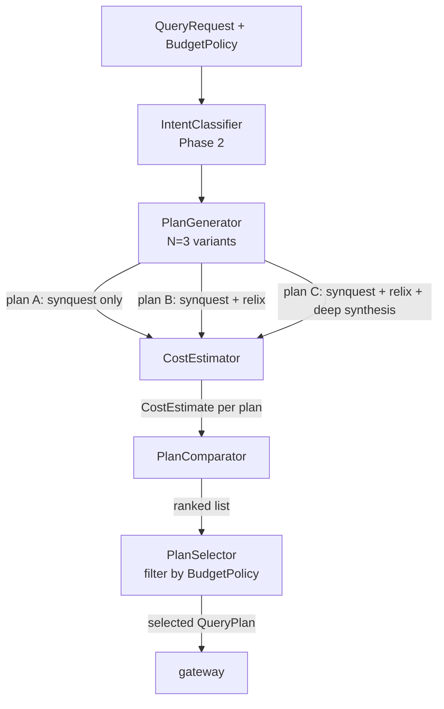

# 03 - planner - Phase 3 - Cost Estimation, Multi-Plan Generation, Cheapest-Plan Selection

**Version:** 1.0
**Date:** 2026-07-24
**Status:** Draft for review
**Depends on:** `planner` Phase 2 DoD met; `topology` Phase 3 `BudgetPolicy` endpoint available; `shared/common` `RequestContext` available
**Scope:** Add cost estimation per engine, generate up to N candidate plans, select the cheapest within the caller's budget policy. No forecast or cross-region penalty (Phase 4).

---

## 1. Context and Document Alignment

| Source | Role in this plan |
|--------|-------------------|
| [synanton-design-1.19.md](../../architecture/platform/synanton-design-1.19.md) §20 `planner` (multi-plan generation, cost model, plan selector, budget policy), §35 budget enforcement (cost-per-token config, per-tenant policy) | Production target. Phase 3 implements the core cost pipeline; Phase 4 adds cross-region penalty and reinforcement tuning. |
| [planner Phase 2](../phase2/02-planner.md) | Foundation. Phase 2 emitted exactly one plan with flag-gated LLM intent classification. Phase 3 wraps plan generation in a multi-candidate loop and adds cost scoring. |
| [05-synapt Phase 3](./05-synapt.md) | `BudgetPolicy` injected into `synapt` requests and forwarded to `planner` via the `QueryRequest` context. |

**Explicit non-goals for Phase 3:**

- No cross-region latency penalty map - Phase 4.
- No reinforcement learning on plan scores - Phase 5.
- No user-visible plan explanation - Phase 4 adds `plan_rationale` field to `QueryResponse`.
- No dynamic cost model updates (costs are static config until Phase 4's ModelServingDirectory is mutable).
- `BudgetPolicy` is read-only in planner - enforcement lives in `synapt`; planner only uses it to filter plans.

---

## 2. Phase 3 in One Sentence

> Extend the planner to generate up to 3 candidate `QueryPlan` variants (varying synquest/relix inclusion and synthesis depth), score each with per-engine cost and latency estimators, and select the lowest-cost plan that fits within the caller's `BudgetPolicy`.

---

## 3. Target Architecture



**No new services.** All components are beans inside the existing `planner` Spring Boot service. `CostEstimator` implementations are injected as a `List<CostEstimator>` - one per engine type.

---

## 4. Data Contracts

### 4.1 `CostEstimate` (internal)
```json
{
  "planId": "plan-b",
  "monetaryCostUsd": 0.0003,
  "latencyMs": 180,
  "qualityScore": 0.87,
  "breakdown": {
    "synquest": { "costUsd": 0.0, "latencyMs": 50 },
    "relix":    { "costUsd": 0.0, "latencyMs": 80 },
    "vllm-synthesiser": { "costUsd": 0.0003, "latencyMs": 2000 }
  }
}
```

### 4.2 `BudgetPolicy` (injected from topology via synapt)
```json
{
  "tenantId": "demo",
  "monthlyUsdLimit": 10.00,
  "usedUsd": 4.23,
  "remainingUsd": 5.77,
  "maxLatencyMs": 5000
}
```

### 4.3 Selected plan propagated to gateway (existing `QueryPlan` structure, extended)
```json
{
  "planId": "plan-b",
  "steps": ["synquest", "relix", "fusion", "synthesise"],
  "synthesisDepth": "standard",
  "estimatedCostUsd": 0.0003,
  "estimatedLatencyMs": 180,
  "planVariantReason": "synquest+relix within budget"
}
```

---

## 5. Implementation Design

### 5.1 `CostEstimator` interface

```java
public interface CostEstimator {
    String engineId();
    CostEstimate estimate(PlanStep step, RequestContext ctx);
}
```

Three implementations registered as Spring beans:

**`VllmCostEstimator`** - `engineId() = "vllm-synthesiser"` or `"vllm-reranker"`. Reads `planner.engines.vllm.cost-per-token-usd` (default `0.000_000_3` - sub-cent per token, representing self-hosted GPU amortised cost). Latency estimated as `(inputTokens + outputTokens) / planner.engines.vllm.tokens-per-second` (default 80 tok/s for Llama 3.1 8B AWQ).

**`IndexCostEstimator`** - `engineId() = "synquest"`. Monetary cost = 0 (self-hosted). Latency = `planner.engines.synquest.latency-p99-ms` (default 50 ms). Quality contribution = 0.6 (baseline recall score; not query-adaptive in Phase 3).

**`GraphCostEstimator`** - `engineId() = "relix"`. Monetary cost = 0 (self-hosted). Latency = `planner.engines.relix.latency-p99-ms` (default 80 ms). Quality contribution = 0.3 (additive when combined with synquest).

### 5.2 `PlanGenerator` - multi-plan generation

`PlanGenerator.generate(IntentResult, BudgetPolicy) → List<QueryPlan>` produces up to `planner.max-plans` (default 3) variants:

- **Plan A** - `[synquest, fusion, synthesise]`. Cheapest. Always generated.
- **Plan B** - `[synquest, relix, fusion, synthesise]`. Generated if `BudgetPolicy.remainingUsd > 0` and `relix` circuit breaker is not open.
- **Plan C** - `[synquest, relix, fusion, synthesise-deep]`. `synthesise-deep` uses a longer synthesis prompt (2× `max_tokens`). Generated only if `BudgetPolicy.remainingUsd > planB.estimatedCostUsd * 3` and `BudgetPolicy.maxLatencyMs > 4000`.

Each plan is immediately scored by calling `CostEstimator.estimate()` for each step. The `PlanStep` carries `estimatedInputTokens` and `estimatedOutputTokens` based on the current query's intent classification (short/medium/long intent → token buckets).

### 5.3 `PlanComparator` - ranking

`PlanComparator.rank(List<QueryPlan>) → List<QueryPlan>` sorts by composite score:

```
score = costWeight * normalised(monetaryCostUsd) + latencyWeight * normalised(latencyMs)
```

where weights come from config (`planner.comparison.cost-weight=0.7`, `planner.comparison.latency-weight=0.3`) and both dimensions are normalised to [0,1] within the candidate set. Lower score is better. On tie, prefer higher `qualityScore`.

### 5.4 `PlanSelector` - budget filter and selection

`PlanSelector.selectBest(List<QueryPlan>, BudgetPolicy) → QueryPlan`:
1. Filter: remove plans where `estimatedCostUsd > BudgetPolicy.remainingUsd` or `estimatedLatencyMs > BudgetPolicy.maxLatencyMs`.
2. If all plans are filtered (budget exhausted): return Plan A with a `degraded=true` flag - Plan A has zero monetary cost (self-hosted only), so it always passes the monetary filter. If latency budget is also exceeded, return Plan A anyway and set `degraded=true` (synapt will surface this as a warning header).
3. From the filtered set, take the first element of the ranked list (lowest composite score).

`PlanSelector` emits `planner_plan_selected{variant=A|B|C}` counter and `planner_estimated_cost_usd` histogram.

---

## 6. Module Boundaries

| Module | Owns in Phase 3 | Does not own |
|--------|----------------|--------------|
| `planner` | `CostEstimator` interface + all 3 impls, `PlanGenerator`, `PlanComparator`, `PlanSelector` | Enforcement of budget (synapt owns that), actual engine latency measurement (each engine's Prometheus metrics own that) |
| `synapt` | `BudgetPolicy` construction (from topology), forwarding to planner via `QueryRequest` | Cost model tuning |
| `topology` | `GET /tenants/{id}/policy` returning `BudgetPolicy` fields | Cost computation |

---

## 7. Prerequisites

| # | Prereq | Home | Notes |
|---|--------|------|-------|
| 1 | `planner` Phase 2 DoD met - `IntentClassifier` flag-gated but functional. | - | Non-negotiable. |
| 2 | `BudgetPolicy` record defined in `shared/common` (or `planner` internal model). | `shared/common` | Shared between `synapt`, `planner`, and `control-plane`. |
| 3 | `planner.engines.*` config keys added to `application.yaml`. | `planner` | No external service dependency - static config only. |
| 4 | Phase 3 circuit breaker state accessible from `planner` (read-only check on gateway's breaker state). | `gateway` Phase 3 | Planner checks `gateway.circuit-breaker.relix.state` via an internal HTTP call or a shared Spring bean - static flag is acceptable for Phase 3. |

---

## 8. Task Breakdown

| # | Task | Deliverable | Est. |
|---|------|-------------|------|
| PL3-1 | Define `CostEstimate`, `BudgetPolicy`, `PlanVariant` records in `shared/common`. | Records | 0.5 day |
| PL3-2 | Implement `VllmCostEstimator`, `IndexCostEstimator`, `GraphCostEstimator`; unit tests with config stubs. | 3 classes + tests | 1 day |
| PL3-3 | Implement `PlanGenerator` - three-variant generation logic; unit tests asserting variant B/C are suppressed when budget is zero. | Class + tests | 1 day |
| PL3-4 | Implement `PlanComparator` - normalised score ranking; unit test with 3 plans of known costs. | Class + tests | 0.5 day |
| PL3-5 | Implement `PlanSelector` - budget filter + best-plan selection; unit test for degraded path. | Class + tests | 0.5 day |
| PL3-6 | Wire `PlanGenerator → PlanComparator → PlanSelector` into the existing planner request flow (replacing the single-plan path). Feature flag `planner.multi-plan.enabled=true` (default true in Phase 3). | Wiring + integration test | 1 day |
| PL3-7 | Extend `QueryPlan` DTO with `estimatedCostUsd`, `estimatedLatencyMs`, `planVariantReason`, `degraded` fields; update gateway to log these fields. | DTO update | 0.5 day |
| PL3-8 | Add Prometheus metrics: `planner_plan_selected` counter, `planner_estimated_cost_usd` histogram. | Metrics | 0.5 day |
| PL3-9 | Integration test: `PlannerCostSelectionIT` - sends a query with a `BudgetPolicy` that excludes Plan C, asserts Plan B is selected. | `PlannerCostSelectionIT` | 1 day |

---

## 9. Testing Strategy

- **Unit:** Each `CostEstimator` with a canned `PlanStep`. `PlanComparator` with three plans of known scores. `PlanSelector` with a budget that cuts Plan C.
- **Integration:** `PlannerCostSelectionIT` exercises the full `PlanGenerator → PlanSelector` chain. `PlannerZeroBudgetIT` asserts the degraded-path fallback.
- **Property test:** Fuzz `PlanComparator` with random cost/latency triples and assert ranking is always total order (no ties produce non-deterministic results - use stable sort with `qualityScore` as tie-breaker).
- **Regression:** Phase 2 `IntentClassifier` tests pass unchanged - the multi-plan wrapper is additive.

---

## 10. Configuration Surface

```yaml
# planner/src/main/resources/application-phase3.yaml
planner:
  multi-plan:
    enabled: true
    max-plans: 3
  engines:
    vllm:
      cost-per-token-usd: 0.0000003
      tokens-per-second: 80
      synthesis-depth-standard-max-tokens: 512
      synthesis-depth-deep-max-tokens: 1024
    synquest:
      latency-p99-ms: 50
    relix:
      latency-p99-ms: 80
  comparison:
    cost-weight: 0.7
    latency-weight: 0.3
  budget:
    degraded-plan-always-passes: true   # Plan A always returned even if budget = 0
```

---

## 11. Risks and Open Questions

| Risk | Mitigation | Decision |
|------|------------|----------|
| Static latency estimates diverge from actual latency under load. | Phase 4 replaces static p99 config with a rolling p99 from Prometheus. Phase 3 accepts estimation error. | Accepted for Phase 3. |
| `normalised()` in `PlanComparator` produces NaN when all plans have the same cost (division by zero). | Guard: if `max == min`, normalised value = 0.5 for all plans; ranking falls through to `qualityScore`. | Defensive guard implemented. |
| Plan C's deeper synthesis blows through `maxLatencyMs` for interactive queries. | `PlanSelector` budget filter removes Plan C. Users who want Plan C raise `maxLatencyMs` in their policy. | By design. |
| `BudgetPolicy.remainingUsd` can be stale (read at request time from synapt, which refreshes every 60 s from topology). | Acceptable for Phase 3. Phase 4 adds Redis atomic decrement to avoid over-spend. | Accepted for Phase 3. |

---

## 12. Definition of Done (Phase 3)

1. `POST /synapt/search` with a `BudgetPolicy` having `remainingUsd=0.01` selects Plan A (no relix, cheapest) - verified by integration test.
2. `POST /synapt/search` with a generous `BudgetPolicy` selects Plan B or C - verified by `planner_plan_selected{variant=B}` counter incrementing.
3. `PlanComparator` ranks three known plans in correct order - verified by unit test.
4. `planner_estimated_cost_usd` histogram appears in Prometheus after at least one query.
5. `PlanSelector` returns Plan A with `degraded=true` when budget is exhausted - verified by `PlannerZeroBudgetIT`.
6. All Phase 2 planner tests pass unchanged.
7. `planner.multi-plan.enabled=false` reverts to the Phase 2 single-plan path - backward compatibility verified.

---

## 13. Follow-on Phases (Signposted)

- **Phase 4** - Cross-region penalty map: `GraphCostEstimator` adds a latency penalty when the relix connector is in a different region from the caller.
- **Phase 4** - Rolling p99 latency from Prometheus replaces static config in `IndexCostEstimator` and `GraphCostEstimator`.
- **Phase 4** - `plan_rationale` field added to `QueryResponse` for user-visible plan explanation.
- **Phase 5** - Reinforcement tuning: quality scores updated from user feedback signals via `synreview`.
- **Phase 5** - Context budget enforcement: plan variant constrained by remaining context window across a multi-turn session.
