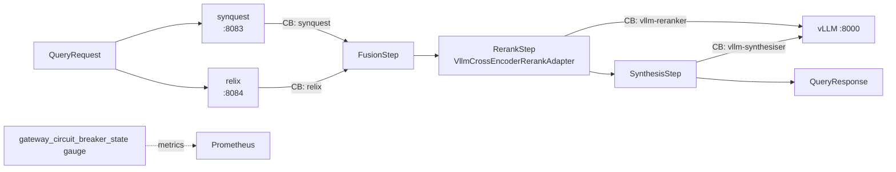

# 04 - gateway - Phase 3 - Reranker Port, Resilience4j Circuit Breakers

**Version:** 1.0
**Date:** 2026-07-24
**Status:** Draft for review
**Depends on:** `gateway` Phase 2 DoD met; `synanton-llm-client` Phase 3 `AnthropicDirectTranslator` available; Resilience4j already in BOM
**Scope:** Add the `RerankPort` SPI with a `VllmCrossEncoderRerankAdapter`. Add per-engine circuit breakers via Resilience4j. No new services - all changes are within the existing `gateway` Spring Boot service.

---

## 1. Context and Document Alignment

| Source | Role in this plan |
|--------|-------------------|
| [synanton-design-1.19.md](../../architecture/platform/synanton-design-1.19.md) §30 `RerankPort` SPI (cross-encoder reranker, vLLM adapter, score threshold), §31 circuit breakers (Resilience4j, per-engine, graceful degradation) | Production target. Phase 3 introduces the reranker SPI and wires circuit breakers. |
| [gateway Phase 2](../phase2/03-gateway.md) | Foundation. Phase 2 added LLM synthesis. Phase 3 inserts reranking between fusion and synthesis, and wraps engine calls with circuit breakers. |
| [01-ingestion-pipeline Phase 3](./01-ingestion-pipeline.md) | `synanton-llm-client`'s HTTP client is reused by the reranker adapter - no direct HTTP in gateway. |

**Explicit non-goals for Phase 3:**

- No SSE streaming from gateway to the caller - Phase 4.
- No adaptive score thresholding (static `scoreThreshold` in config only).
- No second reranker model - one model slot on the existing vLLM instance.
- No cross-encoder fine-tuning - the reranker uses an off-the-shelf cross-encoder checkpoint.
- No circuit breaker event persistence - events are in-memory only; reset on restart.

---

## 2. Phase 3 in One Sentence

> Insert a cross-encoder reranker step (backed by vLLM) between fusion and synthesis, wrap all four engine calls (synquest, relix, vllm-synthesiser, vllm-reranker) with Resilience4j circuit breakers so that a failing engine is skipped gracefully, and expose circuit breaker state as Prometheus gauges.

---

## 3. Target Architecture



**Deployment model.** No new containers. The reranker calls the same vLLM instance already in compose. The vLLM model selected for reranking is `bge-reranker-base` (cross-encoder, ~270 MB, loaded on GPU-1 alongside the embedding model - within the 6.8 GB headroom left by Phase 2). If GPU-1 headroom is insufficient, the reranker calls a `/v1/completions` prompt-based cross-encoder on GPU-0. Config selects which approach.

---

## 4. Data Contracts

### 4.1 `RerankConfig`
```json
{
  "topK": 10,
  "model": "bge-reranker-base",
  "scoreThreshold": 0.3,
  "enabled": true
}
```

### 4.2 `ScoredHit` (extended with `rerankScore`)
```json
{
  "contentRef": "3fa85f64-5717-4562-b3fc-2c963f66afa6",
  "score": 0.87,
  "rerankScore": 0.94,
  "excerpt": "The product ships in 3-5 business days...",
  "entityLabels": ["Product", "ShippingPolicy"]
}
```

### 4.3 Circuit breaker state gauge labels
```
gateway_circuit_breaker_state{engine="synquest"} 0   # 0=CLOSED, 1=OPEN, 2=HALF_OPEN
gateway_circuit_breaker_state{engine="relix"} 0
gateway_circuit_breaker_state{engine="vllm-synthesiser"} 0
gateway_circuit_breaker_state{engine="vllm-reranker"} 0
```

---

## 5. Implementation Design

### 5.1 `RerankPort` interface

```java
public interface RerankPort {
    List<ScoredHit> rerank(String query, List<ScoredHit> hits, RerankConfig cfg);
}
```

Two implementations:

**`NoopRerankAdapter`** - returns hits unchanged; used when `gateway.reranker.enabled=false` (Phase 1/2 default).

**`VllmCrossEncoderRerankAdapter`** - calls vLLM's `/v1/rerank` endpoint (if the loaded model supports it via TEI-compatible vLLM) or falls back to a `/v1/completions` cross-encoder prompt. Uses `LlmClient` from `synanton-llm-client` - not a raw HTTP call. Maps each (query, hit-excerpt) pair to a score; filters hits below `scoreThreshold`; returns top `topK` sorted by `rerankScore` descending.

**Rerank call structure (if using `/v1/rerank`):**
```json
{
  "model": "bge-reranker-base",
  "query": "What is the shipping policy?",
  "documents": ["The product ships in 3-5 business days...", "..."]
}
```
Response: `[{ "index": 0, "score": 0.94 }, ...]`. Mapped back to `ScoredHit.rerankScore`.

**Fallback to `/v1/completions`:** If `/v1/rerank` returns 404 (model does not expose that endpoint), `VllmCrossEncoderRerankAdapter` falls back to a binary relevance prompt: `"Score the relevance of the passage to the query on a scale 0-10.\nQuery: {q}\nPassage: {p}\nScore:"`. Parses the first integer token as the score. Batched as a single prompt with all passages separated by `---`. This fallback is documented as lower quality and is replaced by a proper reranker model in Phase 4.

**Selection:** `RerankPortAdapter` bean is selected by `gateway.reranker.adapter = noop | vllm-rerank`. Default: `noop` until a reranker model is confirmed available.

### 5.2 `RerankStep`

`RerankStep` is inserted into the `QueryExecutionPipeline` between `FusionStep` and `SynthesisStep`. It wraps the `VllmCrossEncoderRerankAdapter` call with the `vllm-reranker` circuit breaker. On open circuit, `RerankStep` logs a warning and returns the unranked fusion output - synthesis proceeds with unranked hits (same as Phase 2 behaviour).

### 5.3 Resilience4j circuit breakers

One `CircuitBreaker` per engine, created in a `@Configuration` class using `CircuitBreakerRegistry.custom()`.

Config per engine (shared defaults, overridable per engine):
```yaml
gateway:
  circuit-breakers:
    synquest:
      failure-rate-threshold: 50
      slow-call-rate-threshold: 80
      slow-call-duration-threshold-ms: 2000
      wait-duration-in-open-state-s: 30
      permitted-calls-in-half-open-state: 5
      sliding-window-size: 20
    relix: # same defaults
    vllm-synthesiser: # same defaults
    vllm-reranker:
      failure-rate-threshold: 60   # reranker is more tolerant - failures degrade gracefully
      slow-call-duration-threshold-ms: 3000
```

Each engine call is wrapped: `circuitBreaker.executeSupplier(() -> engineCall())`. On `CallNotPermittedException` (open circuit), the engine step returns an empty result and the pipeline continues with remaining engines.

**State transitions exposed to Prometheus:**
```java
circuitBreaker.getEventPublisher()
  .onStateTransition(e -> gauge.set(stateToInt(e.getStateTransition().getToState())));
```

`gateway_circuit_breaker_state{engine}` gauge: `0=CLOSED`, `1=OPEN`, `2=HALF_OPEN`.

Additional metrics auto-registered by Resilience4j Micrometer integration: `resilience4j_circuitbreaker_calls_total`, `resilience4j_circuitbreaker_state`.

### 5.4 Graceful degradation semantics

| Engine fails | Degradation |
|-------------|-------------|
| `synquest` OPEN | Query returns empty hits; synthesis step runs but notes "no retrieval results available". |
| `relix` OPEN | Graph step skipped; fusion uses synquest hits only. `QueryResponse.graphIncluded=false`. |
| `vllm-reranker` OPEN | Reranking skipped; unranked fusion hits proceed to synthesis. |
| `vllm-synthesiser` OPEN | Synthesis skipped; `QueryResponse.answer=null`; only ranked hits returned. |

All degradation events emit `gateway_engine_degraded_total{engine}` counter.

---

## 6. Module Boundaries

| Module | Owns in Phase 3 | Does not own |
|--------|----------------|--------------|
| `gateway` | `RerankPort` interface, `NoopRerankAdapter`, `VllmCrossEncoderRerankAdapter`, `RerankStep`, circuit breaker config + wiring | LLM HTTP transport (synanton-llm-client), circuit breaker library (Resilience4j) |
| `synanton-llm-client` | HTTP transport for reranker calls | Reranker scoring logic |

---

## 7. Prerequisites

| # | Prereq | Home | Notes |
|---|--------|------|-------|
| 1 | `gateway` Phase 2 DoD met - synthesis step functional. | - | Non-negotiable. |
| 2 | `resilience4j-spring-boot3` in the Gradle BOM; `io.github.resilience4j:resilience4j-micrometer` for Prometheus integration. | `gradle/libs.versions.toml` | Pin `2.2.0`. |
| 3 | `synanton-llm-client` Phase 3 `LlmClient` wired in `gateway`. | `01-ingestion-pipeline` Phase 3 | `LlmClient` is injected; `@Qualifier("reranker")` selects the reranker model config. |
| 4 | vLLM instance has headroom for a reranker model, or fallback to `/v1/completions` is acceptable. | GPU rig | Documented - `noop` adapter is safe default. |
| 5 | `Micrometer` already in `gateway` from Phase 2. | Phase 2 | No new dep. |

---

## 8. Task Breakdown

| # | Task | Deliverable | Est. |
|---|------|-------------|------|
| GW3-1 | Define `RerankPort` interface, `RerankConfig` record, `ScoredHit.rerankScore` field. | Interfaces + records | 0.5 day |
| GW3-2 | Implement `NoopRerankAdapter` (trivial); unit test. | Class + test | 0.5 day |
| GW3-3 | Implement `VllmCrossEncoderRerankAdapter` (primary path: `/v1/rerank`; fallback: `/v1/completions`). | Class | 1.5 days |
| GW3-4 | Unit test `VllmCrossEncoderRerankAdapter` with mock `LlmClient` - assert correct score mapping and topK filtering. | Tests | 0.5 day |
| GW3-5 | Implement `RerankStep` + wire between `FusionStep` and `SynthesisStep`; handle open-circuit fallback. | Class + wiring | 1 day |
| GW3-6 | Implement circuit breaker config class for all 4 engines; write `CircuitBreakerConfig` Spring `@Configuration`. | Config class | 1 day |
| GW3-7 | Wrap all 4 engine calls with their respective circuit breakers. | 4 call sites updated | 0.5 day |
| GW3-8 | Expose `gateway_circuit_breaker_state` gauge via Micrometer; add `gateway_engine_degraded_total` counter. | Metrics | 0.5 day |
| GW3-9 | Integration test `GatewayCircuitBreakerIT`: bring down synquest mock → assert circuit opens after threshold → query returns degraded response without synquest. | `GatewayCircuitBreakerIT` | 1 day |
| GW3-10 | Integration test `GatewayRerankIT`: mock `LlmClient` returning canned scores → assert hits are reordered by `rerankScore`. | `GatewayRerankIT` | 0.5 day |

---

## 9. Testing Strategy

- **Unit:** `VllmCrossEncoderRerankAdapter` with a `FakeLlmClient`. `RerankStep` with a mock adapter. `PlanComparator` integration (reranker affects quality score selection in planner - verify no circular dependency).
- **Integration:** `GatewayCircuitBreakerIT` using WireMock for engine HTTP endpoints. Simulate 503 responses, assert circuit opens and degrades correctly. `GatewayRerankIT` validates score injection into `ScoredHit`.
- **E2E:** Phase 3 E2E search test asserts `hits[*].rerankScore` is present and non-null when reranker is enabled.
- **Regression:** Phase 2 synthesis tests pass unchanged - `NoopRerankAdapter` is the default so hits are passed through unchanged.

---

## 10. Configuration Surface

```yaml
# gateway/src/main/resources/application-phase3.yaml
gateway:
  reranker:
    enabled: false   # set true when reranker model is loaded in vLLM
    adapter: noop    # noop | vllm-rerank
    top-k: 10
    score-threshold: 0.3
    model: bge-reranker-base
    vllm-rerank-url: http://vllm-llm:8000/v1/rerank
    fallback-to-completions: true

  circuit-breakers:
    synquest:
      failure-rate-threshold: 50
      slow-call-rate-threshold: 80
      slow-call-duration-threshold-ms: 2000
      wait-duration-in-open-state-s: 30
      permitted-calls-in-half-open-state: 5
      sliding-window-size: 20
    relix:
      failure-rate-threshold: 50
      slow-call-duration-threshold-ms: 2000
      wait-duration-in-open-state-s: 30
    vllm-synthesiser:
      failure-rate-threshold: 50
      slow-call-duration-threshold-ms: 2000
      wait-duration-in-open-state-s: 30
    vllm-reranker:
      failure-rate-threshold: 60
      slow-call-duration-threshold-ms: 3000
      wait-duration-in-open-state-s: 30
```

---

## 11. Risks and Open Questions

| Risk | Mitigation | Decision |
|------|------------|----------|
| vLLM does not expose `/v1/rerank` for cross-encoder models in all versions. | `VllmCrossEncoderRerankAdapter` has `/v1/completions` fallback. Quality is lower but functional. | Fallback is the Phase 3 default. |
| GPU-1 headroom for reranker model (270 MB) may not be available if embedding model grew. | `gateway.reranker.enabled=false` default - reranker is opt-in. No DoD dependency on reranker being active. | Default-off is safe. |
| Circuit breaker window too small (20 calls) for low-traffic demo → breaker trips on first few errors. | Demo rate is low; consider `sliding-window-size=10` for demo. Phase 4 makes this adaptive. | Set window=10 for demo profile. |
| `CallNotPermittedException` from Resilience4j is unchecked - must be caught at engine call site, not at gateway boundary. | Wrap each engine call in explicit `try { } catch (CallNotPermittedException e)` - not `@CircuitBreaker` annotation (which requires AOP proxy). | Explicit wrapping chosen for clarity. |

---

## 12. Definition of Done (Phase 3)

1. `gateway_circuit_breaker_state{engine="synquest"}` gauge appears in Prometheus at value `0` (CLOSED) on startup.
2. `GatewayCircuitBreakerIT` passes: with synquest returning 503 × 10, circuit opens; next query returns degraded response (no hits, synthesis notes absence); after 30 s wait + 5 probe calls succeed, circuit closes.
3. `GatewayRerankIT` passes: hits are reordered by reranker score when adapter is `vllm-rerank` (mocked).
4. `POST /synapt/search` with `gateway.reranker.enabled=false` behaves identically to Phase 2 - regression test passes.
5. Phase 2 synthesis DoD remains green - `QueryResponse.answer` is non-null for standard queries.
6. All 4 circuit breakers registered; no startup error for any breaker configuration.
7. `gateway_engine_degraded_total{engine="relix"}` counter increments when relix circuit is forced open in test.

---

## 13. Follow-on Phases (Signposted)

- **Phase 4** - Adaptive score threshold: reranker threshold updated from user feedback via `synreview`.
- **Phase 4** - SSE streaming from gateway to caller; synthesis tokens streamed as they are produced by vLLM.
- **Phase 5** - Second reranker model slot (larger cross-encoder, 1.1 GB); model selected per-query by planner cost model.
- **Phase 5** - Circuit breaker event persistence in Redis so state survives gateway restarts.
- **Phase 5** - Bulkhead isolation per tenant (Resilience4j `Bulkhead` per tenant thread pool).
