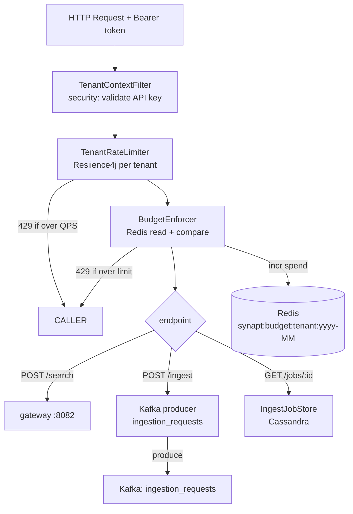

# 05 - synapt - Phase 3 - Rate Limiting, Budget Enforcement, Ingest Enqueue

**Version:** 1.0
**Date:** 2026-07-24
**Status:** Draft for review
**Depends on:** `synapt` Phase 2 DoD met; `security` Phase 3 API-key resolution; `topology` Phase 3 `BudgetPolicy` endpoint; Redis in compose; Kafka in compose
**Scope:** Per-tenant rate limiting via Resilience4j, budget enforcement via Redis, new `POST /ingest` endpoint that enqueues to Kafka instead of calling `synflux` inline.

---

## 1. Context and Document Alignment

| Source | Role in this plan |
|--------|-------------------|
| [synanton-design-1.19.md](../../architecture/platform/synanton-design-1.19.md) §25 `synapt` (rate limiting, budget enforcement, ingest delegation), §35 budget enforcement (Redis spend tracking, monthly key TTL) | Production target. Phase 3 implements per-tenant rate limiting and Redis budget tracking; Phase 4 adds atomic decrement and cross-session budget aggregation. |
| [synapt Phase 2](../phase2/04-synapt.md) | Foundation. Phase 2 added JWT auth, `X-Trace-Id`, error redaction. Phase 3 adds rate limiting, budget enforcement, and the Kafka ingest endpoint. |
| [06-security Phase 3](./06-security.md) | `SubjectAssertion` from API-key validation carries `tenantId` used to look up rate-limit and budget policy. |
| [07-topology Phase 3](./07-topology.md) | `GET /topology/tenants/{id}/policy` returns `BudgetPolicy` and rate-limit QPS for the tenant. |

**Explicit non-goals for Phase 3:**

- No atomic Redis decrement across concurrent requests (race condition is accepted; Phase 4 uses Lua scripts).
- No cross-month budget rollover (Redis key TTL = 35 days handles natural expiry; rollover edge case is Phase 4).
- No per-user rate limiting - rate limiting is per-tenant only.
- No token-bucket rate limiter - Resilience4j `RateLimiter` (sliding window) is used; token bucket is Phase 4.
- `POST /ingest` does not return live job status - callers must poll `GET /jobs/{id}`.

---

## 2. Phase 3 in One Sentence

> Add per-tenant rate limiting (Resilience4j `RateLimiter`, 429 with `Retry-After`) and Redis-backed monthly budget enforcement to `synapt`, and introduce `POST /ingest` that validates tenant context and enqueues an `IngestJobRequest` to Kafka instead of calling `synflux` directly.

---

## 3. Target Architecture



---

## 4. Data Contracts

### 4.1 Rate limit error response (HTTP 429)
```json
{
  "error": "rate_limit_exceeded",
  "tenant_id": "demo",
  "retry_after_seconds": 5,
  "limit_qps": 10
}
```
Headers: `Retry-After: 5`, `X-RateLimit-Limit: 10`, `X-RateLimit-Remaining: 0`.

### 4.2 Budget exceeded response (HTTP 429)
```json
{
  "error": "budget_exceeded",
  "tenant_id": "demo",
  "limit_usd": 10.00,
  "used_usd": 10.47,
  "reset_at": "2026-08-01T00:00:00Z"
}
```

### 4.3 `POST /ingest` request
```json
{
  "manifest_id": "3fa85f64-5717-4562-b3fc-2c963f66afa6",
  "priority": 5
}
```

### 4.4 `POST /ingest` response (HTTP 202)
```json
{
  "job_id": "7c9e6679-7425-40de-944b-e07fc1f90ae7",
  "status": "QUEUED",
  "manifest_id": "3fa85f64-5717-4562-b3fc-2c963f66afa6",
  "estimated_wait_seconds": 15
}
```

### 4.5 `GET /jobs/{job_id}` response
```json
{
  "job_id": "7c9e6679-7425-40de-944b-e07fc1f90ae7",
  "tenant_id": "demo",
  "manifest_id": "3fa85f64-5717-4562-b3fc-2c963f66afa6",
  "status": "PROCESSING",
  "created_at": "2026-07-24T10:00:00Z",
  "updated_at": "2026-07-24T10:00:05Z"
}
```

---

## 5. Implementation Design

### 5.1 `TenantRateLimiter`

`TenantRateLimiter` maintains a `ConcurrentHashMap<String, RateLimiter>` keyed by `tenantId`. On each request:
1. Look up the tenant's `RateLimiter`. If absent, fetch `BudgetPolicy.qpsLimit` from topology (see §5.3), create a `RateLimiter` via `RateLimiterConfig.custom().limitForPeriod(qpsLimit).limitRefreshPeriod(Duration.ofSeconds(1))`.
2. Call `rateLimiter.acquirePermission(Duration.ofMillis(0))`. If returns `false`: respond 429.
3. Policy refresh: a `@Scheduled(fixedDelay=60_000)` task re-fetches all known tenants' policies and updates `RateLimiter.changeTimeoutDuration` / `changeLimitForPeriod` as needed.

Default policy when topology is unreachable: `synapt.rate-limit.default-qps=10`. This default is used for the first 60 s of startup and as a fallback on topology unavailability.

Metric: `synapt_rate_limited_total{tenant_id}` counter incremented on every 429.

### 5.2 `BudgetEnforcer`

Uses Lettuce (via Spring Data Redis) to manage a Redis hash `synapt:budget:{tenantId}:{yyyy-MM}`.

On each request:
1. `HGET synapt:budget:demo:2026-07 spend_usd` - read current spend.
2. Add the request's estimated cost. For search: `CostEstimator` stub returns a flat `synapt.budget.flat-search-cost-usd=0.0001`. For ingest: `synapt.budget.flat-ingest-cost-usd=0.001`.
3. Compare `spend + estimatedCost > BudgetPolicy.monthlyUsdLimit`. If over: respond 429.
4. On successful completion: `HINCRBYFLOAT synapt:budget:demo:2026-07 spend_usd {estimatedCost}`. Set TTL to 35 days (`EXPIRE synapt:budget:demo:2026-07 3024000`) on first write.

Note on race condition: two concurrent requests can both pass the check then both increment - slightly over-spend is possible. Accepted for Phase 3. Phase 4 uses a Lua script for atomic check-and-increment.

`BudgetPolicy` is fetched from topology at startup and cached with a 60 s refresh (same scheduler as `TenantRateLimiter`). If topology is unreachable, the last known policy is used; if no policy has ever been fetched, a permissive default (`monthlyUsdLimit=9999`) is used.

### 5.3 `POST /ingest` endpoint

`POST /ingest` (authenticated, tenant-scoped):
1. Validate `manifest_id` exists for the calling tenant (calls `synvault GET /manifest/{tenant}/{manifest_id}` - 404 → 400 Bad Request).
2. Check rate limit + budget (same `TenantRateLimiter` + `BudgetEnforcer` as search path).
3. Generate `jobId = UUID.randomUUID()`.
4. Produce `IngestJobRequest { tenantId, manifestId, jobId, priority }` to Kafka topic `ingestion_requests` (using `KafkaProducer` from `shared/common`). Key = `tenantId`. Await `Future.get(3, SECONDS)` - if Kafka is unavailable, respond 503.
5. Write a `job` record to Cassandra (via `ingestion-cache` DAO): `status=QUEUED`, `created_at=now()`.
6. Respond 202 with `{ job_id, status="QUEUED", manifest_id, estimated_wait_seconds=15 }`.

`GET /jobs/{job_id}` - reads the `jobs` row from Cassandra. The `synflux` worker updates the row as processing proceeds. No polling via Kafka; Cassandra is the source of truth for job status.

### 5.4 Removed: inline synflux call

Phase 2 `synapt` called `synflux POST /ingest/run` via HTTP. That call is removed. `synflux` no longer has a direct HTTP dependency from `synapt` - communication is Kafka-only for ingestion in Phase 3. The manual fallback `POST /ingest/run` on synflux remains for operator use (not exposed via synapt).

---

## 6. Module Boundaries

| Module | Owns in Phase 3 | Does not own |
|--------|----------------|--------------|
| `synapt` | `TenantRateLimiter`, `BudgetEnforcer`, `POST /ingest`, `GET /jobs/{id}`, Redis spend tracking | Rate-limit policy storage (topology), job execution (synflux), Kafka topic management |
| `topology` | `BudgetPolicy` (QPS limit, monthly USD limit) | Enforcement logic |
| `synflux` | Job state transitions, `QUEUED → PROCESSING → EMBEDDED` | Rate limiting, budget |

---

## 7. Prerequisites

| # | Prereq | Home | Notes |
|---|--------|------|-------|
| 1 | `synapt` Phase 2 DoD met - JWT auth, trace-id, error redaction working. | - | Non-negotiable. |
| 2 | Redis 7.x in compose under `--profile phase3`. | `deployment/docker/compose.yaml` | Uses Lettuce via `spring-boot-starter-data-redis`. |
| 3 | Kafka in compose (Phase 3 base requirement). | `01-ingestion-pipeline` Phase 3 | `ingestion_requests` topic exists. |
| 4 | `security` Phase 3 API-key resolution deployed - `TenantContextFilter` must extract `tenantId` from `SubjectAssertion`. | `06-security Phase 3` | Stub acceptable for unit tests. |
| 5 | `topology` Phase 3 `GET /tenants/{id}/policy` endpoint deployed - or static config fallback used. | `07-topology Phase 3` | 60 s cache means topology can be slow to start. |
| 6 | `resilience4j-spring-boot3` in BOM (shared with gateway). | `gradle/libs.versions.toml` | Already added for gateway; reuse. |

---

## 8. Task Breakdown

| # | Task | Deliverable | Est. |
|---|------|-------------|------|
| SA3-1 | Add Redis (`spring-boot-starter-data-redis`, Lettuce) to `synapt` deps; configure `RedisConnectionFactory` bean. | Config + connection test | 0.5 day |
| SA3-2 | Implement `BudgetPolicyCache` - fetches from topology every 60 s, caches per tenant, applies permissive default. | Class + unit tests | 1 day |
| SA3-3 | Implement `TenantRateLimiter` - per-tenant `RateLimiter` map, 429 response, `synapt_rate_limited_total` metric. | Class + unit tests | 1 day |
| SA3-4 | Implement `BudgetEnforcer` - Redis read/compare/increment, 429 response, 35-day TTL. | Class + unit tests | 1 day |
| SA3-5 | Wire `TenantRateLimiter` and `BudgetEnforcer` as `OncePerRequestFilter` ordered after `TenantContextFilter`. | Filter wiring + tests | 0.5 day |
| SA3-6 | Implement `POST /ingest` endpoint - validate manifest, produce to Kafka, write job row, respond 202. | Controller + tests | 1.5 days |
| SA3-7 | Implement `GET /jobs/{job_id}` - read from Cassandra, respond with job status. | Endpoint + tests | 0.5 day |
| SA3-8 | Remove direct HTTP call to `synflux POST /ingest/run` from `synapt` codebase. | Code deletion + regression test | 0.5 day |
| SA3-9 | Integration test `SynaptRateLimitIT`: 11 requests in 1 s → 10 succeed, 1 returns 429 with `Retry-After`. | `SynaptRateLimitIT` | 1 day |
| SA3-10 | Integration test `SynaptBudgetIT` (Testcontainers Redis): pre-seed spend above limit → next request returns 429. | `SynaptBudgetIT` | 1 day |

---

## 9. Testing Strategy

- **Unit:** `TenantRateLimiter` with a `FakeTopologyClient`. `BudgetEnforcer` with a mock `RedisTemplate`. `POST /ingest` controller with mock Kafka producer and Cassandra DAO.
- **Integration:** `SynaptRateLimitIT` uses Testcontainers with a mock topology server. `SynaptBudgetIT` uses Testcontainers Redis.
- **E2E:** Phase 3 two-tenant demo script provisions two tenants with separate rate limits; verifies that `demo2` at 2 QPS gets 429 while `demo` at 10 QPS continues.
- **Regression:** All Phase 2 `synapt` tests pass - auth, trace-id, error redaction unchanged.

---

## 10. Configuration Surface

```yaml
# synapt/src/main/resources/application-phase3.yaml
synapt:
  rate-limit:
    default-qps: 10
    policy-refresh-interval-s: 60
  budget:
    flat-search-cost-usd: 0.0001
    flat-ingest-cost-usd: 0.001
    redis-key-prefix: "synapt:budget"
    spend-key-ttl-days: 35
    permissive-default-limit-usd: 9999.0
  ingest:
    kafka-producer-timeout-ms: 3000
    estimated-wait-seconds: 15
  topology:
    base-url: http://topology:8087
    connect-timeout-ms: 2000
    read-timeout-ms: 3000

spring:
  data:
    redis:
      host: redis
      port: 6379
      timeout: 2000ms
      lettuce:
        pool:
          max-active: 10
```

---

## 11. Risks and Open Questions

| Risk | Mitigation | Decision |
|------|------------|----------|
| Redis unavailable at startup: `BudgetEnforcer` cannot connect. | On Redis connection failure, `BudgetEnforcer` logs a warning and allows the request (fail-open). Phase 4 adds a circuit breaker around Redis. | Fail-open for Phase 3. |
| Kafka producer timeout (3 s): `POST /ingest` returns 503 if Kafka is down. | Acceptable - ingestion is not a real-time path. 503 includes a `Retry-After: 10` header. | Fail-closed for ingest (503). |
| Budget spend race condition (two concurrent requests over-spend). | Accepted for Phase 3 demo. Documented. Phase 4 uses Lua atomic check-and-increment. | Documented limitation. |
| Topology policy fetch latency at startup causes permissive default to be used for first 60 s. | Acceptable for demo. Warm startup after 60 s uses real policy. | Accepted. |
| `estimated_wait_seconds=15` is a static constant. | For Phase 3 single-broker demo it is a reasonable estimate. Phase 4 computes from router consumer lag. | Static constant for Phase 3. |

---

## 12. Definition of Done (Phase 3)

1. `POST /synapt/ingest` with a valid API key returns HTTP 202 with `status=QUEUED` within 1 s.
2. The `IngestJobRequest` message appears on the `ingestion_requests` Kafka topic (verified by `kafkacat --from-beginning -c 1`).
3. `synapt_rate_limited_total{tenant_id="demo"}` increments when the 11th request per second arrives.
4. 429 response includes `Retry-After` header and correct `retry_after_seconds` in body.
5. `SynaptBudgetIT` passes: request when spend > limit returns HTTP 429 with `budget_exceeded`.
6. `SynaptRateLimitIT` passes.
7. `GET /synapt/jobs/{id}` returns job status from Cassandra.
8. Phase 2 regression: `POST /synapt/search` is unaffected by rate-limit and budget changes (QPS limit is 10; one search per test request is well within limit).
9. Redis spend key `synapt:budget:demo:2026-07` exists and has TTL ≈ 35 days after first ingest request.

---

## 13. Follow-on Phases (Signposted)

- **Phase 4** - Atomic check-and-increment via Lua script in `BudgetEnforcer` to eliminate over-spend race condition.
- **Phase 4** - `estimated_wait_seconds` computed from router consumer lag via `GET /router/status`.
- **Phase 4** - Token-bucket rate limiter replacing Resilience4j sliding window for smoother burst handling.
- **Phase 5** - Per-user rate limiting (sub-tenant granularity) using the same `TenantRateLimiter` keyed by `(tenantId, userId)`.
- **Phase 5** - Budget rollover logic: at month boundary, copy remaining budget to a `carryover` key (capped at 10 % of limit).
