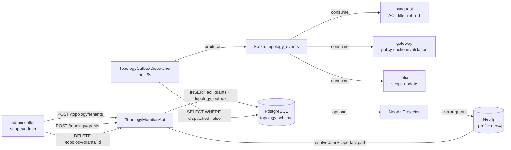

# 07 - topology - Phase 3 - Mutation API, Outbox Dispatcher, Neo4j ACL Projection

**Version:** 1.0
**Date:** 2026-07-24
**Status:** Draft for review
**Depends on:** `topology` Phase 2 DoD met (PostgreSQL schema, demo tenant seeded); `security` Phase 3 API-key / service token auth; Kafka Phase 3 in compose
**Scope:** Add tenant/grant mutation endpoints, outbox dispatcher publishing ACL change events to Kafka, and an optional Neo4j projection for fast ACL resolution.

---

## 1. Context and Document Alignment

| Source | Role in this plan |
|--------|-------------------|
| [synanton-design-1.19.md](../../architecture/platform/synanton-design-1.19.md) §22 `topology` (ACL mutation, outbox pattern, Neo4j projection, `resolveUserScope`), §34 multi-tenant provisioning | Production target. Phase 3 implements mutations and the outbox; Neo4j projection is optional. |
| [topology Phase 2](../phase2/06-topology.md) | Foundation. Phase 2 delivered read-only endpoints (`GET /topology/tenants`, `GET /topology/acl/{uid}`). Phase 3 adds write paths. |
| [06-security Phase 3](./06-security.md) | Admin operations require `scope=admin` in `SubjectAssertion`. Service-to-service calls use RFC 8693 service tokens. |

**Explicit non-goals for Phase 3:**

- No ABAC (attribute-based access control) - simple `(subject, resource_path, permission)` ACL only.
- No hierarchical resource inheritance - `resource_path` matching is exact string equality; prefix matching is Phase 4.
- Neo4j projection is not required for Phase 3 DoD - it is an optional feature gated by `topology.neo4j.enabled=false`.
- No event schema registry - `AclChangeEvent` is a plain JSON object on Kafka.
- No consumer acknowledgement back to topology - outbox uses at-least-once delivery; consumers are idempotent.

---

## 2. Phase 3 in One Sentence

> Add write paths to topology (create tenants, create/revoke grants), implement the outbox dispatcher that fans ACL change events to `topology_events` on Kafka, and optionally project the ACL graph into Neo4j for O(1) `resolveUserScope` lookups.

---

## 3. Target Architecture



---

## 4. Data Contracts

### 4.1 `POST /topology/grants`
Request:
```json
{
  "subject_id": "user:alice",
  "subject_type": "USER",
  "resource_path": "tenants/demo/corpus/legal",
  "permission": "READ",
  "source": "admin-api"
}
```
Response (HTTP 201):
```json
{
  "grant_id": "4b1d2e3f-5a6b-7c8d-9e0f-1a2b3c4d5e6f",
  "subject_id": "user:alice",
  "tenant_id": "demo",
  "resource_path": "tenants/demo/corpus/legal",
  "permission": "READ",
  "created_at": "2026-07-24T10:00:00Z"
}
```

### 4.2 `AclChangeEvent` (Kafka, `topology_events` topic)
```json
{
  "event_id": "uuid",
  "event_type": "GRANT_CREATED",
  "grant_id": "4b1d2e3f-...",
  "tenant_id": "demo",
  "subject_id": "user:alice",
  "resource_path": "tenants/demo/corpus/legal",
  "permission": "READ",
  "occurred_at": "2026-07-24T10:00:00Z"
}
```

### 4.3 `POST /topology/tenants`
Request:
```json
{ "tenant_id": "demo2", "display_name": "Demo Tenant 2", "owner_subject_id": "user:bob" }
```
Response (HTTP 201):
```json
{ "tenant_id": "demo2", "display_name": "Demo Tenant 2", "created_at": "2026-07-24T10:00:00Z" }
```

### 4.4 `GET /topology/tenants/{id}/policy`
Response:
```json
{
  "tenant_id": "demo",
  "qps_limit": 10,
  "monthly_usd_limit": 10.00,
  "max_latency_ms": 5000,
  "effective_from": "2026-07-01T00:00:00Z"
}
```

---

## 5. Implementation Design

### 5.1 `TopologyMutationApi` - write endpoints

All write endpoints require `SubjectAssertion.scopes` containing `admin` (verified by `@PreAuthorize("hasScope('admin')")`). Service accounts (RFC 8693 tokens) are granted `admin` scope in the `service_accounts` table.

**`POST /topology/tenants`:**
- Insert into `topology.tenants(tenant_id, display_name, owner_subject_id, created_at)`.
- Append to `topology.topology_outbox(event_type=TENANT_CREATED, payload=tenantJson)`.
- Return 201.

**`POST /topology/grants`:**
- Derive `tenant_id` from `resource_path` (first path segment after `tenants/`). Validate the tenant exists.
- Insert into `topology.acl_grants(grant_id, tenant_id, subject_id, subject_type, resource_path, permission, source, created_at)`.
- Append to `topology.topology_outbox(event_type=GRANT_CREATED, payload=grantJson)`.
- Return 201.

**`DELETE /topology/grants/{grant_id}`:**
- Set `revoked_at = now()` on the `acl_grants` row. Validate grant exists and belongs to the caller's tenant.
- Append to `topology.topology_outbox(event_type=GRANT_REVOKED, payload={grant_id, tenant_id})`.
- Return 200.

**`PUT /topology/tenants/{id}/policy`:**
- Upsert `topology.tenant_policies(tenant_id, qps_limit, monthly_usd_limit, max_latency_ms, effective_from)`.
- No outbox event (policy changes are polled by consumers, not pushed in Phase 3).
- Return 200.

**`GET /topology/connectors`** (new, for relix `ConnectorRegistry`):
- Returns `[{ connector_id, address }]` from a static config table `topology.connectors`. Seeded by Flyway. Returns `[{ "connector_id": "in-memory", "address": "localhost:9090" }]` by default.

### 5.2 `TopologyOutboxDispatcher`

`@Component` with `@Scheduled(fixedDelay=5000)` on a `@Async` executor (`SingleThreadScheduledExecutor` named `topology-outbox`).

Each cycle:
1. `SELECT * FROM topology.topology_outbox WHERE dispatched=false ORDER BY created_at LIMIT 100`.
2. For each row: produce `AclChangeEvent` JSON to Kafka topic `topology_events` with key = `tenant_id`.
3. After `KafkaProducer.flush()`: `UPDATE topology.topology_outbox SET dispatched=true, dispatched_at=now() WHERE event_id=?`.
4. On Kafka producer exception: log error, skip marking dispatched (retry on next cycle - at-least-once).

Metric: `topology_outbox_pending_total` (gauge, count of `WHERE dispatched=false` rows).

### 5.3 New PostgreSQL schema (Flyway `V3__topology_mutations.sql`)

```sql
ALTER TABLE topology.acl_grants ADD COLUMN revoked_at TIMESTAMPTZ;
ALTER TABLE topology.acl_grants ADD COLUMN subject_type TEXT NOT NULL DEFAULT 'USER';
ALTER TABLE topology.acl_grants ADD COLUMN source TEXT;

CREATE TABLE topology.topology_outbox (
  event_id     UUID PRIMARY KEY DEFAULT gen_random_uuid(),
  event_type   TEXT NOT NULL,
  payload      JSONB NOT NULL,
  dispatched   BOOLEAN NOT NULL DEFAULT FALSE,
  created_at   TIMESTAMPTZ NOT NULL DEFAULT now(),
  dispatched_at TIMESTAMPTZ
);
CREATE INDEX ON topology.topology_outbox (dispatched, created_at) WHERE dispatched = FALSE;

CREATE TABLE topology.tenant_policies (
  tenant_id        TEXT PRIMARY KEY,
  qps_limit        INT NOT NULL DEFAULT 10,
  monthly_usd_limit NUMERIC(10,2) NOT NULL DEFAULT 10.00,
  max_latency_ms   INT NOT NULL DEFAULT 5000,
  effective_from   TIMESTAMPTZ NOT NULL DEFAULT now()
);

CREATE TABLE topology.connectors (
  connector_id TEXT PRIMARY KEY,
  address      TEXT NOT NULL,
  created_at   TIMESTAMPTZ NOT NULL DEFAULT now()
);
INSERT INTO topology.connectors VALUES ('in-memory', 'localhost:9090', now());

-- Seed second tenant for demo
INSERT INTO topology.tenants (tenant_id, display_name, created_at)
VALUES ('demo2', 'Demo Tenant 2', now())
ON CONFLICT DO NOTHING;

INSERT INTO topology.tenant_policies (tenant_id, qps_limit, monthly_usd_limit)
VALUES ('demo', 10, 10.00), ('demo2', 5, 5.00)
ON CONFLICT DO NOTHING;
```

### 5.4 `NeoAclProjector` (optional)

Enabled by `topology.neo4j.enabled=true`. Uses the Neo4j Java Driver to mirror every `acl_grants` insert/revoke to the Neo4j graph:
- `MERGE (:User {uid: $subject_id}) MERGE (:Resource {path: $resource_path}) MERGE (u)-[:HAS_GRANT {grant_id: $grant_id, permission: $permission}]->(r)`.
- On revoke: `MATCH (:User)-[g:HAS_GRANT {grant_id: $grant_id}]->(:Resource) DELETE g`.

`resolveUserScope(uid, tenantId)` fast path (when Neo4j enabled):
```cypher
MATCH (:User {uid: $uid})-[:HAS_GRANT]->(r:Resource)
WHERE r.path STARTS WITH 'tenants/' + $tenantId + '/'
RETURN r.path, r.permission
```

Fallback: if Neo4j is unavailable (driver throws `ServiceUnavailableException`), falls back to the Phase 2 Postgres JOIN query. Metric: `topology_scope_resolution_source{source=neo4j|postgres}`.

---

## 6. Module Boundaries

| Module | Owns in Phase 3 | Does not own |
|--------|----------------|--------------|
| `topology` | `TopologyMutationApi`, `TopologyOutboxDispatcher`, `NeoAclProjector`, Flyway V3 migration | ACL enforcement (gateway/synquest), event consumers |
| `synquest` | `topology_events` consumer for ACL filter rebuild | Event production |
| `gateway` | `topology_events` consumer for policy cache invalidation | Event production |

---

## 7. Prerequisites

| # | Prereq | Home | Notes |
|---|--------|------|-------|
| 1 | `topology` Phase 2 DoD met - read endpoints, Postgres schema, Flyway V1+V2 applied. | - | Non-negotiable. |
| 2 | Kafka in compose (Phase 3 base). | `01-ingestion-pipeline` Phase 3 | `topology_events` topic created by `kafka-init.sh`. |
| 3 | `security` Phase 3 admin scope enforcement available - or stub `@PreAuthorize` for dev. | `06-security Phase 3` | Stub acceptable for unit tests. |
| 4 | Neo4j driver `org.neo4j.driver:neo4j-java-driver` in BOM (same as `relix-neo4j-connector`). | `gradle/libs.versions.toml` | Add only once, shared. |
| 5 | `KafkaClientConfig` beans from `shared/common` Phase 3. | `01-ingestion-pipeline` Phase 3 | Reuse producer bean. |

---

## 8. Task Breakdown

| # | Task | Deliverable | Est. |
|---|------|-------------|------|
| TOP3-1 | Write Flyway `V3__topology_mutations.sql`; apply and verify with Testcontainers Postgres. | Migration file | 1 day |
| TOP3-2 | Implement `POST /topology/tenants`, `GET /topology/tenants`. | Endpoints + tests | 1 day |
| TOP3-3 | Implement `POST /topology/grants`, `DELETE /topology/grants/{id}`, `PUT /topology/tenants/{id}/policy`. | Endpoints + tests | 1.5 days |
| TOP3-4 | Implement `GET /topology/tenants/{id}/policy` (read endpoint for synapt/planner). | Endpoint + tests | 0.5 day |
| TOP3-5 | Implement `GET /topology/connectors` (read endpoint for relix). | Endpoint + tests | 0.5 day |
| TOP3-6 | Implement `TopologyOutboxDispatcher` - scheduled poll, produce, mark dispatched; unit test with mock Kafka. | Class + tests | 1 day |
| TOP3-7 | Integration test `TopologyOutboxIT`: insert grant → wait 10 s → assert event on `topology_events` topic. | `TopologyOutboxIT` | 1 day |
| TOP3-8 | Implement `NeoAclProjector` (optional, `topology.neo4j.enabled`); integration test with Testcontainers Neo4j. | Class + `NeoAclProjectorIT` | 1.5 days |
| TOP3-9 | Add `topology_outbox_pending_total` and `topology_scope_resolution_source` metrics. | Metrics | 0.5 day |

---

## 9. Testing Strategy

- **Unit:** `TopologyOutboxDispatcher` with mock `KafkaProducer` and mock Postgres DAO. `NeoAclProjector` with mock Neo4j driver.
- **Integration:** `TopologyOutboxIT` (Testcontainers Kafka + Postgres): grant created → event on topic within 10 s. `NeoAclProjectorIT` (Testcontainers Neo4j): grant inserted → Neo4j node/relation created.
- **E2E:** Phase 3 two-tenant provisioning script: calls `POST /topology/tenants` for `demo2`, `POST /topology/grants`, asserts `GET /topology/acl/demo2/user:bob` returns the grant.
- **Regression:** Phase 2 topology read tests pass unchanged - `GET /topology/tenants`, `GET /topology/acl/{uid}` are unmodified.

---

## 10. Configuration Surface

```yaml
# topology/src/main/resources/application-phase3.yaml
topology:
  outbox:
    poll-interval-ms: 5000
    batch-size: 100
    kafka-topic: topology_events
  neo4j:
    enabled: false
    uri: bolt://neo4j:7687
    username: neo4j
    password: ${NEO4J_PASSWORD:neo4j}
  connectors:
    static-seed: true   # apply seed data from V3 migration on startup if table is empty
```

---

## 11. Risks and Open Questions

| Risk | Mitigation | Decision |
|------|------------|----------|
| Outbox table grows unboundedly if dispatcher is paused. | Add a retention job: delete `WHERE dispatched=true AND dispatched_at < now() - interval '7 days'` every hour. Phase 4 uses Kafka log compaction instead. | Retention job added in V3 migration as a Postgres scheduled job using `pg_cron` or a `@Scheduled` task. |
| `resolveUserScope` Postgres fallback is a JOIN on `acl_grants` - slow at scale. | For Phase 3 demo with < 100 grants per tenant this is acceptable. Index on `(tenant_id, subject_id)` covers the query. | Index added in V3 migration. |
| `TENANT_CREATED` event consumed by `synquest`/`gateway`/`relix` - those services must be idempotent on duplicate events. | Consumers key on `event_id` UUID; duplicate processing is a no-op. Documented in consumer interface contract. | Idempotent by design. |
| `PUT /topology/tenants/{id}/policy` does not publish an outbox event - synapt reads policy directly from topology on 60 s interval. | Accepted for Phase 3. Immediate propagation is a Phase 4 enhancement. | Known limitation. |

---

## 12. Definition of Done (Phase 3)

1. `POST /topology/tenants` creates `demo2` tenant; `GET /topology/tenants` lists both `demo` and `demo2`.
2. `POST /topology/grants` creates a grant; within 10 s the `AclChangeEvent` appears on `topology_events` topic.
3. `DELETE /topology/grants/{id}` revokes the grant; `GET /topology/acl/{uid}` no longer returns the revoked grant.
4. `GET /topology/tenants/{id}/policy` returns the correct `qps_limit` and `monthly_usd_limit` for each tenant.
5. `TopologyOutboxIT` passes in CI.
6. `topology_outbox_pending_total` gauge visible in Prometheus; drops to 0 after dispatcher runs.
7. Phase 2 topology read-endpoint regression tests pass unchanged.
8. Flyway V3 migration applies cleanly on a fresh database (verified in CI against Testcontainers Postgres).

---

## 13. Follow-on Phases (Signposted)

- **Phase 4** - Hierarchical `resource_path` prefix matching: `MATCH WHERE path STARTS WITH` in ACL resolution.
- **Phase 4** - Policy change outbox event so synapt and planner get immediate cache invalidation.
- **Phase 4** - `pg_cron` or Quartz scheduler for outbox retention instead of a `@Scheduled` Spring bean.
- **Phase 5** - Neo4j Enterprise RBAC for truly tenant-isolated graph queries; `NeoAclProjector` writes to per-tenant named databases.
- **Phase 5** - ABAC: `acl_grants` extended with a `conditions JSONB` column; condition evaluation engine in topology.
