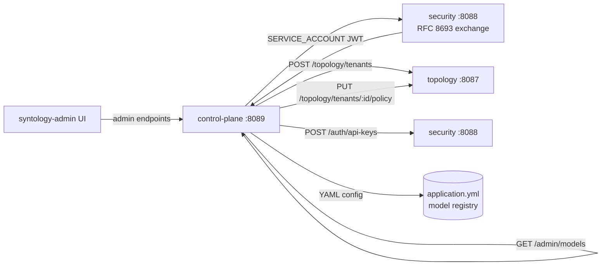

# 08 - control-plane - Phase 3 - First Real Implementation: Admin API, ModelServingDirectory

**Version:** 1.0
**Date:** 2026-07-24
**Status:** Draft for review
**Depends on:** `security` Phase 3 (API-key auth, RFC 8693 service tokens); `topology` Phase 3 (mutation API); `synanton-llm-client` Phase 3 (provider config)
**Scope:** First real implementation of `control-plane`. Admin API for tenant CRUD and policy edits. `ModelServingDirectory` backed by static config. No forecast, anomaly, or GitOps (Phase 4).

---

## 1. Context and Document Alignment

| Source | Role in this plan |
|--------|-------------------|
| [synanton-design-1.19.md](../../architecture/platform/synanton-design-1.19.md) §33 `control-plane` (admin API, ModelServingDirectory, forecast engine, GitOps reconciler - all phased), §34 multi-tenant provisioning flow | Production target. Phase 3 delivers the admin API and static model directory. Forecast, anomaly detection, and GitOps are explicitly Phase 4. |
| [07-topology Phase 3](./07-topology.md) | Admin API proxies tenant and grant mutations to topology. |
| [06-security Phase 3](./06-security.md) | Admin API requires `scope=admin`; control-plane itself calls other services as a `SERVICE_ACCOUNT` via RFC 8693. |

**Explicit non-goals for Phase 3:**

- No forecast engine - Phase 4.
- No anomaly detector - Phase 4.
- No GitOps reconciler - Phase 4.
- No DR runbooks - Phase 5.
- `ModelServingDirectory` is read-only (backed by static `application.yml`). Mutable model directory is Phase 4.
- No RBAC within the admin API - `scope=admin` is the only gate; role-based sub-permissions are Phase 4.
- control-plane does not manage compose deployments - it calls the topology and security APIs over HTTP.

---

## 2. Phase 3 in One Sentence

> Stand up the `control-plane` service (port 8089) with an admin REST API that orchestrates tenant provisioning (via topology), API key generation (via security), and a static `ModelServingDirectory` - authenticated as a service account using RFC 8693 for all downstream calls.

---

## 3. Target Architecture



---

## 4. Data Contracts

### 4.1 `POST /admin/tenants`
Request:
```json
{ "tenant_id": "demo2", "display_name": "Demo Tenant 2", "owner_email": "bob@example.com" }
```
Response (HTTP 201):
```json
{
  "tenant_id": "demo2",
  "display_name": "Demo Tenant 2",
  "created_at": "2026-07-24T10:00:00Z",
  "owner_subject_id": "user:bob@example.com"
}
```

### 4.2 `PUT /admin/tenants/{id}/policy`
Request:
```json
{ "qps_limit": 20, "monthly_usd_limit": 25.00, "max_latency_ms": 4000 }
```
Response (HTTP 200):
```json
{ "tenant_id": "demo2", "qps_limit": 20, "monthly_usd_limit": 25.00, "max_latency_ms": 4000 }
```

### 4.3 `POST /admin/api-keys`
Request:
```json
{ "tenant_id": "demo2", "label": "demo2-prod", "scopes": ["search", "ingest"] }
```
Response (HTTP 201): same shape as `security POST /auth/api-keys` - plaintext key shown once.

### 4.4 `GET /admin/models`
Response:
```json
{
  "models": [
    {
      "model_id": "llama-3.1-8b-instruct",
      "provider": "openai-compat",
      "base_url": "http://vllm-llm:8000/v1",
      "cost_per_token_usd": 0.0000003,
      "capabilities": ["text-generation"],
      "status": "active"
    },
    {
      "model_id": "bge-base-en-v1.5",
      "provider": "openai-compat",
      "base_url": "http://vllm-embed:8001/v1",
      "cost_per_token_usd": 0.0,
      "capabilities": ["embedding"],
      "status": "active"
    }
  ]
}
```

---

## 5. Implementation Design

### 5.1 Spring Boot project setup

New module: `java/control-plane/`. Spring Boot 3.3, port 8089. Gradle module added to `settings.gradle.kts`. Dependencies: `spring-boot-starter-web`, `spring-boot-starter-actuator`, `spring-boot-starter-security`, `synanton-llm-client` (for provider config reading), `shared/common` (for `RequestContext`, `ServiceTokenProvider`).

No database dependency - control-plane has no schema of its own. All data lives in topology (PostgreSQL) and security (PostgreSQL). This is by design: control-plane is a thin orchestration layer.

### 5.2 Authentication - service account identity

At startup, control-plane calls `POST /auth/token` (RFC 8693) with its own bootstrap JWT (a long-lived service JWT stored in env `CONTROL_PLANE_SERVICE_JWT`). This issues a 5-minute service token. `ServiceTokenProvider` (from `shared/common`) manages refresh.

All calls to topology and security from control-plane include `Authorization: Bearer {serviceToken}`.

For inbound admin calls: `AdminAuthFilter` extracts the caller's JWT or API key, calls `POST /security/auth/validate`, and verifies `scope=admin`. Non-admin requests → 403.

### 5.3 `AdminTenantController`

- **`POST /admin/tenants`**: 
  1. Build `owner_subject_id = "user:" + owner_email`.
  2. Call `POST /topology/tenants` with service token.
  3. Call `PUT /topology/tenants/{id}/policy` with default policy (`qps=10, usd=10.00`).
  4. Return 201.

- **`GET /admin/tenants`**: proxies `GET /topology/tenants`. Adds `model_count` from `ModelServingDirectory` (always the same for all tenants in Phase 3).

- **`PUT /admin/tenants/{id}/policy`**: validates body, calls `PUT /topology/tenants/{id}/policy`.

- **`POST /admin/users`**: calls `POST /topology/users` (read: inserts a user record in topology for the tenant). Returns 201.

- **`POST /admin/api-keys`**: calls `POST /security/auth/api-keys` with the caller's admin service token. Returns the key to the admin caller. The plaintext key is never stored by control-plane.

### 5.4 `ModelServingDirectory`

`ModelServingDirectory` is a `@Component` backed by `control-plane.models[]` config list. No external calls. `GET /admin/models` returns the list.

Each model entry in config:
```yaml
control-plane:
  models:
    - model-id: llama-3.1-8b-instruct
      provider: openai-compat
      base-url: http://vllm-llm:8000/v1
      cost-per-token-usd: 0.0000003
      capabilities: [text-generation]
      status: active
    - model-id: bge-base-en-v1.5
      provider: openai-compat
      base-url: http://vllm-embed:8001/v1
      cost-per-token-usd: 0.0
      capabilities: [embedding]
      status: active
```

`ModelServingDirectory` also exposes `getModel(modelId)` used by planner (Phase 4) via an internal HTTP call to `GET /admin/models/{modelId}`.

### 5.5 Metrics

`control_plane_admin_requests_total{operation, tenant, outcome}` counter incremented on every admin endpoint call. `operation` = `create_tenant | update_policy | create_api_key | create_user | list_models`. `outcome` = `success | upstream_error | auth_error`.

---

## 6. Module Boundaries

| Module | Owns in Phase 3 | Does not own |
|--------|----------------|--------------|
| `control-plane` | Admin REST API, `ModelServingDirectory`, service-account auth wiring, `AdminAuthFilter` | Tenant data storage (topology), API key storage (security), model serving (vLLM) |
| `topology` | Tenant and grant storage, policy storage | Admin orchestration logic |
| `security` | API key generation and storage | Admin access control decisions (it enforces scope, not business rules) |

---

## 7. Prerequisites

| # | Prereq | Home | Notes |
|---|--------|------|-------|
| 1 | `topology` Phase 3 `POST /topology/tenants` and `PUT /topology/tenants/{id}/policy` deployed. | `07-topology Phase 3` | control-plane has no value without these. |
| 2 | `security` Phase 3 `POST /auth/token` (RFC 8693) and `POST /auth/api-keys` deployed. | `06-security Phase 3` | Service token and key generation. |
| 3 | `CONTROL_PLANE_SERVICE_JWT` env var set - a long-lived bootstrap JWT for control-plane's service account. | Compose env | Generated by `security` admin once; stored in `.env`. |
| 4 | `shared/common` `ServiceTokenProvider` implemented (from `06-security` Phase 3 tasks). | `06-security Phase 3` | Dependency. |
| 5 | `java/control-plane/` Gradle module scaffold created. | root `settings.gradle.kts` | New module. |

---

## 8. Task Breakdown

| # | Task | Deliverable | Est. |
|---|------|-------------|------|
| CP3-1 | Create `java/control-plane/` Gradle module; Spring Boot scaffold, port 8089, actuator health. | Module + `GET /actuator/health` | 0.5 day |
| CP3-2 | Implement `AdminAuthFilter` - validate inbound JWT/API-key via `POST /security/auth/validate`, check `scope=admin`. | Filter + unit test | 1 day |
| CP3-3 | Implement `ServiceAccountBootstrap` - on startup, use `ServiceTokenProvider` to obtain a service token; refresh before expiry. | Bean + unit test | 0.5 day |
| CP3-4 | Implement `AdminTenantController` - `POST /admin/tenants`, `GET /admin/tenants`, `PUT /admin/tenants/{id}/policy`. | Controller + tests | 1.5 days |
| CP3-5 | Implement `POST /admin/users`, `POST /admin/api-keys`. | Endpoints + tests | 1 day |
| CP3-6 | Implement `ModelServingDirectory` + `GET /admin/models`. | Class + tests | 0.5 day |
| CP3-7 | Add `control_plane_admin_requests_total` Prometheus metric; Micrometer config. | Metrics | 0.5 day |
| CP3-8 | Add `control-plane` service to compose; expose port 8089; inject `CONTROL_PLANE_SERVICE_JWT` from `.env`. | Compose entry | 0.5 day |
| CP3-9 | Integration test `ControlPlaneProvisionIT`: call `POST /admin/tenants` → assert `GET /topology/tenants` lists the new tenant → assert `POST /admin/api-keys` returns a working key. | `ControlPlaneProvisionIT` | 1.5 days |

---

## 9. Testing Strategy

- **Unit:** `AdminTenantController` with mock topology and security HTTP clients. `ModelServingDirectory` with a test YAML config. `AdminAuthFilter` with a mock security validate response.
- **Integration:** `ControlPlaneProvisionIT` (Testcontainers: Postgres + mocked HTTP topology/security). Full provision flow.
- **E2E:** Phase 3 demo script calls `POST /admin/tenants` for `demo2`, then queries with `demo2` API key, asserts tenant isolation.
- **Regression:** control-plane has no Phase 2 state - no regression tests. The Phase 3 test suite is the baseline.

---

## 10. Configuration Surface

```yaml
# control-plane/src/main/resources/application.yaml
control-plane:
  security-url: http://security:8088
  topology-url: http://topology:8087
  admin-scope: admin
  bootstrap-jwt: ${CONTROL_PLANE_SERVICE_JWT}
  models:
    - model-id: llama-3.1-8b-instruct
      provider: openai-compat
      base-url: http://vllm-llm:8000/v1
      cost-per-token-usd: 0.0000003
      capabilities: [text-generation]
      status: active
    - model-id: bge-base-en-v1.5
      provider: openai-compat
      base-url: http://vllm-embed:8001/v1
      cost-per-token-usd: 0.0
      capabilities: [embedding]
      status: active
  http-client:
    connect-timeout-ms: 2000
    read-timeout-ms: 5000

server:
  port: 8089

management:
  endpoints:
    web:
      exposure:
        include: health,info,prometheus
```

---

## 11. Risks and Open Questions

| Risk | Mitigation | Decision |
|------|------------|----------|
| `CONTROL_PLANE_SERVICE_JWT` bootstrap JWT expires (if security service issues a JWT with limited `exp`). | Bootstrap JWT issued with `exp = now() + 365 days` (admin-issued, one-time). In Phase 4, replaced by MTLS or a proper service credential exchange. | Long-lived bootstrap JWT for Phase 3 only. |
| control-plane has no circuit breaker for topology/security HTTP calls. | If topology is down, admin endpoints return 503. This is acceptable for an admin-only path. Phase 4 adds Resilience4j. | No circuit breaker in Phase 3. |
| `ModelServingDirectory` is static - planner uses it to get `cost_per_token_usd`; if config changes, planner must restart. | Phase 3 cost config changes require `docker compose restart control-plane planner`. Phase 4 makes it mutable with a reload endpoint. | Documented operational step. |
| Admin API has no rate limiting - an admin API key can make unlimited calls. | Admin is a trusted scope; rate limiting not required for Phase 3. Phase 4 adds per-scope rate limits. | No rate limiting in Phase 3 admin. |

---

## 12. Definition of Done (Phase 3)

1. `GET http://localhost:8089/actuator/health` returns `{"status":"UP"}`.
2. `POST /admin/tenants` with an admin API key creates `demo2`; `GET /topology/tenants` confirms both `demo` and `demo2` exist.
3. `POST /admin/api-keys` for `demo2` returns a `syn_` prefixed key; that key validates against `POST /security/auth/validate`.
4. `PUT /admin/tenants/demo2/policy` updates the QPS limit; `GET /topology/tenants/demo2/policy` reflects the change.
5. `GET /admin/models` returns at least two model entries from the static config.
6. `control_plane_admin_requests_total{operation="create_tenant",outcome="success"}` counter increments after provisioning.
7. `ControlPlaneProvisionIT` passes in CI.
8. Non-admin API key calling `POST /admin/tenants` returns 403.

---

## 13. Follow-on Phases (Signposted)

- **Phase 4** - `ModelServingDirectory` becomes mutable: `PUT /admin/models/{id}` updates model config; Kafka event triggers planner cost model reload.
- **Phase 4** - Forecast engine: control-plane ingests usage metrics and forecasts monthly spend per tenant.
- **Phase 4** - Anomaly detector: cost or QPS spike detection; alert webhook.
- **Phase 4** - Resilience4j circuit breakers on topology and security HTTP calls.
- **Phase 5** - GitOps reconciler: `PUT /admin/config` accepts a YAML manifest; control-plane applies it to topology + security in idempotent order.
- **Phase 5** - DR runbooks: `POST /admin/runbooks/dr-failover` triggers multi-step recovery sequence.
