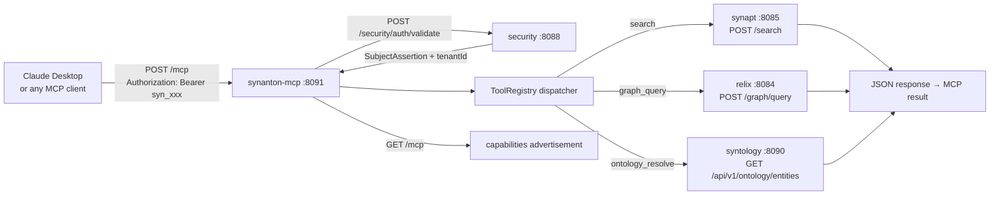

# 10 - synanton-mcp - Phase 3 - First Real Implementation: MCP Tool Surface

**Version:** 1.0
**Date:** 2026-07-24
**Status:** Draft for review
**Depends on:** `security` Phase 3 API-key validation; `synapt` Phase 3 (search endpoint); `relix` Phase 3 (graph query); `syntology` Phase 3 (entity resolve); `shared/common` `RequestContext`
**Scope:** First real implementation of `synanton-mcp`. STREAMABLE_HTTP transport. Three tools: `search`, `graph_query`, `ontology_resolve`. Auth via API key. No SSE (Phase 4).

---

## 1. Context and Document Alignment

| Source | Role in this plan |
|--------|-------------------|
| [synanton-design-1.19.md](../../architecture/platform/synanton-design-1.19.md) §29 `synanton-mcp` (MCP tool surface, STREAMABLE_HTTP transport, tenant-scoped tools, auth delegation) | Production target. Phase 3 delivers the minimal viable MCP surface required for the Phase 3 DoD. |
| [MCP Specification](https://spec.modelcontextprotocol.io/) - STREAMABLE_HTTP transport, tool definition schema, capabilities advertisement | Authoritative protocol spec. Phase 3 targets MCP spec version 2025-03-26. |
| [06-security Phase 3](./06-security.md) | `POST /security/auth/validate` resolves `Bearer syn_` API keys to `SubjectAssertion`. MCP callers must present an API key. |

**Explicit non-goals for Phase 3:**

- No SSE (Server-Sent Events) streaming transport - Phase 4.
- No tool `list_changed` notifications - Phase 4.
- No MCP `sampling` capability - Phase 5.
- No `prompts` or `resources` MCP primitives - tools only.
- No websocket transport - Phase 5.
- No tool call authorization beyond tenant-scope (any valid API-key caller can call any tool).

---

## 2. Phase 3 in One Sentence

> Stand up `synanton-mcp` (port 8091) as a STREAMABLE_HTTP MCP server that exposes `search`, `graph_query`, and `ontology_resolve` tools, authenticates callers via `Bearer syn_` API keys, scopes every tool call to the caller's tenant, and returns results suitable for direct use by Claude Desktop or any MCP-compatible client.

---

## 3. Target Architecture



---

## 4. Data Contracts

### 4.1 MCP capabilities advertisement - `GET /mcp`
```json
{
  "protocolVersion": "2025-03-26",
  "serverInfo": { "name": "synanton-mcp", "version": "1.0.0" },
  "capabilities": {
    "tools": { "listChanged": false }
  },
  "tools": [
    {
      "name": "search",
      "description": "Search the tenant's knowledge corpus and return ranked hits with an optional synthesised answer.",
      "inputSchema": {
        "type": "object",
        "properties": {
          "query": { "type": "string", "description": "The search query." },
          "top_k": { "type": "integer", "default": 10, "description": "Maximum number of hits to return." }
        },
        "required": ["query"]
      }
    },
    {
      "name": "graph_query",
      "description": "Query the tenant's knowledge graph. Supports NEIGHBORS, PATH, and COMMUNITY shapes.",
      "inputSchema": {
        "type": "object",
        "properties": {
          "query_shape": { "type": "string", "enum": ["NEIGHBORS", "PATH", "COMMUNITY"] },
          "params": { "type": "object", "additionalProperties": { "type": "string" } }
        },
        "required": ["query_shape", "params"]
      }
    },
    {
      "name": "ontology_resolve",
      "description": "Resolve an entity label to its canonical type, definition, and relations in the tenant's ontology.",
      "inputSchema": {
        "type": "object",
        "properties": {
          "label": { "type": "string" },
          "version": { "type": "string", "description": "Ontology version (optional, uses pinned or latest)." }
        },
        "required": ["label"]
      }
    }
  ]
}
```

### 4.2 MCP tool call request - `POST /mcp`
```json
{
  "jsonrpc": "2.0",
  "id": "1",
  "method": "tools/call",
  "params": {
    "name": "search",
    "arguments": { "query": "shipping policy", "top_k": 5 }
  }
}
```

### 4.3 MCP tool call response
```json
{
  "jsonrpc": "2.0",
  "id": "1",
  "result": {
    "content": [
      {
        "type": "text",
        "text": "**Search Results for 'shipping policy'**\n\n1. [ProductShippingGuide] Score: 0.94\n   *The product ships in 3-5 business days...*\n\n**Answer:** Products typically ship within 3-5 business days via standard courier."
      }
    ],
    "isError": false
  }
}
```

### 4.4 MCP error response (tool call failure)
```json
{
  "jsonrpc": "2.0",
  "id": "1",
  "result": {
    "content": [{ "type": "text", "text": "Error: upstream search service unavailable (503)" }],
    "isError": true
  }
}
```

---

## 5. Implementation Design

### 5.1 Spring Boot project setup

New module: `java/synanton-mcp/`. Spring Boot 3.3, port 8091. Dependencies: `spring-boot-starter-web`, `spring-boot-starter-actuator`, `shared/common` (`RequestContext`, `ServiceTokenProvider`), `synanton-llm-client` (for potential future synthesis - not used in Phase 3). No Spring Security - auth is handled by the `McpAuthFilter`.

`Content-Type: application/json` for all requests and responses. Chunked encoding is used for the response body when the JSON response is large - but Phase 3 produces a single JSON object, not a stream. SSE (`text/event-stream`) is Phase 4.

### 5.2 `McpAuthFilter`

`OncePerRequestFilter` applied to `POST /mcp`:
1. Extract `Authorization: Bearer {token}` header. If absent: return `{"jsonrpc":"2.0","error":{"code":-32600,"message":"Authorization required"}}`, HTTP 401.
2. Call `POST /security/auth/validate` with the token. Cache the `SubjectAssertion` in a Caffeine cache keyed by the token (TTL 60 s) to avoid a security call on every MCP tool invocation.
3. On 401 from security: return MCP error `{"code": -32600, "message": "Invalid or revoked API key"}`, HTTP 401.
4. Store `SubjectAssertion` in `RequestContext` (via `RequestContextHolder`).

### 5.3 `McpEndpoint`

`@RestController` with two routes:

**`GET /mcp`** - returns the capabilities advertisement JSON (built from the static `ToolRegistry` listing). No auth required - this is a public discovery endpoint.

**`POST /mcp`** - routes JSON-RPC 2.0 requests:
- Parse `method` field.
- `tools/list` → return tools from `ToolRegistry`.
- `tools/call` → extract `params.name` and `params.arguments`, dispatch to `ToolRegistry.invoke(name, arguments, SubjectAssertion)`.
- `initialize` → return server capabilities (same as `GET /mcp` body). MCP clients call this on connection.
- Unknown method → `{"code": -32601, "message": "Method not found"}`.

Error handling: any uncaught exception from a `ToolHandler` is wrapped in `{"isError": true, "content": [{"type": "text", "text": "Error: {message}"}]}` - never a JSON-RPC error (per MCP spec: tool errors are reported in the result, not as JSON-RPC errors).

### 5.4 `ToolRegistry`

```java
public interface ToolHandler {
    String toolName();
    McpContent invoke(Map<String, Object> arguments, SubjectAssertion caller);
}
```

`ToolRegistry` holds `Map<String, ToolHandler>` beans:

**`SearchToolHandler`** - calls `POST http://synapt:8085/search` with body `{ "query": args["query"], "top_k": args.getOrDefault("top_k", 10) }` and `Authorization: Bearer {callerToken}`. Reformats the `QueryResponse` as human-readable markdown: hit excerpts numbered, `answer` field appended if non-null. Returns `McpContent(type=text, text=formattedMarkdown)`.

**`GraphQueryToolHandler`** - calls `POST http://relix:8084/graph/query` with body `{ "query_shape": args["query_shape"], "params": args["params"] }` and the caller's tenant context (set via `X-Tenant-Id: {tenantId}` header - relix reads this in Phase 3). Reformats as markdown table of nodes and edges.

**`OntologyResolveToolHandler`** - calls `GET http://syntology:8090/api/v1/ontology/entities?label={args["label"]}&version={args.getOrDefault("version", "")}` with `X-Tenant-Id` header. Returns entity definition as structured text.

All tool handlers use `java.net.http.HttpClient` (same as `synanton-llm-client`) - no Feign or RestTemplate. Timeout: `synanton-mcp.tool-timeout-ms=5000` per tool call.

### 5.5 `McpContent` formatting

`SearchToolHandler` markdown output format:
```
**Search Results for '{query}'**

1. [{contentRef}] Score: {score:.2f}
   *{excerpt}*

...

**Answer:** {answer}
```
If `answer` is null (synthesis step was skipped by gateway): omit the `**Answer:**` section.

`GraphQueryToolHandler` markdown format:
```
**Graph Query: {query_shape}**

Nodes (N={count}):
- {node_id} ({label}): {key=value, ...}

Edges (E={count}):
- {from} --[{relationship}]--> {to} (weight={weight:.2f})
```

`OntologyResolveToolHandler` format:
```
**Entity: {label}** (type: {entity_type})

Definition: {definition}

Relations:
- {relation_label} → {target_type}
```

---

## 6. Module Boundaries

| Module | Owns in Phase 3 | Does not own |
|--------|----------------|--------------|
| `synanton-mcp` | `McpEndpoint`, `McpAuthFilter`, `ToolRegistry`, three `ToolHandler` implementations, MCP JSON-RPC parsing, response formatting | Search logic (synapt), graph retrieval (relix), ontology storage (syntology), API key validation (security) |
| Downstream services | Their own business logic | MCP protocol, response formatting for MCP consumers |

---

## 7. Prerequisites

| # | Prereq | Home | Notes |
|---|--------|------|-------|
| 1 | `security` Phase 3 `POST /auth/validate` resolves `Bearer syn_` API keys. | `06-security Phase 3` | Non-negotiable. |
| 2 | `synapt` Phase 3 `POST /search` is authenticated and tenant-scoped. | `05-synapt Phase 3` | Tool handler passes the caller's API key through. |
| 3 | `relix` Phase 3 `POST /graph/query` accepts `X-Tenant-Id` header. | `02-relix Phase 3` | Add `X-Tenant-Id` extraction from header in relix Phase 3 if not already done. |
| 4 | `syntology` Phase 3 `GET /api/v1/ontology/entities` accepts `X-Tenant-Id` header. | `09-syntology Phase 3` | Same pattern as relix. |
| 5 | Phase 3 API key generated for `demo` tenant (via `control-plane POST /admin/api-keys`). | Demo setup script | Needed to test Claude Desktop integration. |

---

## 8. Task Breakdown

| # | Task | Deliverable | Est. |
|---|------|-------------|------|
| MCP3-1 | Create `java/synanton-mcp/` Gradle module; Spring Boot scaffold, port 8091, actuator health. | Module scaffold | 0.5 day |
| MCP3-2 | Implement `McpAuthFilter` - API-key extraction, security validate call, Caffeine cache, 401 on failure. | Filter + unit tests | 1 day |
| MCP3-3 | Implement `McpEndpoint` - `GET /mcp` capabilities, `POST /mcp` JSON-RPC 2.0 dispatcher. | Endpoint + tests | 1 day |
| MCP3-4 | Implement `ToolRegistry` interface + `SearchToolHandler` (HTTP call to synapt + markdown formatter). | Handler + tests | 1 day |
| MCP3-5 | Implement `GraphQueryToolHandler` (HTTP call to relix + markdown formatter). | Handler + tests | 1 day |
| MCP3-6 | Implement `OntologyResolveToolHandler` (HTTP call to syntology + text formatter). | Handler + tests | 0.5 day |
| MCP3-7 | Add `synanton_mcp_tool_calls_total{tool, tenant, outcome}` Prometheus counter. | Metrics | 0.5 day |
| MCP3-8 | Add `synanton-mcp` service to compose; expose port 8091. | Compose entry | 0.5 day |
| MCP3-9 | Integration test `McpToolCallIT`: call `POST /mcp` with `tools/call search` and a mock synapt server; assert MCP result format and `isError=false`. | `McpToolCallIT` | 1 day |
| MCP3-10 | Write `docs/user-guides/claude-desktop-setup.md` with Claude Desktop config snippet pointing to `http://localhost:8091/mcp`. | User guide | 0.5 day |

---

## 9. Testing Strategy

- **Unit:** `McpAuthFilter` with mock security HTTP client. `McpEndpoint` routing with mock `ToolRegistry`. Each `ToolHandler` with WireMock stubs for downstream services.
- **Integration:** `McpToolCallIT` (Testcontainers: full stack including security with a pre-seeded API key). Calls `tools/call search` and asserts the MCP result body format.
- **E2E (manual):** Configure Claude Desktop with `claude_desktop_config.json` pointing to `http://localhost:8091/mcp`. Issue a prompt that triggers the `search` tool. Assert Claude receives tenant-scoped hits.
- **Auth:** `McpAuthIT` - missing token → 401; invalid token → 401; valid token for `demo2` → results from `demo2` not `demo`.

---

## 10. Configuration Surface

```yaml
# synanton-mcp/src/main/resources/application.yaml
synanton-mcp:
  security-url: http://security:8088
  synapt-url: http://synapt:8085
  relix-url: http://relix:8084
  syntology-url: http://syntology:8090
  tool-timeout-ms: 5000
  auth-cache:
    ttl-seconds: 60
    max-size: 5000

server:
  port: 8091

management:
  endpoints:
    web:
      exposure:
        include: health,info,prometheus
```

Claude Desktop config snippet (`claude_desktop_config.json` addition):
```json
{
  "mcpServers": {
    "synanton": {
      "url": "http://localhost:8091/mcp",
      "headers": {
        "Authorization": "Bearer syn_<your-api-key>"
      }
    }
  }
}
```

---

## 11. Risks and Open Questions

| Risk | Mitigation | Decision |
|------|------------|----------|
| MCP spec evolution: `2025-03-26` is the target spec version; Claude Desktop may require a different version. | Synanton-mcp echoes back the client's `protocolVersion` in the `initialize` response, clamped to `2025-03-26`. Future spec versions are handled by adding new method handlers. | Version echo strategy. |
| Tool call timeout (5 s) may be too short if synapt synthesis takes 2-3 s + network. | Set `tool-timeout-ms=8000` for search specifically; `5000` for graph and ontology. Expose per-tool timeout config. | Per-tool timeout config. |
| `SearchToolHandler` forwards the caller's raw API key to synapt. If synapt validates the key against security, this is a direct pass-through - correct. If synapt expects a service JWT, the key will be rejected. | Synapt Phase 3 validates both API keys and JWTs (via `security Phase 3`). Direct API key forwarding is the correct approach. | Confirmed: forward API key to synapt. |
| `graph_query` result set for COMMUNITY shape can be 200 nodes - markdown output is very long. | Cap markdown output to 50 nodes/edges with a `...and N more` suffix. Full result available via direct relix API call. | Cap at 50 nodes in formatter. |
| Claude Desktop network routing: `localhost:8091` must be reachable from the Claude Desktop process. | Synanton runs on the local machine; `localhost` works. For remote deployments, update the URL in the user guide. | Document clearly. |

---

## 12. Definition of Done (Phase 3)

1. `GET http://localhost:8091/mcp` returns the capabilities JSON listing three tools: `search`, `graph_query`, `ontology_resolve`.
2. `POST /mcp` with `tools/list` returns all three tools with their input schemas.
3. `POST /mcp` with `tools/call search` and a valid API key returns a non-empty MCP result with `isError=false`.
4. The result for `search` is tenant-scoped: a `demo` API key sees `demo` corpus; a `demo2` API key sees `demo2` corpus.
5. `POST /mcp` with an invalid/revoked API key returns HTTP 401.
6. Claude Desktop configured with `synanton-mcp` endpoint successfully calls `search` and displays results in a conversation (manual E2E verification).
7. `synanton_mcp_tool_calls_total{tool="search", tenant="demo", outcome="success"}` counter increments after a successful call.
8. `McpToolCallIT` passes in CI.
9. `GET /actuator/health` returns `{"status":"UP"}`.

---

## 13. Follow-on Phases (Signposted)

- **Phase 4** - SSE (`text/event-stream`) streaming transport: synthesis tokens streamed to the MCP client as they arrive from vLLM.
- **Phase 4** - `tool_changed` notifications: when tools are added or modified, connected MCP clients are notified.
- **Phase 4** - Additional tools: `ingest_document`, `list_collections`, `get_job_status`.
- **Phase 5** - MCP `prompts` primitive: pre-defined prompt templates that combine search + synthesis.
- **Phase 5** - MCP `resources` primitive: expose corpus manifests as browsable resources.
- **Phase 5** - Websocket transport for persistent MCP connections.
