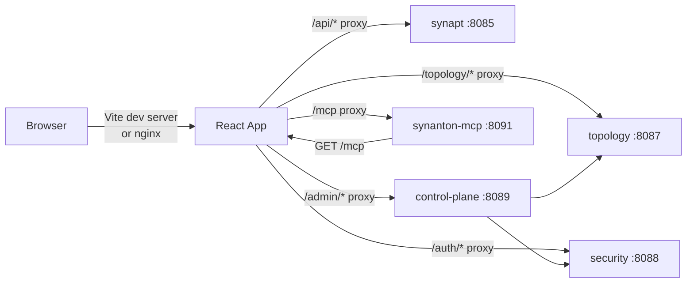

# 11 - syntology-admin (UI) - Phase 3 - Tenant Switcher, Admin Panel, MCP Config Panel

**Version:** 1.0
**Date:** 2026-07-24
**Status:** Draft for review
**Depends on:** `syntology-admin` Phase 2 DoD met; `control-plane` Phase 3 deployed (admin API); `synanton-mcp` Phase 3 deployed (capabilities endpoint); `topology` Phase 3 (tenant list endpoint)
**Scope:** Extend the existing React/Vite UI with a tenant switcher, an admin panel for tenant provisioning and API key generation, and an MCP config panel showing the tool list and Claude Desktop config snippet.

---

## 1. Context and Document Alignment

| Source | Role in this plan |
|--------|-------------------|
| [synanton-design-1.19.md](../../architecture/platform/synanton-design-1.19.md) §28 `syntology-admin` (UI, admin panel, tenant switcher, MCP config panel) | Production target. Phase 3 adds multi-tenant awareness and admin capabilities to the existing UI. |
| [syntology-admin Phase 2](../phase2/08-syntology-admin.md) | Foundation. Phase 2 delivered login screen, corpus browser, and the grants table - all wired against real endpoints. Note: the Synanton standalone demo already implemented these against real auth. Phase 3 brings multi-tenant features to the main platform track. |
| [08-control-plane Phase 3](./08-control-plane.md) | Admin panel calls `control-plane` endpoints at port 8089. |
| [10-synanton-mcp Phase 3](./10-synanton-mcp.md) | MCP config panel reads from `GET /mcp`. |

**Explicit non-goals for Phase 3:**

- No graph visualisation (relix graph browser) - Phase 4.
- No live ingestion progress websocket - Phase 4 (currently polling `GET /jobs/{id}`).
- No dark mode - Phase 4.
- No i18n - English only.
- No role-based UI element hiding beyond checking `scope=admin` in the decoded JWT/assertion.
- No drag-and-drop ontology editor - Phase 5.

---

## 2. Phase 3 in One Sentence

> Add a tenant switcher to the header (listing tenants from topology), an admin panel for CRUD on tenants and API keys (via control-plane), and an MCP config panel that renders the three tool definitions and a copy-pasteable Claude Desktop config - all behind the existing login screen already wired to the real auth endpoint.

---

## 3. Target Architecture



**Tech stack:** React 18, TypeScript, Vite 5, React Query (TanStack Query v5), React Router v6, Tailwind CSS. No new framework dependencies. All new UI is built with the existing component patterns from Phase 2.

---

## 4. Data Contracts (UI perspective)

### 4.1 Tenant switcher data source
```
GET /topology/tenants
→ [{ "tenant_id": "demo", "display_name": "Demo Tenant 1" }, { "tenant_id": "demo2", "display_name": "Demo Tenant 2" }]
```

### 4.2 Admin panel - create tenant form fields
```
tenant_id (text, required), display_name (text, required), owner_email (text, required)
→ POST /admin/tenants
```

### 4.3 API key modal - generate
```
label (text, required), scopes (multi-select: search, ingest, admin)
→ POST /admin/api-keys
← { key_id, key (shown once), label, scopes, created_at }
```

### 4.4 MCP config panel data source
```
GET /mcp
→ { tools: [{ name, description, inputSchema }], ... }
```
Rendered as:
- Tool name + description + input schema table.
- `claude_desktop_config.json` snippet with the current user's API key pre-filled (if one was just generated in the admin panel, otherwise a `<your-api-key>` placeholder).

---

## 5. Implementation Design

### 5.1 Tenant switcher

Location: top-right of the persistent header, next to the user avatar. Renders as a `<select>` or a custom dropdown.

**Data loading:** React Query `useQuery(['tenants'], () => api.get('/topology/tenants'))`. Stale time: 60 s.

**On switch:**
1. Call `localStorage.setItem('activeTenantId', selectedTenantId)`.
2. Navigate to `/login?tenantHint={selectedTenantId}` - this clears the current session (removes JWT from localStorage) and pre-fills the tenant field on the login form.
3. After successful login as the new tenant, the app reads `activeTenantId` from localStorage and includes it in all API calls as `X-Tenant-Id: {tenantId}` header (synapt and syntology use this header for operator convenience; the server-side JWT already carries the canonical tenant).

**Auth scope check:** the tenant switcher is visible to all authenticated users. Switching to a tenant the user does not have credentials for will result in a login failure - no pre-check on the client side.

### 5.2 Admin panel

Route: `/admin` (protected: only rendered if decoded JWT/assertion contains `scope=admin`; otherwise redirect to `/` with a toast "Admin access required").

**Sub-sections:**

**Tenants tab** (`/admin/tenants`):
- Table: `GET /admin/tenants` (via control-plane). Columns: `tenant_id`, `display_name`, `qps_limit`, `monthly_usd_limit`, action buttons.
- "New Tenant" button → modal form → `POST /admin/tenants` → on success, invalidate `['tenants']` query, show toast.
- "Edit Policy" button → inline edit row → `PUT /admin/tenants/{id}/policy` → save.

**API Keys tab** (`/admin/api-keys`):
- List: `GET /auth/api-keys` (via security, scoped to the admin's tenant).
- "Generate API Key" button → modal with `label` + `scopes` checkboxes → `POST /admin/api-keys` → modal shows the plaintext key in a code block with a "Copy" button. Key is shown only in this modal; closing dismisses it.
- "Revoke" button → `DELETE /auth/api-keys/{id}` → confirm dialog → on confirm, remove from list.

**Users tab** (`/admin/users`):
- Simple list of user subjects for the tenant (from `GET /topology/tenants/{id}/users` - new lightweight endpoint added to topology if not already present, or from the grants table).
- "Add User" → `POST /admin/users` → creates user record.

### 5.3 MCP config panel

Route: `/mcp-config` (visible to all authenticated users - helps API key holders configure their MCP client).

**Tool list:** React Query `useQuery(['mcpCapabilities'], () => api.get('/mcp'))`. Renders each tool as a collapsible card:
- Tool name (bold), description.
- Input schema as a table: parameter name | type | required | description.

**Claude Desktop config snippet:**
```typescript
const config = {
  mcpServers: {
    synanton: {
      url: `${window.location.origin}/mcp`,
      headers: { Authorization: `Bearer ${apiKey || '<your-api-key>'}` }
    }
  }
};
```
Rendered in a `<pre>` code block with syntax highlighting (Prism.js, already in Phase 2 deps). "Copy to clipboard" button. If the user just generated an API key in the admin panel, the key is pre-filled (passed via React Router state or a React context). Otherwise: `<your-api-key>` placeholder with a link to the API Keys tab.

### 5.4 `vite.config.ts` proxy additions

```typescript
proxy: {
  '/api': { target: 'http://localhost:8085', changeOrigin: true },  // synapt (existing)
  '/auth': { target: 'http://localhost:8088', changeOrigin: true }, // security (existing)
  '/topology': { target: 'http://localhost:8087', changeOrigin: true }, // topology (existing)
  '/admin': { target: 'http://localhost:8089', changeOrigin: true }, // control-plane (NEW)
  '/mcp': { target: 'http://localhost:8091', changeOrigin: true }   // synanton-mcp (NEW)
}
```

### 5.5 `nginx.conf` additions (production container)

```nginx
location /admin/ {
    proxy_pass http://control-plane:8089/admin/;
    proxy_set_header Host $host;
    proxy_set_header X-Real-IP $remote_addr;
}

location /mcp {
    proxy_pass http://synanton-mcp:8091/mcp;
    proxy_set_header Host $host;
    proxy_set_header Authorization $http_authorization;
}
```

The `Authorization` header must be forwarded to `/mcp` so the MCP auth filter receives the API key from the browser.

---

## 6. Module Boundaries

| Module | Owns in Phase 3 | Does not own |
|--------|----------------|--------------|
| `syntology-admin` (UI) | React components, routing, Vite proxy config, nginx additions, client-side tenant switching | Auth enforcement (security), tenant storage (topology), API key storage (security), MCP server (synanton-mcp) |
| `control-plane` | Admin CRUD endpoints | UI rendering |
| `synanton-mcp` | Tool definitions, capabilities response | UI config panel rendering |

---

## 7. Prerequisites

| # | Prereq | Home | Notes |
|---|--------|------|-------|
| 1 | `syntology-admin` Phase 2 DoD met - login screen, corpus browser, grants table working. | - | Non-negotiable. |
| 2 | `control-plane` Phase 3 deployed - `POST /admin/tenants`, `GET /admin/tenants`, `POST /admin/api-keys` available. | `08-control-plane Phase 3` | Admin panel has no value without these. |
| 3 | `synanton-mcp` Phase 3 deployed - `GET /mcp` returns capabilities. | `10-synanton-mcp Phase 3` | MCP config panel depends on this. |
| 4 | `topology` Phase 3 `GET /topology/tenants` returns multi-tenant list. | `07-topology Phase 3` | Tenant switcher data source. |
| 5 | Vite dev proxy config supports `/admin` and `/mcp` routes. | This plan §5.4 | Done in this plan. |

---

## 8. Task Breakdown

| # | Task | Deliverable | Est. |
|---|------|-------------|------|
| UI3-1 | Add `/admin` and `/mcp` proxy entries to `vite.config.ts` and `nginx.conf`. | Config updates | 0.5 day |
| UI3-2 | Implement `TenantSwitcher` component - dropdown listing tenants, localStorage write, navigate-to-login. | Component + unit test (React Testing Library) | 1 day |
| UI3-3 | Implement `AdminGuard` - checks `scope=admin` in JWT; redirects non-admin users. | HOC + test | 0.5 day |
| UI3-4 | Implement `AdminTenantsTab` - table of tenants, "New Tenant" modal, "Edit Policy" inline edit. | Page + tests | 1.5 days |
| UI3-5 | Implement `AdminApiKeysTab` - list keys, "Generate" modal with one-time display, "Revoke" with confirm. | Page + tests | 1.5 days |
| UI3-6 | Implement `AdminUsersTab` - list users, "Add User" form. | Page + tests | 1 day |
| UI3-7 | Implement `/admin` route with tabs (Tenants, API Keys, Users); wire `AdminGuard`. | Route + layout | 0.5 day |
| UI3-8 | Implement `McpConfigPanel` (`/mcp-config`) - tool cards from `GET /mcp`, Claude Desktop snippet, copy button. | Page + tests | 1.5 days |
| UI3-9 | Cross-link: after API key generation in admin panel, offer "Configure MCP Client" button navigating to `/mcp-config` with key pre-filled via router state. | Navigation + state passing | 0.5 day |
| UI3-10 | E2E test (Playwright): log in as admin → create `demo2` tenant → generate API key → verify key appears in API keys list → navigate to MCP config panel → verify tool list renders. | `admin-flow.spec.ts` | 1 day |

---

## 9. Testing Strategy

- **Unit (React Testing Library):** `TenantSwitcher` with mocked `GET /topology/tenants`. `AdminApiKeysTab` with mocked `POST /admin/api-keys` and one-time key display assertion. `McpConfigPanel` with mocked `GET /mcp` returning three tools.
- **Integration:** Vite proxy config tested by starting the Vite dev server with mock backend servers; asserting `/admin` requests reach the mock control-plane.
- **E2E (Playwright):** `admin-flow.spec.ts` covers the full admin provisioning flow. `mcp-config.spec.ts` covers the MCP panel rendering and copy button.
- **Regression:** Phase 2 login flow, corpus browser, and grants table Playwright tests pass unchanged.

---

## 10. Configuration Surface

```typescript
// vite.config.ts (additions)
proxy: {
  '/admin': { target: process.env.VITE_CONTROL_PLANE_URL ?? 'http://localhost:8089', changeOrigin: true },
  '/mcp': { target: process.env.VITE_MCP_URL ?? 'http://localhost:8091', changeOrigin: true }
}
```

```bash
# .env (additions for local development)
VITE_CONTROL_PLANE_URL=http://localhost:8089
VITE_MCP_URL=http://localhost:8091
```

---

## 11. Risks and Open Questions

| Risk | Mitigation | Decision |
|------|------------|----------|
| One-time API key display: if the user closes the modal before copying, the key is lost. | Modal has a "I have copied the key" confirmation checkbox before the close button is enabled. If dismissed without checking, show a warning: "You will not see this key again." | UX gate on dismiss. |
| `window.location.origin` in the MCP config snippet will be `http://localhost:3000` in dev and the production domain in prod. | This is correct - the snippet should reflect the actual deployment URL. In dev it is `localhost:3000` via Vite proxy; in prod it is the nginx reverse proxy URL. | Correct by construction. |
| Admin panel accessible via `/admin` URL - non-admin users who navigate directly get a redirect. | `AdminGuard` checks scope and redirects with a toast. No sensitive data is loaded before the guard fires. | Guard fires before any admin API call. |
| Tenant switcher clears the session by navigating to `/login` - user must re-enter credentials. | This is expected behaviour for a tenant context switch. Phase 4 may add tenant-context switching without re-login if the user holds a multi-tenant JWT. | Documented UX. |
| `GET /mcp` is an unauthenticated public endpoint - MCP config panel does not require login. | The page at `/mcp-config` is behind the app's `AuthGuard` - the `GET /mcp` call is made client-side with the user's JWT in headers. The endpoint itself allows unauthenticated access for tooling, but the UI always sends auth. | UI always sends auth; server endpoint is optionally public. |

---

## 12. Definition of Done (Phase 3)

1. Tenant switcher renders in the header; clicking "Demo Tenant 2" navigates to `/login?tenantHint=demo2`.
2. `/admin` route is accessible to users with `scope=admin`; non-admin users see a "Admin access required" toast and are redirected.
3. "New Tenant" modal creates `demo2` via `POST /admin/tenants`; the tenant appears in the tenant switcher dropdown.
4. "Generate API Key" modal shows the plaintext `syn_` prefixed key in a copy-able code block; key is not visible after modal close.
5. MCP config panel at `/mcp-config` lists three tools (search, graph_query, ontology_resolve) with their descriptions.
6. The Claude Desktop config snippet shows the correct `url` for the current environment.
7. `admin-flow.spec.ts` Playwright test passes end-to-end.
8. Phase 2 Playwright regression tests (`login-flow.spec.ts`, `corpus-browser.spec.ts`) pass unchanged.
9. nginx routes `/admin/` and `/mcp` correctly to their respective services in the production container.
10. `vite.config.ts` proxy routes verified by running `npm run dev` and issuing requests to `/admin/tenants` - request reaches control-plane.

---

## 13. Follow-on Phases (Signposted)

- **Phase 4** - Graph browser tab: visualise relix graph results using a D3.js or Cytoscape.js force-directed graph.
- **Phase 4** - Live ingestion progress: replace `GET /jobs/{id}` polling with a websocket subscription to the job status stream.
- **Phase 4** - Tenant context switching without re-login: multi-tenant JWT or server-side session context switch.
- **Phase 5** - Ontology editor: drag-and-drop entity type and relation editor backed by `POST /api/v1/ontology/entities`.
- **Phase 5** - Dark mode and i18n support.
