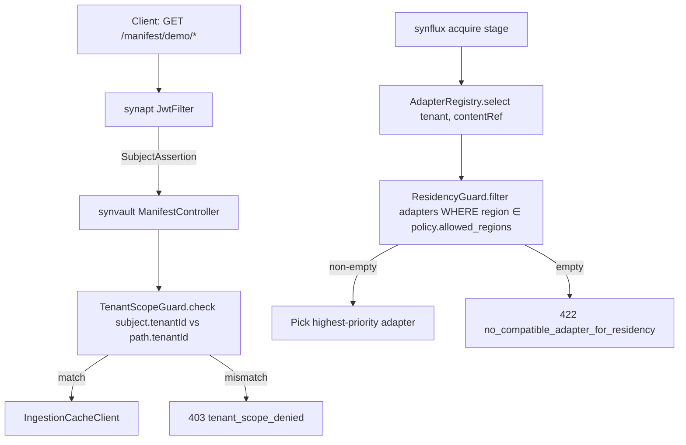

# 02 - synvault - Phase 4 - Tenant-Scoped Manifest Reads & Residency Enforcement

**Version:** 1.0
**Date:** 2026-08-11
**Status:** Draft for review
**Depends on:** Phase 3 `synvault` DoD (unchanged since Phase 1: `FilesystemAdapter`, `MinioObjectStoreAdapter`, `GET /manifest/{tenant}`, `GET /content/{tenant}/{ref}`). Phase 4 `topology` (`10-topology.md`) publishes `data_residency_policy` on `organizations`.
**Scope:** Enforce tenant scoping on every manifest and content read (defence-in-depth on top of `synapt` auth) and refuse adapter selection that would place bytes in a region outside the tenant's `residency.allowed_regions`.

---

## 1. Context and Document Alignment

| Source | Role in this plan |
|--------|-------------------|
| [synanton-design-1.19.md](../../architecture/synanton-design-1.19.md) §16 `synvault` | Production target - Tier Manager, adapter registry |
| [synanton-design-1.19.md](../../architecture/synanton-design-1.19.md) §29 Content Adapter SPI | Adapter SPI stays contract-stable; we add region metadata |
| [synanton-design-1.19.md](../../architecture/synanton-design-1.19.md) §43 Cross-Region & Data Residency | Enforcement rules |
| [synanton-design-1.19.md](../../architecture/synanton-design-1.19.md) §41 Multi-Tenancy and Isolation Tiers | Manifest read scoping requirement |
| [10-topology.md](./10-topology.md) | Publishes `organizations.data_residency_policy JSONB`; produces `topology_events` residency change events |

**Explicit non-goals for Phase 4:**

- No tier movement work (HOT → WARM → COLD → Glacier remains Phase 5).
- No Glacier retrieval flow (Phase 5).
- No re-region migration of existing content (Phase 5 - `RecrawlAfterRestorationWorkflow` handles it).
- No content-body sanitisation - bodies are opaque bytes and are only re-served, never rendered by `synvault`.

---

## 2. Phase 4 in One Sentence

> Every `GET /manifest/{tenant}/*` and `GET /content/{tenant}/{ref}` call is gated by the caller's `SubjectAssertion.tenant_id`, and every write path (adapter selection at ingest time) refuses adapters whose `region` is not in the tenant's `data_residency_policy.allowed_regions`.

---

## 3. Target Architecture



---

## 4. Data Contracts

### 4.1 Manifest read - tenant scope enforcement

`GET /manifest/{tenant}` (existing) - now requires:

- `Authorization: Bearer <token>` (JWT from Phase 2 or API key from Phase 3).
- Path `{tenant}` MUST equal `SubjectAssertion.tenant_id`. `support_admin` role (§26 v1.19) can pass `?on_behalf_of={tenant}` to override.

Response headers added:

```
X-Synanton-Residency: us-east-1,us-west-2
X-Synanton-Tenant-Scope: enforced
```

On mismatch:

```json
HTTP 403 Forbidden
{
  "type": "https://synanton.org/errors/tenant-scope-denied",
  "title": "Caller tenant does not match resource tenant",
  "status": 403,
  "caller_tenant": "demo",
  "resource_tenant": "demo2"
}
```

Emit `synvault_tenant_scope_denied_total{caller_tenant,resource_tenant}`.

### 4.2 Content read - tenant scope + region trace

`GET /content/{tenant}/{content_ref}` - same tenant scope rule. Adds header:

```
X-Synanton-Served-From-Region: us-east-1
```

This lets `gateway` and `synanton-mcp` echo the region on the `execution_trace.warnings` when the read region differs from the caller's preferred region.

### 4.3 Adapter registry - residency filter

Adapter registration is unchanged (Phase 1 SPI). New: every `ContentAdapter` implementation MUST publish `region()` via the `ContentAdapter.descriptor()` method already required by §29. For registered adapters that do not publish a region (legacy `FilesystemAdapter` used in dev), `synvault.adapters.default_region` is used as a fallback (config default: `local`, treated as matching *any* residency).

Selection algorithm (`AdapterRegistry.select(tenantId, contentRef)`):

```
policy   ← topology.getResidencyPolicy(tenantId)
allowed  ← policy.allowed_regions  // e.g. ["us-east-1","us-west-2"]
regionOk ← { adapter | adapter.region ∈ allowed OR adapter.region = "local" }
candidates ← regionOk ∩ adapter.supports(contentRef)
if candidates empty:
  throw ResidencyRefusalException(422)
return highest_priority(candidates)
```

Refusal:

```json
HTTP 422 Unprocessable Entity
{
  "type": "https://synanton.org/errors/residency-refusal",
  "title": "No adapter available in tenant's allowed regions",
  "status": 422,
  "tenant": "demo",
  "allowed_regions": ["us-east-1"],
  "available_regions": ["eu-west-1","ap-southeast-1"]
}
```

Emit `synvault_residency_refusal_total{tenant,requested_region,allowed_regions_hash}`. Audit row written via `topology` audit port (see `10-topology.md` §5).

---

## 5. Implementation Design

### 5.1 `TenantScopeGuard`

```java
@Component
public final class TenantScopeGuard {
    Result check(String pathTenantId, SubjectAssertion caller) {
        if (caller.identityProfile() == IdentityProfile.SUPPORT_ADMIN) return Result.ALLOWED;
        if (Objects.equals(pathTenantId, caller.tenantId())) return Result.ALLOWED;
        return Result.DENIED;
    }
}
```

Wired as a Spring `HandlerInterceptor` on all `/manifest/**` and `/content/**` routes. `support_admin` explicit override requires `?on_behalf_of=<tenant>` AND emits `admin_audit` row.

### 5.2 `ResidencyGuard`

```java
public final class ResidencyGuard {
    public List<ContentAdapter> filter(List<ContentAdapter> candidates, ResidencyPolicy policy) {
        var allowed = policy.allowedRegions();
        return candidates.stream()
            .filter(a -> a.region().equals("local") || allowed.contains(a.region()))
            .toList();
    }
}
```

Called from `AdapterRegistry.select` and from `synflux.AcquireStage.pickAdapter` (via the shared `synvault` client). Refusal escalates as `ResidencyRefusalException` (mapped to 422 in the REST layer, to `content_adapter_refused` job outcome in `synflux`).

### 5.3 `ResidencyPolicyCache`

Reads from `topology` via gRPC:

```protobuf
service TopologyQuery {
  rpc GetResidencyPolicy(TenantId) returns (ResidencyPolicy);
}
message ResidencyPolicy {
  string tenant_id = 1;
  repeated string allowed_regions = 2;
  string version = 3;   // for cache invalidation
  google.protobuf.Timestamp updated_at = 4;
}
```

Caffeine cache with 60 s TTL, invalidated on `topology_events` for `event_type=RESIDENCY_UPDATED`. Metric `synvault_residency_policy_cache_hit_ratio`.

### 5.4 Read-path implementation

`ManifestController` and `ContentController` gain the `TenantScopeGuard` via an interceptor - no per-endpoint code changes required. The support-admin `on_behalf_of` path adds:

```java
if (caller.hasRole("support_admin") && req.getParameter("on_behalf_of") != null) {
    var target = req.getParameter("on_behalf_of");
    auditWriter.record(AuditRow.of(caller, "on_behalf_of", target));
    return Result.ALLOWED_WITH_AUDIT;
}
```

### 5.5 Compatibility for existing local dev

`FilesystemAdapter` returns `region() == "local"`. `local` is treated as matching every residency policy so single-machine demos continue to work without a `topology` running. In production, deployment overlays set `synvault.adapters.default_region` to the actual region string (`us-east-1`, etc.) and `FilesystemAdapter` is disabled behind the `dev` profile.

---

## 6. Module Boundaries

| Module | Owns in Phase 4 | Does not own |
|---|---|---|
| `synvault` | `TenantScopeGuard`, `ResidencyGuard`, `ResidencyPolicyCache`, refusal error mapping, new headers | Storing residency policy (in `topology`); enforcing region on GPU inference (planner) |
| `topology` | `organizations.data_residency_policy` column + `RESIDENCY_UPDATED` outbox event | Consuming events in synvault |
| `synflux` | Handles `ResidencyRefusalException` at acquire stage, sets `job.state=FAILED_RESIDENCY` | The refusal itself |

---

## 7. Prerequisites

| # | Prereq | Home | Notes |
|---|---|---|---|
| 1 | `topology` Phase 4 residency policy schema live (see `10-topology.md`) | topology | Non-negotiable |
| 2 | `topology` `TopologyQuery` gRPC service exposing `GetResidencyPolicy` | topology | New RPC |
| 3 | `topology_events` topic includes `RESIDENCY_UPDATED` events | topology | For cache invalidation |
| 4 | Each production `ContentAdapter` publishes `region()` in `descriptor()` | adapter authors | Concrete adapters: `S3Adapter`, `SharePointAdapter` future-proofed |
| 5 | `shared/common` sanitisation library (Phase 4 `01-shared-common.md`) available | shared | Even though bodies are bytes, control-plane JSON payloads use it |

---

## 8. Task Breakdown

| # | Task | Deliverable | Est. |
|---|---|---|---|
| SV4-1 | Implement `TenantScopeGuard` + `SupportAdminOverrideFilter`; wire as `HandlerInterceptor` on `/manifest/**` and `/content/**` | Interceptor + tests | 1 day |
| SV4-2 | Add `region()` to `ContentAdapter` SPI (default returns `"local"`) with migration note in module docs | SPI update | 0.5 day |
| SV4-3 | Implement `ResidencyGuard` and wire into `AdapterRegistry.select` | Class + tests | 0.5 day |
| SV4-4 | Implement `ResidencyPolicyCache` (Caffeine + `topology_events` invalidation) | Class + tests | 1 day |
| SV4-5 | Wire `ResidencyRefusalException` handling in REST controllers (422) and in `synflux.AcquireStage` (`FAILED_RESIDENCY` outcome) | Controller advice + synflux update | 1 day |
| SV4-6 | Add response headers `X-Synanton-Residency`, `X-Synanton-Tenant-Scope`, `X-Synanton-Served-From-Region` | Header filter | 0.5 day |
| SV4-7 | Metrics: `synvault_tenant_scope_denied_total`, `synvault_residency_refusal_total`, `synvault_residency_policy_cache_hit_ratio` | Micrometer wiring | 0.5 day |
| SV4-8 | Integration test `TenantScopeIT` (Testcontainers): tenant A cannot read tenant B's manifest | `TenantScopeIT` | 0.5 day |
| SV4-9 | Integration test `ResidencyIT`: adapter mock in `eu-west-1` refused for tenant with `allowed=[us-east-1]` | `ResidencyIT` | 0.5 day |
| SV4-10 | Update Phase 1 adapter demo profile so `FilesystemAdapter.region = "local"` continues to work | Config-only | 0.25 day |

---

## 9. Testing Strategy

- **Unit:** `TenantScopeGuardTest` covering match / mismatch / support_admin override. `ResidencyGuardTest` covering allowed / refused / `local` bypass. `ResidencyPolicyCacheTest` verifies invalidation on `RESIDENCY_UPDATED` event.
- **Integration:** `TenantScopeIT` and `ResidencyIT` (see tasks above). Uses `TopologyStub` gRPC service.
- **Regression:** Phase 1 `manifest_returns_expected_shape` and `content_stream_ok` tests unchanged (they now supply a valid `SubjectAssertion` in the header).
- **Security:** `TenantScopeEnumerationTest` - fuzzes 100 random tenant IDs against a single-tenant caller; asserts all return 403 and none return 404 (avoiding tenant existence oracle).

---

## 10. Configuration Surface

```yaml
# synvault/src/main/resources/application-phase4.yaml
synvault:
  tenant-scope:
    enabled: true
    support-admin-override:
      enabled: true          # requires ?on_behalf_of=<tenant>
      audit: true             # always audited
  residency:
    enabled: true
    policy-cache:
      ttl-seconds: 60
      max-size: 1024
    refusal-http-status: 422
  adapters:
    default-region: "local"   # override per environment; production overlays use "us-east-1" etc.
    dev:
      filesystem-adapter-enabled: true    # gated by 'dev' Spring profile in prod
```

---

## 11. Risks and Open Questions

| Risk | Mitigation | Decision |
|---|---|---|
| Fallback `region = "local"` becomes a bypass in production | `FilesystemAdapter` is enabled only under Spring `dev` profile in production overlays; CI gate `no-local-in-prod` scans the compiled config | Add gate |
| `ResidencyPolicyCache` 60 s TTL means a revoked region can serve for up to 60 s | Kafka `topology_events` invalidation targets < 1 s; TTL is a fail-safe. HIGH_SECURITY tenants use TTL = 5 s (config override) | Accepted |
| Denying reads with 403 leaks tenant existence (attacker enumerates 403 vs 404) | Both cases return 403 with the same body shape (no distinction). Test enforces this. | Enforced in tests |
| Support-admin override could be abused | Always audited; alert on `admin_audit` rows where `on_behalf_of != actor.tenant_id` above a rate threshold (wired in `15-observability.md`) | Alert `SupportAdminOnBehalfOfRate` (page if > 20 / hour) |
| Adapters missing `region()` implementation break at boot | Default implementation in the SPI returns `"local"`; deprecation warning logged; CI gate `residency-region-required` blocks merges of new adapters without an explicit region | Add gate |

---

## 12. Definition of Done (Phase 4)

1. `curl -H "Authorization: Bearer <tenantA_key>" /manifest/tenantB/` returns 403; response body carries no distinguishing info between "wrong tenant" and "no such tenant".
2. `synvault_tenant_scope_denied_total{caller_tenant="tenantA",resource_tenant="tenantB"}` increments.
3. Ingesting a document for a tenant with `allowed_regions=["us-east-1"]` when only an `eu-west-1` adapter is registered fails with HTTP 422 and the job transitions to `FAILED_RESIDENCY`; `synvault_residency_refusal_total` increments.
4. Rotating a tenant's `data_residency_policy` triggers `RESIDENCY_UPDATED` on `topology_events`; next request served with the new policy within 1 s (invalidation) or 60 s (TTL fallback).
5. `X-Synanton-Served-From-Region` header echoes on every content read; verified by integration test.
6. All Phase 1 manifest/content tests pass unchanged (with auth header supplied).
7. Support-admin `on_behalf_of` override works and is audited; audit row visible via `topology`'s admin API.
8. CI gates `no-local-in-prod` and `residency-region-required` in place.

---

## 13. Follow-on Phases (Signposted)

- **Phase 5** - Tier movement engine (HOT → WARM → COLD → Glacier) with per-tier region rules; Glacier retrieval flow.
- **Phase 5** - Re-region migration of existing content when a tenant's `allowed_regions` shrinks (backfill with `RecrawlAfterRestorationWorkflow`).
- **Phase 5** - Cross-region replication of hot manifest for read latency; residency remains authoritative on writes.
