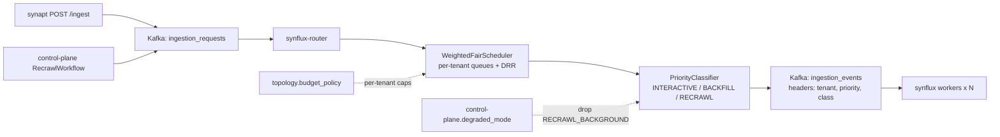

# 03 - synflux-router - Phase 4 - Per-Tenant Fair Scheduling & Priority Queues

**Version:** 1.0
**Date:** 2026-08-11
**Status:** Draft for review
**Depends on:** Phase 3 `synflux-router` DoD (`ingestion_requests` → `ingestion_events` Kafka fan-out, work partitioning). Phase 4 `topology` (`budget_policy`, `tiering_policy`).
**Scope:** Prevent a hot tenant from starving a steady tenant. Introduce weighted-fair queueing across tenants, a small set of priority classes (`INTERACTIVE > BACKFILL > RECRAWL_BACKGROUND`), and per-tenant concurrency caps derived from `topology.budget_policy`.

---

## 1. Context and Document Alignment

| Source | Role in this plan |
|--------|-------------------|
| [synanton-design-1.19.md](../../architecture/synanton-design-1.19.md) §17 `synflux` (router responsibilities, GPU degraded mode, kafka retention flexibility) | Production target |
| [synanton-design-1.19.md](../../architecture/synanton-design-1.19.md) §27 control-plane `RecrawlAfterRestorationWorkflow` | Origin of low-priority recrawl work that must not starve interactive ingest |
| [synanton-design-1.19.md](../../architecture/synanton-design-1.19.md) §25 `topology` (`budget_policy`) | Source of per-tenant concurrency caps |
| [phase3/01-ingestion-pipeline.md](../phase3/01-ingestion-pipeline.md) | Foundation: Kafka topics + worker consumer |

**Explicit non-goals for Phase 4:**

- No new priority classes beyond the three above. `URGENT`/`SLA_BOUND` are Phase 5.
- No cross-region routing at the router layer (planner still owns cross-region for queries; ingest routing follows the tenant's residency policy passively via `synvault`, which fails at acquire time if the region is wrong).
- No dedicated priority topics per tenant - all messages still land on `ingestion_events`; classification is done consumer-side.

---

## 2. Phase 4 in One Sentence

> Add a weighted-fair scheduler between `ingestion_requests` and `ingestion_events` so no single tenant can consume more than `min(fair_share, budget_cap)` of worker throughput, and split traffic by three priority classes so a nightly recrawl never blocks a live ingest.

---

## 3. Target Architecture



---

## 4. Data Contracts

### 4.1 Kafka message envelope (extends Phase 3)

`ingestion_events` message headers (new in Phase 4):

| Header | Type | Values | Purpose |
|---|---|---|---|
| `X-Synanton-Tenant` | string | tenant_id | (already in Phase 3) partitioning key |
| `X-Synanton-Priority` | string | `INTERACTIVE`\|`BACKFILL`\|`RECRAWL_BACKGROUND` | Worker consumer priority selection |
| `X-Synanton-Class` | string | `USER_TRIGGERED`\|`SCHEDULED`\|`RECRAWL_AFTER_RESTORATION` | Provenance for metrics |
| `X-Synanton-Weight` | int | 1..1000 (default 100) | DRR weight for fair share (per tenant, from `budget_policy`) |
| `X-Synanton-Deadline-Ms` | int (optional) | wall-clock ms budget | For INTERACTIVE only; workers set `job.deadline` |

Body payload unchanged. Consumer contract: workers MUST read `X-Synanton-Priority` and drain higher-priority partitions first when picking a next message.

### 4.2 Priority classification rules

```
class ← header 'X-Synanton-Class' (from producer)
if class == USER_TRIGGERED           → INTERACTIVE
if class == SCHEDULED                → BACKFILL
if class == RECRAWL_AFTER_RESTORATION→ RECRAWL_BACKGROUND
if degraded_mode == true             → all RECRAWL_BACKGROUND messages DROPPED (see §5.3)
```

### 4.3 Fair-share config (per tenant, read from `topology.budget_policy`)

```json
{
  "weight": 100,                      // default; override per tenant
  "max_concurrent_ingest_jobs": 8,    // hard cap regardless of fair share
  "burst_credit_seconds": 300         // token bucket refill window
}
```

---

## 5. Implementation Design

### 5.1 `WeightedFairScheduler`

Deficit Round Robin (DRR) across per-tenant queues:

```java
class WeightedFairScheduler {
    Map<String, Deque<Envelope>> queues;     // per-tenant
    Map<String, Integer> deficits;           // per-tenant, in messages
    List<String> activeList;                 // round-robin cursor

    Envelope next() {
        while (!activeList.isEmpty()) {
            String tenant = activeList.get(cursor);
            int weight = tenantWeight(tenant);
            deficits.merge(tenant, weight, Integer::sum);
            while (deficits.get(tenant) > 0 && !queues.get(tenant).isEmpty()) {
                Envelope msg = queues.get(tenant).poll();
                deficits.merge(tenant, -1, Integer::sum);
                if (msg != null) return msg;
            }
            if (queues.get(tenant).isEmpty()) activeList.remove(tenant);
            cursor = (cursor + 1) % activeList.size();
        }
        return null; // idle
    }
}
```

Tuning:

- Weight units are *messages per round*, not bytes.
- Idle tenants excluded from `activeList` and re-enqueued when a new message arrives (edge-triggered).
- Per-tenant queue bounded at `synflux-router.scheduler.per_tenant_max_pending` (default 10000); overflow drops with metric `synflux_router_backpressure_drops_total{tenant}` and 429 response upstream.

### 5.2 `PriorityClassifier`

Simple lookup table over `X-Synanton-Class`. Output published to a *single* `ingestion_events` topic; workers consume from `synflux.worker.priority_partition_map`:

```yaml
synflux.worker.priority_partition_map:
  INTERACTIVE:         [0,1,2,3]      # 4 partitions dedicated
  BACKFILL:            [4,5]          # 2 partitions
  RECRAWL_BACKGROUND:  [6,7]          # 2 partitions
```

Consumer picks partitions by class using `KafkaConsumer.assign()` (manual assignment). This avoids the design-doc anti-pattern of per-tenant topics and keeps operational complexity O(1) in tenants.

Design note: partition count is fixed at topic creation; changing it requires a Kafka rebalance and a rolling worker restart. Documented in the operator runbook.

### 5.3 GPU degraded mode integration

When `platform_state.gpu_degraded.state = ACTIVE` (per §17, §27):

- Router *does not enqueue* new `RECRAWL_BACKGROUND` messages; producer receives HTTP 202 `{ "status": "DEFERRED_DEGRADED_MODE" }` and re-tries after `Retry-After`.
- Existing in-flight `RECRAWL_BACKGROUND` are drained but not paused mid-flight (avoids duplicate processing on restore).
- Metric `synflux_router_degraded_recrawl_deferred_total{tenant}` increments per rejected enqueue.

On `platform_state.restored` event: router resumes normal enqueue; `control-plane.RecrawlAfterRestorationWorkflow` kicks in per §27.

### 5.4 Per-tenant budget cap

Read at boot and on `topology_events` (`event_type=BUDGET_UPDATED`). Cache in Caffeine with 30 s TTL. Cap enforced by short-circuiting `WeightedFairScheduler.next()` when `inflight_jobs[tenant] >= max_concurrent_ingest_jobs[tenant]`.

Enforcement uses a Kafka Streams state store `inflight_by_tenant`:

- Router increments on emit.
- Workers publish `ingestion_completed` messages (already exists from Phase 3); router consumer decrements.
- Cap check is best-effort (race window ≤ 100 ms); the true cap is enforced by the worker pool per-tenant thread limit (§5.5).

### 5.5 Worker-side pool sizing

Companion change in `synflux` worker (small, kept here for locality):

```yaml
synflux.worker.per_tenant_max_threads: 4   # default; overridden by budget_policy
```

Worker uses a `TenantBoundedSemaphore` to guarantee no single tenant occupies > 4 threads simultaneously. Combined with the router's inflight cap this gives two independent enforcement layers.

### 5.6 Fair-scheduler bypass for INTERACTIVE

INTERACTIVE messages skip the fair-share loop entirely and go straight to the priority partition. Rationale: a user-typed ingest ("index this one URL now") must not be delayed by a 10K-doc backfill. Cap: INTERACTIVE traffic itself is throttled by `synapt` rate limits (Phase 3), which are per-tenant, so this bypass cannot be abused.

---

## 6. Module Boundaries

| Module | Owns in Phase 4 | Does not own |
|---|---|---|
| `synflux-router` | `WeightedFairScheduler`, `PriorityClassifier`, per-tenant caps, degraded-mode drop, envelope headers | Worker thread limits (in `synflux`), rate limits (in `synapt`) |
| `synflux` | Consumer-side priority partition assignment, `TenantBoundedSemaphore` | The scheduler itself |
| `topology` | `budget_policy.weight`, `budget_policy.max_concurrent_ingest_jobs`, `BUDGET_UPDATED` outbox event | Reading it (router does) |
| `control-plane` | `RecrawlAfterRestorationWorkflow` produces `X-Synanton-Class: RECRAWL_AFTER_RESTORATION` | Router accepts/drops based on degraded mode |

---

## 7. Prerequisites

| # | Prereq | Home | Notes |
|---|---|---|---|
| 1 | Phase 3 Kafka topics live (`ingestion_requests`, `ingestion_events`, `ingestion_completed`) | phase3/01 | Non-negotiable |
| 2 | `topology.budget_policy` schema includes `weight`, `max_concurrent_ingest_jobs`, `burst_credit_seconds` | `10-topology.md` | Schema addition |
| 3 | `topology_events` publishes `BUDGET_UPDATED` on policy change | `10-topology.md` | For cache invalidation |
| 4 | `platform_state.gpu_degraded` row in Postgres readable via `control-plane` gRPC | `11-control-plane.md` | For degraded-mode drop |
| 5 | Kafka `ingestion_events` topic re-partitioned to 8 partitions (aligned with §5.2 mapping) | ops runbook | One-time migration; documented |

---

## 8. Task Breakdown

| # | Task | Deliverable | Est. |
|---|---|---|---|
| SR4-1 | Extend Kafka message envelope with `X-Synanton-Priority`, `X-Synanton-Class`, `X-Synanton-Weight`, `X-Synanton-Deadline-Ms` headers; update producer in synapt + control-plane | Envelope class + producer updates | 1 day |
| SR4-2 | Implement `PriorityClassifier` from class header; unit tests | Class + tests | 0.5 day |
| SR4-3 | Implement `WeightedFairScheduler` (DRR) with backpressure drops | Class + property-based tests | 2 days |
| SR4-4 | Implement `BudgetPolicyCache` (Caffeine + `BUDGET_UPDATED` invalidation) | Class + tests | 0.5 day |
| SR4-5 | Wire scheduler + classifier into router's poll loop; INTERACTIVE bypass | Router main loop refactor | 1 day |
| SR4-6 | Implement Kafka Streams `inflight_by_tenant` state store; increment on emit, decrement on `ingestion_completed` | Streams topology | 1.5 days |
| SR4-7 | Companion `TenantBoundedSemaphore` in synflux worker | Worker semaphore | 0.5 day |
| SR4-8 | Degraded-mode drop for `RECRAWL_BACKGROUND`; producer-side handling of 202 DEFERRED | Router + producer updates | 0.75 day |
| SR4-9 | Metrics: `synflux_router_backpressure_drops_total`, `synflux_router_scheduler_wait_ms{tenant}`, `synflux_router_degraded_recrawl_deferred_total`, `synflux_router_fair_share_used_ratio{tenant}` | Micrometer | 0.5 day |
| SR4-10 | Load-test harness: one hot tenant vs steady tenant; assert steady tenant p95 latency degrades ≤ 20 % | `FairSchedulerLoadTest` (Gatling or k6) | 1 day |
| SR4-11 | Integration test `PriorityStarvationIT`: 1000 BACKFILL + 5 INTERACTIVE; INTERACTIVE all complete within 2 × BACKFILL p50 | `PriorityStarvationIT` | 0.5 day |
| SR4-12 | Chaos test `DegradedModeDropIT`: enable degraded mode → new RECRAWL_BACKGROUND enqueues rejected with 202 | `DegradedModeDropIT` | 0.5 day |

---

## 9. Testing Strategy

- **Unit:** DRR mathematical correctness (property test: sum of tokens over N rounds = N × total weight). Priority classifier truth table. Budget cap short-circuit.
- **Integration:** `PriorityStarvationIT`, `DegradedModeDropIT`, `BudgetCapIT` (tenant with `max_concurrent=1` never exceeds it under load).
- **Load:** `FairSchedulerLoadTest` (2 tenants, 100 rps hot, 5 rps steady, 10 min; steady tenant p95 latency ≤ 1.2× baseline).
- **Regression:** Phase 3 ingestion pipeline tests unchanged - message body semantics identical, only headers added.

---

## 10. Configuration Surface

```yaml
# synflux-router/src/main/resources/application-phase4.yaml
synflux-router:
  scheduler:
    algorithm: DRR
    per_tenant_max_pending: 10000
    default_weight: 100
    default_max_concurrent_ingest_jobs: 8
    inflight_cache_ttl_seconds: 30
  priority:
    interactive_bypass: true
    partition_map:
      INTERACTIVE:         [0,1,2,3]
      BACKFILL:            [4,5]
      RECRAWL_BACKGROUND:  [6,7]
  degraded_mode:
    drop_recrawl_background: true
    deferred_retry_after_seconds: 900
```

```yaml
# synflux/src/main/resources/application-phase4.yaml
synflux.worker:
  per_tenant_max_threads: 4
  priority_pick_order: [INTERACTIVE, BACKFILL, RECRAWL_BACKGROUND]
```

---

## 11. Risks and Open Questions

| Risk | Mitigation | Decision |
|---|---|---|
| DRR with very large weight ratios (10000:1) causes long waits | Cap max weight at 1000 in `budget_policy` schema; document in operator guide | Cap in schema |
| `inflight_by_tenant` state store diverges under Kafka rebalance | On rebalance, reset counter and rely on worker `TenantBoundedSemaphore` for correctness (defence-in-depth); metric `synflux_router_inflight_reset_total` | Accepted; two-layer enforcement |
| Fixed 8-partition topic limits future scale | Documented in operator runbook as a Phase 5 migration; new partition counts require a controlled rebalance | Accepted |
| RECRAWL drops during degraded mode leave manifest in stale state | `RecrawlAfterRestorationWorkflow` is idempotent (SHA256 keyed) and picks up from `manifest.embedding_quality != FULL` on restore | Verified in §27 |
| Deadline header for INTERACTIVE creates SLA leakage into worker code | Deadline is *advisory* in Phase 4; workers log a warning when exceeded but do not abort. Enforcement is Phase 5. | Advisory only |

---

## 12. Definition of Done (Phase 4)

1. Under a 2-tenant load test (hot tenant 100 rps ingest, steady tenant 5 rps), steady tenant p95 ingest latency ≤ 1.2× baseline.
2. `synflux_router_fair_share_used_ratio{tenant}` gauge visible in Grafana; sum across active tenants ≤ 1.0.
3. `PriorityStarvationIT` passes: 5 INTERACTIVE messages complete within 2× BACKFILL p50 while 1000 BACKFILL are in flight.
4. Enabling `platform_state.gpu_degraded` causes new `RECRAWL_BACKGROUND` enqueues to return HTTP 202 `DEFERRED_DEGRADED_MODE`; on restore, the deferred producer (`control-plane`) automatically resumes.
5. Setting a tenant's `budget_policy.max_concurrent_ingest_jobs = 1` reduces observed concurrent worker threads for that tenant to exactly 1.
6. Kafka `ingestion_events` messages carry all four new headers; workers assign partitions per the priority map at boot.
7. Alerts wired: `SynfluxRouterFairShareStuck` (tenant weight > 0 but `fair_share_used_ratio` at 0 for > 5 min); `SynfluxRouterBackpressureDrops` (> 100 drops/min).
8. Phase 3 ingestion regression suite passes unchanged.

---

## 13. Follow-on Phases (Signposted)

- **Phase 5** - Additional priority classes (`URGENT`, `SLA_BOUND`), deadline enforcement (worker aborts if exceeded), per-region fair queues, cross-region routing.
- **Phase 5** - Dynamic weight adjustment based on tenant historical fairness (feedback control loop).
- **Phase 5** - Router observability: per-tenant queue-depth histograms, DRR round trace exports for support debugging.
