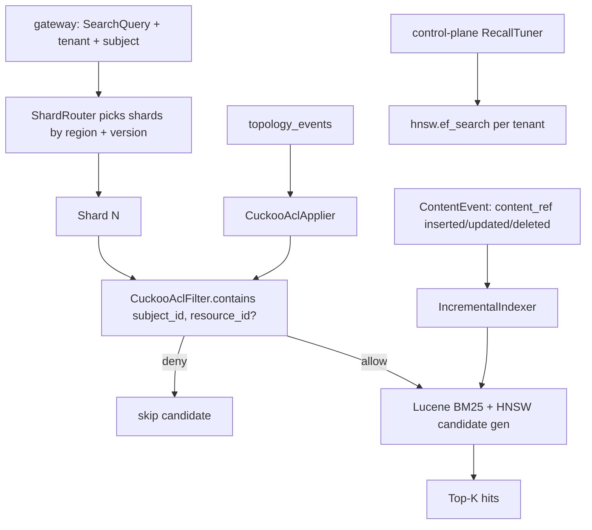

# 04 - synquest - Phase 4 - Cuckoo ACL Filter, Incremental Updates, Shard-Version Routing, Hot-Shard Rebalance

**Version:** 1.0
**Date:** 2026-08-11
**Status:** Draft for review
**Depends on:** Phase 1 `synquest` DoD (Lucene 9 BM25 + HNSW hybrid, `POST /search`); Phase 4 `topology` (`topology_events` on Kafka).
**Scope:** Give `synquest` its Phase 4 production-hardening surface: (1) a Cuckoo ACL pre-filter to enforce grants at pre-filter time for HIGH_SECURITY tenants; (2) incremental index updates driven by `topology_events` and `ContentEvent` streams (no full boot-time rebuild for every change); (3) shard-version routing so rebalance / hot-shard drain is safe under live queries; (4) recall monitoring + auto-tuning of `hnsw.ef_search`.

---

## 1. Context and Document Alignment

| Source | Role in this plan |
|--------|-------------------|
| [synanton-design-1.19.md](../../architecture/synanton-design-1.19.md) §20 `synquest` | Production target - Cuckoo filter, region awareness, recall monitoring, hot-shard rebalancing |
| [synanton-design-1.19.md](../../architecture/synanton-design-1.19.md) §40 Three-layer ACL enforcement | Pre-filter is layer 2 (compile-time injection is layer 1, gateway trim is layer 3) |
| [synanton-design-1.19.md](../../architecture/synanton-design-1.19.md) §41 HIGH_SECURITY tier | Cuckoo mandatory for HIGH_SECURITY |
| [10-topology.md](./10-topology.md) | Publishes `topology_events` with `event_type=GRANT_UPDATED`/`GRANT_REVOKED` |
| [11-control-plane.md](./11-control-plane.md) | Publishes `RecallTuner` Temporal workflow that adjusts `hnsw.ef_search` per tenant |

**Explicit non-goals for Phase 4:**

- No Rust migration (Phase 5). All new code is Java against Lucene 9.
- No supernode sampling (Phase 5).
- No multilingual tokenisation stack (bge-m3 stays Phase 5).
- No cross-region shard replication - shards remain single-region; `region` label on descriptor is for planner routing (see `06-planner.md`), not for replicated data movement.

---

## 2. Phase 4 in One Sentence

> Enforce grants at pre-filter time via a Cuckoo filter with < 300 ms p99 update latency, keep indices continuously in sync with `topology_events` and `ContentEvent` streams rather than boot-time rebuilds, and make hot-shard rebalancing safe under load with a shard-version-aware query protocol.

---

## 3. Target Architecture



---

## 4. Data Contracts

### 4.1 `SearchQuery` protocol additions

```protobuf
message SearchQuery {
  // ... Phase 1 fields ...
  optional int32 shard_version_min = 20;   // read-your-write consistency
  string tenant_id = 21;
  string subject_id = 22;                  // needed for CuckooAclFilter
  repeated string subject_groups = 23;
}

message SearchResponse {
  // ... Phase 1 fields ...
  int32 served_from_shard_version = 30;
  string served_from_region = 31;
  bool acl_prefilter_applied = 32;         // true = HIGH_SECURITY tenant
}
```

### 4.2 `CapabilityPort.descriptor()` additions

Every shard now publishes:

```json
{
  "shard_id": "us-east-1-01",
  "region": "us-east-1",
  "shard_version": 7,
  "tenant_partitioning": "HASH_MOD_N",
  "hnsw_config": { "m": 16, "ef_search": 128 },
  "cuckoo_enabled": true,
  "bucket_size": 4,
  "document_count": 1287345
}
```

Descriptor consumed by planner (`06-planner.md`) for shard fan-out decisions.

### 4.3 `topology_events` consumer contract

Router subscribes to `topology_events` with consumer group `synquest-acl-applier`. Event shapes handled:

```json
{ "event_type": "GRANT_UPDATED", "grant_id": "...", "tenant_id": "demo", "subject_id": "user:alice", "resource_id": "doc:...", "permission": "READ" }
{ "event_type": "GRANT_REVOKED", "grant_id": "...", "tenant_id": "demo", "subject_id": "user:alice", "resource_id": "doc:...", "permission": "READ" }
```

Order guarantee: partitioned by `tenant_id`, so grants for one tenant are strictly ordered. Cross-tenant ordering not required.

### 4.4 `ContentEvent` consumer contract

Consumer group `synquest-incremental-indexer` reads `ingestion_completed` (already published by workers in Phase 3):

```json
{ "event_type": "CONTENT_INDEXED", "content_ref_id": "...", "tenant_id": "demo", "chunk_ids": [...], "embedding_quality": "FULL" }
{ "event_type": "CONTENT_DELETED", "content_ref_id": "...", "tenant_id": "demo" }
```

---

## 5. Implementation Design

### 5.1 `CuckooAclFilter`

Backed by an in-memory Cuckoo filter (`com.github.mgunlogson.cuckoofilter4j:cuckoo-filter:1.0.4`) per shard, per tenant. Entry key: `SHA256(subject_id || ':' || resource_id)[:16]` (128-bit fingerprint).

Operations:

- `add(subjectId, resourceId)` - on `GRANT_UPDATED`; O(1) expected.
- `remove(subjectId, resourceId)` - on `GRANT_REVOKED`; O(1) expected, no rebuild required (that's the whole point of Cuckoo vs Bloom).
- `mightContain(subjectId, resourceId)` - called during candidate filtering; false-positive rate ε ≤ 0.001 (bucket size 4).

Persistence: snapshot to disk every 5 min (via Lucene sidecar file `cuckoo-{tenant}.snap`) and replay unacked `topology_events` on boot.

**HIGH_SECURITY gate:** `CuckooAclFilter.enabled = tenantPolicy.tier == HIGH_SECURITY`. STANDARD tenants get compile-time injection at gateway only (defence-in-depth degrades to 2 layers, matching design v1.19 §41).

Nightly rebuild: `CuckooCompactor` Temporal workflow (owned by `control-plane`, wired here). Rebuilds from authoritative `topology.acl_grants` snapshot; drops fragmentation ≤ 1 %.

Metrics:

- `synquest_cuckoo_size_bytes{tenant,shard}`
- `synquest_cuckoo_false_positive_ratio{tenant,shard}` (sampled)
- `synquest_cuckoo_update_lag_ms{tenant,shard}` histogram - critical for the < 300 ms p99 SLO

### 5.2 `IncrementalIndexer`

Reads `ingestion_completed` and translates to Lucene index operations:

```java
class IncrementalIndexer {
    void onIndexed(ContentIndexedEvent e) {
        var doc = fetchChunkPayload(e.tenantId, e.chunkIds);
        indexWriter.updateDocuments(new Term("content_ref_id", e.contentRefId), doc);
        indexWriter.commit();  // periodic; see below
    }
    void onDeleted(ContentDeletedEvent e) {
        indexWriter.deleteDocuments(new Term("content_ref_id", e.contentRefId));
    }
}
```

Commit policy:

- Soft commits every 5 s (in-memory near-real-time reader refresh).
- Hard commits every 60 s or 10K docs (whichever first) - trades durability vs write-amp.
- Config: `synquest.incremental.soft_commit_ms=5000`, `synquest.incremental.hard_commit_ms=60000`.

Consumer offset committed only after Lucene soft commit; on crash, replay from last soft-committed offset (idempotent because `updateDocuments` is UPSERT semantics).

Metric: `synquest_incremental_lag_seconds` (time between Kafka message timestamp and Lucene reader refresh).

### 5.3 Shard-version routing

Each shard carries a monotonically-increasing `shard_version` integer. On rebalance the new shard is spun up at `shard_version = current + 1` and passes through five states per §20:

| State | Duration | Query behaviour | Write behaviour |
|---|---|---|---|
| SPIN_UP | few minutes | not queried | pre-seed from source | 
| WRITE_CUTOVER | seconds | old shard still queried | new writes only to new shard |
| COOLDOWN | `synquest.shard.cooldown_seconds=600` | both queried, dedup by higher version | writes to new only |
| DRAIN | until copy complete | both queried | writes to new only |
| RETIRE | `synquest.shard.retire_idle_seconds=60` idle | new shard only queried | new only |

Query dedup: when both shards return the same `content_ref_id`, keep the higher `written_at_version` (`synquest.shard.merge_dedup_prefer_higher_version=true`).

Optional query param `shard_version_min` (see §4.1) is honoured by short-circuiting shards below the required version, so a client that just wrote can force read-your-write consistency without re-polling.

Metrics: `synquest_shard_drain_progress_ratio{from_version,to_version}`, `synquest_shard_dedup_hit_total{shard_id}`, `synquest_shard_version_stale_reads_total`.

### 5.4 Recall monitoring + tuning

`RecallSampler` background job:

- Every day, replay `synquest.recall.sample_size_per_day=1000` historical queries against a shadow shard configured with `hnsw.ef_search = 512` (ground truth).
- Compare top-10 recall against production shard's top-10.
- Emit `synquest_recall_at_10{tenant}` gauge.

`control-plane.RecallTuner` Temporal workflow (owned there; wired here):

- Reads `synquest_recall_at_10{tenant}` daily.
- Adjusts `hnsw.ef_search` per tenant in `topology.tenant_policy.hnsw_ef_search` (bump +32 when recall drops below 0.90).
- Bounded 64..512.

Alert `synquest_recall_below_slo` fires when 7-day rolling recall < `synquest.recall.slo_floor=0.90`.

### 5.5 Hot-shard rebalance runbook

Detection: `synquest_shard_load_ratio{shard} > 1.4` for 15 min (metric = QPS ratio to shard avg).

Action:

1. Operator triggers `synctl helper synquest rebalance --shard-id=<hot> --split-into=2`.
2. `synquest` spins up 2 new shards at `shard_version + 1`, routes writes to them (WRITE_CUTOVER).
3. COOLDOWN 10 min.
4. DRAIN: copy docs from old shard to new pair in bounded batches (`synquest.shard.drain_batch_size=1000`), respecting Kafka `ingestion_completed` for concurrent writes.
5. RETIRE old when idle 60 s.

Documented in `docs/operations/runbooks/synquest-shard-rebalance.md` (referenced from `15-observability.md`).

---

## 6. Module Boundaries

| Module | Owns in Phase 4 | Does not own |
|---|---|---|
| `synquest` | `CuckooAclFilter`, `IncrementalIndexer`, `ShardRouter`, shard-version query semantics, `RecallSampler` | `topology_events` producer (topology owns); `RecallTuner` workflow (control-plane owns); `CuckooCompactor` Temporal workflow (control-plane owns) |
| `topology` | Publishing `topology_events` with correct ordering guarantees | ACL applier semantics |
| `control-plane` | `RecallTuner`, `CuckooCompactor`, shard rebalance orchestration | Shard state machine (synquest owns) |
| `gateway` | Populating `SearchQuery.subject_id`, `subject_groups`, `shard_version_min` | Cuckoo filter maintenance |

---

## 7. Prerequisites

| # | Prereq | Home | Notes |
|---|---|---|---|
| 1 | `topology` publishes `topology_events` with `GRANT_UPDATED` / `GRANT_REVOKED` | `10-topology.md` | Non-negotiable |
| 2 | `ingestion_completed` events include `content_ref_id` + `chunk_ids` (already true from Phase 3) | phase3 | Verify shape |
| 3 | `cuckoo-filter:1.0.4` added to BOM | `gradle/libs.versions.toml` | New dep |
| 4 | `topology.tenant_policy.tier` field readable via `TopologyQuery.GetTenantPolicy` | `10-topology.md` | For HIGH_SECURITY gate |
| 5 | Kafka topic `topology_events` partitioned by tenant_id | `10-topology.md` | For per-tenant ordering |

---

## 8. Task Breakdown

| # | Task | Deliverable | Est. |
|---|---|---|---|
| SQ4-1 | Add Cuckoo filter dep; implement `CuckooAclFilter` per-shard/per-tenant with snapshot/restore | Class + tests | 2 days |
| SQ4-2 | Implement `TopologyEventConsumer` → `CuckooAclApplier`; measure `synquest_cuckoo_update_lag_ms` | Consumer + tests | 1 day |
| SQ4-3 | HIGH_SECURITY gate: enable Cuckoo only when `tenant_policy.tier=HIGH_SECURITY`; STANDARD skips filter | Config binding + gate test | 0.5 day |
| SQ4-4 | Implement `IncrementalIndexer` (soft+hard commit policy, delete-by-term); refactor Phase 1 boot-time build to be an initial catch-up path | Refactor + tests | 2 days |
| SQ4-5 | Implement `ShardRouter` with shard-version resolution; add `shard_version_min` query param handling | Router + tests | 1.5 days |
| SQ4-6 | Implement 5-state shard lifecycle (SPIN_UP → RETIRE); dedup by higher version | State machine + tests | 2 days |
| SQ4-7 | Implement `RecallSampler` daily job; emit `synquest_recall_at_10{tenant}` | Job + tests | 1 day |
| SQ4-8 | Wire `RecallTuner` inputs (control-plane calls back with `hnsw.ef_search` per tenant) | gRPC glue | 0.5 day |
| SQ4-9 | Add descriptor fields (`region`, `shard_version`, `cuckoo_enabled`, `hnsw_config`) to `CapabilityPort.descriptor()` | SPI update | 0.5 day |
| SQ4-10 | Metrics wiring: `synquest_cuckoo_*`, `synquest_shard_*`, `synquest_recall_*`, `synquest_incremental_lag_seconds` | Micrometer | 0.5 day |
| SQ4-11 | Integration test `CuckooRevocationIT` (Testcontainers Postgres + Kafka): grant, verify shown; revoke, verify hidden within 300 ms | `CuckooRevocationIT` | 1 day |
| SQ4-12 | Integration test `IncrementalIndexIT`: publish `CONTENT_INDEXED`; assert queryable in ≤ 5 s | `IncrementalIndexIT` | 0.5 day |
| SQ4-13 | Integration test `ShardRebalanceIT`: split hot shard live under continuous query load; assert zero missed hits | `ShardRebalanceIT` | 1.5 days |
| SQ4-14 | Chaos test `SnapshotReplayIT`: crash mid-consumer; assert Cuckoo state recovers from snapshot + replay | `SnapshotReplayIT` | 0.5 day |

---

## 9. Testing Strategy

- **Unit:** `CuckooAclFilter` add/remove/contains + false-positive rate. Shard version dedup preference. Recall sampler math.
- **Integration:** `CuckooRevocationIT`, `IncrementalIndexIT`, `ShardRebalanceIT`, `SnapshotReplayIT`, `HighSecurityTierGateIT` (HIGH_SECURITY tenant sees pre-filter applied, STANDARD does not).
- **Load:** `SearchUnderRebalanceLoad` k6 harness - 500 qps search while rebalance runs; assert p99 latency ≤ 1.5× baseline, zero unhandled 5xx.
- **Regression:** Phase 1 search-quality benchmarks (BM25 nDCG@10, HNSW recall@10) must not regress > 1 pp.

---

## 10. Configuration Surface

```yaml
# synquest/src/main/resources/application-phase4.yaml
synquest:
  cuckoo:
    enabled_for_tier: HIGH_SECURITY
    bucket_size: 4
    initial_capacity_per_tenant: 100000
    snapshot_interval_seconds: 300
    false_positive_rate: 0.001
  incremental:
    soft_commit_ms: 5000
    hard_commit_ms: 60000
    max_docs_between_hard_commits: 10000
  shard:
    cooldown_seconds: 600
    retire_idle_seconds: 60
    drain_batch_size: 1000
    merge_dedup_prefer_higher_version: true
  recall:
    sample_size_per_day: 1000
    slo_floor: 0.90
    tune_step: 32
    ef_search_min: 64
    ef_search_max: 512
  hnsw:
    ef_search_default: 128
    m: 16
```

---

## 11. Risks and Open Questions

| Risk | Mitigation | Decision |
|---|---|---|
| Cuckoo filter memory grows unbounded with grant count | Sized per tenant at `initial_capacity_per_tenant`; auto-resize doubles at 90 % load; metric `synquest_cuckoo_size_bytes` alerted at > 2 GB per shard | Alert |
| `topology_events` replay after long outage floods consumer | Consumer uses back-pressure via `max.poll.records=500` and pauses if `cuckoo_update_lag_ms` > 10 s | Config |
| Shard-version routing bugs cause split-brain reads | Property-based test asserts sum of query results across old+new shard versions equals ground-truth set; run in CI | Test |
| Recall drift silent after `hnsw.ef_search` change | `RecallSampler` reports pre- and post-change recall; `synquest_recall_below_slo` alert fires within 24 h | Accepted |
| False positives from Cuckoo filter cause spurious deny | Filter is used as *positive membership* (allow-list) - false positives mean *false allow*, not false deny; gateway final-trim catches false allows (defence-in-depth per §40) | Accepted |
| Boot-time rebuild path removal breaks fresh-cluster startup | Retain `synquest.startup.initial_catchup=true` mode that treats an empty index as needing full replay from `embedding_content_cache` | Retained |

---

## 12. Definition of Done (Phase 4)

1. `POST /topology/grants` for a HIGH_SECURITY tenant results in `CuckooAclFilter.mightContain` returning `true` for the new grant within 300 ms p99 across all `synquest` shards.
2. `DELETE /topology/grants/{id}` (revoke) results in `mightContain` returning `false` within 300 ms p99, no shard restart or rebuild.
3. Publishing a `CONTENT_INDEXED` event makes the document queryable via `POST /search` within 5 s p95 (soft-commit window).
4. `ShardRebalanceIT`: splitting a hot shard live under 500 qps produces zero missed hits (verified by golden dataset replay).
5. `SearchResponse.acl_prefilter_applied = true` for HIGH_SECURITY tenants, `false` for STANDARD.
6. `synquest_recall_at_10{tenant}` gauge visible in Grafana; `synquest_recall_below_slo` alert has a rule.
7. `SearchQuery.shard_version_min` honoured: reads under required version return HTTP 425 `too_early` with `Retry-After: 1`.
8. `SnapshotReplayIT` passes: forced crash + restart recovers Cuckoo filter state without data loss.
9. Phase 1 search-quality baseline (nDCG@10, recall@10) not regressed > 1 pp.

---

## 13. Follow-on Phases (Signposted)

- **Phase 5** - Rust migration of the hot loop (BM25 + HNSW inner loop) behind the same `POST /search` API; per-tenant feature-flag rollout.
- **Phase 5** - Supernode sampling for graph-adjacent doc IDs (`§20`).
- **Phase 5** - Multilingual tokenisation via `bge-m3` (`§20`).
- **Phase 5** - Cross-region shard read replicas (data-locality reads) - residency remains authoritative on writes.
