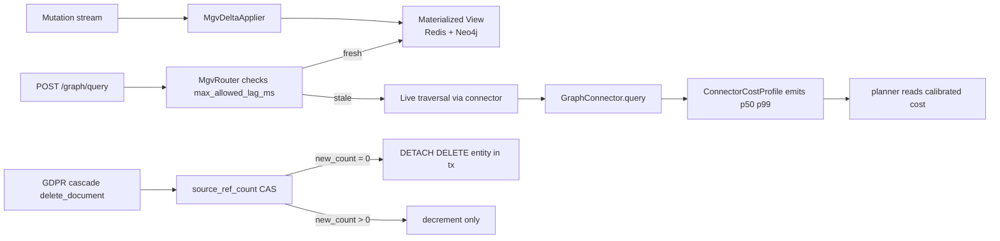

# 05 - relix - Phase 4 - Materialized Graph Views, `source_ref_count` CAS, Cost Calibration

**Version:** 1.0
**Date:** 2026-08-11
**Status:** Draft for review
**Depends on:** Phase 3 `relix` DoD (gRPC connector SPI, `InMemoryConnector` behind gRPC, `Neo4jConnector`). Phase 4 Redis (added in `INDEX.md`).
**Scope:** Materialize hot subgraphs into a fast-read view with a freshness SLO; make entity source-reference decrement atomic with CAS so concurrent GDPR cascades cannot race; calibrate the planner's connector cost model against real p99 latencies emitted per connector-pattern bin.

---

## 1. Context and Document Alignment

| Source | Role in this plan |
|--------|-------------------|
| [synanton-design-1.19.md](../../architecture/synanton-design-1.19.md) §21 `relix` (MGV, source_ref_count CAS, multi-signal edge relevance, cost calibration) | Production target |
| [synanton-design-1.19.md](../../architecture/synanton-design-1.19.md) §28 Relix Graph Connector SPI v1.0 | SPI unchanged; connectors report cost profiles |
| [synanton-design-1.19.md](../../architecture/synanton-design-1.19.md) §10 GDPR Erasure Cascade | `source_ref_count` CAS is the correctness invariant that makes cascade race-free |
| [06-planner.md](./06-planner.md) | Consumes calibrated cost profiles for plan comparison |

**Explicit non-goals for Phase 4:**

- No Louvain community detection (Phase 5).
- No cross-connector federated queries (Phase 5).
- No bounded emulated traversal work (Phase 5; only cost-model plumbing lands here).
- No multi-signal edge weight *tuning* automation - the weights ship with defaults; tenant overrides via `topology.tenant_policy` are Phase 5.

---

## 2. Phase 4 in One Sentence

> Serve hot patterns from a delta-refreshed materialized view with p95 lag < 200 ms, decrement entity `source_ref_count` atomically with CAS so concurrent cascades cannot double-delete or leak orphans, and emit real per-pattern latency profiles the planner uses to pick the cheapest plan.

---

## 3. Target Architecture



---

## 4. Data Contracts

### 4.1 MGV lookup - request shape (existing endpoint, new headers)

`POST /graph/query` (existing) - request unchanged. New response headers:

```
X-Synanton-Mgv-Served: true|false
X-Synanton-Mgv-Lag-Ms: 47
X-Synanton-Fallback-Reason: mgv_stale|mgv_miss|N/A
```

If MGV lag > `relix.mgv.max_allowed_lag_ms` (default 200 ms), fall back to live traversal transparently and set `X-Synanton-Fallback-Reason: mgv_stale`.

### 4.2 `source_ref_count` CAS operation

New RPC on the internal admin surface (called by `synflux` GDPR cascade and by `RelixDeleteConnector`):

```protobuf
service RelixMutation {
  rpc DecrementSourceRef(DecrementSourceRefRequest) returns (DecrementSourceRefResponse);
}
message DecrementSourceRefRequest {
  string tenant_id = 1;
  string entity_id = 2;
  string source_ref_id = 3;   // the content_ref being removed
}
message DecrementSourceRefResponse {
  int32 new_count = 1;
  bool detached = 2;          // true if entity was DETACH DELETEd in same tx
  string outcome = 3;         // OK | NO_OP | ERROR
}
```

Behaviour maps 1:1 to the design-doc §21 algorithm:

```
UPDATE entity SET source_ref_count = source_ref_count - 1
  WHERE entity_id = ? AND source_ref_count > 0 AND ? = ANY(sources)
  RETURNING source_ref_count;
IF affected_rows = 0:
  return NO_OP, emit relix_cascade_cas_noop_total
ELSE IF new_count > 0:
  return OK, detached=false
ELSE  -- new_count = 0
  DETACH DELETE entity_id in same transaction
  return OK, detached=true
```

Metrics: `relix_cascade_cas_success_total`, `relix_cascade_cas_noop_total`, `relix_cascade_detach_total`.

### 4.3 `ConnectorCostProfile` reporting

Every connector implementation (existing SPI, extended here) reports post-response:

```protobuf
message ConnectorCostProfile {
  string connector_id = 1;      // "in_memory", "neo4j-default", ...
  string pattern = 2;           // e.g. "shortest_path_1hop", "entity_neighbors"
  int64 p50_ns = 3;
  int64 p99_ns = 4;
  int32 sample_size = 5;
  int64 payload_bytes_p50 = 6;
}
```

Reported every 60 s per bin `(connector_id, pattern, payload_size_bucket)` to `RelixCostAggregator`. Planner queries this via `RelixCatalog.getCost(connector, pattern)` (Phase 3 gRPC, extended).

---

## 5. Implementation Design

### 5.1 Materialized Graph Views (MGV)

Two tiers:

- **Redis MGV** (hot patterns): key `mgv:{tenant}:{pattern_hash}`, value = serialized subgraph, TTL 60 s.
- **Neo4j MGV** (medium patterns): separate keyspace `mgv_{tenant}`, `MATCH` prewritten by `MgvDeltaApplier` on writes.

**Delta refresh:**

- `RelixMutationStream` (already exists from Phase 3) emits `EntityUpdated`, `RelationCreated`, `RelationDeleted`.
- `MgvDeltaApplier` consumes; for each event, invalidates affected Redis keys via `SUBSCRIBE mgv:invalidate:{tenant}` pub/sub and updates Neo4j MGV nodes.
- Lag metric `relix_mgv_lag_ms` measured as time between mutation event timestamp and MGV update commit.

**Fallback logic:**

```java
if (mgvLagMs.get(tenant) > config.mgv.maxAllowedLagMs) {
    metric.increment("relix_mgv_stale_fallback_total", "tenant", tenant);
    return liveTraversal(query);
}
```

**SLO:** `relix_mgv_freshness_p95_ms < 200` (see §45 SLO table).

### 5.2 `SourceRefCountCasOperator`

Implementation is connector-specific but wrapped in a uniform interface:

- **Neo4j:** transactional `MATCH (e:Entity {entity_id: $eid}) WHERE $src IN e.sources AND size(e.sources) > 0 SET e.sources = [s IN e.sources WHERE s <> $src] WITH e, size(e.sources) AS c FOREACH (_ IN CASE WHEN c = 0 THEN [1] ELSE [] END | DETACH DELETE e) RETURN c`.
- **InMemory:** synchronized on entity_id monitor; same semantics.

Concurrency-correctness invariant: after any interleaving of `DecrementSourceRef` calls, `source_ref_count = 0` iff the entity node no longer exists in the graph. Property-based test enforces this.

### 5.3 Cost calibration pipeline

- `ConnectorSpanReporter` interceptor on the gRPC client side of the SPI (in `relix`) records `duration_ns` and `response_bytes` for every call.
- `RelixCostAggregator` (in-process, per shard) buckets samples into `(connector_id, pattern, payload_size_bucket=log10(bytes))`.
- Every 60 s, aggregator computes p50/p99 per bin and pushes to a local Prometheus-scrapeable gauge `relix_connector_cost_p99_ns{connector,pattern}`.
- `RelixCatalog.getCost(connector, pattern)` (gRPC) reads the latest gauge value; planner uses it for plan comparison (see `06-planner.md`).

### 5.4 Multi-signal edge relevance (v1.1 baseline; tenant overrides Phase 5)

Ship default weights per design §21 v1.1:

```yaml
relix.edge_signal.weight:
  direct_link: 3.0
  source_overlap: 4.0
  co_occurrence: 1.5
  type_affinity: 1.0
```

Score computed on every subgraph return, exposed as `edges[].relevance`. Callers rank/sort/filter as they wish; no server-side thresholding in Phase 4.

### 5.5 Compatibility for existing Phase 1/2 in-memory graph

`InMemoryConnector` (Phase 1) is unchanged in its query surface but wraps in:

- MGV: no-op (in-memory is already the "view" - lag reports as 0).
- CAS: implemented with synchronized block per entity_id.
- Cost: reports real ns-scale latencies to the aggregator.

---

## 6. Module Boundaries

| Module | Owns in Phase 4 | Does not own |
|---|---|---|
| `relix` | `MgvRouter`, `MgvDeltaApplier`, `SourceRefCountCasOperator`, `ConnectorSpanReporter`, `RelixCostAggregator`, `RelixCatalog.getCost` | `RelixMutationStream` producers (connectors); mutation semantics beyond the CAS window |
| `synflux` | Publishing GDPR delete events that trigger CAS | The CAS itself |
| `gateway` | Consuming `X-Synanton-Fallback-Reason` header for `execution_trace.warnings` | MGV state |
| `planner` | Consuming `relix_connector_cost_p99_ns` for plan comparison | Emitting the metric |

---

## 7. Prerequisites

| # | Prereq | Home | Notes |
|---|---|---|---|
| 1 | Redis cluster available (added in `INDEX.md`) | ops | Non-negotiable |
| 2 | Phase 3 gRPC connector SPI live (`InMemoryConnector`, `Neo4jConnector`) | phase3/02 | Non-negotiable |
| 3 | `RelixMutationStream` publishes `EntityUpdated`, `RelationCreated`, `RelationDeleted` reliably | phase3/02 | Extend if needed |
| 4 | Neo4j has a separate `mgv_{tenant}` keyspace concept (or database) | ops | New keyspace per tenant |
| 5 | Lettuce Redis client added to BOM (see `INDEX.md`) | shared BOM | Yes |

---

## 8. Task Breakdown

| # | Task | Deliverable | Est. |
|---|---|---|---|
| RX4-1 | Implement `MgvRouter` with `max_allowed_lag_ms` fallback and response header wiring | Class + tests | 1 day |
| RX4-2 | Implement Redis MGV backend (`RedisMgvBackend`) with TTL + `SUBSCRIBE mgv:invalidate` pub/sub | Class + tests | 2 days |
| RX4-3 | Implement Neo4j MGV backend (`Neo4jMgvBackend`); per-tenant keyspace `mgv_{tenant}` | Class + tests | 1.5 days |
| RX4-4 | Implement `MgvDeltaApplier` consuming `RelixMutationStream` | Consumer + tests | 1 day |
| RX4-5 | Implement `SourceRefCountCasOperator` for `InMemoryConnector` and `Neo4jConnector` | 2 impls + property tests | 2 days |
| RX4-6 | Expose `RelixMutation.DecrementSourceRef` gRPC | Proto + service | 0.5 day |
| RX4-7 | Wire `synflux` GDPR delete path to call `DecrementSourceRef` per removed source | Integration point | 0.5 day |
| RX4-8 | Implement `ConnectorSpanReporter` interceptor on gRPC client | Interceptor + tests | 0.5 day |
| RX4-9 | Implement `RelixCostAggregator` (60 s buckets, p50/p99 emission) | Class + tests | 1 day |
| RX4-10 | Extend `RelixCatalog.getCost(connector, pattern)` gRPC and wire planner client | Proto + service + client | 0.5 day |
| RX4-11 | Ship default multi-signal weights; expose `edges[].relevance` field | DTO + config | 0.5 day |
| RX4-12 | Metrics: `relix_mgv_lag_ms`, `relix_mgv_stale_fallback_total`, `relix_cascade_cas_success_total`, `relix_cascade_cas_noop_total`, `relix_cascade_detach_total`, `relix_connector_cost_p99_ns` | Micrometer | 0.5 day |
| RX4-13 | Integration test `MgvFreshnessIT`: mutate, query, assert served from MGV within 200 ms | `MgvFreshnessIT` | 1 day |
| RX4-14 | Property test `CascadeCasConcurrencyPT`: N parallel decrements never leaves orphaned entity | `CascadeCasConcurrencyPT` | 1 day |
| RX4-15 | Integration test `CostCalibrationIT`: inject artificial 100 ms latency in InMemoryConnector; assert `RelixCatalog.getCost` returns matching p99 within 90 s | `CostCalibrationIT` | 0.5 day |

---

## 9. Testing Strategy

- **Unit:** MGV router fallback logic. CAS SQL/Cypher round-trip. Cost aggregator bucketing correctness.
- **Property:** `CascadeCasConcurrencyPT` (jqwik / kotest-property): concurrent decrements always leave `count == 0 iff entity gone`.
- **Integration:** `MgvFreshnessIT`, `CostCalibrationIT`, `MgvInvalidationIT` (write triggers pub/sub → cache clear).
- **Regression:** Phase 3 `Neo4jConnectorAcceptance` and `InMemoryConnectorAcceptance` suites unchanged.

---

## 10. Configuration Surface

```yaml
# relix/src/main/resources/application-phase4.yaml
relix:
  mgv:
    enabled: true
    max_allowed_lag_ms: 200
    redis:
      enabled: true
      ttl_seconds: 60
      max_entries_per_tenant: 10000
    neo4j:
      enabled: true
      keyspace_prefix: "mgv_"
  subgraph:
    cypher_timeout_ms: 2000
    emulated_total_timeout_ms: 4000
    max_subgraph_nodes: 5000
  cost:
    reporter_interval_seconds: 60
    payload_size_buckets: [1000, 10000, 100000, 1000000]
  edge_signal:
    weight:
      direct_link: 3.0
      source_overlap: 4.0
      co_occurrence: 1.5
      type_affinity: 1.0
  cascade:
    cas_timeout_ms: 500
```

---

## 11. Risks and Open Questions

| Risk | Mitigation | Decision |
|---|---|---|
| MGV Redis cache stampede on invalidation of hot key | `RedisMgvBackend` uses single-flight per key (Caffeine `LoadingCache` in front of Redis GET) | Add single-flight |
| Neo4j MGV keyspace multiplies per tenant → operational cost | Per-tier gate: only tenants with `tier IN (STANDARD, HIGH_SECURITY)` get MGV; small tenants use Redis-only | Config flag |
| CAS DETACH DELETE holds locks under contention | `cas_timeout_ms=500` bound; on timeout, return `outcome=ERROR` (retryable), do not block indefinitely | Accepted |
| Cost aggregator sample size too small for rare patterns | Report `sample_size` alongside p99; planner uses conservative penalty if `sample_size < 10` | Accepted |
| Multi-signal weights not tuned per tenant | Default weights ship; per-tenant override deferred to Phase 5 (`topology.tenant_policy.edge_signal_weights`) | Phase 5 |
| `RelixMutationStream` outage stalls MGV → fallback path is only safety net | Alert `relix_mgv_lag_seconds > 30` (page); MGV disabled per tenant if lag > 300 s (auto-fallback for extended outages) | Alert + auto-disable |

---

## 12. Definition of Done (Phase 4)

1. `POST /graph/query` for a hot pattern is served from MGV in ≥ 80 % of requests; `X-Synanton-Mgv-Served: true` header present.
2. `relix_mgv_freshness_p95_ms` < 200 in Grafana, sampled over 24 h.
3. `RelixMutation.DecrementSourceRef` RPC observable in traces from `synflux` GDPR cascade path.
4. `CascadeCasConcurrencyPT` passes with N=100 concurrent decrements; invariant holds for all runs.
5. `RelixCatalog.getCost(connector, pattern)` returns non-zero values within 90 s of connector traffic (verified by `CostCalibrationIT`).
6. `edges[].relevance` field present in every `graph/query` response with weight sum matching config.
7. Alert `relix_mgv_lag_seconds > 30` fires and Grafana dashboard shows lag per tenant.
8. Phase 3 `Neo4jConnector` and `InMemoryConnector` acceptance suites pass unchanged.

---

## 13. Follow-on Phases (Signposted)

- **Phase 5** - Louvain community detection with `community_id` property.
- **Phase 5** - Cross-connector federated queries.
- **Phase 5** - Per-tenant `edge_signal.weight` overrides via `topology.tenant_policy`.
- **Phase 5** - Bounded emulated traversal with cost-aware early termination.
