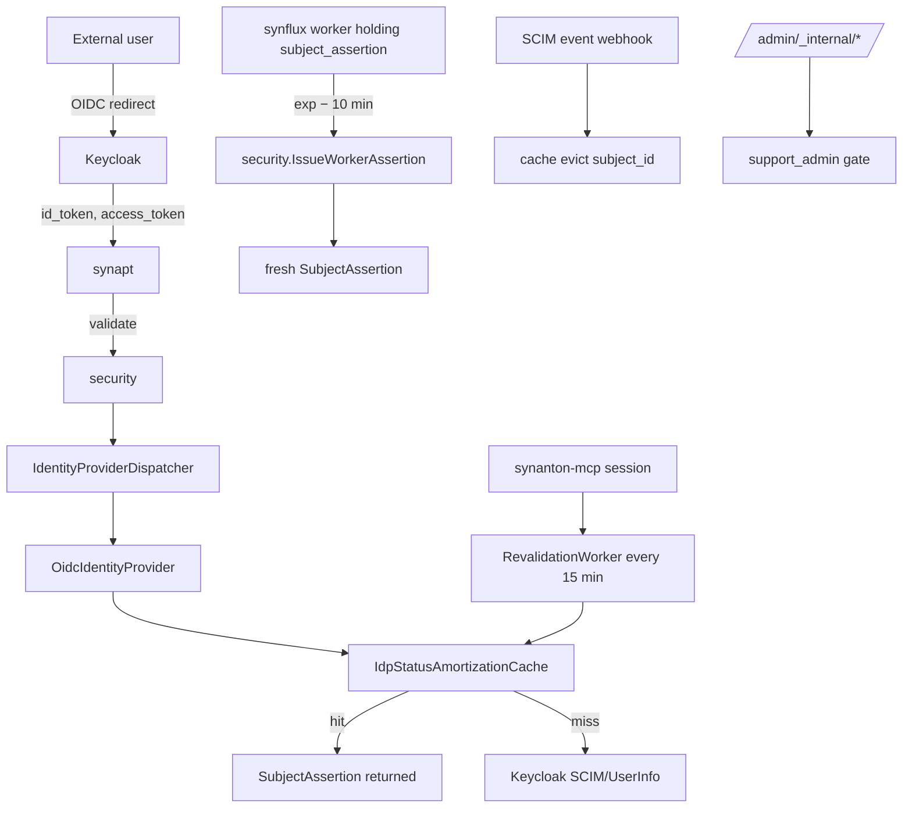

# 09 - security - Phase 4 - Keycloak/OIDC, IdP Amortisation, MCP Session Revalidation, Worker Token Renewal, `support_admin`

**Version:** 1.0
**Date:** 2026-08-11
**Status:** Draft for review
**Depends on:** Phase 3 `security` DoD (RFC 8693 token exchange, API key lifecycle, `IdentityProviderPort` dispatcher). Phase 4 `topology` (`admin_audit`, tier field on `organizations`).
**Scope:** Add a real external IdP path (Keycloak/OIDC), amortise IdP hits so authz never adds > 5 ms to hot requests, revalidate MCP sessions on a sliding schedule so revoked users lose access without waiting for token expiry, renew long-running worker tokens before they expire, and define the `support_admin` RBAC role for internal operational tooling.

---

## 1. Context and Document Alignment

| Source | Role in this plan |
|--------|-------------------|
| [synanton-design-1.19.md](../../architecture/synanton-design-1.19.md) §26 `security` (IdP amortization, MCP session revalidation, worker token renewal, outbound broker) | Production target |
| [synanton-design-1.19.md](../../architecture/synanton-design-1.19.md) §11 ACL Propagation Flow (IdP amortization, worker token renewal, MCP session revalidation) | Flow semantics |
| [synanton-design-1.19.md](../../architecture/synanton-design-1.19.md) §26 `support_admin` role *(v1.19)* | RBAC addition |
| [synanton-design-1.19.md](../../architecture/synanton-design-1.19.md) §26a API Key Lifecycle (`SYNANTON_SUPPORT_KEY` *(v1.19)*) | Support key semantics |
| [synanton-design-1.19.md](../../architecture/synanton-design-1.19.md) §31 Identity Provider Port + Outbound Auth Broker | SPI stays contract-stable |
| [phase3/06-security.md](../phase3/06-security.md) | Foundation - Phase 3 delivered `IdentityProviderPort` dispatch + RFC 8693 |

**Explicit non-goals for Phase 4:**

- No MTLS handshake implementation (Phase 5).
- No hardware security module (HSM) for key storage - argon2id in Postgres still authoritative.
- No cross-region IdP federation (deferred).
- No OAuth 2.1 dynamic client registration (Phase 5+).

---

## 2. Phase 4 in One Sentence

> Wire a real external IdP (Keycloak/OIDC) through `IdentityProviderPort` with an amortised authz cache (5 s HIGH_SECURITY / 60 s STANDARD), revalidate MCP sessions on a sliding 15-min schedule, renew worker tokens at `exp − 10 min`, and add the `support_admin` role reserved for internal automation.

---

## 3. Target Architecture



---

## 4. Data Contracts

### 4.1 OIDC login flow

`GET /auth/oidc/authorize?tenant_id={t}` (existing shape) - redirects to `oidc.issuer_uri + /protocol/openid-connect/auth`. Callback handled by `POST /auth/oidc/callback` (new):

```json
POST /auth/oidc/callback?state=...&code=...
→ 200 OK, sets HttpOnly refresh cookie, returns
{ "access_token": "eyJhbGc...", "expires_in": 3600, "subject_id": "user:alice@example.com" }
```

### 4.2 `SubjectAssertion` (extended)

```java
public record SubjectAssertion(
    String subjectId,
    String tenantId,
    IdentityProfile identityProfile,     // USER_SUBJECT | SERVICE_ACCOUNT | API_KEY | MTLS
    List<String> scopes,
    Set<String> roles,                   // may include "support_admin"
    Instant expiresAt,
    String assertionId,                  // for renewal correlation
    IdpStatus idpStatus                  // fresh timestamp
) {}

public record IdpStatus(String status, Instant refreshedAt) {}
```

### 4.3 `IssueWorkerAssertion` RPC

```protobuf
service SecurityInternal {
  rpc IssueWorkerAssertion(IssueWorkerAssertionRequest) returns (SubjectAssertion);
}
message IssueWorkerAssertionRequest {
  string job_id = 1;
  string parent_assertion_id = 2;   // linked to the assertion being renewed
  string tenant_id = 3;
}
```

Response is a fresh `SubjectAssertion` inheriting the parent's scopes and profile but with a new expiry.

### 4.4 SCIM webhook

`POST /auth/scim/events` from Keycloak on user disable/delete:

```json
{ "event_type": "USER_DISABLED", "subject_id": "user:alice@example.com" }
```

Handler evicts `IdpStatusAmortizationCache` entry immediately.

---

## 5. Implementation Design

### 5.1 `OidcIdentityProvider`

Uses `spring-security-oauth2-client` + `spring-boot-starter-oauth2-resource-server`. Configuration:

```yaml
security:
  oidc:
    enabled: true
    issuer_uri: "http://keycloak.security.svc/realms/synanton"
    client_id: "synanton"
    client_secret_env: "KEYCLOAK_CLIENT_SECRET"
    jwks_cache_seconds: 300
    scim:
      webhook_path: "/auth/scim/events"
      shared_secret_env: "KEYCLOAK_SCIM_SECRET"
```

`OidcIdentityProvider.supports(header)` returns true for `Bearer eyJ...` tokens whose `iss` claim matches `oidc.issuer_uri`. The Phase 3 `JwtIdentityProvider` (issued by our internal `JwtIssuer`) continues to serve local login flows; the `IdentityProviderDispatcher` picks based on issuer.

### 5.2 `IdpStatusAmortizationCache`

```java
class IdpStatusAmortizationCache {
    private final Cache<String, IdpStatus> cache;   // Caffeine
    IdpStatus getOrRefresh(String subjectId, TierPolicy tier) {
        var ttl = switch (tier) {
            case HIGH_SECURITY -> Duration.ofSeconds(5);
            case FINANCIAL, HEALTHCARE -> Duration.ofSeconds(10);
            default -> Duration.ofSeconds(60);
        };
        return cache.get(subjectId, id -> {
            var status = idp.probe(id);   // Keycloak call
            emitStale(id, status);
            return status;
        });
    }
    void evict(String subjectId) { cache.invalidate(subjectId); }
}
```

Metrics:

- `security_idp_amortization_stale_seconds{tenant,tier}` histogram - measured on every request as `now - status.refreshedAt`.
- `security_idp_amortization_stale_authz_total{tenant,tier}` - increments when a still-cached status contradicts a freshly-fetched status (i.e., cache serves a stale allow).

Alert `IdpAmortizationStaleAuthzHigh`: `> 5 in 1 h for HIGH_SECURITY` → page.

### 5.3 `RevalidationWorker` (MCP sessions)

Long-lived MCP sessions carry a `session_id` bound to a `SubjectAssertion`. `RevalidationWorker` (Virtual thread) runs on a sliding 15-minute schedule (per-tier override):

```java
class RevalidationWorker {
    void revalidate(McpSession session) {
        try {
            var status = idp.probeWithRetry(session.subjectId(),
                                            retries=3, timeout=Duration.ofMinutes(5));
            if (status.disabled()) session.terminate("subject_disabled");
        } catch (IdpUnavailable e) {
            metric.increment("security_mcp_revalidation_backoff_total");
            // exponential backoff; do not terminate on transient failure
        }
    }
}
```

Config:

```yaml
security.mcp.session:
  revalidation_interval_minutes:
    STANDARD: 60
    HIGH_SECURITY: 5
    FINANCIAL: 15
```

### 5.4 Worker token renewal

Every long-running worker (`synflux`, `relix` connectors, etc.) uses `ServiceTokenProvider` (Phase 3 helper) extended with:

```java
void scheduleRenewal(SubjectAssertion current) {
    var renewAt = current.expiresAt().minus(Duration.ofMinutes(10));
    scheduler.schedule(() -> {
        try {
            var fresh = securityStub.issueWorkerAssertion(
                IssueWorkerAssertionRequest.of(jobId, current.assertionId(), tenantId));
            replaceLocal(fresh);
            scheduleRenewal(fresh);
        } catch (StatusException e) {
            if ("ERR_SUBJECT_REVOKED".equals(errCode(e))) compensate();
        }
    }, renewAt.toEpochMilli() - now());
}
```

On `ERR_SUBJECT_REVOKED`: worker triggers per-service compensation (transaction rollback, in-flight job park) and exits gracefully.

Config: `security.worker.renewal_lead_time_minutes=10`.

### 5.5 `support_admin` RBAC role

New role in `security.roles` table (Flyway migration):

```sql
INSERT INTO security.roles (role_name, description, is_system) VALUES
  ('support_admin', 'Internal operational tooling role', true);
INSERT INTO security.role_permissions (role_name, permission) VALUES
  ('support_admin', 'admin.internal.status'),
  ('support_admin', 'admin.internal.bundle'),
  ('support_admin', 'admin.internal.clean'),
  ('support_admin', 'admin.internal.delete'),
  ('support_admin', 'admin.internal.recrawl'),
  ('support_admin', 'admin.internal.workflow'),
  ('support_admin', 'tenant.metadata.read');
```

**Assignment rules (enforced at write time):**

- OIDC-federated users CANNOT be assigned `support_admin`. `SecurityMutationApi.grantRole()` rejects if user's `identity_profile == USER_SUBJECT AND source == OIDC`.
- Only service principals or break-glass accounts (`ttl <= 24h`) may hold `support_admin`.
- Every grant/revoke writes `admin_audit` with `actor = platform_superadmin` or `break_glass_pipeline`.

**Explicit denials:**

- Cannot read tenant content bodies unless the tenant also grants `content:read` explicitly.
- Cannot assume tenant identity via RFC 8693 USER_SUBJECT profile (`TokenExchangeEndpoint` refuses subject_token whose bearer holds `support_admin`).
- Cannot bypass residency or budget policies.

### 5.6 `SYNANTON_SUPPORT_KEY` credential

API key with prefix `syn_support_<yyMM>_`, tightened parameters:

- TTL: 90 d (STANDARD), 30 d (HIGH_SECURITY / FINANCIAL / HEALTHCARE).
- Grace: 7 d all tiers.
- IP allowlist: **required** (generation refused without CIDR list).
- Notifications: Email T-14/7/3/1 + PagerDuty T-3.
- Brute-force lockout: 30 min for `syn_support_*` prefix.

Metric: `security_api_key_active_total{tenant, key_class="support"}`. Alert `ApiKeyPastExpiry` fires at T-14.

### 5.7 Outbound Auth Broker refinements (from Phase 3)

- `security.outbound.exchange_p99_slo_ms=100`; on breach, deny call rather than block thread (avoids cascade). Emits `security_outbound_deny_slo_total`.
- Cache disabled for HIGH_SECURITY: `security.outbound.cache_max_age_seconds=0` when target tenant is HIGH_SECURITY.
- Audit row per exchange: `security_outbound_audit(exchange_id, caller_subject, target_audience, profile, success)`.

---

## 6. Module Boundaries

| Module | Owns in Phase 4 | Does not own |
|---|---|---|
| `security` | `OidcIdentityProvider`, `IdpStatusAmortizationCache`, `RevalidationWorker`, `IssueWorkerAssertion` RPC, `support_admin` role, `SYNANTON_SUPPORT_KEY` semantics | Route filtering (synapt / control-plane); Keycloak deployment (ops) |
| `synapt` | Consuming `SubjectAssertion.roles.contains("support_admin")` for admin route auth | Role definition |
| `synflux`, `relix`, others | Scheduling their own `ServiceTokenProvider.scheduleRenewal` | The renewal RPC |
| `topology` | `admin_audit` schema | Writing rows |

---

## 7. Prerequisites

| # | Prereq | Home | Notes |
|---|---|---|---|
| 1 | Phase 3 `security` DoD met (RFC 8693, API key lifecycle) | phase3 | Non-negotiable |
| 2 | Keycloak deployed in dev via compose (`INDEX.md`) | ops | Non-negotiable |
| 3 | `security.roles`, `security.role_permissions`, `security.role_assignments` tables extant (add `support_admin` row + `role` column value) | Flyway V4 | Yes |
| 4 | SCIM shared secret set (`KEYCLOAK_SCIM_SECRET`) | secrets | Yes |
| 5 | `topology.admin_audit` schema with `before_state_hash`, `after_state_hash` | `10-topology.md` | Yes |
| 6 | `spring-security-oauth2-client:6.x`, `spring-boot-starter-oauth2-resource-server:3.x` in BOM | shared | Yes |

---

## 8. Task Breakdown

| # | Task | Deliverable | Est. |
|---|---|---|---|
| SEC4-1 | Flyway V4 migration: `support_admin` role + permissions + assignment rules | Migration file | 0.5 day |
| SEC4-2 | Implement `OidcIdentityProvider`; register with `IdentityProviderDispatcher` | Class + tests | 2 days |
| SEC4-3 | Implement OIDC login endpoints (`/auth/oidc/authorize`, `/auth/oidc/callback`) | Controllers + tests | 1.5 days |
| SEC4-4 | Implement `IdpStatusAmortizationCache` with per-tier TTL | Class + tests | 1 day |
| SEC4-5 | Implement SCIM webhook receiver `/auth/scim/events`; verify HMAC shared secret; evict cache | Controller + tests | 0.5 day |
| SEC4-6 | Implement `RevalidationWorker` (Virtual thread + exponential backoff) | Class + tests | 1 day |
| SEC4-7 | Implement `IssueWorkerAssertion` gRPC; add `assertionId` to `SubjectAssertion` | Proto + service + tests | 1 day |
| SEC4-8 | Extend `ServiceTokenProvider` with `scheduleRenewal` (10 min lead) | Refactor + tests | 0.5 day |
| SEC4-9 | Wire renewal into synflux workers as reference impl | Worker integration | 0.5 day |
| SEC4-10 | Enforce `support_admin` assignment rules in `SecurityMutationApi.grantRole` | Handler + tests | 0.5 day |
| SEC4-11 | Extend `ApiKeyIdentityProvider` for `syn_support_*` prefix: required IP allowlist, T-14/7/3/1 notifications, elevated lockout | Refactor + tests | 1 day |
| SEC4-12 | Outbound broker: SLO breach → deny call; cache disabled for HIGH_SECURITY | Refactor + tests | 0.5 day |
| SEC4-13 | Metrics: `security_idp_amortization_stale_seconds`, `security_idp_amortization_stale_authz_total`, `security_mcp_revalidation_backoff_total`, `security_outbound_deny_slo_total`, `security_api_key_active_total{key_class}` | Micrometer | 0.5 day |
| SEC4-14 | Integration test `OidcLoginIT`: Testcontainers Keycloak; authorize → callback → validate returns `identity_profile=USER_SUBJECT`, `roles` populated | `OidcLoginIT` | 1.5 days |
| SEC4-15 | Integration test `AmortizationEvictionIT`: SCIM disable event → next request 401 within cache TTL bound | `AmortizationEvictionIT` | 0.5 day |
| SEC4-16 | Integration test `WorkerRenewalIT`: assertion nearing exp → renewed transparently; revoked → compensation triggered | `WorkerRenewalIT` | 1 day |
| SEC4-17 | Integration test `SupportAdminAssignmentIT`: OIDC user cannot be granted `support_admin` | `SupportAdminAssignmentIT` | 0.5 day |
| SEC4-18 | Integration test `McpRevalidationIT`: MCP session; disable user; session terminates on next tick | `McpRevalidationIT` | 0.5 day |

---

## 9. Testing Strategy

- **Unit:** `IdpStatusAmortizationCache` per-tier TTL. Support-admin assignment rule truth table. `syn_support_*` key generation refuses missing IP allowlist. Outbound deny-on-SLO branch.
- **Integration:** Testcontainers Keycloak for `OidcLoginIT`, `AmortizationEvictionIT`, `McpRevalidationIT`, `WorkerRenewalIT`, `SupportAdminAssignmentIT`.
- **Regression:** All Phase 3 API key lifecycle + token exchange tests pass unchanged.
- **Security:** `SupportAdminEscalationTest` - attempt every documented denial (assume tenant, read content, bypass residency/budget) - all must fail.

---

## 10. Configuration Surface

```yaml
# security/src/main/resources/application-phase4.yaml
security:
  oidc:
    enabled: true
    issuer_uri: "http://keycloak.security.svc/realms/synanton"
    client_id: "synanton"
    jwks_cache_seconds: 300
    scim:
      webhook_path: "/auth/scim/events"
  idp_amortization:
    ttl_seconds:
      STANDARD: 60
      HIGH_SECURITY: 5
      FINANCIAL: 10
      HEALTHCARE: 10
    max_size: 100000
  mcp:
    session:
      revalidation_interval_minutes:
        STANDARD: 60
        HIGH_SECURITY: 5
        FINANCIAL: 15
      backoff_retries: 3
      backoff_max_minutes: 5
  worker:
    renewal_lead_time_minutes: 10
  outbound:
    exchange_p99_slo_ms: 100
    cache_max_age_seconds: 3600
    disable_cache_for_tier: HIGH_SECURITY
  api_keys:
    support:
      prefix: "syn_support_"
      ttl_days:
        STANDARD: 90
        HIGH_SECURITY: 30
        FINANCIAL: 30
        HEALTHCARE: 30
      grace_days: 7
      require_ip_allowlist: true
      brute_force_lockout_seconds: 1800
      notification_lead_days: [14, 7, 3, 1]
```

---

## 11. Risks and Open Questions

| Risk | Mitigation | Decision |
|---|---|---|
| Keycloak outage cascades to platform authz | `IdpStatusAmortizationCache` continues serving cached decisions; `IdpUnavailable` events tracked; graceful degradation via `security_idp_probe_failure_total` metric | Accepted |
| MCP session revalidation storms Keycloak on 15-min tick | Jittered scheduling (`+/- 3 min` per session); rate-limit at Keycloak side | Jitter |
| SCIM webhook can be spoofed to evict legitimate cache entries | HMAC-SHA256 shared secret verified before eviction; audit `SCIM_EVICT` events | HMAC |
| Support key with narrow IP allowlist blocks legitimate cross-region admin | Deployment guide requires bastion CIDR set; T-14 notification includes IP allowlist check | Doc |
| `support_admin` role becomes a persistent human privilege | Assignment rules enforce service-principal-only; `admin_audit` alerts on `support_admin` role grant to `USER_SUBJECT` | Alert |
| Worker token renewal race under high job churn | Renewal is idempotent (uses `assertionId` for correlation); duplicate renewals return the same fresh assertion | Idempotent |
| Outbound cache disable for HIGH_SECURITY inflates Keycloak load | HIGH_SECURITY tenants pay the cost by design; documented in tenant tier guide | Accepted |

---

## 12. Definition of Done (Phase 4)

1. `OidcLoginIT` passes: user logs in via Keycloak realm `synanton`, receives access token, `POST /auth/validate` returns `identity_profile=USER_SUBJECT` with `roles` populated.
2. `AmortizationEvictionIT` passes: `USER_DISABLED` SCIM event evicts cache; next request 401 within max(1 s, tier TTL).
3. `McpRevalidationIT` passes: after `SCIM USER_DISABLED`, MCP session terminates within `revalidation_interval_minutes` + 3 min jitter.
4. `WorkerRenewalIT` passes: assertion at exp − 10 min triggers `IssueWorkerAssertion`; revoked subject triggers `ERR_SUBJECT_REVOKED` + worker compensation.
5. `SupportAdminAssignmentIT` passes: OIDC-federated user cannot be granted `support_admin`; service principal can.
6. `security_idp_amortization_stale_authz_total{tier="HIGH_SECURITY"}` is 0 in 24h dev soak.
7. `syn_support_*` key generation refused without IP allowlist; T-14 email sent for key nearing expiry (verified in Mailhog test container).
8. Outbound broker: SLO-breach counter increments in a chaos test (inject 500 ms latency); no cascade to caller threads.
9. All Phase 3 API key + RFC 8693 tests pass unchanged.

---

## 13. Follow-on Phases (Signposted)

- **Phase 5** - MTLS via `MtlsIdentityProvider`.
- **Phase 5** - Cross-region key management + HSM for `SYNANTON_SUPPORT_KEY`.
- **Phase 5** - OAuth 2.1 dynamic client registration for MCP clients.
- **Phase 5** - Prompt/model version tracking integration with `synreview` (§27a v1.17).
