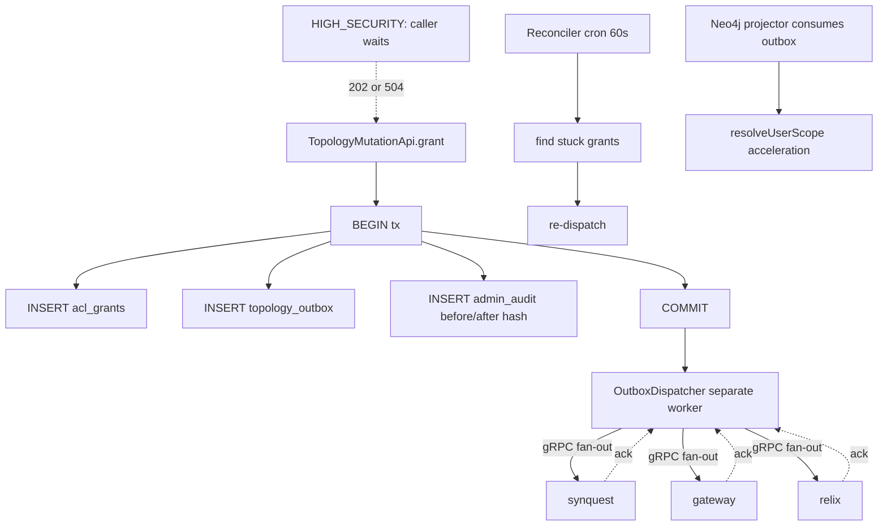

# 10 - topology - Phase 4 - HIGH_SECURITY 2-Phase ACL Propagation, Residency Policy, Full Audit Schema

**Version:** 1.0
**Date:** 2026-08-11
**Status:** Draft for review
**Depends on:** Phase 3 `topology` DoD (grant/revoke API, outbox dispatcher, Neo4j projection). Phase 4 `security` (`support_admin` role).
**Scope:** Turn topology into the authoritative multi-tenant policy store with hard SLOs. Add HIGH_SECURITY 2-phase ACL propagation (synchronous ack from downstream consumers within 50 ms), residency policy enforcement (`data_residency_policy.allowed_regions`), full `admin_audit` schema with before/after state hashes, and PGV validation on the gRPC mutation surface.

---

## 1. Context and Document Alignment

| Source | Role in this plan |
|--------|-------------------|
| [synanton-design-1.19.md](../../architecture/synanton-design-1.19.md) §25 `topology` | Production target |
| [synanton-design-1.19.md](../../architecture/synanton-design-1.19.md) §11 ACL Propagation Flow (HIGH_SECURITY 2-phase) | Correctness contract |
| [synanton-design-1.19.md](../../architecture/synanton-design-1.19.md) §35 `topology` schema, `audit` schema, `security` schema *(v1.19)* | Data model |
| [synanton-design-1.19.md](../../architecture/synanton-design-1.19.md) §43 Cross-Region & Data Residency | Residency semantics |
| [synanton-design-1.19.md](../../architecture/synanton-design-1.19.md) §28-§32 note: PGV gRPC validation | Validation on mutation surface |
| [01-shared-common.md](./01-shared-common.md) | `PgvValidatingServerInterceptor` |

**Explicit non-goals for Phase 4:**

- No external ACL provider (LDAP as authoritative source of grants) - Phase 5+.
- No GDPR erasure automation from topology events (Phase 5).
- No cross-region topology replication with quorum consensus (Phase 5).

---

## 2. Phase 4 in One Sentence

> Grants become policy: every mutation writes an audited row with before/after state hashes, HIGH_SECURITY tenants get a two-phase commit that waits for downstream acks within 50 ms, residency policy is enforced end-to-end, and every mutation RPC is PGV-validated.

---

## 3. Target Architecture



---

## 4. Data Contracts

### 4.1 Schema (`topology` PostgreSQL)

```sql
-- organizations: policy container per tenant
CREATE TABLE topology.organizations (
  org_id                UUID PRIMARY KEY,
  tenant_id             TEXT UNIQUE NOT NULL,
  name                  TEXT NOT NULL,
  tier                  TEXT NOT NULL CHECK (tier IN ('STANDARD','HIGH_SECURITY','FINANCIAL','HEALTHCARE')),
  data_residency_policy JSONB NOT NULL DEFAULT '{"allowed_regions":["us-east-1"]}',
  tiering_policy        JSONB NOT NULL DEFAULT '{}',
  rerank_policy         JSONB NOT NULL DEFAULT '{"mode":"ALWAYS","model_family":"bge-reranker-large","candidate_pool_size":100,"top_n":20}',
  budget_policy         JSONB NOT NULL DEFAULT '{"monthly_usd_cap":1000,"weight":100,"max_concurrent_ingest_jobs":8,"burst_credit_seconds":300}',
  cross_region_penalty_ms JSONB NOT NULL DEFAULT '{}',
  outbound_auth_profiles  JSONB NOT NULL DEFAULT '{}',
  regulatory_profile      TEXT,
  cost_privacy           JSONB NOT NULL DEFAULT '{}',
  max_context_tokens     INT NOT NULL DEFAULT 32000,
  created_at             TIMESTAMPTZ NOT NULL DEFAULT now(),
  updated_at             TIMESTAMPTZ NOT NULL DEFAULT now()
);

CREATE TABLE topology.acl_grants (
  grant_id           UUID PRIMARY KEY DEFAULT gen_random_uuid(),
  org_id             UUID NOT NULL REFERENCES topology.organizations(org_id),
  subject_id         TEXT NOT NULL,
  subject_type       TEXT NOT NULL CHECK (subject_type IN ('USER','GROUP')),
  resource_id        TEXT NOT NULL,
  resource_type      TEXT NOT NULL CHECK (resource_type IN ('SPACE','PROJECT','FOLDER','DOCUMENT')),
  permission         TEXT NOT NULL,
  propagation_state  TEXT NOT NULL DEFAULT 'PENDING_PROPAGATION'
                       CHECK (propagation_state IN ('PENDING_PROPAGATION','PROPAGATED','STUCK')),
  created_at         TIMESTAMPTZ NOT NULL DEFAULT now(),
  propagated_at      TIMESTAMPTZ
);

CREATE TABLE topology.topology_outbox (
  outbox_id     UUID PRIMARY KEY DEFAULT gen_random_uuid(),
  event_type    TEXT NOT NULL,
  payload       JSONB NOT NULL,
  created_at    TIMESTAMPTZ NOT NULL DEFAULT now(),
  dispatched_at TIMESTAMPTZ,
  ack_state     JSONB NOT NULL DEFAULT '{}'
);

CREATE INDEX ON topology.topology_outbox (dispatched_at) WHERE dispatched_at IS NULL;
CREATE INDEX ON topology.acl_grants (propagation_state) WHERE propagation_state = 'STUCK';
```

### 4.2 `audit` schema

```sql
CREATE SCHEMA IF NOT EXISTS audit;

CREATE TABLE audit.admin_audit (
  audit_id           BIGSERIAL PRIMARY KEY,
  event_time         TIMESTAMPTZ NOT NULL DEFAULT now(),
  actor_subject_id   TEXT NOT NULL,
  actor_type         TEXT NOT NULL,                 -- USER_SUBJECT | SERVICE_ACCOUNT | SUPPORT_ADMIN
  actor_role         TEXT,
  target_tenant_id   TEXT NOT NULL,
  action             TEXT NOT NULL,                 -- e.g. GRANT_CREATED, GRANT_REVOKED, POLICY_UPDATED
  target_resource_id TEXT,
  before_state_hash  TEXT,                          -- SHA256 hex of the JSON before mutation
  after_state_hash   TEXT,                          -- SHA256 hex after
  payload            JSONB NOT NULL,                -- redacted mutation body
  trace_id           TEXT,
  on_behalf_of       TEXT                           -- populated for support_admin actions
);

CREATE INDEX ON audit.admin_audit (target_tenant_id, event_time DESC);
CREATE INDEX ON audit.admin_audit (actor_type, event_time DESC);
```

### 4.3 Mutation API (gRPC, PGV-validated)

```protobuf
service TopologyMutation {
  rpc Grant(GrantRequest)              returns (PropagationId);
  rpc Revoke(RevokeRequest)            returns (PropagationId);
  rpc UpsertPolicy(UpsertPolicyRequest) returns (PolicyVersion);
}

message GrantRequest {
  string tenant_id     = 1 [(validate.rules).string.pattern = "^[a-zA-Z0-9_-]{1,64}$"];
  string subject_id    = 2 [(validate.rules).string.pattern = "^[a-zA-Z0-9_@.-]{1,128}$"];
  string subject_type  = 3 [(validate.rules).string = {in: ["USER","GROUP"]}];
  string resource_id   = 4 [(validate.rules).string.uuid = true];
  string resource_type = 5 [(validate.rules).string = {in: ["SPACE","PROJECT","FOLDER","DOCUMENT"]}];
  string permission    = 6 [(validate.rules).string = {in: ["READ","WRITE","ADMIN"]}];
  string idempotency_key = 7 [(validate.rules).string = {min_len: 1, max_len: 256}];
}
```

Response:

```protobuf
message PropagationId {
  string id = 1;
  string state = 2;   // PENDING_PROPAGATION | PROPAGATED
}
```

### 4.4 Outbox event payloads

```json
{ "event_type": "GRANT_CREATED", "grant_id": "...", "tenant_id": "demo", "subject_id": "user:alice", "resource_id": "...", "permission": "READ", "outbox_id": "..." }
{ "event_type": "GRANT_REVOKED", "grant_id": "...", "tenant_id": "demo", "subject_id": "user:alice", "resource_id": "...", "outbox_id": "..." }
{ "event_type": "RESIDENCY_UPDATED", "tenant_id": "demo", "allowed_regions": ["us-east-1"], "version": "v2", "outbox_id": "..." }
{ "event_type": "BUDGET_UPDATED", "tenant_id": "demo", "monthly_usd_cap": 5000, "outbox_id": "..." }
```

Ack format (consumer → outbox worker via gRPC):

```protobuf
message Ack {
  string outbox_id = 1;
  string consumer = 2;   // "synquest" | "gateway" | "relix"
  int32 status = 3;      // 0=ok, 1=busy, 2=fatal
}
```

---

## 5. Implementation Design

### 5.1 Mutation flow (single transaction)

```java
@Transactional
PropagationId grant(GrantRequest r) {
    var beforeHash = hashCurrent(r.tenantId(), r.subjectId(), r.resourceId());
    var grantId = insertGrant(r);
    var afterHash = hashAfterGrant(r);
    var outboxId = insertOutbox("GRANT_CREATED", r);
    insertAudit(currentSubject(), r.tenantId(), "GRANT_CREATED", beforeHash, afterHash, r);
    return PropagationId.of(grantId, "PENDING_PROPAGATION");
}
```

State hashes are `SHA256(canonical_json(state))`. `admin_audit` rows are immutable (`REVOKE` writes a new row, not an UPDATE).

### 5.2 Outbox dispatcher

Separate worker (Kafka Streams job) runs every `topology.outbox.dispatch_interval_ms=100`. For each `dispatched_at IS NULL` row:

1. Fan out gRPC notifications to `synquest`, `gateway`, `relix` (targets from a static config map).
2. Collect `Ack` responses; write into `ack_state JSONB`.
3. When all three have `status=0`, set `dispatched_at = now()` and `acl_grants.propagation_state = 'PROPAGATED'`, `propagated_at = now()`.
4. If any consumer reports `status=2` (fatal): mark `acl_grants.propagation_state = 'STUCK'`, emit `AclStuckGrant` alert.

### 5.3 HIGH_SECURITY 2-phase commit

When caller's tenant is HIGH_SECURITY, the caller (`security` or `synapt`) invokes:

```java
grantResult = topology.grantAsync(r);   // returns PropagationId
boolean allAcked = topology.awaitAcks(grantResult.id(), Duration.ofMillis(50));
if (!allAcked) {
    // 202 with propagation_id but WARN header
    return ResponseEntity.accepted().header("Warning", "propagation-pending").body(...);
}
return ResponseEntity.ok(...);
```

Config: `topology.high_security.ack_deadline_ms=50`. Beyond deadline, response returns `202 Accepted` with `Retry-After: 1` for polling.

Alert `AclStuckGrant`: 3 consecutive reconciler runs unresolved → page. Reconciler config: `topology.high_security.reconciler_max_attempts=60`.

### 5.4 Reconciler cron

Every 60 s: scan `acl_grants WHERE propagation_state = 'STUCK'`; re-dispatch outbox row. On success, transition to `PROPAGATED`. Retry counter tracked in a Redis key `topology:reconciler_retries:{outbox_id}`; alert if a single row exceeds `reconciler_max_attempts=60`.

### 5.5 Neo4j projection

Existing from Phase 3. Extend to also project residency policy for `gateway.resolveUserScope` acceleration:

- Project `Organization` node with `allowed_regions[]`.
- Project `User -[GRANT]-> Resource` edges.

`resolveUserScope(subject_id)` in `gateway` prefers Neo4j; falls back to authoritative PostgreSQL if projection lag > 5 s. Metric `topology_projection_lag_seconds`; alert `TopologyProjectionStale` at > 5 s.

### 5.6 PGV interceptor

Wire `PgvValidatingServerInterceptor` from `shared/common` (`01-shared-common.md`) onto the gRPC server. Every `Grant`/`Revoke`/`UpsertPolicy` message is validated before the service impl runs.

Metric `grpc_validation_failed_total{service="TopologyMutation",method,field,error}`. Alert `GrpcValidationBurst` (> 100/min across all services).

### 5.7 Residency policy validation

`UpsertPolicy(policy_name="data_residency_policy")` invokes a plausibility check: `allowed_regions` must be non-empty subset of `synanton.regions.registered[]` (platform-wide list from control-plane config).

Downgrading `allowed_regions` (removing a region that currently has content) requires `force=true` and triggers a `content_scan_required` event; content is not automatically migrated in Phase 4 (Phase 5 workflow handles it).

### 5.8 `TopologyQuery` gRPC (extended)

New RPCs (or extension of Phase 3):

```protobuf
service TopologyQuery {
  rpc GetTenantPolicy(TenantId)         returns (TenantPolicy);
  rpc GetResidencyPolicy(TenantId)      returns (ResidencyPolicy);
  rpc GetRerankPolicy(TenantId)         returns (RerankPolicy);
  rpc GetBudgetRemaining(TenantId)      returns (BudgetRemaining);
  rpc GetCrossRegionPenaltyMap(TenantId) returns (CrossRegionPenaltyMap);
}
```

All results cacheable by `TenantPolicyCache` in downstream services (Caffeine, 30-60 s TTL, invalidated by `topology_events` Kafka).

---

## 6. Module Boundaries

| Module | Owns in Phase 4 | Does not own |
|---|---|---|
| `topology` | Schema, mutation API, outbox dispatcher, reconciler, `admin_audit`, PGV validation on RPCs, Neo4j projection | Consuming events (downstream services own their consumers) |
| `security` | Publishing mutation intents on behalf of user actions | Storing them |
| `control-plane` | GitOps reconcile source of policy for tenants | Applying it (topology applies) |
| `synquest`, `gateway`, `relix` | Consuming `topology_events`; sending `Ack` responses to outbox dispatcher | Order or dedup of events (Kafka partitioning by tenant_id handles order) |

---

## 7. Prerequisites

| # | Prereq | Home | Notes |
|---|---|---|---|
| 1 | Phase 3 `topology` DoD met (grant/revoke API, outbox, Neo4j projection) | phase3/07 | Non-negotiable |
| 2 | `shared/common:4.0.0` publishes `PgvValidatingServerInterceptor` | `01-shared-common.md` | Non-negotiable |
| 3 | `security` publishes `support_admin` role | `09-security.md` | Yes |
| 4 | Kafka `topology_events` topic partitioned by `tenant_id` | ops | Verify partitioning |
| 5 | Redis available (used for reconciler retry counters) | INDEX.md | Yes |

---

## 8. Task Breakdown

| # | Task | Deliverable | Est. |
|---|---|---|---|
| TP4-1 | Flyway V4 migration: extend `organizations` with residency/tiering/rerank/budget/penalty/regulatory/max_context_tokens columns; add `admin_audit` schema | Migration files | 1 day |
| TP4-2 | Extend `acl_grants` with `propagation_state`, `propagated_at`; add index for STUCK | Migration | 0.25 day |
| TP4-3 | Add `topology_outbox.ack_state JSONB` (Phase 3 had only `dispatched_at`) | Migration | 0.25 day |
| TP4-4 | Implement `grantAsync`/`revokeAsync` returning `PropagationId` (Phase 3 was fire-and-forget) | Refactor + tests | 1 day |
| TP4-5 | Implement `admin_audit` row emission on every mutation with before/after hashes | Class + tests | 1 day |
| TP4-6 | Refactor outbox dispatcher to collect gRPC acks into `ack_state` | Refactor + tests | 1 day |
| TP4-7 | Implement `awaitAcks(propagation_id, deadline)` synchronous polling method | Class + tests | 0.5 day |
| TP4-8 | Implement HIGH_SECURITY 2-phase caller wrapper (accepted 202 vs 200 branch) | Wrapper + tests | 0.5 day |
| TP4-9 | Implement reconciler cron (60 s); alert on STUCK grants | Class + tests | 1 day |
| TP4-10 | Add PGV rules to `TopologyMutation` `.proto`; wire `PgvValidatingServerInterceptor` | Proto edits + config | 1 day |
| TP4-11 | Extend `TopologyQuery` gRPC with `GetTenantPolicy`, `GetResidencyPolicy`, `GetRerankPolicy`, `GetBudgetRemaining`, `GetCrossRegionPenaltyMap` | Proto + service | 1 day |
| TP4-12 | Publish `RESIDENCY_UPDATED`, `BUDGET_UPDATED`, `GRANT_CREATED`, `GRANT_REVOKED` on `topology_events` | Producer wiring | 0.5 day |
| TP4-13 | Extend Neo4j projection to include `Organization.allowed_regions[]` | Projector update | 0.5 day |
| TP4-14 | Metrics: `topology_grant_ack_lag_ms{consumer}`, `topology_grant_state_total{state}`, `topology_outbox_dispatch_lag_ms`, `topology_projection_lag_seconds`, `topology_reconciler_retries_total` | Micrometer | 0.5 day |
| TP4-15 | Integration test `HighSecurity2PhaseIT` (Testcontainers): grant → 200 within 50 ms; simulate slow synquest → 202 with `Warning: propagation-pending` | `HighSecurity2PhaseIT` | 1 day |
| TP4-16 | Integration test `PgvRejectionIT`: bad `resource_type` → `INVALID_ARGUMENT` with `field_violations` | `PgvRejectionIT` | 0.5 day |
| TP4-17 | Integration test `AdminAuditIT`: `grantAsync` writes `admin_audit` row with correct hashes and `actor_type` | `AdminAuditIT` | 0.5 day |
| TP4-18 | Integration test `StuckGrantReconciliationIT`: kill one consumer; reconciler eventually recovers | `StuckGrantReconciliationIT` | 1 day |

---

## 9. Testing Strategy

- **Unit:** State hash canonicalisation. Reconciler retry counter. PGV rule generation.
- **Integration:** All `*IT` classes with Testcontainers Postgres + Kafka + Redis + stub consumers.
- **Chaos:** `AckTimeoutChaosIT` - inject 100 ms latency on one consumer; HIGH_SECURITY caller receives 202; reconciler eventually resolves.
- **Regression:** All Phase 3 mutation tests pass; ordering guarantee (per-tenant Kafka partition) preserved.

---

## 10. Configuration Surface

```yaml
# topology/src/main/resources/application-phase4.yaml
topology:
  outbox:
    dispatch_interval_ms: 100
  high_security:
    ack_deadline_ms: 50
    reconciler_max_attempts: 60
  reconciler:
    cron_seconds: 60
  projection:
    neo4j:
      lag_slo_seconds_p95: 0.5
      lag_slo_seconds_p99: 2.0
      fallback_lag_seconds: 5
  regions:
    registered: [us-east-1, us-west-2, eu-west-1, ap-southeast-1]
```

---

## 11. Risks and Open Questions

| Risk | Mitigation | Decision |
|---|---|---|
| 50 ms ack deadline is tight if consumer is doing a garbage collection pause | Consumers use G1 with < 20 ms pause targets; 2-phase always falls back to 202 gracefully | Accepted |
| Reconciler storms Kafka on outage recovery | Exponential backoff per outbox_id (2, 5, 15, 60 s); max attempts 60 | Backoff |
| PGV rule change breaks legacy clients | PGV rules follow N-2 discipline: adding stricter constraint requires 30-day warn window (via `synapt` deprecation machinery for REST; gRPC direct callers get docs update) | Discipline |
| `admin_audit` grows unbounded | Partitioned by month (native Postgres declarative partitioning); older partitions archived to S3 per `regulatory_profile.audit_retention` (documented for Phase 5 automation) | Partitioning |
| Force `allowed_regions` downgrade with existing content in dropped region | Explicit `force=true` flag; emits `RESIDENCY_DOWNGRADE_WITH_CONTENT` event; ops runbook documents manual migration | Runbook |
| Neo4j projection failure blocks `resolveUserScope` for gateway | Fallback to PostgreSQL when projection lag > 5 s; `topology_projection_lag_seconds` alert fires | Fallback |

---

## 12. Definition of Done (Phase 4)

1. `HighSecurity2PhaseIT` passes: grant for HIGH_SECURITY tenant returns 200 within 50 ms when all consumers ack; returns 202 with `Warning: propagation-pending` header when one is slow.
2. `AclStuckGrant` alert has a rule; reconciler runs every 60 s; STUCK grants are re-dispatched.
3. Grant ack observable in `synquest`, `gateway`, `relix` within 300 ms p99 (Phase 4 DoD §1).
4. `admin_audit` row present for every `Grant`/`Revoke`/`UpsertPolicy` call, with before/after SHA-256 hashes and `actor_type` populated.
5. `TopologyMutation.Grant` with invalid `resource_type` returns gRPC `INVALID_ARGUMENT` with `BadRequest.field_violations` populated.
6. `TopologyQuery.GetResidencyPolicy`, `GetRerankPolicy`, `GetBudgetRemaining`, `GetCrossRegionPenaltyMap` return correct policy for the tenant; cached in downstream services with 30-60 s TTL.
7. `topology_events` messages for `GRANT_CREATED`, `GRANT_REVOKED`, `RESIDENCY_UPDATED`, `BUDGET_UPDATED` are published on the topic partitioned by `tenant_id`.
8. `topology_projection_lag_seconds` p95 < 500 ms, p99 < 2 s in Grafana.
9. Force-downgrading `allowed_regions` returns 200 with `RESIDENCY_DOWNGRADE_WITH_CONTENT` event emitted; without `force=true`, returns 400.
10. All Phase 3 mutation tests pass unchanged.

---

## 13. Follow-on Phases (Signposted)

- **Phase 5** - Automated content migration on `allowed_regions` downgrade.
- **Phase 5** - Cross-region topology replication with Raft quorum.
- **Phase 5** - LDAP as authoritative source of grant assignments (topology becomes projection).
- **Phase 5** - GDPR erasure automation triggered by `RESOURCE_DELETED` events fanned out to relix cascade.
