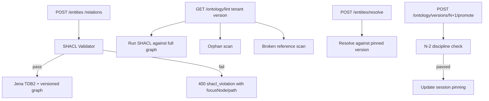

# 12 - syntology - Phase 4 - SHACL Validation, Ontology Lint Hooks, Per-Tenant Versioning

**Version:** 1.0
**Date:** 2026-08-11
**Status:** Draft for review
**Depends on:** Phase 3 `syntology` DoD (session pinning, per-tenant ontology versioning). Phase 4 `control-plane` (Ontology Lint Workflow consumer of the SHACL-lint API), `security` (`support_admin`).
**Scope:** Turn syntology from an ontology *storage* service into an ontology *governance* service. Every write validated by SHACL shapes; expose a lint API called by `control-plane.OntologyLintWorkflow`; move per-tenant versioning from best-effort to enforced; ship SHACL versioning aligned with ontology versioning.

---

## 1. Context and Document Alignment

| Source | Role in this plan |
|--------|-------------------|
| [synanton-design-1.19.md](../../architecture/synanton-design-1.19.md) §19 `syntology` (SHACL, schema migration, session pinning) | Production target |
| [synanton-design-1.19.md](../../architecture/synanton-design-1.19.md) §27 Ontology Lint | Consumer contract |
| [synanton-design-1.19.md](../../architecture/synanton-design-1.19.md) §42 Schema Migration Discipline (N-2) | Versioning discipline |
| [phase3/09-syntology.md](../phase3/09-syntology.md) | Foundation - session pinning + per-tenant versioning |

**Explicit non-goals for Phase 4:**

- No ontology diffing UI (Phase 5).
- No cross-tenant ontology reuse (each tenant continues to own its own version graph).
- No automatic SHACL shape generation from entity samples (Phase 5+).

---

## 2. Phase 4 in One Sentence

> Every entity/relation write must pass SHACL validation aligned with the tenant's pinned ontology version, expose a lint API that answers "is this ontology internally consistent?" to `control-plane`, and enforce N-2 discipline on ontology mutations across pinned sessions.

---

## 3. Target Architecture



---

## 4. Data Contracts

### 4.1 SHACL validation on writes

`POST /entities` (existing) and `POST /relations` - request body validated against SHACL shape graph for the tenant's current version. Response on failure:

```json
HTTP 400 Bad Request
{
  "type": "https://synanton.org/errors/shacl-violation",
  "title": "SHACL validation failed",
  "status": 400,
  "violations": [
    {
      "focus_node": "http://example.com/entity/123",
      "result_path": "http://example.com/predicate/hasName",
      "source_shape": "http://example.com/shapes/NameShape",
      "result_message": "Value must be a string with length between 1 and 200"
    }
  ]
}
```

Emit `syntology_shacl_violations_total{tenant,shape,path}`.

### 4.2 Lint API (called by control-plane)

`GET /ontology/lint?tenant=demo&version=v3`:

```json
{
  "tenant_id": "demo",
  "version": "v3",
  "checked_at": "2026-08-11T10:00:00Z",
  "summary": { "shacl_violations": 0, "orphans": 4, "broken_references": 1, "missing_frontmatter": 2 },
  "shacl_violations": [ /* ... */ ],
  "orphans": [ { "entity_id": "...", "reason": "no incident edges" } ],
  "broken_references": [ { "entity_id": "...", "broken_predicate": "rdfs:subClassOf", "target_missing": "..." } ],
  "missing_frontmatter": [ { "entity_id": "...", "required": ["type","display_name"] } ]
}
```

### 4.3 Version promotion contract

`POST /ontology/versions/{new_version}/promote`:

- Requires `support_admin` role (see `09-security.md`).
- Rejects if there exist pinned sessions on version < `new_version - 2` (N-2 discipline).
- On promote: publishes `ontology_events` `ONTOLOGY_VERSION_PROMOTED { tenant, from_version, to_version }`.

### 4.4 Session pinning (Phase 3 baseline; enforced here)

Sessions carry `X-Synanton-Ontology-Version` header. Requests without this header default to `latest`; requests with it are pinned. Pinning cache lifetime `syntology.session_pin.max_age_hours=24`. Promote workflow refuses to remove a version that has active pinned sessions.

---

## 5. Implementation Design

### 5.1 SHACL validator

Uses Apache Jena's `ShaclValidator`:

```java
class ShaclEnforcer {
    ValidationReport validate(String tenantId, String version, Model payload) {
        var shapeGraph = shapesLoader.loadFor(tenantId, version);
        return ShaclValidator.get().validate(shapeGraph, payload.getGraph());
    }
    void enforce(...) {
        var report = validate(...);
        if (!report.conforms()) throw new ShaclViolation(report);
    }
}
```

Shape graphs stored in Jena TDB2 alongside the data graph, in a separate named graph `urn:synanton:shapes:{tenant}:{version}`. Loaded lazily and cached in-process with 5 min TTL.

Config: `syntology.shacl.enabled: true`, `syntology.shacl.max_shape_graph_size_bytes: 5000000`.

### 5.2 Lint API

Endpoint `GET /ontology/lint`:

- **SHACL check** on full graph (bounded to `syntology.lint.max_nodes=100000`).
- **Orphan scan**: SPARQL `SELECT ?e WHERE { ?e rdf:type ?t . FILTER NOT EXISTS { ?e ?p ?o . FILTER(?p != rdf:type) } FILTER NOT EXISTS { ?other ?q ?e . FILTER(?q != rdf:type) } }`.
- **Broken reference scan**: SPARQL for triples where object of `rdfs:subClassOf`/`rdfs:seeAlso` is not defined in graph.
- **Missing frontmatter**: enforced by SHACL `sh:minCount` on required properties per entity type.

Returns results in a bounded JSON body; if `count > syntology.lint.result_cap=1000`, sets `truncated: true` and provides `next_cursor`.

Metric: `syntology_lint_run_seconds` histogram, `syntology_lint_findings_total{category,tenant}`.

### 5.3 Per-tenant versioning

Each tenant has a `syntology_versions` sequence:

```sql
CREATE TABLE syntology.ontology_versions (
  tenant_id       TEXT NOT NULL,
  version         TEXT NOT NULL,      -- "v1","v2",...
  promoted_at     TIMESTAMPTZ NOT NULL,
  promoted_by     TEXT NOT NULL,
  is_current      BOOLEAN NOT NULL DEFAULT false,
  shape_graph_uri TEXT NOT NULL,
  PRIMARY KEY (tenant_id, version)
);
```

Promotion RPC checks:

1. `new_version` is monotonically next.
2. All pinned sessions across the tenant reference version >= `new_version - 2`.
3. `new_version` has a non-empty SHACL shape graph.

If (2) fails, endpoint returns 409 with `blocked_by_pinned_sessions[]` array; `admin` operator can call `POST /admin/sessions/expire-pinned` (Phase 3 endpoint) to unblock.

### 5.4 `POST /entities/resolve` version awareness

Existing endpoint - resolve entity type strings against tenant's pinned ontology version. Header `X-Synanton-Ontology-Version` selects; absence → `latest`. Response includes the version used:

```json
{ "resolved_type": "http://example.com/type/Company", "ontology_version": "v3" }
```

### 5.5 `ontology_events` Kafka topic

New topic (or existing if already present in phase 3):

```
{ "event_type": "ONTOLOGY_VERSION_PROMOTED", "tenant_id": "demo", "from_version": "v2", "to_version": "v3", "shape_diff_uri": "..." }
{ "event_type": "SHAPE_UPDATED", "tenant_id": "demo", "version": "v3", "shape_uri": "..." }
```

Consumers: `relix` (may cache pattern-coverage per version), `gateway` (invalidates cross-tenant cache entries scoped to the older version).

---

## 6. Module Boundaries

| Module | Owns in Phase 4 | Does not own |
|---|---|---|
| `syntology` | SHACL enforcement, lint API, version promotion with N-2, session pinning enforcement, `ontology_events` producer | Ontology lint scheduling (control-plane owns); duplicate detection heuristic (control-plane's `OntologyLintWorkflow` orchestrates) |
| `control-plane` | Calling `GET /ontology/lint`; filing review items | The lint API itself |
| `relix`, `gateway` | Consuming `ontology_events` for version invalidation | Emitting them |

---

## 7. Prerequisites

| # | Prereq | Home | Notes |
|---|---|---|---|
| 1 | Phase 3 `syntology` DoD met (session pinning) | phase3/09 | Non-negotiable |
| 2 | Jena `jena-shacl:5.x` in BOM | shared | Yes |
| 3 | `syntology.ontology_versions` table | Flyway V4 | Yes |
| 4 | `support_admin` role available in `security` | `09-security.md` | Yes |
| 5 | Kafka `ontology_events` topic created | ops | Yes |

---

## 8. Task Breakdown

| # | Task | Deliverable | Est. |
|---|---|---|---|
| SY4-1 | Flyway migration: `syntology.ontology_versions` table + backfill from existing version pointer | Migration | 0.5 day |
| SY4-2 | Implement `ShapesLoader` (Jena TDB2 named-graph reads + Caffeine cache) | Class + tests | 1 day |
| SY4-3 | Implement `ShaclEnforcer.enforce` on `POST /entities`, `POST /relations`; RFC 7807 body | Class + tests | 1.5 days |
| SY4-4 | Implement `GET /ontology/lint` orchestrating SHACL + orphan + broken-ref + missing-frontmatter | Controller + service + tests | 2 days |
| SY4-5 | Implement `POST /ontology/versions/{v}/promote` with N-2 check | Controller + tests | 1 day |
| SY4-6 | Implement `ontology_events` producer for `ONTOLOGY_VERSION_PROMOTED`, `SHAPE_UPDATED` | Producer + tests | 0.5 day |
| SY4-7 | Extend `POST /entities/resolve` response with `ontology_version` field | DTO + tests | 0.25 day |
| SY4-8 | Enforce `support_admin` role on version promote and shape upload | Filter wiring | 0.25 day |
| SY4-9 | Metrics: `syntology_shacl_violations_total`, `syntology_lint_run_seconds`, `syntology_lint_findings_total{category}`, `syntology_version_promoted_total` | Micrometer | 0.5 day |
| SY4-10 | Integration test `ShaclEnforcementIT`: bad payload → 400 with focusNode; good payload → 200 | `ShaclEnforcementIT` | 1 day |
| SY4-11 | Integration test `OntologyLintIT`: seed graph with orphan + broken ref + missing frontmatter; endpoint reports all three | `OntologyLintIT` | 1 day |
| SY4-12 | Integration test `VersionPromoteN2IT`: pinned session on v1; promote to v4 blocked; expire pinned; retry succeeds | `VersionPromoteN2IT` | 0.5 day |
| SY4-13 | Integration test `SessionPinningEnforcedIT`: request with `X-Synanton-Ontology-Version: v2` resolves against v2 | `SessionPinningEnforcedIT` | 0.5 day |

---

## 9. Testing Strategy

- **Unit:** SHACL shape loader caching. N-2 discipline arithmetic. Lint result truncation.
- **Integration:** All `*IT` classes with embedded Jena TDB2.
- **Regression:** Phase 3 syntology tests unchanged (session pinning, resolve).

---

## 10. Configuration Surface

```yaml
# syntology/src/main/resources/application-phase4.yaml
syntology:
  shacl:
    enabled: true
    max_shape_graph_size_bytes: 5000000
    cache:
      ttl_minutes: 5
      max_size: 128
  lint:
    max_nodes: 100000
    result_cap: 1000
    default_categories: [shacl, orphans, broken_references, missing_frontmatter]
  session_pin:
    max_age_hours: 24
  version:
    n_minus_2_enforced: true
  cache:
    entity_ttl_seconds: 600
```

---

## 11. Risks and Open Questions

| Risk | Mitigation | Decision |
|---|---|---|
| SHACL validation adds latency on write | Cache shape graph per version in memory; measured p99 < 20 ms for typical shapes | Cache |
| Lint API slow on large graphs | Bounded by `max_nodes=100000`; larger graphs return partial results with `truncated=true` and `next_cursor` | Bound |
| N-2 discipline blocks legitimate promote for orphaned pinned sessions | Operator can expire pinned sessions via Phase 3 `/admin/sessions/expire-pinned` | Existing endpoint |
| Shape graph tampering by API caller | Shape graph writes require `support_admin` role; audit every write | Auth |
| SHACL false negatives for constraints Jena doesn't support | SHACL sparql-based constraints available for edge cases; documented in ontology guide | Doc |

---

## 12. Definition of Done (Phase 4)

1. `ShaclEnforcementIT`: entity write violating a `sh:minCount` returns 400 with `violations[]` array populated.
2. `GET /ontology/lint?tenant=demo` returns `shacl_violations`, `orphans`, `broken_references`, `missing_frontmatter` summaries.
3. `POST /ontology/versions/vN/promote` with pinned session on `v(N-3)` returns 409 with `blocked_by_pinned_sessions[]`.
4. `ontology_events` `ONTOLOGY_VERSION_PROMOTED` message published on promote; `gateway` cache-invalidator consumes it (verified via `gateway_cross_tenant_cache_write_total` decreasing after promote).
5. `POST /entities/resolve` returns `ontology_version` in response body.
6. `syntology_shacl_violations_total`, `syntology_lint_findings_total{category}`, `syntology_version_promoted_total` metrics visible in Grafana.
7. All Phase 3 syntology tests pass unchanged.

---

## 13. Follow-on Phases (Signposted)

- **Phase 5** - Ontology diffing UI in `syntology-admin`.
- **Phase 5** - Auto-generated SHACL shapes from entity samples (`SHAPESLearner` workflow).
- **Phase 5** - Cross-tenant ontology reuse / import with permission model.
