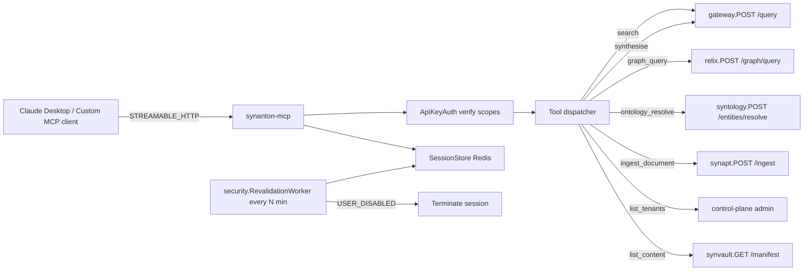

# 13 - synanton-mcp - Phase 4 - Full Tool Surface, MCP Session Revalidation, Scope Enforcement

**Version:** 1.0
**Date:** 2026-08-11
**Status:** Draft for review
**Depends on:** Phase 3 `synanton-mcp` DoD (STREAMABLE_HTTP transport; three tools: `search`, `graph_query`, `ontology_resolve`; API-key auth). Phase 4 `security` (`RevalidationWorker`), `gateway` (Phase 4 hardened `POST /query`).
**Scope:** Expand the tool surface to the full §27b set (adds `synthesise`, `ingest_document`, `list_tenants`, `list_content`, and observability tools); wire MCP session revalidation so a revoked user's session terminates within the tier's revalidation window; enforce per-key scope on every tool call.

---

## 1. Context and Document Alignment

| Source | Role in this plan |
|--------|-------------------|
| [synanton-design-1.19.md](../../architecture/synanton-design-1.19.md) §27b `synanton-mcp` (Tool surface, Auth, Deployment, Config) | Production target |
| [synanton-design-1.19.md](../../architecture/synanton-design-1.19.md) §26 MCP session revalidation | Session lifecycle |
| [synanton-design-1.19.md](../../architecture/synanton-design-1.19.md) §11 ACL Propagation Flow (MCP session revalidation) | Correctness contract |
| [phase3/10-synanton-mcp.md](../phase3/10-synanton-mcp.md) | Foundation |
| [09-security.md](./09-security.md) | Provides `RevalidationWorker` and scope semantics |

**Explicit non-goals for Phase 4:**

- No streaming synthesis in MCP tools (Phase 5).
- No agent-framework tool-loop (out of scope for MCP protocol; consumer builds that on top).
- No MCP client library maintained by us - clients implement the STREAMABLE_HTTP spec themselves.

---

## 2. Phase 4 in One Sentence

> Ship the full §27b tool surface behind the same API-key auth, revalidate every long-lived MCP session on the tier's schedule so revoked users lose access within minutes, and enforce per-key scopes on every tool call.

---

## 3. Target Architecture



---

## 4. Data Contracts

### 4.1 Tool surface (JSON-RPC method names)

| Tool | Purpose | Scope required |
|---|---|---|
| `search` | Hybrid retrieval + optional synthesis (Phase 3, kept) | `search` |
| `graph_query` | Graph traversal (Phase 3, kept) | `graph:read` |
| `ontology_resolve` | Entity type resolution (Phase 3, kept) | `ontology:read` |
| `synthesise` | Explicit synthesis-only over provided hits | `synthesise` |
| `ingest_document` | Enqueue an ingest job | `ingest:write` |
| `list_tenants` | Enumerate accessible tenants for caller | `tenant:list` |
| `list_content` | Paginated manifest listing | `content:list` |
| `execution_trace` | Retrieve trace for a prior query by id | `trace:read` |
| `usage_summary` | Per-tenant usage/budget snapshot | `usage:read` |

Every tool response includes `execution_trace` (subset of the underlying service's trace) so the MCP client can render a citation panel.

### 4.2 Session lifecycle

- Session initialised on first tool call from a given `session_id` (client-supplied via `Mcp-Session-Id` header).
- Session record in Redis: `mcp:session:{id}` → `{subject_id, tenant_id, tier, roles, scopes, started_at, last_active_at, revalidated_at}`.
- TTL: session evicted after `synanton-mcp.session.idle_ttl_minutes=60` idle.
- Revalidation: `security.RevalidationWorker` scans open sessions every N min per tier (5/15/60) - see `09-security.md`.

### 4.3 Response headers

```
Mcp-Session-Id: <id>
Mcp-Session-Revalidated: 2026-08-11T10:23:00Z
X-Synanton-Trace-Id: ...
```

### 4.4 Error format (MCP JSON-RPC)

```json
{
  "jsonrpc": "2.0",
  "id": 1,
  "error": {
    "code": -32001,
    "message": "insufficient_scope",
    "data": { "required": "ingest:write", "have": ["search","graph:read"] }
  }
}
```

Error codes:

- `-32001` `insufficient_scope`
- `-32002` `session_revoked`
- `-32003` `session_expired`
- `-32004` `tenant_scope_mismatch`
- `-32005` `residency_refused`

---

## 5. Implementation Design

### 5.1 Scope enforcement

`ScopeEnforcer` interceptor keyed by tool name:

```java
class ScopeEnforcer {
    void check(String tool, SubjectAssertion subject) {
        var required = REQUIRED_SCOPES.get(tool);
        if (!subject.scopes().contains(required)) throw new InsufficientScope(required, subject.scopes());
    }
}
```

Scope list is fixed per §4.1; declared as an enum in `synanton-mcp.tools`.

### 5.2 Session store + revalidation

Redis-backed:

```java
record McpSession(String id, String subjectId, String tenantId, Tier tier,
                  Set<String> roles, Set<String> scopes,
                  Instant startedAt, Instant lastActiveAt, Instant revalidatedAt) {}

class SessionStore {
    void upsert(McpSession s);
    Optional<McpSession> get(String id);
    void terminate(String id, String reason);
    List<McpSession> allByTier(Tier tier);   // scoped for revalidation batch
}
```

`security.RevalidationWorker` (see `09-security.md`) periodically:

```java
for (session in sessionStore.allByTier(HIGH_SECURITY)) {   // every 5 min
    var status = idpAmortizationCache.getOrRefresh(session.subjectId, HIGH_SECURITY);
    if (status.disabled()) sessionStore.terminate(session.id, "subject_disabled");
    else sessionStore.markRevalidated(session.id);
}
```

Metric `synanton_mcp_session_revalidations_total{tier,outcome}`; alert `McpRevalidationBacklog` if `revalidated_at` lag > 2× interval.

### 5.3 Tool implementations (thin proxies)

Each tool is a JSON-RPC method → downstream HTTP/gRPC call:

```java
class McpToolDispatcher {
    Object dispatch(String tool, JsonNode params, SubjectAssertion caller) {
        scopeEnforcer.check(tool, caller);
        return switch (tool) {
            case "search"           -> gatewayClient.query(params, caller);
            case "graph_query"      -> relixClient.query(params, caller);
            case "ontology_resolve" -> syntologyClient.resolve(params, caller);
            case "synthesise"       -> gatewayClient.synthesise(params, caller);
            case "ingest_document"  -> synaptClient.enqueueIngest(params, caller);
            case "list_tenants"     -> controlPlaneClient.listTenants(caller);
            case "list_content"     -> synvaultClient.listManifest(params, caller);
            case "execution_trace"  -> gatewayClient.getTrace(params, caller);
            case "usage_summary"    -> controlPlaneClient.usageSummary(params, caller);
            default -> throw new ToolNotFound(tool);
        };
    }
}
```

Downstream calls carry the caller's `SubjectAssertion` propagated as `X-Synanton-Subject-Assertion` header (signed and short-lived; issued at MCP boundary via `security.IssueWorkerAssertion`-like pattern - the assertion carries `identity_profile=API_KEY` and `tenant_id`, downstream services trust and enforce).

### 5.4 Residency + tenant scope

Every tool call inherits the caller's `tenant_id` from the API key. `list_content` and `list_tenants` filter to the caller's tenant unless caller is `support_admin` (rare - MCP not commonly used by support tooling; still enforced).

`residency_refused` bubbles up from `synvault` / `synquest` as JSON-RPC error `-32005`.

### 5.5 STREAMABLE_HTTP transport (Phase 3 baseline)

Unchanged from Phase 3. Session negotiation via `Mcp-Session-Id`; server-sent events for streaming outputs on `search` and `synthesise`. Phase 4 adds:

- Session termination reason emitted as final SSE event before close.
- Backpressure via `Retry-After` header when tenant budget denied (see `07-gateway.md` §5.6).

### 5.6 Observability

Metrics:

- `synanton_mcp_tool_calls_total{tool,tenant,outcome}`.
- `synanton_mcp_session_active{tier}` gauge.
- `synanton_mcp_session_revalidations_total{tier,outcome}` counter.
- `synanton_mcp_scope_denied_total{tool,scope}` counter.

Alerts:

- `McpSessionRevalidationLag` - `revalidated_at` older than `2 × interval` for any tier.
- `McpScopeDeniedSpike` - `> 20/min` (likely misconfigured client).

---

## 6. Module Boundaries

| Module | Owns in Phase 4 | Does not own |
|---|---|---|
| `synanton-mcp` | Tool dispatcher, scope enforcer, session store, downstream client wiring | Underlying business logic (gateway, relix, syntology, synvault, control-plane, synapt own their own APIs) |
| `security` | `RevalidationWorker`, scope semantics (stored on API keys) | Session termination action (mcp owns) |
| `topology` | Per-tenant residency check surface | mcp routing |

---

## 7. Prerequisites

| # | Prereq | Home | Notes |
|---|---|---|---|
| 1 | Phase 3 `synanton-mcp` DoD met (three tools + STREAMABLE_HTTP) | phase3/10 | Non-negotiable |
| 2 | `security.RevalidationWorker` implementation (`09-security.md`) | `09-security.md` | Non-negotiable |
| 3 | API keys carry `scopes` field (Phase 3 §26a) | phase3/06 | Yes |
| 4 | Downstream services trust `X-Synanton-Subject-Assertion` (signed) | shared/common | Verify + document |
| 5 | Redis reachable for session store | INDEX.md | Yes |
| 6 | `gateway` Phase 4 changes wired (compile-time ACL, residency) | `07-gateway.md` | Yes |

---

## 8. Task Breakdown

| # | Task | Deliverable | Est. |
|---|---|---|---|
| MC4-1 | Add new tool declarations to JSON-RPC catalogue: `synthesise`, `ingest_document`, `list_tenants`, `list_content`, `execution_trace`, `usage_summary` | Catalogue + tests | 1 day |
| MC4-2 | Implement `ScopeEnforcer` and inject before tool dispatch | Class + tests | 0.5 day |
| MC4-3 | Implement `SessionStore` (Redis) + upsert/get/terminate | Class + tests | 1 day |
| MC4-4 | Extend `security.RevalidationWorker` (in security module) to iterate MCP sessions from `SessionStore` | Cross-module wiring | 0.5 day |
| MC4-5 | Implement downstream clients: `SynaptClient`, `SynvaultClient`, `ControlPlaneAdminClient` (existing gateway/relix/syntology clients from Phase 3) | Clients + tests | 1.5 days |
| MC4-6 | Sign `X-Synanton-Subject-Assertion` header for downstream calls; verify on receipt in shared/common | Signing + verify | 1 day |
| MC4-7 | Wire MCP JSON-RPC error codes (`-32001…-32005`) | Error mapper + tests | 0.5 day |
| MC4-8 | Emit `Mcp-Session-Revalidated` header on every response | Filter | 0.25 day |
| MC4-9 | SSE termination on session revocation - emit final event before close | SSE handler | 0.5 day |
| MC4-10 | Metrics: `synanton_mcp_tool_calls_total`, `synanton_mcp_session_active{tier}`, `synanton_mcp_session_revalidations_total`, `synanton_mcp_scope_denied_total` | Micrometer | 0.5 day |
| MC4-11 | Integration test `NewToolsIT`: each new tool called successfully with valid scope | `NewToolsIT` | 1 day |
| MC4-12 | Integration test `ScopeEnforcementIT`: call `ingest_document` with key missing `ingest:write` → -32001 | `ScopeEnforcementIT` | 0.5 day |
| MC4-13 | Integration test `SessionRevalidationIT`: disable user via SCIM; MCP session terminated within tier's interval | `SessionRevalidationIT` | 0.5 day |
| MC4-14 | Integration test `TenantResidencyIT`: `list_content` for tenant with `allowed=[us-east-1]` from us-east-1 client succeeds; from disallowed region returns -32005 | `TenantResidencyIT` | 0.5 day |
| MC4-15 | Contract test: Claude Desktop client (real STREAMABLE_HTTP handshake) calls each tool successfully in a dev tenant | manual smoke doc + CI test | 1 day |

---

## 9. Testing Strategy

- **Unit:** Scope enforcement table. JSON-RPC error mapping. Session TTL math.
- **Integration:** All `*IT` classes with Testcontainers Redis + WireMock downstream services + Keycloak (for SCIM revoke scenario).
- **Contract:** MCP protocol conformance test suite - the STREAMABLE_HTTP spec includes conformance tests; ensure new tools appear in tool-list response and function per spec.
- **Regression:** Phase 3 three-tool suite passes unchanged.

---

## 10. Configuration Surface

```yaml
# synanton-mcp/src/main/resources/application-phase4.yaml
synanton-mcp:
  session:
    idle_ttl_minutes: 60
    store: redis
  tools:
    catalogue:
      - search
      - graph_query
      - ontology_resolve
      - synthesise
      - ingest_document
      - list_tenants
      - list_content
      - execution_trace
      - usage_summary
  downstream:
    gateway_url:        "http://gateway.synanton.svc:8083"
    relix_url:          "http://relix.synanton.svc:8085"
    syntology_url:      "http://syntology.synanton.svc:8080"
    synapt_url:         "http://synapt.synanton.svc:8080"
    synvault_url:       "http://synvault.synanton.svc:8091"
    control_plane_url:  "http://control-plane.synanton.svc:8080"
  subject_assertion:
    signing_key_env: "MCP_ASSERTION_KEY"
    ttl_seconds: 120
```

---

## 11. Risks and Open Questions

| Risk | Mitigation | Decision |
|---|---|---|
| Fan-out to many downstream services increases MCP failure surface | Each downstream client uses Resilience4j retry+circuit breaker with distinct fallback (e.g. `list_tenants` returns empty if control-plane down); documented | Circuit breakers |
| MCP clients cache tool list stale after schema change | Tool list served fresh per session; MCP protocol supports `tools/listChanged` notification which we emit on config change | Protocol feature |
| Signed subject assertions leak if MCP compromised | Assertion TTL 120 s; downstream verifies signature; compromise limited to short window | Short TTL |
| Session revalidation storms Keycloak on many active MCP sessions | Reuses `IdpStatusAmortizationCache` from `09-security.md`; only cache misses hit Keycloak | Reuse |
| Client sends `Mcp-Session-Id` collision (e.g. two clients same id) | On collision, second client gets new id; old session logged and continues; documented behaviour | Doc |

---

## 12. Definition of Done (Phase 4)

1. All nine tools (§4.1) callable from a real STREAMABLE_HTTP client (Claude Desktop verified in dev).
2. `ScopeEnforcementIT` passes: missing scope → JSON-RPC error `-32001` with `data.required` populated.
3. `SessionRevalidationIT` passes: SCIM `USER_DISABLED` → MCP session terminated within tier's `revalidation_interval_minutes` (+ 3 min jitter tolerance).
4. `TenantResidencyIT` passes: cross-region call refused with `-32005`.
5. `synanton_mcp_session_active{tier}` gauge visible in Grafana.
6. All downstream clients carry a signed `X-Synanton-Subject-Assertion` header verified by shared/common on receipt.
7. Alerts `McpSessionRevalidationLag`, `McpScopeDeniedSpike` have rules.
8. Phase 3 three-tool suite passes unchanged.

---

## 13. Follow-on Phases (Signposted)

- **Phase 5** - Streaming synthesis tool (`synthesise` returns SSE with chunk-by-chunk output including thinking blocks separated per `46a`).
- **Phase 5** - MCP `resources/*` methods (file-based content browsing).
- **Phase 5** - MCP OAuth 2.1 dynamic client registration.
- **Phase 5** - Agent-framework composability primitives (multi-tool plan hints in tool responses).
