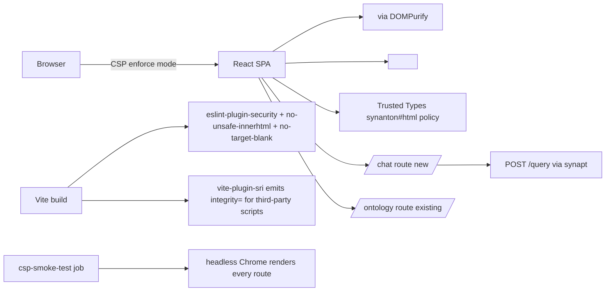

# 14 - syntology-admin (UI) - Phase 4 - CSP Compliance, Trusted Types, SafeHtml, Synanton Chat UI Kickoff

**Version:** 1.0
**Date:** 2026-08-11
**Status:** Draft for review
**Depends on:** Phase 3 `syntology-admin` DoD (login, tenant switcher, admin panel, MCP config panel). Phase 4 `synapt` (CSP + companion headers - `08-synapt.md`).
**Scope:** Bring the React SPA into full v1.18 UI security compliance: CSP-clean under `enforce` mode, all `dangerouslySetInnerHTML` behind `<SafeHtml />`, all external links behind `<SafeExternalLink />`, Trusted Types adopted, external scripts declared with SRI, and start the first-party Synanton chat UI (design §46a) as a new route in the same SPA.

---

## 1. Context and Document Alignment

| Source | Role in this plan |
|--------|-------------------|
| [synanton-design-1.19.md](../../architecture/synanton-design-1.19.md) §48b UI Security Guidelines *(v1.18)* | Production target |
| [synanton-design-1.19.md](../../architecture/synanton-design-1.19.md) §49 Infrastructure Security Headers *(v1.18)* | CSP conformance target |
| [synanton-design-1.19.md](../../architecture/synanton-design-1.19.md) §46a Future UI Addenda *(v1.1)* (reasoning streaming, i18n parity) | Chat UI kickoff scope |
| [phase3/11-syntology-admin.md](../phase3/11-syntology-admin.md) | Foundation - tenant switcher + admin panel + MCP config |
| [08-synapt.md](./08-synapt.md) | Server-side CSP + `/csp-report` endpoint |

**Explicit non-goals for Phase 4:**

- No full-featured chat product - the chat UI is a *minimum-viable* first route so the design §46a UI concerns (thinking blocks, streaming, i18n parity) have somewhere to land iteratively.
- No React state management library change (SPA stays on the Phase 3 stack).
- No native mobile.

---

## 2. Phase 4 in One Sentence

> Ship a CSP-clean React SPA where every unsafe browser sink runs through a Trusted Types policy or a `<SafeHtml />` / `<SafeExternalLink />` wrapper, publish the eslint gates that enforce this, and add a first-party Synanton chat route (Phase-4 MVP: hit `POST /query`, render answer + citations, no streaming).

---

## 3. Target Architecture



---

## 4. Deliverables

### 4.1 `<SafeHtml />` component

```tsx
import DOMPurify from 'dompurify';

const CONFIG = {
  FORBID_TAGS: ['script','style','iframe','object','embed','link','meta'],
  FORBID_ATTR: ['onerror','onload','onclick','onmouseover','onfocus','onblur'],
  ALLOW_DATA_ATTR: false,
};

export function SafeHtml({ html }: { html: string }) {
  const clean = React.useMemo(() => DOMPurify.sanitize(html, CONFIG), [html]);
  return <div dangerouslySetInnerHTML={{ __html: clean }} />;
}
```

Every existing `dangerouslySetInnerHTML` in the SPA is rewritten through this wrapper. CI gate `no-raw-innerHTML` fails the build if `dangerouslySetInnerHTML` appears anywhere outside `SafeHtml.tsx`.

### 4.2 `<SafeExternalLink />` component

```tsx
export function SafeExternalLink({ href, children, ...rest }: Props) {
  if (!assertSafeUrl(href)) return <span>{children} (blocked)</span>;
  return <a href={href} target="_blank" rel="noopener noreferrer" {...rest}>{children}</a>;
}

function assertSafeUrl(href: string): boolean {
  try {
    const u = new URL(href, window.location.origin);
    return ['http:','https:','mailto:','tel:'].includes(u.protocol);
  } catch { return false; }
}
```

Blocked URLs increment `ui_url_blocked_total{scheme}` (via a fetch to `/csp-report`-adjacent endpoint or Beacon API). ESLint `react/jsx-no-target-blank` and custom `synanton/url-must-be-validated` enforce usage.

### 4.3 Trusted Types policy

```typescript
// src/security/trustedTypes.ts
if (typeof window !== 'undefined' && (window as any).trustedTypes) {
  (window as any).trustedTypes.createPolicy('synanton#html', {
    createHTML: (input: string) => DOMPurify.sanitize(input),
  });
  (window as any).trustedTypes.createPolicy('synanton#script', {
    createScript: () => { throw new Error('no dynamic scripts'); },
  });
}
```

CSP already sends `require-trusted-types-for 'script'` from synapt (see `08-synapt.md`).

### 4.4 Token storage

- Access tokens: in-memory closure inside `AuthProvider` (never `localStorage` or `sessionStorage`).
- Refresh: `HttpOnly; Secure; SameSite=Strict` cookie set by synapt on login.
- CSRF defence: double-submit-cookie (`X-Csrf-Token` header matches non-HttpOnly cookie); handled by an axios/fetch middleware.

CI grep-fail gate: any `localStorage.setItem` or `sessionStorage.setItem` referencing a `token`/`credential`/`session` key fails the build.

### 4.5 Third-party script inventory

```yaml
# ui/syntology-admin/vendor-inventory.yaml
- name: react
  version: 18.3.1
  purpose: framework
  audited: 2026-08-11
  sri: sha384-...
- name: dompurify
  version: 3.2.0
  purpose: HTML sanitisation
  audited: 2026-08-11
  sri: sha384-...
- name: recharts
  version: 2.13.0
  purpose: SLO dashboards
  audited: 2026-08-11
  sri: sha384-...
```

Vite plugin `vite-plugin-sri` emits `integrity=` attributes on all third-party `<script>` tags at build time. CI gate `sri-required` fails builds where any `<script src>` lacks an integrity attribute.

### 4.6 Chat UI route (`/chat`)

MVP scope (design §46a):

- Single text input; on submit calls `POST /query` via the auth-provider HTTP client.
- Renders `answer` field + `citations[]` panel + `execution_trace.warnings[]` chips.
- No streaming (Phase 5).
- i18n stubbed via `react-i18next`; English strings + placeholder locales committed with parity-test gate.
- Thinking blocks (from §46a): if `execution_trace.thinking_blocks[]` present, render collapsed by default in a rolling 5-line window with opacity fade; never persisted to `localStorage`.

Component skeleton:

```tsx
export function ChatRoute() {
  const [messages, setMessages] = React.useState<Msg[]>([]);
  const [input, setInput] = React.useState('');
  const submit = async () => {
    const r = await api.query({ query: input, tenant_id: activeTenant });
    setMessages(m => [...m, { user: input, bot: r.answer, citations: r.citations, warnings: r.execution_trace.warnings }]);
    setInput('');
  };
  return <ChatShell messages={messages} onSubmit={submit} input={input} setInput={setInput} />;
}
```

### 4.7 i18n parity test

```typescript
// test/i18n-parity.spec.ts
const reference = keys(require('../src/i18n/en.json'));
const locales = ['de','fr','es','ja'];
for (const l of locales) {
  const keys_l = keys(require(`../src/i18n/${l}.json`));
  expect(new Set(keys_l)).toEqual(new Set(reference));
}
```

CI gate: missing translation key fails the build. Empty translation is allowed (fallback to English at runtime); missing key is not.

### 4.8 `/csp-report` reporter

Browser posts CSP violations to synapt's `/csp-report` (see `08-synapt.md`). No SPA-side code required beyond ensuring the endpoint URI is served from the same origin (default; CSP header contains `report-uri /csp-report`).

---

## 5. Enforcement (ESLint + CI Gates)

`ui/syntology-admin/.eslintrc.cjs` additions:

```js
module.exports = {
  extends: ['react-app', 'plugin:security/recommended'],
  rules: {
    'react/jsx-no-target-blank': 'error',
    'no-restricted-globals': ['error', { name: 'eval', message: 'blocked by Trusted Types' }],
    'no-restricted-syntax': [
      'error',
      { selector: "MemberExpression[object.name='localStorage'][property.name='setItem']", message: 'no token storage' },
      { selector: "JSXAttribute[name.name='dangerouslySetInnerHTML']", message: 'use <SafeHtml/>' }
    ],
    'security/detect-object-injection': 'warn'
  }
};
```

CI job `ui-security-gate`:

- Runs `eslint .` on `ui/syntology-admin/**`.
- Runs `pnpm run test:i18n-parity`.
- Runs `pnpm run build && ./scripts/check-sri.sh dist/index.html` - fails if any script tag lacks `integrity=`.

CI job `csp-smoke-test`:

- Boots the SPA behind a synapt mock in enforce-mode CSP.
- Headless Chrome via Playwright visits every route; asserts `page.on('console', msg)` never receives CSP-violation messages.

---

## 6. Module Boundaries

| Module | Owns in Phase 4 | Does not own |
|---|---|---|
| `syntology-admin` (UI) | `<SafeHtml />`, `<SafeExternalLink />`, Trusted Types policies, ESLint gates, chat route MVP, vendor inventory + SRI, i18n parity gate | The CSP header itself (synapt owns); `/csp-report` receiver (synapt owns); the underlying `POST /query` API |
| `synapt` | CSP + companion headers, `/csp-report` receiver | UI enforcement |

---

## 7. Prerequisites

| # | Prereq | Home | Notes |
|---|---|---|---|
| 1 | Phase 3 `syntology-admin` DoD met (login, tenant switcher, MCP config) | phase3/11 | Non-negotiable |
| 2 | synapt sends CSP + companion headers (`08-synapt.md`) | phase4 | Non-negotiable |
| 3 | `POST /query` exists via `gateway` + `synapt` (Phase 2 baseline; Phase 4 hardened) | phase2 | Baseline |
| 4 | `dompurify:3.x`, `vite-plugin-sri`, `eslint-plugin-security`, `react-i18next` in `package.json` | pnpm add | Yes |
| 5 | Playwright available in CI for `csp-smoke-test` | CI | Yes |

---

## 8. Task Breakdown

| # | Task | Deliverable | Est. |
|---|---|---|---|
| SA_UI4-1 | Add DOMPurify + trusted-types + eslint-plugin-security + vite-plugin-sri + react-i18next deps | `package.json` + lockfile | 0.25 day |
| SA_UI4-2 | Implement `<SafeHtml />` and `<SafeExternalLink />`; publish `assertSafeUrl` helper | 3 files + tests | 1 day |
| SA_UI4-3 | Sweep repo for `dangerouslySetInnerHTML` usage; rewrite via `<SafeHtml />`; add ESLint gate | Refactor + gate | 1 day |
| SA_UI4-4 | Sweep repo for external `<a>` tags; rewrite via `<SafeExternalLink />`; add ESLint gate | Refactor + gate | 0.5 day |
| SA_UI4-5 | Install Trusted Types policies (`synanton#html`, `synanton#script`) at app bootstrap | Bootstrap module | 0.5 day |
| SA_UI4-6 | Refactor auth provider - access token in-memory only; refresh via HttpOnly cookie | Refactor + tests | 1 day |
| SA_UI4-7 | Add CSRF double-submit cookie middleware | Middleware + tests | 0.5 day |
| SA_UI4-8 | Add ESLint rule blocking `localStorage.setItem` for token/credential keys | ESLint rule + test | 0.25 day |
| SA_UI4-9 | Publish `vendor-inventory.yaml`; wire `vite-plugin-sri`; document SRI process | Inventory + config + docs | 0.5 day |
| SA_UI4-10 | CI job `ui-security-gate` (eslint + test:i18n-parity + check-sri) | Workflow YAML | 0.5 day |
| SA_UI4-11 | CI job `csp-smoke-test` (Playwright + headless Chrome) | Workflow YAML | 1 day |
| SA_UI4-12 | Implement `/chat` route MVP: text input, `POST /query`, render answer + citations + warnings | Route + components + tests | 2 days |
| SA_UI4-13 | Implement thinking-block viewer (rolling 5-line, collapsed by default, opacity fade); never persist | Component + tests | 1 day |
| SA_UI4-14 | Set up react-i18next with `en.json` + placeholder locales; i18n parity test | Config + gate | 0.5 day |
| SA_UI4-15 | Update deployment overlay to serve SPA behind synapt with correct CSP headers verified | Ops change + CSP smoke pass | 0.5 day |
| SA_UI4-16 | Documentation: `docs/user-guides/ui-security-model.md` (SafeHtml, SafeExternalLink, adding vendors, adding locales) | Doc | 0.5 day |

---

## 9. Testing Strategy

- **Component (React Testing Library):** `<SafeHtml />` sanitises XSS payloads. `<SafeExternalLink />` blocks `javascript:`. Chat route renders answer + citations.
- **CI gates:** `ui-security-gate`, `csp-smoke-test`, `test:i18n-parity`.
- **E2E (Playwright):** `chatRouteSmoke` - log in, ask a question, assert answer visible. `cspViolationScan` - visits every route in enforce mode, asserts zero violations.
- **Regression:** Phase 3 admin UI tests (login, tenant switch, MCP config) pass unchanged.

---

## 10. Configuration Surface

`ui/syntology-admin/vite.config.ts` (excerpt):

```ts
import sri from 'vite-plugin-sri';
export default defineConfig({
  plugins: [react(), sri()],
  server: { headers: { /* Development-time only; production CSP served by synapt */ } },
});
```

`ui/syntology-admin/src/config/security.ts`:

```ts
export const SECURITY = {
  URL_SCHEMES_ALLOWED: ['http:','https:','mailto:','tel:'],
  DOMPURIFY: {
    FORBID_TAGS: ['script','style','iframe','object','embed','link','meta'],
    FORBID_ATTR: ['onerror','onload','onclick','onmouseover','onfocus','onblur'],
    ALLOW_DATA_ATTR: false,
  },
  TRUSTED_TYPES_POLICIES: ['synanton#html','synanton#script']
};
```

---

## 11. Risks and Open Questions

| Risk | Mitigation | Decision |
|---|---|---|
| CSP `enforce` mode breaks a library that injects inline styles | 2-week `report_only` soak (see `08-synapt.md`); triage every violation before flip | Soak |
| DOMPurify strips legitimate markup in ontology descriptions | `<SafeHtml />` config lists an allowlist for well-known safe elements; extension via PR review | Allowlist |
| Trusted Types policy blocks a downstream library | Whitelisted via named policies; documented process for adding a new policy (requires ADR + security review) | Doc |
| SRI hash mismatch after dependency bump breaks build | Bump procedure includes running `vite-plugin-sri` to regenerate + committing new hash; CI gate confirms | Procedure |
| i18n parity gate fails on new key without translations | Translations may be empty strings (fallback to en); missing key still fails | Empty allowed |
| Chat MVP raises expectations of full chat product | README + UI banner label the route `MVP - preview` explicitly | Label |
| Token in-memory means page refresh loses auth | Refresh cookie (HttpOnly) automatically re-authenticates via silent refresh endpoint on load | Silent refresh |

---

## 12. Definition of Done (Phase 4)

1. `curl -I` against every SPA route returns `Content-Security-Policy` (enforce mode) with the exact directive set from `synanton-design-1.19.md` §49.
2. `csp-smoke-test` CI job passes: headless Chrome visits every route, zero CSP violations.
3. `ui-security-gate` CI job passes: eslint clean, i18n parity holds, SRI present on all third-party scripts.
4. `dangerouslySetInnerHTML` occurrences count = 1 (inside `SafeHtml.tsx`); grep gate enforces.
5. External `<a>` tags either use `<SafeExternalLink />` or fail eslint.
6. Trusted Types policies `synanton#html` and `synanton#script` installed at bootstrap; browser console shows the policies loaded.
7. Access tokens never appear in `localStorage` or `sessionStorage` (grep gate); refresh flow works via HttpOnly cookie.
8. `/chat` route renders answer + citations + warnings for a real dev-tenant `POST /query`; labelled `MVP - preview`.
9. Thinking-block viewer shows collapsed with opacity fade; is never present in `localStorage`.
10. `vendor-inventory.yaml` lists every third-party script; each has `sri`, `audited`.
11. Phase 3 admin UI tests pass unchanged.

---

## 13. Follow-on Phases (Signposted)

- **Phase 5** - Stream chat responses via SSE from `POST /query`; extend thinking-block viewer to render live tokens.
- **Phase 5** - Full chat feature set (history, sessions, share/export).
- **Phase 5** - Tighten CSP `style-src` to nonce-based (remove `'unsafe-inline'`).
- **Phase 5** - Add reasoning-block streaming per design §46a with model-agnostic separator.
- **Phase 5** - Localisation deliveries beyond English + placeholders.
