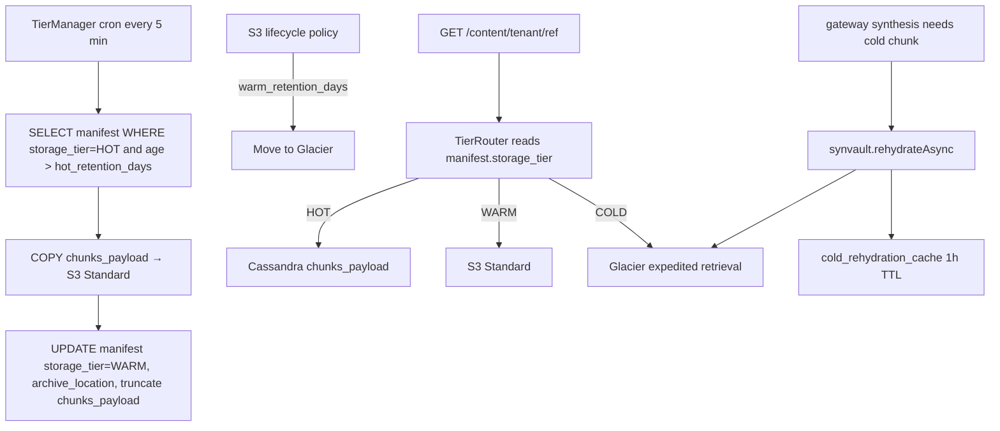

# 02 - synvault - Phase 5 - Tier Manager (HOT → WARM → COLD → Glacier), `rehydrateAsync`

**Version:** 1.0
**Date:** 2026-08-11
**Status:** Draft for review
**Depends on:** Phase 4 `synvault` DoD (tenant-scoped reads, residency enforcement). Phase 4 `gateway` cold-rehydration cache (`07-gateway.md`). Phase 4 `topology.tiering_policy` schema.
**Scope:** Move payloads through their lifecycle: HOT (Cassandra `chunks_payload`) → WARM (S3 Standard) → COLD (S3 Glacier). Expose `rehydrateAsync(content_ref_id)` that `gateway` calls during cold synthesis. Preserve `GET /content/{tenant}/{ref}` transparency for HOT and WARM; document degraded path for COLD.

---

## 1. Context and Document Alignment

| Source | Role in this plan |
|--------|-------------------|
| [synanton-design-1.19.md](../../architecture/synanton-design-1.19.md) §9 Tier Movement Flow (v1.17 cold-retrieval rehydration) | Production target |
| [synanton-design-1.19.md](../../architecture/synanton-design-1.19.md) §16 `synvault` Tier Manager | Config surface |
| [synanton-design-1.19.md](../../architecture/synanton-design-1.19.md) §39 Object Storage Layout (S3 / Glacier) | Bucket / prefix layout |
| [phase4/07-gateway.md](../phase4/07-gateway.md) | Consumer of `rehydrateAsync` |
| [phase4/02-synvault.md](../phase4/02-synvault.md) | Foundation: tenant scope + residency |

**Explicit non-goals for Phase 5:**

- No lifecycle policy authoring for existing buckets - documented as ops setup for the Terraform overlay.
- No cross-region tier movement (data stays in tenant's residency).
- No user-facing "restore this document" UI - retrieval is transparent per §9.

---

## 2. Phase 5 in One Sentence

> Age content out of expensive HOT storage on a schedule per `topology.tiering_policy`, keep WARM retrievals fully transparent, and make COLD synthesis retrievals either succeed within 8 s or degrade to abstract text with an audit trail.

---

## 3. Target Architecture



---

## 4. Data Contracts

### 4.1 Manifest schema additions

```cql
ALTER TABLE ingestion_cache.manifest ADD storage_tier         TEXT;   -- HOT | WARM | COLD
ALTER TABLE ingestion_cache.manifest ADD archive_location     TEXT;   -- s3 URI when WARM/COLD
ALTER TABLE ingestion_cache.manifest ADD tier_last_moved_at   TIMESTAMP;
ALTER TABLE ingestion_cache.manifest ADD abstract_text        TEXT;   -- populated by synflux Pass 2, used by cold-degraded path
```

### 4.2 S3 layout

```
s3://synanton-warm-{region}/{tenant_id}/{content_ref_id}/{chunk_index}.bin
s3://synanton-cold-{region}/{tenant_id}/{content_ref_id}/{chunk_index}.bin   (Glacier storage class)
```

Both buckets versioned; both encrypted with SSE-KMS using per-tenant CMK.

### 4.3 `POST /internal/rehydrate/{content_ref_id}`

Called by `gateway` (Phase 4 `ColdRehydrator`):

```
POST /internal/rehydrate/{content_ref_id}
Authorization: Bearer <service_token>
X-Synanton-Tenant: demo
X-Synanton-Timeout-Ms: 8000
```

Response:

```
HTTP 200 OK
X-Synanton-Rehydration-Source: warm|cold
{
  "content_ref_id": "...",
  "bytes_available": 4523,
  "cache_key": "synanton:rehydrate:<sha>"
}
```

If retrieval will exceed the requested timeout:

```
HTTP 202 Accepted
X-Synanton-Rehydration-ETA-Seconds: 300
{
  "content_ref_id": "...",
  "eta_seconds": 300,
  "cache_key": "synanton:rehydrate:<sha>"
}
```

### 4.4 `GET /content/{tenant}/{ref}` behaviour

- HOT: served directly from Cassandra (unchanged from Phase 1).
- WARM: served transparently from S3 Standard; response header `X-Synanton-Served-From-Tier: warm`.
- COLD: `202 Accepted` with `X-Synanton-Rehydration-ETA-Seconds` if not cached; on subsequent call served from `cold_rehydration_cache`.

---

## 5. Implementation Design

### 5.1 `TierManager`

Loop every `synvault.tier.scan_interval_seconds=300`:

```java
class TierManager {
    void tick() {
        for (var tenant : tenantsWithHotContent()) {
            var policy = topology.getTieringPolicy(tenant);
            if (!policy.enabled) continue;
            var batch = manifestDao.findHotOlderThan(tenant, policy.hotRetentionDays, batchSize);
            for (var doc : batch) {
                try {
                    copyChunksToS3Warm(doc);
                    manifestDao.markWarm(doc.contentRefId, s3Uri(doc));
                    truncateHotChunks(doc.contentRefId);
                    metric.recordMoved(tenant, "WARM", doc.totalBytes);
                } catch (Exception e) {
                    metric.recordFailure(tenant, "WARM", e);
                }
            }
        }
    }
}
```

Concurrency: `synvault.tier.parallelism=8` per synvault instance.

### 5.2 WARM → COLD transition

Handled by **S3 lifecycle policy** (declared in Terraform), not synvault code:

```json
{
  "Rules": [
    {
      "ID": "warm-to-cold",
      "Status": "Enabled",
      "Filter": { "Prefix": "" },
      "Transitions": [
        { "Days": {{ warm_retention_days }}, "StorageClass": "GLACIER" }
      ]
    }
  ]
}
```

Synvault reconciles: on read, if `manifest.storage_tier=WARM` but S3 object class is `GLACIER`, updates `storage_tier=COLD` in-place. Metric `synvault_tier_reconcile_total{from,to}`.

### 5.3 `RehydrateAsyncService`

```java
class RehydrateAsyncService {
    CompletableFuture<RehydrateResult> rehydrate(String tenantId, String contentRefId, Duration timeout) {
        var cacheKey = "synanton:rehydrate:" + sha256(contentRefId);
        if (redis.exists(cacheKey)) return CompletableFuture.completedFuture(cached(cacheKey));
        redis.setnx(cacheKey, "PENDING", ttl(config.rehydrationBackoffSeconds));
        return CompletableFuture.supplyAsync(() -> {
            var chunks = manifestDao.getChunks(tenantId, contentRefId);
            var bytes = fetchFromS3(chunks);
            redis.set(cacheKey, bytes, ttl(3600));
            return new RehydrateResult(contentRefId, bytes.length, cacheKey);
        });
    }
}
```

For Glacier objects, uses S3 `restore-object` with `Tier=Expedited` (1-5 min) or `Standard` (3-5 h) based on tenant's `tiering_policy.glacier_tier` (default `Expedited`).

### 5.4 Adapter per tier (`ContentPullPort`)

- `CassandraHotAdapter` - existing Phase 1 code path.
- `S3WarmAdapter` - Netty-based async S3 client; streaming reads.
- `S3ColdAdapter` - checks object class; if `GLACIER`, issues `restore-object` then polls; if already restored (WARM copy), streams directly.

All three implement the same `ContentPullPort` SPI; `TierRouter` picks by `manifest.storage_tier`.

### 5.5 Residency enforcement (from Phase 4)

Every `S3WarmAdapter` / `S3ColdAdapter` publishes `region()`. `TierManager` picks a warm bucket in the tenant's residency; Glacier bucket in the same region. Cross-region tier movement is **not** allowed.

### 5.6 Metrics

- `synvault_tier_moved_bytes_total{tenant,target_tier}`.
- `synvault_tier_scan_duration_seconds`.
- `synvault_cold_retrieval_total{tenant,target_tier}`.
- `synvault_tier_reconcile_total{from,to}`.
- `synvault_rehydrate_p95_seconds{tenant}`.
- `synvault_rehydrate_pending{tenant}` (gauge - in-flight rehydrations).

Alerts:

- `SynvaultTierMoveStalled` - no HOT→WARM movement in 4 h despite policy schedule.
- `SynvaultRehydrateSlo` - `p95 > 8 s` for warm; `p95 > 300 s` for cold (Expedited tier).

---

## 6. Module Boundaries

| Module | Owns in Phase 5 | Does not own |
|---|---|---|
| `synvault` | `TierManager`, `RehydrateAsyncService`, `TierRouter`, `S3WarmAdapter`, `S3ColdAdapter`, manifest schema additions | S3 lifecycle policy (Terraform/ops); Glacier restore quota (AWS) |
| `topology` | `tiering_policy` field on `organizations` | Enforcement (synvault reads) |
| `gateway` | Calls `POST /internal/rehydrate/{ref}` when synthesis needs cold chunk | Rehydration itself |
| `ops` | S3 buckets + lifecycle + KMS CMK provisioning | Application code |

---

## 7. Prerequisites

| # | Prereq | Home | Notes |
|---|---|---|---|
| 1 | Phase 4 `synvault` DoD met | phase4/02 | Non-negotiable |
| 2 | S3 buckets `synanton-warm-{region}` and `synanton-cold-{region}` provisioned with lifecycle policy | ops | Non-negotiable |
| 3 | Per-tenant KMS CMK for SSE-KMS | ops | Yes |
| 4 | `topology.organizations.tiering_policy` schema (JSONB with `hot_retention_days`, `warm_retention_days`, `glacier_tier`) | topology | Yes |
| 5 | Phase 4 `gateway` `ColdRehydrator` calls `POST /internal/rehydrate/{ref}` | phase4/07 | Yes |
| 6 | `abstract_text` column populated by `synflux` Pass 2 (Phase 2 chain-of-thought) | phase2 | Yes |
| 7 | Redis reachable for `cold_rehydration_cache` | phase4 infra | Yes |

---

## 8. Task Breakdown

| # | Task | Deliverable | Est. |
|---|---|---|---|
| SV5-1 | CQL migration V4: manifest columns `storage_tier`, `archive_location`, `tier_last_moved_at`, `abstract_text` | Migration | 0.5 day |
| SV5-2 | Implement `TierManager` (scan + copy + truncate + mark WARM) | Class + tests | 2 days |
| SV5-3 | Implement `S3WarmAdapter` (Netty async S3 client, streaming reads) | Class + tests | 1.5 days |
| SV5-4 | Implement `S3ColdAdapter` (restore-object + polling + streaming) | Class + tests | 2 days |
| SV5-5 | Implement `TierRouter` (dispatches to HOT/WARM/COLD adapter) | Class + tests | 0.5 day |
| SV5-6 | Implement `RehydrateAsyncService` (Redis PENDING sentinel + async fetch + backoff) | Class + tests | 1.5 days |
| SV5-7 | Wire `POST /internal/rehydrate/{content_ref_id}` endpoint (service-auth only) | Controller + tests | 0.5 day |
| SV5-8 | Extend `GET /content/{tenant}/{ref}` to return 202 with ETA for cold reads | Controller update + tests | 1 day |
| SV5-9 | Implement WARM↔COLD reconcile on read (update manifest when S3 object class drifts) | Class + tests | 0.5 day |
| SV5-10 | Emit metrics: `synvault_tier_moved_bytes_total`, `synvault_cold_retrieval_total`, `synvault_rehydrate_p95_seconds`, `synvault_rehydrate_pending`, `synvault_tier_reconcile_total` | Micrometer | 0.5 day |
| SV5-11 | Integration test `TierMovementIT` (Testcontainers Cassandra + LocalStack S3): HOT doc past retention → WARM within 5 min | `TierMovementIT` | 1 day |
| SV5-12 | Integration test `WarmReadTransparentIT`: WARM doc read succeeds without special headers | `WarmReadTransparentIT` | 0.5 day |
| SV5-13 | Integration test `ColdRehydrationIT`: cold doc via `rehydrate` returns bytes; second call returns cached | `ColdRehydrationIT` | 1 day |
| SV5-14 | Integration test `ResidencyOnTierMoveIT`: tenant with `allowed=[us-east-1]` never moves to `eu-west-1` bucket | `ResidencyOnTierMoveIT` | 0.5 day |
| SV5-15 | Terraform for S3 buckets + lifecycle + KMS + IAM (ops overlay) | Terraform module | 1.5 days |
| SV5-16 | Runbook `docs/operations/runbooks/synvault-tier.md` | Runbook | 0.5 day |

---

## 9. Testing Strategy

- **Unit:** Adapter selection by tier. Rehydration state machine (PENDING/COMPLETE/BACKOFF).
- **Integration:** All `*IT` classes with Testcontainers Cassandra + LocalStack S3 (Glacier support requires MinIO or motto).
- **Load:** `TierMoveIOAmp` - 10K docs → HOT→WARM in one scan; assert no read-path degradation.
- **Chaos:** `S3TransientOutageIT` - random 500s on S3 puts; TierManager retries and marks failures without corrupting manifest.
- **Regression:** Phase 4 residency + tenant-scope tests unchanged.

---

## 10. Configuration Surface

```yaml
# synvault/src/main/resources/application-phase5.yaml
synvault:
  tier:
    enabled: true
    scan_interval_seconds: 300
    parallelism: 8
    s3_part_size_mb: 16
  rehydrate:
    backoff_seconds: 300
    max_wait_seconds: 60
    cache_ttl_seconds: 3600
    glacier_default_tier: Expedited   # Expedited | Standard
  adapters:
    hot:  { enabled: true }
    warm: { enabled: true, region: us-east-1, bucket: synanton-warm-us-east-1 }
    cold: { enabled: true, region: us-east-1, bucket: synanton-cold-us-east-1 }
```

Per-tenant policy (`topology.organizations.tiering_policy`):

```json
{
  "enabled": true,
  "hot_retention_days": 30,
  "warm_retention_days": 180,
  "glacier_tier": "Expedited",
  "abstract_only_below_confidence": 0.5
}
```

---

## 11. Risks and Open Questions

| Risk | Mitigation | Decision |
|---|---|---|
| S3 Glacier restore quota exhausted under load | Bulk `Standard` retrieval used for `RecrawlAfterRestorationWorkflow`; only interactive synthesis uses `Expedited`; documented | Doc |
| `truncate chunks_payload` on live-read window causes 500 | TierManager updates manifest FIRST (adds `archive_location`), then truncates on next iteration; readers observe the switch atomically | Two-step |
| S3 CRR (cross-region for DR) doubles storage cost | Tenant policy allows opting out of CRR; documented in cost guide | Opt-out |
| Rehydration cache stampede on a hot content_ref | `PENDING` sentinel prevents duplicate S3 fetches; single-flight semantics | Sentinel |
| Manifest `storage_tier` drift after operator manual S3 changes | Reconcile-on-read heals; nightly `TierReconcileJob` cleans stale rows | Layered |
| Cold retrieval user-visible latency in dashboards | Retrieval time is *documented* SLO on the runbook; UI degraded path (`X-Synanton-Cold-Rehydration: degraded`) short-circuits worst case | Documented |

---

## 12. Definition of Done (Phase 5)

1. `TierMovementIT` passes: HOT doc past `hot_retention_days` becomes WARM within one scan cycle.
2. `synvault_tier_moved_bytes_total{tenant,target_tier="WARM"}` increments; `chunks_payload` verified truncated by direct Cassandra query.
3. `WarmReadTransparentIT`: WARM doc served via `GET /content/{tenant}/{ref}` with `X-Synanton-Served-From-Tier: warm` header.
4. `ColdRehydrationIT`: cold doc via `rehydrate` fetched from Glacier within 5 min (Expedited); second call returns from `cold_rehydration_cache`.
5. `ResidencyOnTierMoveIT`: cross-region tier movement refused with `residency_refusal` audit.
6. `SynvaultTierMoveStalled` and `SynvaultRehydrateSlo` alerts wired.
7. Terraform module for S3 buckets + lifecycle + KMS shipped in `deployment/terraform/synvault-tier/`.
8. Phase 4 residency + tenant-scope regression suite passes.

---

## 13. Follow-on Phases (Signposted)

- **v1.20+** - Cross-region WARM replicas for read-nearest.
- **v1.20+** - Bulk restore workflow triggered by operator: `synctl synvault restore --content-ref=...`.
- **v1.20+** - Adaptive `hot_retention_days` per-tenant based on access-frequency prediction.
