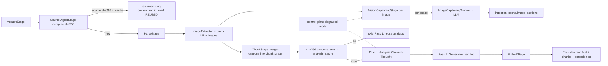

# 03 - synflux - Phase 5 - Vision Captioning Stage, Two-Step Chain-of-Thought Hardening, SHA256 Incremental Cache

**Version:** 1.0
**Date:** 2026-08-11
**Status:** Draft for review
**Depends on:** Phase 2 `synflux` DoD (`EnrichStage`, `EmbedStage`); Phase 3 worker mode + Kafka. Phase 5 `ingestion-cache` (`01-ingestion-cache.md`, populates `image_captions`), `synanton-llm-client` (vision model support via `content_type: image`).
**Scope:** Add the `VisionCaptioningStage` between parse and enrich; harden the two-step chain-of-thought so Pass 1 failures produce actionable DLQ rows; wire the SHA256 incremental cache so identical source files never re-ingest and identical parsed text never re-enriches.

---

## 1. Context and Document Alignment

| Source | Role in this plan |
|--------|-------------------|
| [synanton-design-1.19.md](../../architecture/synanton-design-1.19.md) §17 Vision captioning stage (v1.1) | Production target |
| [synanton-design-1.19.md](../../architecture/synanton-design-1.19.md) §17 Two-step chain-of-thought (v1.1) | Pass 1 / Pass 2 semantics |
| [synanton-design-1.19.md](../../architecture/synanton-design-1.19.md) §17 SHA256 incremental cache (v1.1) | Cache lookup contract |
| [synanton-design-1.19.md](../../architecture/synanton-design-1.19.md) §17 GPU degraded mode (v1.17) | Failure path (vision drops on degraded) |
| [phase5/01-ingestion-cache.md](./01-ingestion-cache.md) | `image_captions` DAO |
| [phase5/09-synreview.md](./09-synreview.md) | Consumer of PII flags + low-confidence chunks |

**Explicit non-goals for Phase 5:**

- No arbitrary media (video, audio) - images only.
- No caption re-generation on model version bump (deferred; use `RecrawlAfterRestorationWorkflow` pattern for backfills).
- No OCR - images are captioned semantically; OCR remains a Phase 6+ enhancement if demand.

---

## 2. Phase 5 in One Sentence

> Ingest images alongside text, cache captions by image SHA256, harden the two-pass LLM enrichment so failures never silently drop content, and skip re-work when source or parsed content is byte-identical to a previous run.

---

## 3. Target Architecture



---

## 4. Data Contracts

### 4.1 Chunk record extensions

```java
public record Chunk(
    String contentRefId,
    int chunkIndex,
    String text,
    Type contentType,       // TEXT | IMAGE_CAPTION | TABLE
    Map<String,String> metadata,
    List<String> imageRefs  // sha256s of associated images
) {
  enum Type { TEXT, IMAGE_CAPTION, TABLE }
}
```

Image-caption chunks carry `contentType=IMAGE_CAPTION` and `metadata.image_sha256=<hex>` for citation back to the original image.

### 4.2 `VisionCaptionRequest` / `VisionCaptionResponse`

```java
record VisionCaptionRequest(byte[] pngBytes, String modelFamily, String tenantId) {}
record VisionCaptionResponse(String caption, double confidence, String modelVersion) {}
```

Wire format via `synanton-llm-client` OpenAI-compat vision surface (`content_type: image`).

### 4.3 SHA256 cache lookups

| Lookup | Table | Skip if hit |
|---|---|---|
| Source digest | `ingestion_cache.source_digests` (tenant_id, sha256(source_bytes)) | Entire pipeline; return existing `content_ref_id` |
| Analysis (Pass 1) | `ingestion_cache.analysis_cache` (tenant_id, sha256(canonical_text), analysis_model_id) | Pass 1 |
| Image caption | `ingestion_cache.image_captions` (tenant_id, image_sha256, model_family) | `VisionCaptioningStage` per image |
| Embedding | `ingestion_cache.embedding_content_cache` (tenant_id, sha256(chunk_text), embed_model_id) | `EmbedStage` per chunk |

### 4.4 DLQ envelope

```json
{
  "content_ref_id": "...",
  "tenant_id": "demo",
  "poison_reason": "ANALYSIS_FAILED | GENERATION_INCOMPLETE | PARSER_PANIC | VISION_DROPPED | RECRAWL_FAILED",
  "stage": "PASS_1 | PASS_2 | VISION | PARSE",
  "error_summary": "...",
  "attempt_count": 3,
  "last_attempted_at": "..."
}
```

Written to `synflux_dlq` Kafka topic (per §37); consumed by operator tooling and by `synreview` for `LOW_CONFIDENCE_CHUNK` filing.

---

## 5. Implementation Design

### 5.1 `SourceDigestStage`

```java
class SourceDigestStage implements Stage {
    Result run(AcquireResult in) {
        var sha = sha256(in.sourceBytes());
        var existing = sourceDigestDao.find(in.tenantId(), sha);
        if (existing.isPresent()) {
            metric.increment("synflux_source_digest_hit_total", "tenant", in.tenantId());
            return Result.reused(existing.get().contentRefId());
        }
        return Result.proceed(sha);
    }
}
```

On new source, insert `source_digests(tenant_id, source_sha256, content_ref_id, ingested_at)` at the end of the pipeline (post-persist).

### 5.2 `ImageExtractor`

Walks the parsed document tree (Tika-mediated) and extracts inline images:

- Normalise to PNG.
- Strip EXIF metadata (PII risk).
- Compute `sha256(png_bytes)`.
- Emit as `ImageCandidate(sha256, pngBytes, occursInChunkIndex)`.

Downstream `VisionCaptioningStage` receives the list.

### 5.3 `VisionCaptioningStage`

For each `ImageCandidate`:

1. Check `image_captions` cache with `(tenant_id OR NULL, image_sha256, model_family)`. Hit → reuse caption.
2. Miss → `LlmClient.captionImage(request)` via `ModelServingDirectory` for the tenant's region.
3. Write caption to `image_captions` (tenant-scoped; cross-tenant bucket populated only if `cost_privacy.share_image_captions=true`).
4. Append `Chunk(contentType=IMAGE_CAPTION, text=caption, metadata={image_sha256:...})` to the chunk stream.

Failure handling:

- Vision model timeout / 5xx: retry 3× exp backoff (2, 5, 15 s).
- Persistent failure: **drop the image**, metric `synflux_vision_dropped_total{tenant,reason="vision_failed"}`, DLQ optional (`synflux.vision.dlq_on_drop=false` default). Document survives without that image.
- Degraded mode active: skip all captioning, metric `synflux_vision_dropped_total{tenant,reason="degraded_mode"}`, no DLQ.

### 5.4 `EnrichStage` hardening (Pass 1 / Pass 2)

**Pass 1 (per chunk): Analysis chain-of-thought.**

- Cache key: `(tenant_id, sha256(canonical_text), analysis_model_id)`.
- On hit: reuse cached `analysis_json`; skip LLM call.
- On miss: call LLM with structured prompt; validate response against JSON schema (`enrichment-pass1.schema.json`).
- Failure: `attempts < 3`: retry with exponential backoff; `attempts == 3`: DLQ with `poison_reason=ANALYSIS_FAILED`, do NOT proceed to Pass 2 for this chunk.
- Metric: `synflux_pass1_duration_seconds`, `synflux_pass1_failure_total{tenant,reason}`, `synflux_pass1_cache_hit_total`.

**Pass 2 (per doc): Generation.**

- Input: all Pass 1 outputs for the doc.
- LLM call produces entities, relations, indexing hints, review items.
- Failure: emit `synflux_pass2_partial_total`, index chunk with parsed content only, file `LOW_CONFIDENCE_CHUNK` review item in `synreview` (see `09-synreview.md`), retryable via `synctl synflux enrich retry --content-ref=<id>`.

### 5.5 GPU degraded-mode branching

Reads `platform_state.gpu_degraded.state` (via Kafka `platform_state` topic; consumer in synflux). When ACTIVE:

- `VisionCaptioningStage`: skip entirely; drop images with `reason=degraded_mode`.
- `EnrichStage`: skip Pass 1 + Pass 2; chunk indexed with parsed content only. Manifest `embedding_quality=LEXICAL_ONLY`.
- `EmbedStage`: switch to `synflux.degraded.embedding_fallback_model` (default `all-MiniLM-L6-v2`). If CPU queue > `degraded.cpu_max_queue_seconds=30`, skip embedding entirely (`embedding_quality=LEXICAL_ONLY`).

On restore, `RecrawlAfterRestorationWorkflow` (`08-control-plane.md`) re-processes rows with `embedding_quality != FULL`.

### 5.6 Two-step chain-of-thought retention

`analysis_cache` (Pass 1 output) retained for 90 d (per `01-ingestion-cache.md`). Rationale: (a) `synreview` UI shows the reasoning trace; (b) `RelixCommunityJob` uses Pass 1 concept vectors as seeds; (c) ontology lint reruns cheap.

Retention TTL is a floor, not a ceiling - long-lived caches don't auto-invalidate on prompt or model change. Model bumps require an operator-initiated `synctl synflux enrich retry --tenant=demo --since=<date>` sweep, tracked as a Phase 6 automation.

### 5.7 Idempotency across all stages

Every persistent write keyed by `sha256(tenant_id || content_ref_id || stage || chunk_index)`. Kafka messages carry the same key so re-delivery is safe.

---

## 6. Module Boundaries

| Module | Owns in Phase 5 | Does not own |
|---|---|---|
| `synflux` | `SourceDigestStage`, `ImageExtractor`, `VisionCaptioningStage`, Pass 1/Pass 2 hardening, degraded-mode branching, DLQ emission | Vision model deployment (ops); `image_captions` table (in `ingestion-cache`) |
| `synanton-llm-client` | Vision-capable API surface (`content_type: image`) | Model choice per tenant (planner via `ModelServingDirectory`) |
| `ingestion-cache` | Cache tables + DAO | Population (synflux does) |
| `control-plane` | `RecrawlAfterRestorationWorkflow` for GPU-restore recovery | Degraded-mode circuit (control-plane) |
| `synreview` | `LOW_CONFIDENCE_CHUNK` / `PII_FLAG` review items | Filing them (synflux does) |

---

## 7. Prerequisites

| # | Prereq | Home | Notes |
|---|---|---|---|
| 1 | Phase 2 `EnrichStage` + `EmbedStage` live | phase2 | Non-negotiable |
| 2 | `synanton-llm-client` supports vision (`content_type: image`) - single translator update | shared client | Yes |
| 3 | `ingestion_cache.image_captions` and `source_digests` schemas (see `01-ingestion-cache.md`) | phase5/01 | Non-negotiable |
| 4 | Vision model deployed (Qwen2-VL or LLaVA) accessible via `ModelServingDirectory` | ops | Non-negotiable |
| 5 | Phase 4 GPU degraded-mode circuit (Kafka `platform_state`) available | phase4/11 | Yes |
| 6 | `synreview.review_items` table (`09-synreview.md`) | phase5/09 | Non-negotiable |
| 7 | `synflux_dlq` Kafka topic (from Phase 2) | phase2 | Yes |

---

## 8. Task Breakdown

| # | Task | Deliverable | Est. |
|---|---|---|---|
| SF5-1 | Extend `Chunk` record with `contentType` enum + `imageRefs`; migration for existing code paths | Record + tests | 1 day |
| SF5-2 | Implement `SourceDigestStage` (compute sha256, DAO lookup, short-circuit) | Class + tests | 1 day |
| SF5-3 | Implement `ImageExtractor` (Tika walk, PNG normalise, EXIF strip, sha256) | Class + tests | 1.5 days |
| SF5-4 | Implement `VisionCaptioningStage` (cache-check, LLM call, cache-write, drop-on-fail) | Class + tests | 2 days |
| SF5-5 | Extend `synanton-llm-client` vision surface (OpenAI-compat `content_type: image`) | Client update + tests | 1 day |
| SF5-6 | Refactor `EnrichStage`: separate Pass 1 / Pass 2 execution, structured DLQ | Refactor + tests | 2 days |
| SF5-7 | Wire GPU degraded-mode consumer (`platform_state` Kafka); branch stages accordingly | Consumer + branch logic | 1 day |
| SF5-8 | Wire embedding fallback path (`all-MiniLM-L6-v2` on CPU) | Config + adapter | 0.5 day |
| SF5-9 | Emit `LOW_CONFIDENCE_CHUNK` / `PII_FLAG` review items on Pass 2 outputs | Filing logic + tests | 1 day |
| SF5-10 | Metrics: `synflux_source_digest_hit_total`, `synflux_vision_captions_total`, `synflux_vision_dropped_total`, `synflux_pass1_failure_total`, `synflux_pass1_cache_hit_total`, `synflux_pass2_partial_total`, `synflux_degraded_ingest_total{quality}` | Micrometer | 0.5 day |
| SF5-11 | CLI `synctl synflux enrich retry --content-ref=<id>` for partial-Pass2 recovery | CLI subcommand + tests | 0.5 day |
| SF5-12 | Integration test `VisionCaptionsIT`: PDF with 3 images → 3 caption chunks; second run 100 % cache hit | `VisionCaptionsIT` | 1 day |
| SF5-13 | Integration test `SourceDigestSkipIT`: identical file twice → second run reuses content_ref_id | `SourceDigestSkipIT` | 0.5 day |
| SF5-14 | Integration test `Pass1DlqIT`: force LLM 500 3× → DLQ row with `poison_reason=ANALYSIS_FAILED` | `Pass1DlqIT` | 0.5 day |
| SF5-15 | Integration test `DegradedModeSkipIT`: enable degraded → vision + Pass1 skipped, chunk indexed LEXICAL_ONLY | `DegradedModeSkipIT` | 0.5 day |
| SF5-16 | Regression: Phase 2 EnrichStage + EmbedStage golden-dataset tests unchanged | - | 0.25 day |

---

## 9. Testing Strategy

- **Unit:** `SourceDigestStage` cache miss/hit. `ImageExtractor` EXIF stripping. Pass 1 retry state machine.
- **Integration:** All `*IT` classes with Testcontainers Cassandra + Kafka + vLLM mock (WireMock respecting OpenAI-compat vision shape).
- **Load:** `VisionThroughputLoadTest` - 1000 images ingested with 100 duplicates; cache hit ratio ≥ 10 %.
- **Regression:** Phase 2 pipeline golden dataset produces identical manifests (excluding new `contentType` field).

---

## 10. Configuration Surface

```yaml
# synflux/src/main/resources/application-phase5.yaml
synflux:
  source_digest:
    enabled: true
  vision:
    enabled: true
    model_family: qwen2-vl-7b
    max_image_bytes: 5242880       # 5 MB
    exif_strip: true
    dlq_on_drop: false
  enrich:
    pass1:
      max_attempts: 3
      backoff_ms: [2000, 5000, 15000]
      json_schema_path: classpath:enrichment-pass1.schema.json
    pass2:
      max_attempts: 3
      partial_ok: true
  degraded:
    embedding_fallback_model: all-MiniLM-L6-v2
    cpu_max_queue_seconds: 30
    skip_vision: true
    skip_pass1: true
    skip_pass2: true
```

---

## 11. Risks and Open Questions

| Risk | Mitigation | Decision |
|---|---|---|
| Vision model latency dominates ingest wall-clock | Batch captioning (up to 8 images per request) in `VisionCaptioningStage`; async fan-out with bounded concurrency | Batch |
| PII leaks via caption text | Downstream `PII_FLAG` review item filed by Pass 2; caption text also passes through OWASP sanitiser | Layered |
| SHA256 collision on source file (theoretical) | Combined with tenant_id in the key; probability negligible; documented | Doc |
| Model-version bump invalidates 90 d of `analysis_cache` | Operator-initiated re-enrich sweep documented; `RecrawlAfterRestorationWorkflow` pattern reusable | Doc |
| Duplicate images across tenants trigger cross-tenant lookup path when not opted in | Cache key includes `tenant_id` unless flag flipped; verified in `ImageCaptionCacheIT` | Tested |
| Degraded-mode skip leaves gaps in graph | `RecrawlAfterRestorationWorkflow` scans `embedding_quality != FULL` after restore | Yes (§27) |
| EXIF strip loses legitimate geo-metadata (some tenants want it) | Tenant policy toggle `cost_privacy.retain_image_exif` (default false); when true, EXIF preserved but PII-scan runs on it | Toggle |

---

## 12. Definition of Done (Phase 5)

1. `VisionCaptionsIT`: PDF with 3 embedded images ingests → 3 `IMAGE_CAPTION` chunks visible via `GET /manifest/{tenant}`; captions searchable via `POST /search`.
2. Re-running identical ingest yields 100 % image cache hits (`ingestion_cache_image_cache_hit_total` matches image count).
3. `SourceDigestSkipIT`: identical file ingested twice → second run short-circuits and reuses `content_ref_id`; `synflux_source_digest_hit_total` increments.
4. `Pass1DlqIT`: forced 3× LLM 500s → DLQ row with `poison_reason=ANALYSIS_FAILED`; Pass 2 not attempted for that chunk.
5. `Pass2PartialIT`: partial Pass 2 → chunk indexed with parsed content only; `LOW_CONFIDENCE_CHUNK` row in `synreview.review_items`.
6. `DegradedModeSkipIT`: circuit ACTIVE → vision drops, Pass 1 skipped, embedding falls back to `all-MiniLM-L6-v2`; manifest `embedding_quality=DEGRADED` or `LEXICAL_ONLY`.
7. `synctl synflux enrich retry --content-ref=<id>` re-processes a stuck row on operator command.
8. Metrics `synflux_vision_captions_total`, `synflux_pass1_cache_hit_total`, `synflux_degraded_ingest_total{quality}` visible in Grafana.
9. Phase 2 EnrichStage regression passes.

---

## 13. Follow-on Phases (Signposted)

- **v1.20+** - Automatic re-enrich on model version bump (`AnalysisModelBumpWorkflow`).
- **v1.20+** - OCR for scanned documents (pipeline branch by MIME).
- **v1.20+** - Audio/video captioning via Whisper + video summarisation models.
- **v1.20+** - Structured table extraction (`TableExtractorStage`) with schema inference.
